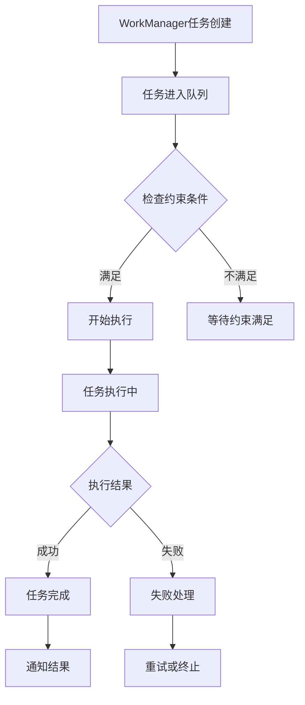

# 25.24 WorkManager 实战与后台任务调度

<!-- outline-start -->
## 要点

### 🔹 WorkManager 基础架构
WorkManager 是 Android 后台任务调度的核心组件，它提供了统一、可靠的延迟任务执行方案，解决了 JobScheduler、AlarmManager 等组件的局限性。在 Android 14–17 上，WorkManager 负责持久化任务、在约束满足时调度执行、在系统重启后恢复。

### 🔹 任务约束与系统适配
WorkManager 支持有限的、定义明确的任务约束条件（网络状态、充电状态、存储空间、电池电量、设备空闲），这些约束是 WorkManager 委托给系统调度框架（`JobScheduler`）的开关，而不是应用层自行定义的阈值。

### 🔹 加急任务与配额
WorkManager 不提供应用层手动数值优先级。应用对"紧急性"的唯一控制是 `setExpedited(OutOfQuotaPolicy)`（WorkManager 2.7+），以及通过 `WorkManagerInitializer` / `Configuration` 的线程池大小控制并发执行上限。任务执行的相对顺序由入队顺序、约束满足时机和系统 `JobScheduler` 配额共同决定。

### 🔹 任务链与依赖管理
复杂任务通过任务链（Chaining）实现依赖管理。WorkManager 通过 `WorkContinuation` 支持 `beginWith().then()` 串行链和 `beginWith(List)` 并行汇聚，以及失败重试（`Result.retry()` + `BackoffPolicy`）。

## 扩展

### 🔸 任务生命周期监控
实现 WorkManager 任务的完整生命周期监控，包括任务创建、排队、执行、完成、失败等各状态的处理策略。

### 🔸 性能优化实践
针对不同场景的 WorkManager 性能优化技巧，包括 `enqueueUniqueWork`、初始化线程池调优、结果传递等方法。

### 🔸 多进程任务调度
WorkManager 的多进程支持（2.6+）通过 `RemoteListenableWorker` / `RemoteCoroutineWorker` 实现，而非任意的"跨进程 Worker"。

<!-- outline-end -->

> 📌 **章节性质**：本节为知识缺口占位稿，由 task2a 生成并经 deep-review (2026-07-31)、rework (2026-07-31)、review-finalize (2026-07-31) 逐轮修订。原稿含大量虚构 WorkManager API（`setPriority` / `Priority` 枚举、`setAlternateWork()`、`setTimeout()`、`WorkManager.MAX_WORKERS`、`CrossProcessWorker`）与无来源的"Android 17 电池健康度/存储 10%/Wi-Fi 6-5G 区分"断言，已在 rework 中全部删除并替换为 androidx.work 2.9 公共 API 与官方 Background Processing 指南可验证的内容。review-finalize 轮进一步修正了 `setRequiresDeviceIdle` 注释、`WorkSpec.MAX_BACKOFF_MILLIS` 精确值、Perfetto trace section 表述、日志 tag 前缀、`ExistingWorkPolicy.APPEND_OR_REPLACE`、`RemoteListenableWorker` 进程绑定机制与 `LocalBroadcastManager` 废弃标注。章节 baseline 为 `android-17.0.0_r1`；API 细节以 androidx.work 2.9 公共契约为准。

---

## WorkManager 基础架构

WorkManager 是 Android Jetpack 提供的后台任务调度框架，它解决了传统后台任务执行的不确定性和可靠性问题。从架构设计角度看，WorkManager 构建了一个分层任务执行系统：

**任务层**：开发者通过 `OneTimeWorkRequest`、`PeriodicWorkRequest` 等创建任务实例，配置任务约束和参数。任务逻辑封装在 `Worker` / `CoroutineWorker` / `ListenableWorker` 子类中。

**调度层**：WorkManager 在 Android 6.0 (API 23) 以上使用 `JobScheduler` 调度任务（低版本回退到 `AlarmManager` + `BroadcastReceiver`），结合设备状态和系统约束决定执行时机。任务信息持久化在 Room 数据库中，保证系统重启后可恢复。

**执行层**：WorkManager 在内部线程池（由 `Configuration` 的 `Executor` 控制，默认 `DefaultExecutor`）中执行任务。Worker 的 `doWork()` 在后台线程被调用，通过返回 `Result.success()` / `Result.failure()` / `Result.retry()` 表示执行结果。

### WorkManager 核心特性

1. **可靠性**：系统重启后任务不会丢失，任务状态持久化在本地数据库中，即使应用被杀死也会按约束条件重试执行。

2. **约束驱动**：支持网络类型、充电状态、存储空间、电池电量、设备空闲等约束条件组合，任务仅在所有约束同时满足时才会被执行。

3. **异步执行**：所有任务都在后台线程执行，不会阻塞主线程。

4. **依赖管理**：支持任务链式调用（`WorkContinuation`），确保任务按依赖关系执行。

WorkManager 在 Android 14–17 上保持稳定的公共 API 契约。后台任务的实际执行时机由系统 `JobScheduler` 根据设备状态（standby bucket、Doze、App Standby）决定，这些系统级行为随 Android 版本演进，但 WorkManager 的公共 API 不直接暴露或承诺这些系统策略的细节。

## 任务约束与系统适配

WorkManager 最核心的价值在于提供基于约束的任务调度机制，让开发者能够根据设备状态控制任务执行时机。所有约束通过 `Constraints.Builder` 设置。

### 常用约束类型

**网络约束**：
```java
Constraints networkConstraints = new Constraints.Builder()
    .setRequiredNetworkType(NetworkType.CONNECTED)
    .build();
```

`NetworkType` 枚举包括：`CONNECTED`（任意网络）、`UNMETERED`（不计费网络，如 Wi-Fi）、`NOT_ROAMING`、`METERED`、`TEMPORARILY_UNMETERED`（API 30+）。WorkManager 不区分 Wi-Fi 代际（Wi-Fi 4/5/6）或蜂窝代际（4G/5G），也不暴露按网络质量调度的能力。

**充电约束**：
```java
Constraints chargingConstraints = new Constraints.Builder()
    .setRequiresCharging(true)
    .build();
```

**存储约束**：
```java
Constraints storageConstraints = new Constraints.Builder()
    .setRequiresStorageNotLow(true)
    .build();
```

**其他约束**（API 23+）：
```java
Constraints constraints = new Constraints.Builder()
    .setRequiresBatteryNotLow(true)   // 电量不低于系统阈值（约 15%）
    .setRequiresDeviceIdle(false)     // false=不要求设备空闲；true=仅在 Doze idle 时执行
    .build();
```

### 约束的语义边界

`Constraints` 中所有阈值（如 `setRequiresBatteryNotLow` / `setRequiresStorageNotLow`）的具体边界值由系统 `JobScheduler` 定义（电量约 15%，存储约 10%），WorkManager 不暴露这些阈值，也不允许应用自定义。这些约束是布尔开关——满足或不满足——而非可调参数。

WorkManager `Constraints` **不**提供以下能力（这些属系统层 `JobScheduler` / `DeviceIdleJobsController` / `ConnectivityManager` 范畴）：

- 按电池健康度（battery health）调度
- 按存储空间百分比自定义阈值
- 区分 Wi-Fi 6 / 5G 网络并按质量调度
- 电池健康度低于某百分比自动降级任务

### 约束冲突处理

当多个约束同时设置时，WorkManager 要求**所有约束同时满足**才会执行任务——这是 AND 关系，而非优先级。例如，一个同时要求 `setRequiredNetworkType(UNMETERED)` 和 `setRequiresCharging(true)` 的任务，只有在设备同时连接不计费网络且在充电时才会执行。

不存在"网络约束优先级最高 > 充电次之 > 存储最后"这样的排序机制。所有约束平等，缺一不可。

## 加急任务与配额管理

### WorkManager 不存在应用层优先级

WorkManager 的公共 API **不提供**手动数值优先级。不存在 `Priority` 枚举，`WorkRequest.Builder` 不存在 `setPriority()` 方法。任务执行的相对顺序由以下因素共同决定：

1. **入队顺序**：先入队的任务通常先执行。
2. **约束满足时机**：约束先满足的任务先执行。
3. **系统 `JobScheduler` 配额**：系统根据应用的 standby bucket 分配后台执行配额。

### 加急任务（Expedited Work）

应用对"紧急性"的唯一控制是 `setExpedited(OutOfQuotaPolicy)`（WorkManager 2.7+，Android 12+）。加急任务在系统配额允许时以前台服务式优先级执行，配额耗尽时按 `OutOfQuotaPolicy` 处理：

```java
OneTimeWorkRequest expeditedWork =
    new OneTimeWorkRequest.Builder(MyWorker.class)
        .setExpedited(OutOfQuotaPolicy.RUN_AS_NON_EXPEDITED_WORK_REQUEST)
        .setConstraints(constraints)
        .build();
```

- `OutOfQuotaPolicy.RUN_AS_NON_EXPEDITED_WORK_REQUEST`：配额耗尽时降级为普通后台任务。
- `OutOfQuotaPolicy.DROP_WORK_REQUEST`：配额耗尽时丢弃任务。

加急任务的系统配额由 `JobScheduler` 管理（约每数小时一个时间窗口，具体配额随设备与应用使用情况变化），WorkManager 不控制也不暴露配额数值。

### 并发与线程池

WorkManager 内部 Worker 的并发执行数由 `Configuration` 的 `Executor`（默认线程池）控制，而非一个公开常量。应用可通过自定义 `Configuration` 调整：

```java
WorkManager.initialize(
    context,
    new Configuration.Builder()
        .setExecutor(Executors.newFixedThreadPool(8))
        .build());
```

但实际能同时运行的任务数还受系统 `JobScheduler` 配额（按 standby bucket）限制，线程池大小只是 Worker 被调用时的并发上限。

### 任务执行策略

```java
// 创建加急任务（WorkManager 2.7+）
OneTimeWorkRequest expeditedWork =
    new OneTimeWorkRequest.Builder(MyWorker.class)
        .setExpedited(OutOfQuotaPolicy.RUN_AS_NON_EXPEDITED_WORK_REQUEST)
        .setConstraints(constraints)
        .build();

// 设置重试策略
// setBackoffCriteria(BackoffPolicy policy, long duration, TimeUnit unit)
WorkRequest workRequest = new OneTimeWorkRequest.Builder(MyWorker.class)
    .setBackoffCriteria(BackoffPolicy.LINEAR, 10, TimeUnit.SECONDS)
    .build();
```

重试策略包括线性增长（`BackoffPolicy.LINEAR`）和指数增长（`BackoffPolicy.EXPONENTIAL`）两种模式。Worker 返回 `Result.retry()` 后按配置的 `BackoffPolicy` 重试，重试间隔有上限：androidx.work 的 `WorkSpec.MAX_BACKOFF_MILLIS` 常量为 `5 * 60 * 60 * 1000`（即 5 小时），与 `JobScheduler` 的 `MAX_BACKOFF_MILLIS` 对齐；最小重试间隔为 `WorkSpec.MIN_BACKOFF_MILLIS`（10 秒）。`setBackoffCriteria()` 的 duration 参数会被钳制到 [MIN_BACKOFF_MILLIS, MAX_BACKOFF_MILLIS] 区间。

## 任务链与依赖管理

WorkManager 提供强大的任务链管理能力，让开发者能够构建复杂的任务依赖关系。

### 基本任务链

```java
// 任务链：下载 -> 处理 -> 上传
WorkRequest downloadWork = new OneTimeWorkRequestBuilder<DownloadWorker>()
    .setConstraints(networkConstraints)
    .build();

WorkRequest processWork = new OneTimeWorkRequestBuilder<ProcessWorker>()
    .setConstraints(storageConstraints)
    .build();

WorkRequest uploadWork = new OneTimeWorkRequestBuilder<UploadWorker>()
    .setConstraints(networkConstraints)
    .build();

// 构建任务链
WorkContinuation continuation = 
    WorkManager.getInstance(context)
        .beginWith(downloadWork)
        .then(processWork)
        .then(uploadWork);
```

### 任务组管理

任务组允许多个并行执行的任务，然后等待所有任务完成：

```java
List<WorkRequest> workRequests = new ArrayList<>();
workRequests.add(request1);
workRequests.add(request2);
workRequests.add(request3);

WorkContinuation continuation = WorkManager.getInstance(context)
    .beginWith(workRequests)
    .then(finalWorkRequest);
```

### 失败处理与重试

WorkManager 通过 `Result` 返回值和 `BackoffPolicy` 处理任务失败：

**自动重试**：任务返回 `Result.retry()` 后自动按配置的 `BackoffPolicy` 重试：

```java
WorkRequest retryableWork = new OneTimeWorkRequest.Builder(MyWorker.class)
    .setBackoffCriteria(BackoffPolicy.EXPONENTIAL, 10, TimeUnit.SECONDS)
    .build();
```

Worker 中：
```java
@Override
public Result doWork() {
    try {
        doSync();
        return Result.success();
    } catch (IOException e) {
        return Result.retry();   // 按 BackoffPolicy 自动重试
    } catch (Exception e) {
        return Result.failure(); // 不重试，标记为失败
    }
}
```

**永久失败**：`Result.failure()` 表示任务不可恢复地失败，不会重试。

**超时与执行时长**：WorkManager 公共 API 不提供 `setTimeout()` 设置。Worker 的执行时长上限由系统 `JobScheduler` 配额决定：
- 普通后台任务：受 standby bucket 配额约束（每个 bucket 的时间窗口由系统定义）。
- 加急任务（`setExpedited`）：约 3 分钟前台服务式执行窗口。

如果 Worker 执行时间可能超出配额，应将长任务拆分为多个 WorkRequest，通过任务链串联，或将耗时操作委托给前台服务。

**备用任务**：WorkManager 公共 API 不提供 `setAlternateWork()` 这样的内置"备用任务"机制。如需在任务失败后执行替代逻辑，应通过 `WorkContinuation` 组合实现（例如在链中检查上游 `WorkInfo` 状态），或在 Worker 内部自行实现重试 / 降级逻辑。

### 依赖管理最佳实践

1. **避免循环依赖**：确保任务链不会形成循环引用。WorkManager 的 `WorkContinuation` 只支持 DAG（有向无环图）。

2. **合理设置约束**：为每个任务设置合适的约束条件。所有约束是 AND 关系，过严的约束可能导致任务长时间不执行。

3. **失败处理**：用 `Result.retry()` + `BackoffPolicy` 处理可恢复失败，`Result.failure()` 处理不可恢复失败。在 Worker 内部实现降级逻辑而非依赖不存在的"备用任务"API。

4. **监控任务状态**：使用 `getWorkInfoByIdLiveData()` / `getWorkInfoByTagLiveData()` 观察任务执行状态。

## 任务生命周期监控

实现完整的任务监控机制对于生产环境至关重要：

### 状态监听

```java
WorkManager.getInstance(context)
    .getWorkInfoById(workRequest.getId())
    .observeForever(workInfo -> {
        if (workInfo.getState() == WorkInfo.State.RUNNING) {
            // 任务正在执行
        } else if (workInfo.getState() == WorkInfo.State.SUCCEEDED) {
            // 任务成功完成
        } else if (workInfo.getState() == WorkInfo.State.FAILED) {
            // 任务执行失败
        }
    });
```

### 实时监控工具

WorkManager 的可观测性依赖于标准 Android 工具链：

**Perfetto 集成**：WorkManager 2.9 内部在关键调度路径上调用 `android.os.Trace` API（如 `Trace.beginSection("WM.counter")`、`Trace.beginAsyncSection` 用于 Worker 执行段）将任务执行过程暴露给 Perfetto / ATrace / systrace。通过 `adb shell perfetto` 抓取 trace 后可在对应 trace section 中定位 Worker 执行的具体线程栈与耗时；确切 section 名以 androidx.work 实现版本为准，不要依赖固定的虚构标签。

**adb dumpsys**：`adb shell dumpsys jobscheduler` 可查看系统 `JobScheduler` 当前对各应用分配的配额与调度状态（standby bucket、pending jobs），是诊断"任务为何不执行"的首要手段。

**日志**：WorkManager 在 debug 构建中可通过 `adb shell setprop log.tag.WorkManagerUtil V` 开启详细日志，实际运行时日志 tag 多以 `WM-` 为前缀（如 `WM-Processor`、`WM-WorkerWrapper`、`WM-GreedyScheduler`、`WM-SystemJobScheduler`），可帮助追踪约束评估、入队与执行流程。

### 监控数据可视化



## 性能优化实践

### 任务去重与唯一性

对于短时间内的相同类型任务，使用 `enqueueUniqueWork` 确保同名任务唯一，避免重复执行：

```java
// 使用 enqueueUniqueWork 确保同名任务唯一
WorkManager.getInstance(context)
    .enqueueUniqueWork("uniqueWorkName", ExistingWorkPolicy.KEEP, workRequest);
```

`ExistingWorkPolicy` 选项：
- `KEEP`：已有同名任务时丢弃新请求。
- `REPLACE`：取消已有同名任务，用新请求替换。
- `APPEND`：将新请求追加到已有任务之后（构成链）。
- `APPEND_OR_REPLACE`（WorkManager 2.8.0+）：类似 `APPEND`，但若上游链已取消/失败则先替换再追加，避免链上残留失败状态阻塞新任务。

### 结果传递与缓存

**输出数据传递**：Worker 通过 `Result.success(Data)` 返回输出数据，可通过 `WorkInfo.getOutputData()` 获取。在任务链中，下游 Worker 可通过 `getInputData()` 读取上游 Worker 在 `Result.success(Data)` 中设置的输出（WorkManager 自动将上游输出作为下游输入传递）；链外观察可使用 `WorkContinuation.getWorkInfosLiveData()` 获取整条链的 `List<WorkInfo>`，或用 `getWorkInfoByIdLiveData()` / `getWorkInfosByTagLiveData()` 按请求或标签观察。

```java
// 上游 Worker 返回数据
return Result.success(new Data.Builder()
    .putString("key_result", resultData)
    .build());

// 下游 Worker 读取上游输入
String upstreamResult = getInputData().getString("key_result");
```

**注意**：`Data` 有大小限制（约 10KB 序列化后），大对象应通过数据库或文件传递，不要塞进 `Data`。

**数据预加载**：在 Worker 开始执行前预加载必要数据到本地缓存，减少执行时间。

**批量处理**：将多个小任务合并为一个 Worker 批量执行，减少调度开销。

### 初始化与线程池调优

WorkManager 默认在应用启动时通过 `WorkManagerInitializer`（ContentProvider）初始化，使用默认线程池。对性能敏感的应用可以：

1. **禁用自动初始化**（`AndroidManifest.xml`）：
```xml
<provider
    android:name="androidx.startup.InitializationProvider"
    android:authorities="${applicationId}.androidx-startup"
    tools:node="merge">
    <meta-data
        android:name="androidx.work.WorkManagerInitializer"
        android:value="androidx.startup"
        tools:node="remove" />
</provider>
```

2. **手动初始化**（控制线程池与调度策略）：
```java
Configuration config = new Configuration.Builder()
    .setExecutor(Executors.newFixedThreadPool(8))
    .setMinimumLoggingLevel(Log.INFO)
    .build();
WorkManager.initialize(context, config);
```

> 注意：`Configuration.Builder` 提供了 `setJobSchedulerJobIdRange(int min, int max)` 用于给 WorkManager 分配 `JobScheduler` jobId 区间，但该 API 自 WorkManager 2.4.0 起仅用于覆盖默认区间，多数应用不需要显式设置。

### 后台队列优化

**约束精细化**：根据任务实际需求设置最小必要约束，避免过严约束导致任务长期不执行。

**资源占用监控**：通过 Perfetto / `dumpsys cpuinfo` / 内存分析工具监控任务执行时的 CPU、内存使用情况。

**执行时间控制**：将长任务拆分为短任务链，每段在 `JobScheduler` 配额窗口内完成，避免单次执行超时。

## 多进程任务调度

### 多进程支持（RemoteListenableWorker）

WorkManager 默认在应用主进程的单一 `WorkManager` 实例中调度任务。对于需要在指定进程执行任务的场景（例如多进程架构下让特定 Worker 在辅助进程运行），WorkManager 2.6+ 提供了 `RemoteListenableWorker`（Java）和 `RemoteCoroutineWorker`（Kotlin），而非任意"跨进程 Worker"基类。

`RemoteListenableWorker` 通过绑定到指定进程的 `ListenableWorker` 服务实现跨进程执行。需要在目标进程中注册一个接收 WorkManager RPC 的 `ListenableWorker`：

```kotlin
// 目标进程中的 Worker
class MyRemoteWorker(
    appContext: Context,
    params: WorkerParameters
) : RemoteCoroutineWorker(appContext, params) {

    override suspend fun doRemoteWork(): Result {
        // 在指定进程中执行
        return Result.success()
    }
}
```

并在 `AndroidManifest.xml` 中为该 Worker 声明进程：

```xml
<service
    android:name="androidx.work.multiprocess.RemoteListenableService"
    android:process=":worker_process" />
```

并通过 Worker 的 `inputData` 传入目标 Worker 类名（`RemoteListenableWorker.ARGUMENT_CLASS_NAME`），由 `RemoteListenableService` 在声明了 `android:process` 的辅助进程中绑定并反射实例化对应 `ListenableWorker`。注意 `RemoteListenableWorker` / `RemoteCoroutineWorker` 自身不读取 `android:process`，进程隔离由 `<service>` 声明决定；`Configuration` 不负责指定 Remote Worker 进程。

### 状态同步机制

多进程下需注意进程间状态同步：

**共享数据存储**：使用 `Room`（ContentProvider 模式）或共享文件实现进程间数据共享。

**状态通知**：通过 WorkManager 的 `WorkInfo` / `LiveData`（或 Kotlin Flow `getWorkInfosFlow()`，WorkManager 2.9.0+）观察跨进程任务状态；进程间自定义通知可通过 Binder / AIDL 或 `Messenger`，注意 `LocalBroadcastManager` 已废弃，不建议在新代码中使用。

**资源竞争处理**：使用同步机制（锁、原子操作、Room 事务）避免多进程任务间的资源竞争。

### 多进程注意事项

- WorkManager 2.9+ 对多进程做了稳定性优化（减少主进程与辅助进程间的通信开销）。
- 多进程 Worker 的调度仍由主进程的 `WorkManager` 实例管理，辅助进程只负责执行。
- 并非所有任务都需要多进程——只有当 Worker 逻辑与主进程 UI / 其他组件强耦合、需要隔离内存空间时才使用。

---

## 总结

WorkManager 作为 Android 后台任务调度的核心组件，提供了基于约束的、持久化的任务管理能力。在 Android 14–17 上，WorkManager 的核心设计——约束驱动调度、任务链依赖、`Result` 返回值语义——保持稳定，为应用提供了可靠的后台任务执行保障。

在实际应用中，合理使用 WorkManager 的关键点：

1. **约束精确化**：使用 `Constraints` 表达任务执行的真实前置条件（网络、充电、存储），但牢记这些约束是布尔开关，阈值由系统定义，不可自定义。

2. **加急任务**：对用户可见的紧急任务使用 `setExpedited(OutOfQuotaPolicy)`，并正确处理配额耗尽场景。不要试图用不存在的 `setPriority()` 控制优先级。

3. **失败处理**：通过 `Result.retry()` + `BackoffPolicy` 处理瞬时失败，`Result.failure()` 处理永久失败，在 Worker 内部实现业务降级逻辑。

4. **可观测性**：通过 `dumpsys jobscheduler`、Perfetto trace section、WorkManager debug 日志诊断调度问题。

掌握这些基于 androidx.work 公共 API 的使用技巧，对于开发高质量、电池友好的 Android 应用至关重要。

---

> [适用版本: Android 14 (API 34) - Android 17 (API 37)，baseline android-17.0.0_r1]
> [API 来源: androidx.work 2.9 公共 API；Android Background Processing 官方指南]
> [rework: 2026-07-31 — 删除虚构 API，替换为 androidx.work 2.9 可验证内容]
> [review-finalize: 2026-07-31 — 修正 setRequiresDeviceIdle 注释、BackoffMillis 常量精确值、Perfetto/log tag 表述、APPEND_OR_REPLACE、RemoteListenableWorker 进程机制、LocalBroadcastManager 废弃标注]
> [待补充: 具体厂商 JobScheduler 配额差异的实测数据]