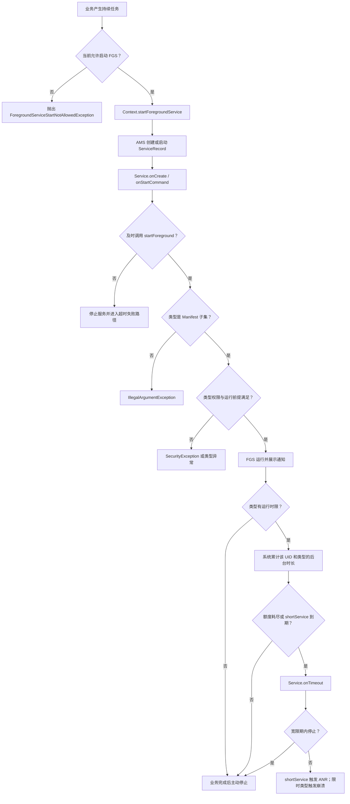

# 25.26 Android 17 前台服务类型执行模型与后台启动性能边界

前台服务（Foreground Service，FGS）用于承载用户已经知晓、离开页面后仍需继续的工作，例如播放、导航、通话和屏幕采集。它提供持续通知和较高的进程存活权重，却不承诺独占 CPU、无限运行、后台随时启动或后台随时拉起页面。

Android 17 沿用了 Android 12 至 Android 16 逐步增加的 FGS 限制，并新增了两处需要单独处理的 API 37 边界：

- 后台音频交互需要合法的非 `shortService` FGS；以 API 37 为目标时，FGS 还要具有 while-in-use（WIU）能力，闹钟音频有受限例外。
- `IntentSender.sendIntent()` 纳入后台 Activity 启动（Background Activity Launch，BAL）的发送方显式授权规则。

源码基准为 `android-17.0.0_r1`。历史版本用于解释规则从何时生效，不把预览版或 `main` 分支行为写成 Android 17 结论。

## 1. 一次 FGS 启动要通过三道独立检查

工程上最容易出现的误判，是把“能调用 `startForegroundService()`”“能晋升为 FGS”“能访问敏感资源”当成同一个条件。系统分别判断三个问题：

| 检查 | 发生时机 | 典型失败 |
|---|---|---|
| 调用方能否从当前状态启动 FGS | `startForegroundService()` 请求进入 AMS 时 | `ForegroundServiceStartNotAllowedException` |
| Service 能否按声明的类型晋升 | `startForeground()` 进入 `ActiveServices.setServiceForegroundInnerLocked()` 时 | `MissingForegroundServiceTypeException`、`IllegalArgumentException`、`SecurityException` |
| 晋升后能否访问目标资源并继续运行 | 类型权限、WIU 能力、运行时额度和具体子系统再次检查时 | 资源访问被拒、`onTimeout()`、ANR 或 `RemoteServiceException` |

一个高优先级 FCM 消息可能临时允许应用从后台启动 FGS，却不会自动赋予摄像头、麦克风或位置的 WIU 能力。一个正在运行的 FGS 也不会自动获得 BAL 权限。这些条件要分开记录和排查。

这张图把 Android 17 的主状态变化压缩到一条可用于日志设计的路径中：



`startForeground()` 成功只代表服务通过了本次晋升检查。后续资源访问、时间额度、用户停止和进程回收仍会改变结果。

## 2. 从 `startForegroundService()` 到 `startForeground()`

### 2.1 两段式调用的职责

调用方通过 `Context.startForegroundService()` 请求系统启动 Service。Service 收到生命周期回调后，应尽快调用 `startForeground()`，同时提交非零通知 ID、通知对象和本次使用的 FGS 类型。

`android-17.0.0_r1` 的 `ActiveServices.scheduleServiceForegroundTransitionTimeoutLocked()` 会启动晋升计时器。计时器到期后，`serviceForegroundTimeout()` 停止仍在等待晋升的服务，并准备 ANR 记录；Service 在等待期间被提前销毁时，`serviceForegroundCrash()` 可向应用投递 `ForegroundServiceDidNotStartInTimeException`。

Android 17 AOSP 中，`ActivityManagerConstants.DEFAULT_SERVICE_START_FOREGROUND_TIMEOUT_MS` 是 30 秒，后续 ANR 延迟默认是 10 秒。两个值都能通过 DeviceConfig 改写。应用不能把 30 秒当作业务预算：进程启动、主线程排队、依赖初始化和设备配置都会影响可用时间，`startForeground()` 应放在 Service 回调的短路径中。

### 2.2 不要在晋升前等待耗时初始化

常见错误是在 `onCreate()` 中同步创建数据库、恢复大对象、连接网络或等待 Binder，再调用 `startForeground()`。这会把所有冷启动成本叠加到晋升计时器上。

更稳妥的顺序是：

1. 预先创建通知渠道。
2. Service 进入回调后立即构造轻量通知并调用 `startForeground()`。
3. 把业务工作交给可取消的异步任务。
4. 工作完成、失败或取消时统一调用 `stopSelf()`。

FGS 不会把 Service 回调移出主线程。`onCreate()`、`onStartCommand()`、`onTimeout()` 默认仍由应用主线程接收，重 I/O 和计算要转移到合适的执行器。

## 3. 类型声明与晋升时校验

### 3.1 Android 17 的公开类型集合

以 API 37 SDK 和 `ServiceInfo` 为准，应用可见的类型包括：

| 类型 | 适用工作 | 额外条件摘要 |
|---|---|---|
| `dataSync` | 上传、下载、备份、恢复、导入导出 | `FOREGROUND_SERVICE_DATA_SYNC`；以 API 35+ 为目标时受 6 小时额度约束 |
| `mediaPlayback` | 音乐、视频、有声内容播放 | `FOREGROUND_SERVICE_MEDIA_PLAYBACK`；建议配合 Media3 `MediaSessionService` |
| `phoneCall` | `ConnectionService` 承载的持续通话 | `FOREGROUND_SERVICE_PHONE_CALL`，并持有 `MANAGE_OWN_CALLS` 或默认拨号角色 |
| `location` | 导航、位置共享、持续定位 | `FOREGROUND_SERVICE_LOCATION` 和位置权限；WIU 状态另行检查 |
| `connectedDevice` | 蓝牙、Wi-Fi、USB、NFC、UWB 等设备交互 | `FOREGROUND_SERVICE_CONNECTED_DEVICE`，并满足至少一项设备访问前提 |
| `mediaProjection` | `MediaProjection` 屏幕采集 | `FOREGROUND_SERVICE_MEDIA_PROJECTION` 和当前用户授权的采集会话 |
| `camera` | 持续相机使用 | `FOREGROUND_SERVICE_CAMERA` 和 `CAMERA`；受 WIU 约束 |
| `microphone` | 录音、语音通信 | `FOREGROUND_SERVICE_MICROPHONE` 和录音权限；受 WIU 约束 |
| `health` | 运动、健康传感器采集 | `FOREGROUND_SERVICE_HEALTH`，并满足对应传感器或 Health Connect 权限 |
| `remoteMessaging` | 跨设备消息连续性 | `FOREGROUND_SERVICE_REMOTE_MESSAGING` |
| `shortService` | 约 3 分钟内完成的关键短任务 | 无类型专用权限；仍需 `FOREGROUND_SERVICE` |
| `mediaProcessing` | 视频、图片等离线媒体处理 | `FOREGROUND_SERVICE_MEDIA_PROCESSING`；以 API 35+ 为目标时受 6 小时额度约束 |
| `specialUse` | 其他有效且无法归类的 FGS 场景 | `FOREGROUND_SERVICE_SPECIAL_USE`，Manifest 中说明子类型，并接受商店审核 |
| `systemExempted` | 受系统身份、角色或策略保护的场景 | 普通三方应用不能把它当作通用选择 |

`ServiceInfo` 中还能看到隐藏的 `fileManagement` 常量。Android 17 的 `ForegroundServiceTypePolicy` 明确保留了“暂时隐藏”的注释，默认策略表没有注册它；三方应用不要据此构造未公开方案。

类型描述业务目的，系统不会定时查询“是否正占用对应硬件”，也没有发现不占硬件就自动移除通知、降级为普通 Service 的通用路径。系统在晋升时校验声明、类型权限和运行前提；Camera、Audio、Location、MediaProjection 等子系统还会在资源访问时执行自己的权限和状态检查。

### 3.2 Manifest 与运行时类型必须一致

这段 Manifest 为一个 `dataSync` 服务声明基础权限和类型，通知权限用于常规通知展示：

```xml
<manifest xmlns:android="http://schemas.android.com/apk/res/android">
    <uses-permission android:name="android.permission.FOREGROUND_SERVICE" />
    <uses-permission android:name="android.permission.FOREGROUND_SERVICE_DATA_SYNC" />
    <uses-permission android:name="android.permission.POST_NOTIFICATIONS" />

    <application ...>
        <service
            android:name=".SyncService"
            android:exported="false"
            android:foregroundServiceType="dataSync" />
    </application>
</manifest>
```

`POST_NOTIFICATIONS` 被拒绝时，合法 FGS 仍可启动；服务仍须提交通知，系统会在活动应用或 Task Manager 等界面保留可见性，常规通知抽屉可能不显示它。不能把通知权限结果用作是否调用 `startForeground()` 的判断。

这段 Kotlin 示例把晋升放在回调开头，并在完成、取消和超时时停止服务：

```kotlin
class SyncService : Service() {
    private val scope = CoroutineScope(SupervisorJob() + Dispatchers.IO)

    override fun onStartCommand(intent: Intent?, flags: Int, startId: Int): Int {
        ServiceCompat.startForeground(
            this,
            NOTIFICATION_ID,
            buildNotification(),
            ServiceInfo.FOREGROUND_SERVICE_TYPE_DATA_SYNC
        )

        scope.launch {
            try {
                runSync()
            } finally {
                stopSelf(startId)
            }
        }
        return START_NOT_STICKY
    }

    override fun onTimeout(startId: Int, fgsType: Int) {
        scope.cancel("FGS time limit reached")
        stopSelf(startId)
    }

    override fun onDestroy() {
        scope.cancel()
        super.onDestroy()
    }

    override fun onBind(intent: Intent?): IBinder? = null
}
```

`buildNotification()` 应只读取内存中的轻量状态，通知渠道应在更早阶段创建。`stopSelf(startId)` 可以避免旧请求结束时误停仍在处理的新请求；真实项目还要让 `runSync()` 支持协作式取消和幂等恢复。

调用入口应记录用户动作，并处理当前状态不准启动 FGS 的结果：

```kotlin
fun startUserRequestedSync(context: Context) {
    val intent = Intent(context, SyncService::class.java)
    try {
        ContextCompat.startForegroundService(context, intent)
    } catch (e: ForegroundServiceStartNotAllowedException) {
        enqueueConstrainedWork(context)
    }
}
```

`ForegroundServiceStartNotAllowedException` 适合转入可延期任务或提示用户重试。类型专用权限与运行前提在 Service 调用 `startForeground()` 时校验，那里抛出的 `SecurityException` 不会同步返回这段调用代码；应在启动前核对前提，并把 Service 端异常纳入崩溃监控。

### 3.3 `ActiveServices` 的四类校验结果

`setServiceForegroundInnerLocked()` 先读取 Manifest 类型。运行时类型必须是 Manifest 类型位集合的子集，否则抛出 `IllegalArgumentException`。随后 `validateForegroundServiceType()` 调用 `ForegroundServiceTypePolicy`，把结果映射为：

- 未声明有效类型：`MissingForegroundServiceTypeException` 或 `InvalidForegroundServiceTypeException`。
- 类型专用权限或运行前提不满足：`SecurityException`。
- 兼容阶段的宽松拒绝：记录警告；是否强制取决于目标 SDK 和兼容开关。
- 校验通过：记录类型、进入 FGS 状态并发布通知。

多个类型可以按位组合，但每个类型的权限和前提都要满足。`shortService` 与其他类型组合时会被系统忽略，服务按其他类型运行，也失去 short 类型的约 3 分钟语义。组合类型不能用来规避类型要求。

## 4. 后台启动许可与 WIU 能力

### 4.1 后台启动例外是窄窗口

以 API 31+ 为目标的应用通常不能在后台启动 FGS。官方允许的场景包含用户界面交互、用户请求的精确闹钟、经过确认的高优先级 FCM、特定系统广播或角色、NFC 交易事件、Companion Device Manager 和当前可见的悬浮窗等。

这些例外都有来源和时效。以 FCM 为例，系统可能把高优先级消息降为普通优先级；应用应在启动前检查 `RemoteMessage.getPriority()`。不要在业务代码里假定“收到推送就一定有 FGS 许可”。

Android 17 的 `ActivityManagerService.mFgsStartTempAllowList` 以 UID 保存到期时间、原因码、原因文本和授权调用 UID。`ActiveServices` 查询该列表，把命中的原因码用于本次后台启动判断。源码没有“FCM 固定 10 秒”“每小时固定 5 次”的通用 Android 17 规则；持续时间由产生例外的系统组件和 DeviceConfig 决定。

`FgsTempAllowList` 的作用是临时放行 FGS 启动。`OomAdjusterImpl` 根据进程是否已经承载 FGS 来调整进程状态，没有因为 UID 进入该列表就直接提升到前台进程档位。授权窗口、进程存活权重、Doze 临时白名单也不能互相替代。

### 4.2 WIU 是另一道门

Camera、Microphone、Location 和部分 Health 场景依赖 while-in-use 权限。应用即使已获授权，处于后台时 `checkSelfPermission()` 仍可能返回 `PERMISSION_GRANTED`，这只说明用户授予了“使用期间可用”的权限。

以 API 34+ 为目标时，系统会在创建此类 FGS 时检查应用当前能否使用对应权限。应用在后台且不满足 WIU 例外时，创建服务会直接抛出 `SecurityException`。通用后台 FGS 例外不保证 WIU 能力。

安全的设计方式是让用户在可见 Activity、通知、Widget 或受支持的外部设备交互中发起操作，并在该交互上下文仍有效时启动 FGS。对持续定位，还要分别核对 `ACCESS_BACKGROUND_LOCATION` 的授予与产品用途，不能从 `location` 类型本身推导后台位置权限。

## 5. 三种超时必须分开

### 5.1 晋升超时

晋升超时覆盖 `startForegroundService()` 后迟迟没有调用 `startForeground()` 的情况。它发生在业务工作开始阶段，和 `Service.onTimeout()` 无关。

Android 17 AOSP 默认使用 30 秒晋升计时器，并在超时后安排额外 10 秒的 ANR 处理；Service 被提前收回时还可能收到 `ForegroundServiceDidNotStartInTimeException`。诊断时应搜索错误文本：

```text
Context.startForegroundService() did not then call Service.startForeground()
```

这段文本说明故障点位于晋升阶段。修复方向是缩短 Service 主线程路径、提前创建通知渠道和去除同步初始化。

### 5.2 `shortService` 超时

`shortService` 从 `startForeground()` 调用时开始计时，Android 17 默认约 3 分钟。到期后：

1. 系统调用 `Service.onTimeout(int)`；API 35+ 同时支持 `onTimeout(int, int)`。
2. 从到期点起默认约 5 秒后，进程失去 short FGS 对应的进程状态保护。
3. 从到期点起默认约 10 秒后仍未停止，`onShortFgsAnrTimeout()` 触发 ANR。

三个时间都可由 DeviceConfig 调整，约 3 分钟是 API 语义，不能当成高精度定时器。`shortService` 不支持 sticky 重启，不能从后台继续启动另一个 FGS；它可以切换为其他类型，但应用在切换时必须具备启动新 FGS 的资格。再次用 `shortService` 调用 `startForeground()` 只有在应用当前可见或符合后台启动例外时才能延长时限，不能把重复调用当作后台续期心跳。

`shortService` 没有“禁止启动 Activity”的专用规则。Activity 能否启动仍由 BAL 判断；仅有 short FGS 通常无法因此获得 BAL 许可。

### 5.3 `dataSync` 与 `mediaProcessing` 的累计额度

以 API 35+ 为目标时，这两类 FGS 在应用处于后台期间分别拥有“24 小时窗口内累计 6 小时”的额度。额度按 UID 和类型共享：

- 两个 `dataSync` 服务共同消耗同一份 `dataSync` 额度。
- `dataSync` 与 `mediaProcessing` 分开计时。
- 用户把应用带到前台会重置额度。
- 额度耗尽后继续运行会收到 `onTimeout(int, int)`；宽限期内不停止会触发 `RemoteServiceException`，属于崩溃路径。
- 同类型额度已耗尽时再次启动，会抛出 `ForegroundServiceStartNotAllowedException`。

Android 17 的 `getTimeLimitedFgsType()` 只处理 `dataSync` 和 `mediaProcessing`。源码没有“其他 FGS 一律 24 小时停止”的规则。播放、位置、通话等类型仍要服从业务合法性、子系统状态、用户停止、后台限制和内存回收。

### 5.4 Android 16 以后的 Job 配额

从 Android 16 起，FGS 中启动的 `JobScheduler`、WorkManager 或 DownloadManager 工作仍消耗各自的运行配额。FGS 运行时长与 JobScheduler 配额没有合并成同一份计数；FGS 也不能为 Job 解除 App Standby 或调度额度。

用户明确触发的大文件传输可评估 user-initiated data transfer job。可延期、可重试、带网络或充电约束的工作更适合 WorkManager 或 JobScheduler。长时间 Worker 使用 FGS 时，仍要遵守 FGS 类型、启动和超时规则。

更多超时与 Job 配额细节参见 [25.13 Foreground Service 超时与 JobScheduler 配额治理](./13-fgs-timeout-jobscheduler-quota.md)。

## 6. FGS 对进程优先级和性能的影响

### 6.1 常见 OOM 档位

Android 17 的进程状态计算已移到 `services/core/java/com/android/server/am/psc/`。`OomAdjusterImpl` 对 FGS 的关键分支如下：

| 状态 | 常见 `oom_score_adj` | 进程状态 |
|---|---:|---|
| 普通非 short FGS | `PERCEPTIBLE_APP_ADJ = 200` | `PROCESS_STATE_FOREGROUND_SERVICE` |
| 仍在有效期内的 short FGS | `PERCEPTIBLE_MEDIUM_APP_ADJ + 1 = 226` | `PROCESS_STATE_FOREGROUND_SERVICE` |
| 刚从 TOP 转为普通 FGS的短暂保护期 | `PERCEPTIBLE_RECENT_FOREGROUND_APP_ADJ = 50` | 依上下文继续计算 |
| 当前可见或 TOP Activity | 通常 100 或 0 一带 | 由 Activity 可见性决定 |

表中是 FGS 分支给出的基准档位，绑定关系、可见组件、provider、最近前台状态和 OEM 内存策略还会参与最终计算。`oom_score_adj` 越小，LMKD 越晚考虑回收。FGS 进程仍可因极端内存压力、崩溃、ANR、用户停止或策略违规而退出。

### 6.2 FGS 不提供的能力

创建 FGS 不会自动获得以下能力：

- 更高的 CPU 频率或固定调度优先级。
- WakeLock、网络、传感器或存储资源。
- Doze、App Standby、JobScheduler 配额豁免。
- 免受 LMKD 回收的保证。
- 后台 Activity 启动权。
- 超出类型时间额度的运行权。

业务若要求熄屏后持续执行，还要单独评估 WakeLock；需要联网时还要处理网络约束和重试。FGS 只解决用户可感知性、服务运行身份和一部分进程重要性问题。

### 6.3 性能目标要来自业务测量

“FGS 启动必须小于 500 ms”“系统杀死率必须小于 0.1%”这类固定阈值没有 AOSP 或 Android API 保证。团队应按场景建立自己的指标：

- `startForegroundService()` 调用到 `onStartCommand()` 的分位延迟。
- `onStartCommand()` 到 `startForeground()` 成功的分位延迟。
- 冷启动与热启动分布。
- 各类型运行时长、停止原因和超时回调次数。
- 用户停止、进程死亡、系统拒绝和权限拒绝的比例。
- 任务完成率、重试次数、流量、WakeLock 时长和电量贡献。

记录时要带上应用版本、设备型号、系统版本、目标 SDK、调用来源、可见性、FGS 类型和异常类。缺少这些维度，单个耗时值很难用于定位。

## 7. FGS 与 BAL 没有隐式继承关系

运行 FGS 时直接调用 `startActivity()`，仍要通过 `BackgroundActivityStartController` 的 BAL 检查。持续通知本身、FGS 类型、`FgsTempAllowList` 命中都没有成为通用 BAL 例外。

合法路径通常来自用户点击通知的 `PendingIntent`、当前可见窗口、系统角色或权限，以及官方列出的其他 BAL 例外。`fullScreenIntent` 只适用于来电、闹钟等高优先级且满足通知权限与渠道条件的场景，不能作为普通 FGS 展示页面的替代入口。

Android 14 起，发送 `PendingIntent` 的一方需要通过 `ActivityOptions.setPendingIntentBackgroundActivityStartMode()` 表达是否贡献自己的 BAL 权限；Android 15 起，创建方若要委托自身权限，也要显式选择 creator mode。API 36 新增了更窄的 `MODE_BACKGROUND_ACTIVITY_START_ALLOW_IF_VISIBLE`，Android 17 建议优先采用该模式。

Android 17 把相同规则扩展到 `IntentSender.sendIntent()`。这段代码只在发送方可见时贡献 BAL 权限：

```kotlin
val options = ActivityOptions.makeBasic().apply {
    pendingIntentBackgroundActivityStartMode =
        ActivityOptions.MODE_BACKGROUND_ACTIVITY_START_ALLOW_IF_VISIBLE
}

intentSender.sendIntent(
    context,
    requestCode,
    fillInIntent,
    requiredPermission,
    options.toBundle(),
    context.mainExecutor,
    onFinished
)
```

该重载和 `ALLOW_IF_VISIBLE` 需要按 API 级别做运行时保护。即使发送成功，系统仍会验证创建方、发送方和当前窗口状态；BAL 被拦截时通常没有直接异常，Logcat 会记录 `Background activity launch blocked!`。

Android 16+ 可以在测试构建中启用 StrictMode 检测：

```kotlin
StrictMode.setVmPolicy(
    StrictMode.VmPolicy.Builder()
        .detectBlockedBackgroundActivityLaunch()
        .penaltyLog()
        .build()
)
```

这项检测适合尽早放入测试版 `Application.onCreate()`，用于发现当前已被拦截或提高目标 SDK 后将被拦截的调用。

## 8. Android 17 后台音频边界

Android 17 对播放、音频焦点和音量修改增加了后台状态检查：

- 运行在 Android 17 上的所有应用，后台操作音频时需要可见 Activity，或运行一个类型不为 `shortService` 的 FGS。
- 以 API 37 为目标的应用若在后台操作音频，FGS 还要具有 WIU 能力。用户在应用可见时发起操作并启动 FGS，通常可以保留该能力。
- 应用拥有精确闹钟权限且操作 `USAGE_ALARM` 音频流时，WIU 条件有受限例外；它不能扩大到媒体播放。
- 音频播放和音量 API 可能静默失败；音频焦点请求返回 `AUDIOFOCUS_REQUEST_FAILED`。

播放应用宜使用 Media3 `MediaSessionService`，并在用户启动播放时创建 `mediaPlayback` FGS。播放完成、永久失焦或不可恢复错误后，结束媒体会话并停止 FGS；后续恢复应由新的用户动作触发。

这组命令用于在 Android 17 测试设备上切换音频强化策略并查看证据：

```bash
adb shell cmd audio set-enable-hardening enable
adb shell dumpsys audio
adb logcat | grep AudioHardening
```

测试结束后可用 `set-enable-hardening disable` 恢复默认测试设置。`AudioHardening` 记录中的 `partial` 表示缺少 FGS，`full` 表示存在 FGS 但缺少 WIU 能力。

相关的音频功耗与生命周期设计参见 [25.17 Android 17 后台音频强化与功耗](./17-background-audio-hardening-power.md)。

## 9. 选择 FGS、Job 或 WorkManager

| 任务特征 | 候选方案 | 判断依据 |
|---|---|---|
| 用户正在听、看、导航、通话或采集屏幕 | 对应类型 FGS | 用户需要持续感知和随时停止 |
| 用户发起的大文件上传或下载 | User-initiated data transfer job；必要时评估 `dataSync` FGS | 传输语义、进度展示、配额和中断恢复 |
| 可延期、可重试、有网络或充电约束 | WorkManager 或 JobScheduler | 系统安排时机，天然支持约束和重试 |
| 约 3 分钟内必须完成且无法延期 | `shortService`，仅在后台启动资格成立时使用 | 有硬超时和 ANR 风险 |
| 精确到时的用户闹钟 | Exact Alarm | 只用于用户明确需要的精确时间事件 |
| 收到推送后刷新缓存 | 普通 WorkManager；高优先级消息仅用于时效内容 | 推送优先级可能被降级，FGS 许可不是常量 |

方案选择应从用户可感知性、是否允许延期、失败后能否恢复、所需资源和平台配额出发。把所有后台任务包进 FGS 会增加通知干扰、功耗、超时和商店审核风险。

推送触发细节参见 [8.11 推送通知管线性能](../../part2-performance/ch08-responsiveness/11-push-notification-pipeline-performance.md)。OEM 额外后台策略的取证方法参见 [25.25 OEM 厂商差异化后台限制与功耗诊断](./25-android17-oem-background-restriction-power-diagnosis.md)。

## 10. 可观测性与故障注入

### 10.1 基础诊断命令

这组命令分别查看 ServiceRecord、进程状态和最近的系统拒绝记录：

```bash
adb shell dumpsys activity services com.example.app
adb shell dumpsys activity processes com.example.app
adb logcat -v threadtime ActivityManager:I ActivityTaskManager:I '*:S'
```

`services` 输出可核对 `isForeground`、通知 ID、FGS 类型、启动时间和 short FGS 状态；`processes` 输出用于对照 `procState` 与 `adj`。不同厂商可能追加字段，脚本应优先匹配字段名和事件语义，避免依赖固定行号。

### 10.2 压缩限时类型的测试周期

这组命令在测试设备上启用限时类型兼容变更，并把两类额度缩短到 60 秒：

```bash
adb shell am compat enable FGS_INTRODUCE_TIME_LIMITS com.example.app
adb shell device_config put activity_manager data_sync_fgs_timeout_duration 60000
adb shell device_config put activity_manager media_processing_fgs_timeout_duration 60000
```

测试应覆盖 `onTimeout()` 到达、协程取消、`stopSelf(startId)`、重复 startId、进程重建和额度耗尽后的再次启动。

这组命令删除测试覆盖值，防止后续用例继续继承 60 秒配置：

```bash
adb shell device_config delete activity_manager data_sync_fgs_timeout_duration
adb shell device_config delete activity_manager media_processing_fgs_timeout_duration
adb shell am compat reset FGS_INTRODUCE_TIME_LIMITS com.example.app
```

兼容开关重置后，应重启应用进程并复核 DeviceConfig 输出；共享测试设备还要记录谁修改过配置和恢复时间。

### 10.3 建议记录的应用事件

每次启动至少记录以下阶段，时间戳使用同一个单调时钟：

1. 用户或系统触发源。
2. 调用 `startForegroundService()`。
3. `onCreate()` 与 `onStartCommand()`。
4. `startForeground()` 返回或抛出异常。
5. 工作开始、首个有效进度、完成或取消。
6. `onTimeout()`、`onTaskRemoved()`、`onDestroy()`。
7. 主动停止、用户停止、崩溃、ANR 或进程死亡原因。

事件中保存 FGS 类型位、startId、任务 ID 和触发源 ID，才能把系统日志与业务任务对应起来。不要在日志里写入通知正文、定位数据或用户内容。

## 11. 常见故障定位

| 现象 | 优先核对 | 修复方向 |
|---|---|---|
| 后台调用立刻抛 `ForegroundServiceStartNotAllowedException` | 调用时可见性、例外来源、FCM 当前优先级、同类型额度 | 改由用户动作发起，或改用可调度任务 |
| `startForeground()` 抛 `IllegalArgumentException` | 运行时类型是否为 Manifest 类型子集 | 统一 Manifest 与 `ServiceCompat.startForeground()` 类型 |
| `startForeground()` 抛 `SecurityException` | 类型专用权限、运行时权限、WIU 能力、MediaProjection 授权 | 在合法用户交互阶段请求权限并启动 |
| 出现 `did not then call Service.startForeground()` | Service 主线程阻塞、通知渠道和通知构造、冷启动依赖 | 提前建渠道，晋升后再做耗时工作 |
| 约 3 分钟后 ANR | `shortService` 是否处理 `onTimeout()` | 取消任务并立即停止；无法保证时长时更换调度方案 |
| 运行数小时后 `RemoteServiceException` | `dataSync` 或 `mediaProcessing` 的 24 小时累计额度 | 分段、可恢复执行，处理 `onTimeout()`，评估 Job |
| FGS 存在但相机、麦克风或位置不可用 | 启动时是否有 WIU 能力 | 从可见界面或受支持的用户交互重新启动 |
| FGS 中 `startActivity()` 没有页面 | BAL 日志、PendingIntent 创建方和发送方 opt-in | 用用户点击入口；按 API 级别设置 ActivityOptions |
| Android 17 后台播放静音或焦点失败 | FGS 类型、WIU 能力、`AudioHardening` 日志 | 在用户发起播放时启动 `mediaPlayback` FGS |
| OEM 设备早于 AOSP 预期停止 | 系统停止原因、厂商电池策略、应用自有停止逻辑 | 保留 AOSP 对照机证据，再进入 OEM 专项排查 |

## 12. 发布前核查清单

- [ ] 每个 FGS 都有明确的用户可感知用途和停止入口。
- [ ] Manifest 类型、类型专用权限和运行时传入类型一致。
- [ ] `startForeground()` 位于轻量回调路径，前面没有同步 I/O。
- [ ] Camera、Microphone、Location 和 Health 场景验证了 WIU 能力。
- [ ] `shortService`、`dataSync`、`mediaProcessing` 实现并测试了 `onTimeout()`。
- [ ] FGS 内启动的 Job 或 Worker 按自身配额设计。
- [ ] 没有把 FGS、临时启动许可和 BAL 许可混为一项状态。
- [ ] PendingIntent 与 IntentSender 按目标 API 配置 BAL 授权模式。
- [ ] Android 17 后台音频从用户动作启动，并保留 WIU 能力。
- [ ] 监控区分启动拒绝、类型拒绝、晋升超时、运行超时、ANR、崩溃和用户停止。
- [ ] 测试修改的 DeviceConfig 与 compat 开关已恢复。
- [ ] OEM 问题有 AOSP 对照结果，未用机型印象替代系统证据。

## 源码锚点

- [`ActiveServices.java` @ `android-17.0.0_r1`](https://android.googlesource.com/platform/frameworks/base/+/refs/tags/android-17.0.0_r1/services/core/java/com/android/server/am/ActiveServices.java)：后台启动判断、类型校验、晋升超时、short FGS 和限时类型。
- [`ActivityManagerConstants.java` @ `android-17.0.0_r1`](https://android.googlesource.com/platform/frameworks/base/+/refs/tags/android-17.0.0_r1/services/core/java/com/android/server/am/ActivityManagerConstants.java)：30 秒晋升超时、short FGS 和 6 小时额度默认值。
- [`ActivityManagerService.java` @ `android-17.0.0_r1`](https://android.googlesource.com/platform/frameworks/base/+/refs/tags/android-17.0.0_r1/services/core/java/com/android/server/am/ActivityManagerService.java)：`FgsTempAllowListItem` 与 `mFgsStartTempAllowList`。
- [`ForegroundServiceTypePolicy.java` @ `android-17.0.0_r1`](https://android.googlesource.com/platform/frameworks/base/+/refs/tags/android-17.0.0_r1/core/java/android/app/ForegroundServiceTypePolicy.java)：各类型权限、WIU 标志和策略结果。
- [`ServiceInfo.java` @ `android-17.0.0_r1`](https://android.googlesource.com/platform/frameworks/base/+/refs/tags/android-17.0.0_r1/core/java/android/content/pm/ServiceInfo.java)：API 37 类型常量与类型语义。
- [`Service.java` @ `android-17.0.0_r1`](https://android.googlesource.com/platform/frameworks/base/+/refs/tags/android-17.0.0_r1/core/java/android/app/Service.java)：`onTimeout(int)` 与 `onTimeout(int, int)`。
- [`OomAdjusterImpl.java` @ `android-17.0.0_r1`](https://android.googlesource.com/platform/frameworks/base/+/refs/tags/android-17.0.0_r1/services/core/java/com/android/server/am/psc/OomAdjusterImpl.java)：普通 FGS、short FGS 和 recent TOP 的进程档位。
- [`BackgroundActivityStartController.java` @ `android-17.0.0_r1`](https://android.googlesource.com/platform/frameworks/base/+/refs/tags/android-17.0.0_r1/services/core/java/com/android/server/wm/BackgroundActivityStartController.java)：BAL 创建方、发送方和可见性检查。
- [`IntentSender.java` @ `android-17.0.0_r1`](https://android.googlesource.com/platform/frameworks/base/+/refs/tags/android-17.0.0_r1/core/java/android/content/IntentSender.java)：API 37 `sendIntent()` 的 BAL 兼容开关与 options 重载。

## 官方文档

- [Foreground services overview](https://developer.android.com/develop/background-work/services/fgs)
- [Changes to foreground services](https://developer.android.com/develop/background-work/services/fgs/changes)
- [Foreground service types](https://developer.android.com/develop/background-work/services/fgs/service-types)
- [Restrictions on starting a foreground service from the background](https://developer.android.com/develop/background-work/services/fgs/restrictions-bg-start)
- [Foreground service timeouts](https://developer.android.com/develop/background-work/services/fgs/timeout)
- [Activity security and BAL](https://developer.android.com/guide/components/activities/secure-bal)
- [Android 17 behavior changes for target API 37](https://developer.android.com/about/versions/17/behavior-changes-17)
- [Android 17 background audio hardening](https://developer.android.com/about/versions/17/changes/bg-audio)
