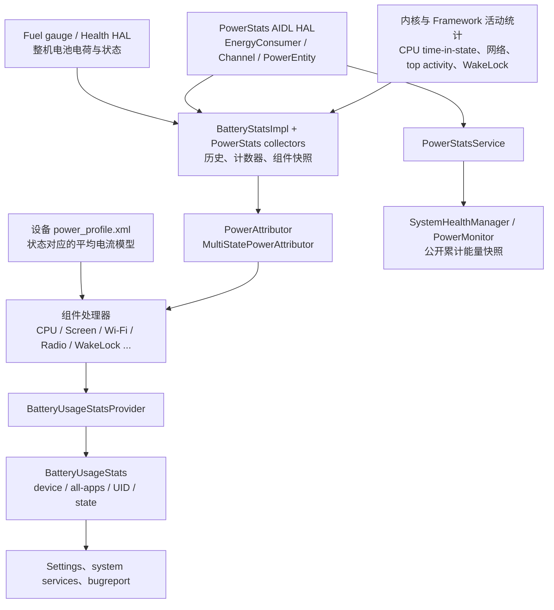

# 25.27 Android 17 BatteryUsageStats 与功耗归因管线

`BatteryUsageStats`、`PowerMonitor` 和电池库仑计回答的是三类问题：

- `BatteryUsageStats` 回答“系统把一段时间内的电量记到哪些组件和 UID 名下”。它是 Android Framework 的隐藏数据模型，普通应用没有读取全设备归因结果的公开权限。
- `PowerMonitor` 回答“某条设备功耗轨道或某个 energy consumer 从开机以来累计了多少能量”。它是公开 API，但没有标准的 UID 维度。
- fuel gauge 回答“电池整体少了多少电荷”。它提供设备总量基准，无法单独解释每个 UID 做了什么。

这三种口径互相补充。设置页里的“某应用用了多少电”来自归因结果；ODPM rail 的前后差值来自设备计量；外接功耗仪测到的是整机输入或电池侧功率。读数名称相近，测量边界并不相同。

## 接口边界：谁能读取什么

Android 17（API 37）的接口边界如下：

| 入口 | 可见性 | 数据范围 | 单位与时间口径 | 适合解决的问题 |
|---|---|---|---|---|
| `BatteryStatsManager.getBatteryUsageStats()` | `@SystemApi`、`@hide`，需要 `BATTERY_STATS` | 设备、全部应用、UID、组件及可选状态维度 | 归因电量通常以 mAh 表示；默认是当前 BatteryStats 会话 | Settings、系统服务、bugreport、特权诊断工具 |
| `SystemHealthManager.getSupportedPowerMonitors()` / `getPowerMonitorReadings()` | API 35 起公开 | ODPM rail 或 modeled energy consumer | 自开机累计的 μWs，包含电池供电和插电阶段 | 应用内设备能量窗口采样、实验对比 |
| `SystemHealthManager.takeMyUidSnapshot()` | API 24 起公开 | 调用方自己的 UID | `HealthStats` 中的 CPU、网络、WakeLock 等资源统计 | 应用自诊断；它不直接给出 UID mAh |
| `dumpsys batterystats` / bugreport | `adb shell` 诊断面 | 全设备与 UID 的活动统计、历史和归因输出 | 取决于命令选项与统计会话 | 实验室复现、离线定位 |
| 外接功耗仪 | 实验室硬件 | 整机或指定供电路径 | 电压、电流、功率、能量 | 校验整机能耗与短时功率波形 |

Android 17 源码树中没有 `android.os.BatteryUsageStatsManager`。正确的系统入口是 [`BatteryStatsManager`](https://android.googlesource.com/platform/frameworks/base/+/refs/tags/android-17.0.0_r1/core/java/android/os/BatteryStatsManager.java)，类注释将它限定为内部系统组件使用；三个 `getBatteryUsageStats` 重载都带有 `@hide` 与 `@RequiresPermission(BATTERY_STATS)`。

`BATTERY_STATS` 在 [`AndroidManifest.xml`](https://android.googlesource.com/platform/frameworks/base/+/refs/tags/android-17.0.0_r1/core/res/AndroidManifest.xml) 中的保护级别是 `signature|privileged|development`。普通第三方应用即使在 manifest 中声明它，也拿不到全设备 BatteryUsageStats 权限。通过反射调用隐藏接口还会受到非 SDK 接口限制，产品代码不应依赖这条路。

## BatteryUsageStats 的系统数据模型

`BatteryUsageStats` 是一次功耗归因快照。它包含两类聚合结果：

- `AGGREGATE_BATTERY_CONSUMER_SCOPE_DEVICE`：设备总量，包含已归到应用的电量和无法归到应用的部分。
- `AGGREGATE_BATTERY_CONSUMER_SCOPE_ALL_APPS`：所有 UID consumer 的合计。

两者出现差值很正常。例如基带待机、屏幕无前台活动的时间段、平台共享资源和未能分摊的硬件能量，都可能留在设备侧。

UID 列表的正确类型是 `List<UidBatteryConsumer>`。系统代码调用 `getUidBatteryConsumers()`，再从 `UidBatteryConsumer.getUid()` 取 UID。基类 `BatteryConsumer` 没有通用 `getUid()`，系统也未提供 `getBatteryConsumers()` 接口。

下面的片段只用于阅读 AOSP 系统代码，不能作为普通应用示例：

```java
BatteryUsageStatsQuery query = new BatteryUsageStatsQuery.Builder()
        .includeProcessStateData()
        .build();

try (BatteryUsageStats stats =
        batteryStatsManager.getBatteryUsageStats(query)) {
    AggregateBatteryConsumer device = stats.getAggregateBatteryConsumer(
            BatteryUsageStats.AGGREGATE_BATTERY_CONSUMER_SCOPE_DEVICE);

    for (UidBatteryConsumer uidConsumer : stats.getUidBatteryConsumers()) {
        int uid = uidConsumer.getUid();
        double totalMah = uidConsumer.getConsumedPower();
        double cpuMah = uidConsumer.getConsumedPower(
                BatteryConsumer.POWER_COMPONENT_CPU);
    }
}
```

这段代码对应 Android 17 的对象关系，也体现了 `BatteryUsageStats` 的 `Closeable` 生命周期。它依赖隐藏类、隐藏方法和特权权限，只适用于平台源码、系统应用或受控测试环境。

查询参数还可以请求进程状态、屏幕状态和供电状态维度。Android 17 的进程状态枚举包括 foreground、background、foreground service 与 cached。状态维度是否存在取决于 query flag；读取方不能假定每个快照都带有这些拆分项。

### Android 17 标准组件

[`BatteryConsumer`](https://android.googlesource.com/platform/frameworks/base/+/refs/tags/android-17.0.0_r1/core/java/android/os/BatteryConsumer.java) 在 `android-17.0.0_r1` 中定义了 19 个平台组件 ID：

| ID | 常量 | 归因对象 |
|---:|---|---|
| 0 | `POWER_COMPONENT_SCREEN` | 屏幕点亮与亮度相关消耗 |
| 1 | `POWER_COMPONENT_CPU` | CPU 活跃、cluster、scaling step |
| 2 | `POWER_COMPONENT_BLUETOOTH` | 蓝牙控制器或模型消耗 |
| 3 | `POWER_COMPONENT_CAMERA` | 相机使用 |
| 4 | `POWER_COMPONENT_AUDIO` | 音频子系统 |
| 5 | `POWER_COMPONENT_VIDEO` | 视频子系统 |
| 6 | `POWER_COMPONENT_FLASHLIGHT` | 闪光灯 |
| 7 | `POWER_COMPONENT_SYSTEM_SERVICES` | system_server 代应用执行的工作 |
| 8 | `POWER_COMPONENT_MOBILE_RADIO` | 蜂窝无线电；标准常量名不是 MODEM |
| 9 | `POWER_COMPONENT_SENSORS` | 传感器 |
| 10 | `POWER_COMPONENT_GNSS` | 卫星定位 |
| 11 | `POWER_COMPONENT_WIFI` | Wi-Fi |
| 12 | `POWER_COMPONENT_WAKELOCK` | 阻止 CPU 休眠的估算成本 |
| 13 | `POWER_COMPONENT_MEMORY` | 内存相关消耗 |
| 14 | `POWER_COMPONENT_PHONE` | 通话状态相关部分 |
| 15 | `POWER_COMPONENT_AMBIENT_DISPLAY` | 息屏显示 |
| 16 | `POWER_COMPONENT_IDLE` | 设备空闲 |
| 17 | `POWER_COMPONENT_REATTRIBUTED_TO_OTHER_CONSUMERS` | 从当前 consumer 转记给其他 consumer 的负值 |
| 18 | `POWER_COMPONENT_BASE` | 状态时长等归因基础数据 |

厂商自定义组件 ID 的范围是 1000 到 9999。Android 17 没有标准 `POWER_COMPONENT_GPU`，也没有 `POWER_COMPONENT_MODEM`、`POWER_COMPONENT_SENSOR` 或 `POWER_COMPONENT_WAKE_LOCK` 这些拼法。GPU 数据若出现在厂商 monitor、rail 或 custom component 中，其名称和覆盖范围仍由设备实现决定。

## Android 17 的数据路径

下面的图用于区分硬件计量、活动记账、归因计算和消费端：



图中的两条输出路径需要分开读。`BatteryUsageStatsProvider` 让 `PowerAttributor` 把历史与组件统计折算为 mAh 和 UID 责任；`PowerStatsService` 则把 HAL 提供的累计 energy consumer 与 rail 读数暴露为 `PowerMonitor`。后者不会自动生成前者的 UID 列表。

Android 17 的 [`BatteryUsageStatsProvider`](https://android.googlesource.com/platform/frameworks/base/+/refs/tags/android-17.0.0_r1/services/core/java/com/android/server/power/stats/BatteryUsageStatsProvider.java) 在当前会话和累计会话两条路径中都会调用：

`mPowerAttributor.estimatePowerConsumption(builder, history, start, end)`

默认实现 [`MultiStatePowerAttributor`](https://android.googlesource.com/platform/frameworks/base/+/refs/tags/android-17.0.0_r1/services/core/java/com/android/server/power/stats/processor/MultiStatePowerAttributor.java) 为 base、WakeLock、CPU、screen、ambient display、mobile radio、phone、Wi-Fi、Bluetooth、audio、video、flashlight、camera、GNSS、sensors 和 custom components 配置处理器。Android 17 的顶层 `power/stats/` 目录已经不再保留旧的 `CpuPowerCalculator`、`ScreenPowerCalculator` 等主归因实现。

## 三类硬件数据不要混用

### Fuel gauge：整机电池基准

fuel gauge 或 coulomb counter 观测电池整体电荷变化，Health HAL 把电量、充电状态、温度等信息交给 Framework。这条路径能告诉系统一段会话内电池总量大致减少了多少，却没有天然的 UID 标签。

把 fuel gauge 总量拆成应用列表，需要 CPU 时间、网络活动、屏幕前台时长、传感器持有时间等软件侧证据。因而“设备少了 100 mAh”和“应用 A 被归了 18 mAh”是不同层级的结论。

### PowerStats AIDL HAL：consumer、rail 与驻留时间

Android 17 平台侧使用 `android.hardware.power.stats` 稳定 AIDL 接口。它提供六个 RPC，可分成三组：

| 数据组 | 查询描述 | 读取累计值 |
|---|---|---|
| `PowerEntity` | `getPowerEntityInfo()` | `getStateResidency(ids)` |
| `EnergyConsumer` | `getEnergyConsumerInfo()` | `getEnergyConsumed(ids)` |
| Energy meter `Channel` | `getEnergyMeterInfo()` | `readEnergyMeter(ids)` |

下面的接口轮廓用于识别 Android 17 AIDL 方法名：

```aidl
@VintfStability
interface IPowerStats {
    PowerEntity[] getPowerEntityInfo();
    StateResidencyResult[] getStateResidency(in int[] powerEntityIds);
    EnergyConsumer[] getEnergyConsumerInfo();
    EnergyConsumerResult[] getEnergyConsumed(in int[] energyConsumerIds);
    Channel[] getEnergyMeterInfo();
    EnergyMeasurement[] readEnergyMeter(in int[] channelIds);
}
```

这些方法来自 [`IPowerStats.aidl`](https://android.googlesource.com/platform/hardware/interfaces/+/refs/tags/android-17.0.0_r1/power/stats/aidl/android/hardware/power/stats/IPowerStats.aidl)。Android 10 资料中的 HIDL `getRailInfo()`、`getEnergyData()` 属于旧接口族，不能拿来描述 Android 17 的 AIDL 调用。

`EnergyConsumerResult.energyUWs` 是自开机累计的 μWs。它还有一个可选 `EnergyConsumerAttribution[]`，元素携带 UID 与对应的累计 μWs。这个字段只说明 HAL 合约允许厂商提供 UID attribution；设备是否填写、覆盖哪些 consumer、Framework collector 是否采用，都要按设备源码和实测确认。共享 rail 仍可能需要软件活动统计来分摊。

[`EnergyConsumerType`](https://android.googlesource.com/platform/hardware/interfaces/+/refs/tags/android-17.0.0_r1/power/stats/aidl/android/hardware/power/stats/EnergyConsumerType.aidl) 只有 OTHER、BLUETOOTH、CPU_CLUSTER、DISPLAY、GNSS、MOBILE_RADIO、WIFI、CAMERA 八种枚举。GPU 可以由厂商用 OTHER 和设备私有名称表达，却没有跨设备可移植的 GPU 类型。

### PowerProfile：硬件计量缺失时的设备模型

`power_profile.xml` 不是一张 AOSP 通用功耗表。AOSP 文件里的数值是模板占位，产品设备需要用自己的测量结果配置资源 overlay。Android 17 的处理器按组件选择数据源：有可用 measured energy 时使用硬件累计值，没有时依据活动时长与 PowerProfile 模型估算。

下面的 XML 片段用于确认 Android 17 模板中的键名和数组结构：

```xml
<array name="cpu.active">
    <value>0.1</value>
</array>
<array name="cpu.clusters.cores">
    <value>1</value>
</array>
<array name="cpu.speeds.cluster0">
    <value>400000</value>
</array>
<array name="cpu.active.cluster0">
    <value>0.1</value>
</array>
<item name="cpu.idle">0.1</item>
<item name="screen.on.display0">0.1</item>
<item name="screen.full.display0">0.1</item>
<item name="wifi.active">0.1</item>
```

片段摘自 [`core/res/res/xml/power_profile.xml`](https://android.googlesource.com/platform/frameworks/base/+/refs/tags/android-17.0.0_r1/core/res/res/xml/power_profile.xml)。其中的 `0.1` 和单核配置仅是 AOSP 模板值，不能复制到量产设备。空格分隔的 `<item name="cpu.core_speeds.cluster0">`、`gpu.power` 等形式与 Android 17 标准模板不符。

硬件能量和 PowerProfile 也不是一次性的“二选一”。以 CPU 为例，处理器会用 measured energy 约束总量，再利用 power bracket 的模型比例和 UID time-in-bracket 分配共享消耗。这个过程只修正当前统计窗口的归因比例，不会把新参数写回 `power_profile.xml`，也没有固定 30% 偏差告警。

## Android 17 的组件归因算法

### CPU：频点模型、硬件总量和 UID 时间共同参与

[`CpuPowerStatsProcessor`](https://android.googlesource.com/platform/frameworks/base/+/refs/tags/android-17.0.0_r1/services/core/java/com/android/server/power/stats/processor/CpuPowerStatsProcessor.java) 的常规路径包含以下步骤：

1. 从 `CpuScalingPolicies` 取得 policy、cluster 与 scaling step 的对应关系。
2. 从 PowerProfile 读取 CPU active、cluster 和每个 scaling step 的平均电流系数。
3. 汇总设备在各 scaling step 与 power bracket 的时间。
4. 如果存在 CPU energy consumer，将累计能量换算为 mAh，并按原模型比例缩放对应 bracket 的估算值。
5. 对每个 UID，用 `UID time in bracket / device time in bracket` 分摊该 bracket 的能量。
6. measured CPU 能量路径还会扣除 WakeLock 估算，避免同一段“CPU 保持唤醒”消耗同时记在 CPU 与 WakeLock。

因此，Android 17 的 CPU 归因并不是读取 `/proc/<pid>/stat` 后乘一个 cluster 平均值。处理器明确使用 scaling step、power bracket、可选 energy consumer 和 UID 时间。温度、共享 rail、调度迁移与厂商采集质量仍会带来误差，源码中没有适用于所有设备的固定误差百分比。

Android 17 还保留一个面向特定 collector 的 fast path：当 descriptor 没有 CPU scaling step 且带有直接能量标记时，处理器会读取 device 与 UID 的 consumed energy。它不能推导成“所有 PowerStats HAL 设备都提供 per-UID CPU 实测能量”。

### WakeLock：估算被阻止的休眠机会

[`WakelockPowerStatsProcessor`](https://android.googlesource.com/platform/frameworks/base/+/refs/tags/android-17.0.0_r1/services/core/java/com/android/server/power/stats/processor/WakelockPowerStatsProcessor.java) 使用 `PowerProfile.POWER_CPU_IDLE` 和本窗口内的 WakeLock usage duration 估算设备功耗，再按各 UID 的持有时长占比分配：

`UID WakeLock mAh = device WakeLock mAh × UID hold duration / all UID hold duration`

这项数据表示 WakeLock 让 CPU 保持 awake 的模型成本。它没有“WakeLock 硬件 rail”这一含义，也无法单独反映被唤醒后业务线程、网络和外设做了多少工作。CPU 处理器的去重逻辑还说明，分析时不能把 CPU 与 WakeLock 两项直接相加后再次归责。

### Screen：设备总量与 UID 分摊是两步

[`ScreenPowerStatsProcessor`](https://android.googlesource.com/platform/frameworks/base/+/refs/tags/android-17.0.0_r1/services/core/java/com/android/server/power/stats/processor/ScreenPowerStatsProcessor.java) 先计算设备屏幕消耗：

- 有 display energy consumer 时，把 measured energy 换算为 mAh。
- 缺少 measured energy 时，用 screen-on、doze 和亮度 bin 的持续时间乘 PowerProfile 系数。

屏幕开启阶段的设备总量随后按 UID top activity duration 的占比分配。Android 17 处理器只有“总 top activity duration 为 0”时跳过 UID 分配，没有旧 `ScreenPowerCalculator` 中 10 分钟 smear 门槛。应用列表里的屏幕份额是归因结果，不能当作某个应用独占显示 rail 的硬件测量。

### Wi-Fi、蜂窝与共享资源

Wi-Fi 和蜂窝归因通常同时依赖 controller activity、网络统计、radio active 时间、PowerProfile 与可选 energy consumer。短小但频繁的网络请求可能让无线电反复退出低功耗状态，字节数少也会产生明显成本。按 UID 字节数、包数或活动时间分摊共享尾部能量时，归因结果天然受并发应用和设备固件能力影响。

`POWER_COMPONENT_SYSTEM_SERVICES` 与 reattribution 用来处理 system_server 代应用执行工作的场景。看到系统服务 consumer 的负 reattributed 值时，应结合被转入的应用项理解，避免把同一份能量重复统计。

## GPU：平台标准项为空缺

Android 17 的三个标准定义都没有 GPU 专属项：

- `BatteryConsumer` 没有 `POWER_COMPONENT_GPU`。
- `PowerProfile.java` 没有标准 `POWER_GPU` 或 `gpu.active` 键。
- PowerStats AIDL 的 `EnergyConsumerType` 没有 GPU 枚举。

设备仍可能提供名为 GPU、G3D 或其他名称的 ODPM rail / modeled consumer。公开 [`PowerMonitor`](https://developer.android.com/reference/android/os/PowerMonitor) 文档明确提醒：rail 名称、能量范围和 OEM 模型都依赖设备。同名 monitor 在两台设备上也不保证代表同一组电源域。

“按 SurfaceFlinger 帧数与 gralloc 内存估算 UID GPU 功耗”的说法在 `android-17.0.0_r1` 的 BatteryUsageStats 主归因路径中没有源码依据。帧数、GPU counters 和显存能帮助定位图形负载，不能伪装成标准 GPU mAh 归因算法。

## 普通应用如何使用 PowerMonitor

API 35 起，应用可以从 `SystemHealthManager` 枚举 `PowerMonitor`，再异步读取累计能量。下面的 Kotlin 代码用于封装 monitor 枚举和单次快照：

```kotlin
import android.content.Context
import android.os.OutcomeReceiver
import android.os.PowerMonitor
import android.os.PowerMonitorReadings
import android.os.health.SystemHealthManager
import androidx.annotation.RequiresApi
import java.util.concurrent.Executor

@RequiresApi(35)
class PowerWindowSampler(
    context: Context,
    private val callbackExecutor: Executor,
) {
    private val manager =
        context.getSystemService(SystemHealthManager::class.java)

    fun discover(onResult: (List<PowerMonitor>) -> Unit) {
        manager.getSupportedPowerMonitors(callbackExecutor) { monitors ->
            onResult(monitors)
        }
    }

    fun read(
        monitors: List<PowerMonitor>,
        onResult: (PowerMonitorReadings) -> Unit,
        onError: (RuntimeException) -> Unit,
    ) {
        manager.getPowerMonitorReadings(
            monitors,
            callbackExecutor,
            object : OutcomeReceiver<PowerMonitorReadings, RuntimeException> {
                override fun onResult(result: PowerMonitorReadings) {
                    onResult(result)
                }

                override fun onError(error: RuntimeException) {
                    onError(error)
                }
            },
        )
    }
}

data class EnergySample(
    val energyUws: Long,
    val timestampMs: Long,
)

fun intervalAverageMicrowatts(
    begin: EnergySample,
    end: EnergySample,
): Double? {
    val deltaEnergyUws = end.energyUws - begin.energyUws
    val deltaTimeMs = end.timestampMs - begin.timestampMs
    if (deltaEnergyUws < 0 || deltaTimeMs <= 0) return null
    return deltaEnergyUws * 1_000.0 / deltaTimeMs
}
```

同一个 monitor 取两次 `getConsumedEnergy()` 与 `getTimestampMillis()`，前后做差后才得到窗口能量。公式中的 μWs 除以秒得到 μW，所以毫秒时间差需要乘 1000。重启、HAL reset、`ENERGY_UNAVAILABLE` 或 monitor 变化都应让本轮样本作废。

这段代码不能提供以下能力：

- 不能返回某个 UID 的 mAh。
- 不能保证设备存在任何 monitor；列表可以为空。
- 不能按 monitor 名称跨机型直接比较。
- 不能把单次累计值当作瞬时功率。
- 不能排除插电阶段的能量；`PowerMonitorReadings` 明确包含 battery 与 plugged-in 两种状态。

Android 17 的 [`PowerStatsService`](https://android.googlesource.com/platform/frameworks/base/+/refs/tags/android-17.0.0_r1/services/core/java/com/android/server/powerstats/PowerStatsService.java) 还会限制公开读数的时间和精度。普通调用方允许复用最多 20 秒前的缓存读数，并对返回累计值加入区间随机噪声；calling UID 是该刷新周期内的 sticky key。有 `ACCESS_FINE_POWER_MONITORS` 的特权调用方使用 250 ms 最大年龄，该权限同样是 `signature|privileged|development`。

因此，应用侧窗口应比 20 秒缓存周期长得多，通常用分钟级业务场景和多轮样本观察差值。毫秒级尖峰、亚秒启动阶段和绝对功率校准应交给 Perfetto rail、Power Profiler 或外接仪器。

## `takeMyUidSnapshot()` 能补充什么

`SystemHealthManager.takeMyUidSnapshot()` 对普通应用开放，返回调用方 UID 的 `HealthStats`。它适合读取 CPU user/system time、WakeLock timer、网络字节等资源活动，帮助解释 PowerMonitor 窗口为何变化。

它没有把这些活动统一换算成 mAh。应用可以同时保存：

- PowerMonitor 的设备级窗口能量。
- `HealthStats` 的本 UID CPU、网络和 WakeLock 增量。
- 业务计数，例如完成任务数、渲染帧数、下载字节数。
- thermal status、屏幕状态、网络类型和充电状态。

这些量组合后能回答“每完成一次任务，设备 monitor 增加多少能量，应用自身资源活动发生了什么变化”。它仍是受设备和场景约束的实验结论，不能替代系统 UID 归因。

## 诊断工作流

### 受控采集

`batterystats --reset` 会清除既有统计，只应在专用测试设备或明确的测试窗口执行。准备好 release/profileable 构建后，在场景开始前执行：

```bash
adb shell dumpsys batterystats --reset
```

确认重置完成后，断开 USB 并运行固定场景。场景结束后重新连接设备，再导出统计和 bugreport：

```bash
adb shell dumpsys batterystats > batterystats.txt
adb bugreport bugreport.zip
```

导出的文本便于按 UID 和组件检索，bugreport 可供系统工具回放。把重置和导出分成两个阶段，也能避免脚本紧接着导出一份几乎没有场景数据的样本。

采集时至少固定这些条件：

1. 使用同一台物理设备、同一系统构建和同一应用构建。
2. 记录电池电量、是否插电、屏幕亮度与刷新率。
3. 固定 Wi-Fi / 蜂窝网络、信号条件与后台账户同步状态。
4. 让设备回到可比较的 thermal 状态，再开始下一轮。
5. 使用稳定脚本执行相同操作，记录完成的任务数量。
6. 运行多轮并报告分布、均值或置信区间，避免用单次差值下结论。

### 工具如何分工

| 工具 | 强项 | 读数限制 |
|---|---|---|
| `dumpsys batterystats` | UID 活动、WakeLock、网络、组件归因摘要 | 统计会话和 OEM 模型会影响结果 |
| Battery Historian | 长时间事件时间线与 bugreport 回放 | 时间线上多为“组件何时活跃”，不等同于每段消耗了多少 mAh |
| Android Studio Power Profiler | 功耗轨道与应用代码、系统事件对齐 | 设备支持度影响轨道完整性 |
| Perfetto power rails | rail 累计能量与系统 trace 同时分析 | rail 名称和可用性由 OEM 决定 |
| Macrobenchmark `PowerMetric` | 自动重复场景并生成 power / energy / battery 指标 | 需要受支持设备和严谨的 benchmark 配置 |
| 外接功耗仪 | 整机绝对功率与短时波形 | 难以直接提供 UID 责任，需要 trace 辅助解释 |

Android Developers 已标注 [Battery Historian 不再活跃维护](https://developer.android.com/topic/performance/power/setup-battery-historian)，有条件时优先采用 system tracing、Macrobenchmark power metric 或 Power Profiler。Historian 仍适合读取旧 bugreport 和长时间事件记录，但其 chart 中的活动条只表示组件处于活跃状态，不能直接解释该条带消耗了多少电。

更完整的采集命令与事件解读见 [25.1 功耗诊断与分析方法](01-power-diagnosis.md)，PowerMonitor 与 ADPF 实验见 [25.16 ADPF Power Efficiency Mode 与 PowerMonitor 能耗验证](16-adpf-power-efficiency-powermonitor.md)，Historian 的观测侧内容见 [26.20 Battery Historian 与性能指标集成](../ch26-observability/26.20-battery-historian-performance-metrics-integration.md)。

## 常见读数冲突

### device 总量大于 all-apps

设备 consumer 包含未归给 UID 的系统与硬件成本，all-apps 只是 UID consumer 之和。共享资源无法分摊、无 top activity 的屏幕区间、基带待机等都可能产生差值。

### PowerMonitor 差值与 BatteryUsageStats mAh 对不上

两者的时间基准、供电状态、组件覆盖和单位都不同。PowerMonitor 统计自开机累计的 μWs，并包含插电能量；BatteryUsageStats 依据 BatteryStats 会话和 on-battery 状态组织归因结果。比较前要把窗口、供电状态和单位换算对齐。

μWs 转换为 mAh 还需要电压：

`mAh = μWs / (voltage_mV × 3600)`

使用固定“标称电压”只会得到近似值。电池电压会随荷电状态和负载变化，rail 电压也可能与电池端不同。跨工具比较时保留原始能量单位更稳妥。

### 设置页把屏幕电量记到应用

Android 17 的 screen processor 会按 top activity duration 分摊屏幕开启阶段的设备功耗。某应用获得屏幕份额表示它在该窗口内占据前台时间，不代表显示面板只为该 UID 供电。

### monitor 名称里有 GPU，但 BatteryConsumer 没有 GPU

PowerMonitor 接受厂商自定义名称，BatteryConsumer 是平台固定的归因组件集合。这两个命名空间没有一一映射关系。GPU monitor 可用于同机型、同构建的实验差值，不能用不存在的 `POWER_COMPONENT_GPU` 查询 UID 归因。

### measured energy 仍然存在归因误差

硬件计量提高了组件总量的可信度，共享 rail 如何拆给 UID 仍依赖时间、活动量或厂商 attribution。总量测得准与责任分得准是两个独立问题。

## 版本演进

| 平台版本 | 相关变化 |
|---|---|
| Android 10 | 引入 PowerStats HIDL 1.0，用 rail 与 power entity 数据补充功耗观测 |
| Android 12（API 31） | Framework 引入 `BatteryUsageStats` / `BatteryUsageStatsQuery` 结构化归因模型；它们仍属于隐藏系统接口 |
| Android 15（API 35） | `PowerMonitor`、`PowerMonitorReadings` 和 `SystemHealthManager` 的读取方法成为公开 API |
| Android 16（API 36） | Framework 处于迁移阶段：部分组件交给 `PowerAttributor`，未覆盖部分仍可走旧 `*PowerCalculator` |
| Android 17（API 37） | `BatteryUsageStatsProvider` 委托 `PowerAttributor`；`MultiStatePowerAttributor` 用各组件 `PowerStatsProcessor` 完成主归因路径 |

版本表中的“公开 PowerMonitor”不等于“公开 BatteryUsageStats”。截至 `android-17.0.0_r1`，普通应用依旧不能读取全设备 UID mAh 列表。

## Review 检查表

阅读或实现功耗归因功能时，可按以下顺序核对：

- 代码引用的是 `BatteryStatsManager` 还是不存在的 `BatteryUsageStatsManager`。
- 调用方是否具备系统签名与 `BATTERY_STATS`；普通应用是否改用公开 API 和诊断工具。
- 数据单位是 mAh、μWs、μW、电流还是时间，是否混用了累计量与速率。
- 时间窗口是自开机、BatteryStats 会话、上次充电判定，还是手工 reset 后的测试窗口。
- 组件是平台 `BatteryConsumer`、HAL `EnergyConsumer`、meter `Channel`，还是 OEM monitor 名称。
- measured energy 覆盖的是设备总量还是也带可靠 UID attribution。
- PowerProfile 是否来自目标设备的 overlay，是否把 AOSP 占位值当成量产参数。
- CPU、screen 与 WakeLock 是否理解了 Android 17 processor 的分摊和去重规则。
- GPU 结论是否限定到具体设备 monitor，是否错误引用平台不存在的 GPU component。
- 对比实验是否固定设备状态、运行多轮并保留 trace 证据。

系统功耗模型的基础推导见 [11.1 功耗模型](../../part2-performance/ch11-power/01-power-model.md)，SoC 与厂商实现边界见 [5.21 Android 17 SoC 电池优化架构](../../part1-fundamentals/ch05-cpu-power/5.21-android17-battery-optimization-soc-architecture.md)。

## 源码锚点

- [`BatteryStatsManager.java`](https://android.googlesource.com/platform/frameworks/base/+/refs/tags/android-17.0.0_r1/core/java/android/os/BatteryStatsManager.java)：系统入口、隐藏方法与权限声明。
- [`BatteryUsageStats.java`](https://android.googlesource.com/platform/frameworks/base/+/refs/tags/android-17.0.0_r1/core/java/android/os/BatteryUsageStats.java)：device / all-apps 聚合、UID consumer 与会话字段。
- [`BatteryUsageStatsQuery.java`](https://android.googlesource.com/platform/frameworks/base/+/refs/tags/android-17.0.0_r1/core/java/android/os/BatteryUsageStatsQuery.java)：时间范围、状态维度、历史和组件过滤。
- [`BatteryUsageStatsProvider.java`](https://android.googlesource.com/platform/frameworks/base/+/refs/tags/android-17.0.0_r1/services/core/java/com/android/server/power/stats/BatteryUsageStatsProvider.java)：Android 17 到 `PowerAttributor` 的调用点。
- [`MultiStatePowerAttributor.java`](https://android.googlesource.com/platform/frameworks/base/+/refs/tags/android-17.0.0_r1/services/core/java/com/android/server/power/stats/processor/MultiStatePowerAttributor.java)：组件与 processor 的配置关系。
- [`CpuPowerStatsProcessor.java`](https://android.googlesource.com/platform/frameworks/base/+/refs/tags/android-17.0.0_r1/services/core/java/com/android/server/power/stats/processor/CpuPowerStatsProcessor.java)：CPU bracket、energy consumer 缩放和 UID 分配。
- [`ScreenPowerStatsProcessor.java`](https://android.googlesource.com/platform/frameworks/base/+/refs/tags/android-17.0.0_r1/services/core/java/com/android/server/power/stats/processor/ScreenPowerStatsProcessor.java)：屏幕模型、实测总量与 top activity 分摊。
- [`WakelockPowerStatsProcessor.java`](https://android.googlesource.com/platform/frameworks/base/+/refs/tags/android-17.0.0_r1/services/core/java/com/android/server/power/stats/processor/WakelockPowerStatsProcessor.java)：WakeLock 模型与 UID 持有时长占比。
- [`SystemHealthManager.java`](https://android.googlesource.com/platform/frameworks/base/+/refs/tags/android-17.0.0_r1/core/java/android/os/health/SystemHealthManager.java)：公开 PowerMonitor 异步接口和本 UID HealthStats。
- [`PowerStatsService.java`](https://android.googlesource.com/platform/frameworks/base/+/refs/tags/android-17.0.0_r1/services/core/java/com/android/server/powerstats/PowerStatsService.java)：monitor 枚举、缓存、权限和噪声处理。
- [`IPowerStats.aidl`](https://android.googlesource.com/platform/hardware/interfaces/+/refs/tags/android-17.0.0_r1/power/stats/aidl/android/hardware/power/stats/IPowerStats.aidl)：Android 17 Vendor HAL 合约。
- [`EnergyConsumerResult.aidl`](https://android.googlesource.com/platform/hardware/interfaces/+/refs/tags/android-17.0.0_r1/power/stats/aidl/android/hardware/power/stats/EnergyConsumerResult.aidl)：累计 μWs 与可选 UID attribution。
