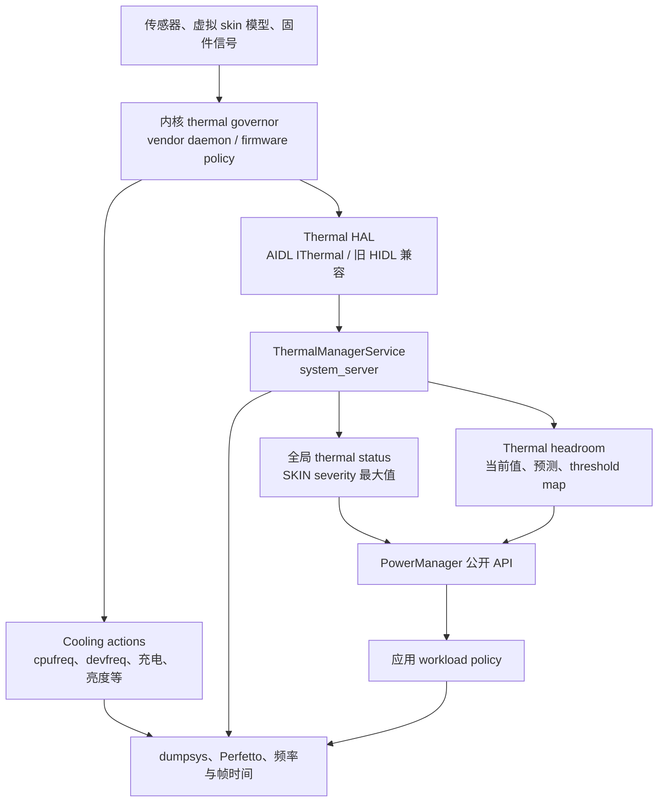

# 25.28 ThermalManager 热节流适配与性能降级治理实战

## 先校正 API 名称

Android SDK 没有公开的 `ThermalManager` Java 类。应用侧入口位于 `android.os.PowerManager`：

- `getCurrentThermalStatus()`、`addThermalStatusListener()`：API 29；
- `getThermalHeadroom(forecastSeconds)`：API 30；
- `getThermalHeadroomThresholds()`：API 35；
- `addThermalHeadroomListener()`：API 36。

Android 17 也没有 `PowerManager.isThermalStatusProtectionEnabled()`、`getThermalMitigations()` 或“thermal mitigation 列表”公开接口。应用能收到全局 severity 与 skin thermal headroom，无法查询系统当前启用了哪组 CPU、GPU、屏幕或充电限制。

系统内部服务名是 `ThermalManagerService`。它连接独立的 Thermal HAL；Power HAL 负责 performance hint、session 与 CPU/GPU capacity headroom 等另一组能力。两套 HAL 可以在厂商策略中协同，但 AOSP 接口和 Binder 服务彼此独立。

## 热治理的目标

冷机跑分反映短时峰值，长时间游戏、导航、视频通话、直播和端侧推理更依赖稳态吞吐。持续负载的典型过程如下：

1. CPU、GPU、ISP、NPU、modem、屏幕和充电共同产生热量。
2. skin 或其他热模型接近产品限制，厂商策略提高 throttling severity。
3. cpufreq/devfreq cooling、固件、vendor daemon 或 QoS 请求降低资源上限。
4. 同一份应用工作在更低资源预算下执行，帧时间、编码时间或推理延迟上升。
5. 应用若继续堆积过期工作，功耗和热压力可能持续，用户体验进一步恶化。

应用无法通过 Thermal API 指定频率或 cooling state。可控对象是工作量：目标帧率、渲染分辨率、画质、编码规格、相机分析速率、模型档位、并发度、预取与非紧急后台工作。

较好的策略会提前减掉低价值工作，并在设备冷却后分阶段恢复。只在 `SEVERE` 到来时一次性关闭大量能力，通常会出现明显质量跳变；状态刚降低就全部恢复，又容易在阈值附近反复振荡。

## Android 17 系统路径

下面的图用于区分应用可见信号与系统内部缓解动作：



限制 CPU/GPU、充电或屏幕的动作通常发生在内核、固件和 vendor 策略层，不需要等待应用回调。`PowerManager` 给应用的是产品级热压力信号，应用用它缩减自己的工作量。

Android 17 的 Framework 服务位于 [`services/core/java/com/android/server/power/thermal/ThermalManagerService.java`](https://android.googlesource.com/platform/frameworks/base/+/refs/tags/android-17.0.0_r1/services/core/java/com/android/server/power/thermal/ThermalManagerService.java)。旧版本资料中的 `server/power/ThermalManagerService.java` 路径不能直接套到当前 tag。

### Thermal HAL 的当前接口

Android 17 的稳定 AIDL [`IThermal`](https://android.googlesource.com/platform/hardware/interfaces/+/refs/tags/android-17.0.0_r1/thermal/aidl/android/hardware/thermal/IThermal.aidl) 提供四类能力：

| 能力 | AIDL 方法 |
|---|---|
| 当前温度 | `getTemperatures()`、`getTemperaturesWithType()` |
| 静态 threshold | `getTemperatureThresholds()`、`getTemperatureThresholdsWithType()` |
| cooling device | `getCoolingDevices()`、`getCoolingDevicesWithType()` |
| 事件与预测 | `registerThermalChangedCallback*()`、cooling callback、`forecastSkinTemperature()` |

severity 变化由 `IThermalChangedCallback.notifyThrottling(Temperature)` 推送。AIDL v3 还提供低频 threshold 更新 `notifyThresholdChanged(TemperatureThreshold)`。Android 17 AIDL 中没有 `sendThermalNotify()`。

`android-17.0.0_r1` 冻结了 AIDL v1、v2、v3，没有 v4：

- v1 覆盖温度、threshold、cooling device 与 thermal callback；
- v2 增加 cooling device change callback；
- v3 增加 skin temperature forecast 与 threshold change callback。

兼容旧 vendor image 的设备仍可能连接 HIDL Thermal HAL 2.0、1.1 或 1.0。AIDL 版本号和旧 HIDL “2.0”属于不同版本体系，文档中应写清接口族。

### CoolingDevice 不属于普通应用 API

Framework 的 raw temperature、thermal event 与 cooling device Binder 方法需要 `DEVICE_POWER`。普通应用不能枚举每个 sensor 的摄氏温度，也不能读取 cooling state 或 power limit。

HAL `CoolingDevice.value` 由 0 到 driver `max_state`：0 表示未限制，值越高表示更深限制。这个值到 MHz、亮度或充电电流的映射由 driver 与产品配置决定。它适合系统调试和 statsd，不适合作为应用兼容协议。

## 全局 thermal status 的含义

`ThermalManagerService.onTemperatureMapChangedLocked()` 遍历缓存温度，只考虑 `Temperature.TYPE_SKIN`，并取最高 severity 作为默认设备的全局 status。因此：

- CPU sensor 温度很高，但 skin severity 尚未升档时，全局 status 仍可能较低；
- 多个 skin sensor 同时上报时，Framework 采用 severity 较高的一路；
- status 说明整机热缓解等级，不能直接推导某个 CPU cluster 的最高频率；
- thermal source 可能包含 battery power constraint、充电和厂商虚拟模型，公开回调不提供原因字段。

任何 CPU、GPU、NPU 或 SKIN sensor 到达 `SHUTDOWN` 时，Framework 会请求 thermal-state shutdown；BATTERY sensor 使用 battery-thermal shutdown reason。应用可能来不及收到 `SHUTDOWN` 回调，状态保存和媒体文件收尾不能拖到这一档才开始。

Android 17 的七档状态如下：

| 值 | 常量 | Framework 语义 | 应用侧建议 |
|---:|---|---|---|
| 0 | `THERMAL_STATUS_NONE` | 未处于 throttling | 维持当前档位，继续观察长时趋势 |
| 1 | `THERMAL_STATUS_LIGHT` | 轻度限制，UX 预期尚未受影响 | 停止高成本预取、减少投机工作 |
| 2 | `THERMAL_STATUS_MODERATE` | 前台体验可能开始受影响 | 降低非必要画质、采样率或后台并发 |
| 3 | `THERMAL_STATUS_SEVERE` | 系统容量明显受限 | 切到可持续帧率、码率、模型或并发档位 |
| 4 | `THERMAL_STATUS_CRITICAL` | 平台已采用强缓解动作 | 保留主要功能，减少热源并准备保存状态 |
| 5 | `THERMAL_STATUS_EMERGENCY` | 部分平台能力正在关闭 | 停止可选管线，尽快持久化重要状态 |
| 6 | `THERMAL_STATUS_SHUTDOWN` | 设备需要立即关机 | 不能依赖应用仍有执行机会 |

这张表定义响应强度，不定义通用产品参数。游戏是否从 120 FPS 调到 90、60 或 30，视频是否降低分辨率，必须由目标设备的帧时间、功耗、温升和质量实验决定。

## Thermal headroom：提前量与读取边界

[`PowerManager.getThermalHeadroom()`](https://developer.android.com/reference/android/os/PowerManager#getThermalHeadroom(int)) 跟踪 skin 这类慢变化传感器，数值方向如下：

- 0 表示距离 `SEVERE` threshold 还有较大空间，它不对应固定摄氏温度；
- 1 表示当前或预测将到达 `THERMAL_STATUS_SEVERE`；
- 大于 1 表示越过 `SEVERE` 归一化位置，但没有到 CRITICAL、EMERGENCY 的固定映射；
- `NaN` 表示设备不支持、数据不足、HAL 未就绪或调用太频繁等情况。

`forecastSeconds` 的允许范围是 0 到 60。预测假设近期工作负载趋势保持相近，预测越远越容易受场景切换影响。应用不能把一次预测值当成未来温度承诺。

Android 17 的 Framework fallback 每秒读取 skin 温度，每个 sensor 最多保留 30 个样本，至少有三个样本后用线性回归外推；若 HAL v3 支持 `forecastSkinTemperature()`，服务在满足条件时也可使用 HAL 预测。应用不需要识别内部来源，按“短期趋势信号”处理即可。

### 使用 OEM threshold map

API 35 的 [`getThermalHeadroomThresholds()`](https://developer.android.com/reference/android/os/PowerManager#getThermalHeadroomThresholds()) 返回 status 到 headroom 的 map。只有厂商提供了对应 threshold 的 status 才会出现；同一 headroom 在不同机型上可能对应不同 severity。

`SEVERE` 的归一化位置是 1。LIGHT、MODERATE、CRITICAL 等项应读取 map，不能写成跨设备固定的 0.7、0.8 或 0.9。Android 17 中 threshold 还可能变化，API 36 的 listener 会把新 map 随回调交给应用。

`getThermalHeadroomThresholds()` 可能抛出 `UnsupportedOperationException` 或 `IllegalStateException`。产品代码应保留 status-only 降级路径。

### API 36 headroom listener

`addThermalHeadroomListener()` 回调包含当前 headroom、预测 headroom、预测秒数和 threshold map。它由 skin severity/temperature 或 threshold 显著变化触发，不是周期性 forecast stream。

Android 17 服务端对相似回调使用 5 秒最小间隔，并以 headroom 差值 0.03、threshold 差值 0.01 判断显著变化。产品若需要持续提前预测，仍要按保守间隔调用 `getThermalHeadroom()`。官方游戏兼容建议按 10 秒量级轮询，可减少旧设备因调用过快返回 `NaN` 的情况。

## 应用监听器的安全封装

下面的 Kotlin 示例只注册一次 status listener；API 36 起再注册 headroom listener，API 30—35 由外部调度器以低频调用 `pollForecast()`：

```kotlin
import android.content.Context
import android.os.Build
import android.os.PowerManager
import androidx.annotation.RequiresApi
import java.util.concurrent.Executor

data class ThermalSignals(
    val status: Int,
    val headroom: Float,
    val forecastHeadroom: Float,
    val forecastSeconds: Int,
    val thresholds: Map<Int, Float>,
)

@RequiresApi(29)
class AppThermalObserver(
    context: Context,
    private val callbackExecutor: Executor,
    private val onChanged: (ThermalSignals) -> Unit,
) {
    private val powerManager =
        context.getSystemService(PowerManager::class.java)

    @Volatile private var status = powerManager.currentThermalStatus
    @Volatile private var headroom = Float.NaN
    @Volatile private var forecastHeadroom = Float.NaN
    @Volatile private var forecastSeconds = 0
    @Volatile private var thresholds: Map<Int, Float> = emptyMap()
    private var started = false
    private var headroomListenerToken: Any? = null

    private val statusListener =
        PowerManager.OnThermalStatusChangedListener { newStatus ->
            status = newStatus
            publish()
        }

    fun start() {
        if (started) return
        started = true
        powerManager.addThermalStatusListener(
            callbackExecutor,
            statusListener,
        )

        if (Build.VERSION.SDK_INT >= 36) {
            headroomListenerToken = runCatching {
                Api36.register(
                    powerManager,
                    callbackExecutor,
                ) { current, forecast, seconds, map ->
                    headroom = current
                    forecastHeadroom = forecast
                    forecastSeconds = seconds
                    thresholds = map
                    publish()
                }
            }.getOrNull()
        } else if (Build.VERSION.SDK_INT >= 35) {
            thresholds = runCatching {
                Api35.readThresholds(powerManager)
            }.getOrDefault(emptyMap())
        }
    }

    @RequiresApi(30)
    fun pollForecast(seconds: Int = 10) {
        val clampedSeconds = seconds.coerceIn(0, 60)
        val value = runCatching {
            powerManager.getThermalHeadroom(clampedSeconds)
        }.getOrDefault(Float.NaN)
        if (!value.isNaN()) {
            forecastHeadroom = value
            forecastSeconds = clampedSeconds
            publish()
        }
    }

    fun stop() {
        if (!started) return
        headroomListenerToken?.let { token ->
            if (Build.VERSION.SDK_INT >= 36) {
                Api36.unregister(powerManager, token)
            }
        }
        headroomListenerToken = null
        powerManager.removeThermalStatusListener(statusListener)
        started = false
    }

    private fun publish() {
        onChanged(
            ThermalSignals(
                status,
                headroom,
                forecastHeadroom,
                forecastSeconds,
                thresholds,
            ),
        )
    }

    @RequiresApi(35)
    private object Api35 {
        fun readThresholds(
            powerManager: PowerManager,
        ): Map<Int, Float> =
            powerManager.getThermalHeadroomThresholds()
    }

    @RequiresApi(36)
    private object Api36 {
        fun register(
            powerManager: PowerManager,
            executor: Executor,
            callback: (
                Float,
                Float,
                Int,
                Map<Int, Float>,
            ) -> Unit,
        ): Any {
            val listener =
                PowerManager.OnThermalHeadroomChangedListener {
                        current,
                        forecast,
                        seconds,
                        thresholds ->
                    callback(
                        current,
                        forecast,
                        seconds,
                        thresholds,
                    )
                }
            powerManager.addThermalHeadroomListener(
                executor,
                listener,
            )
            return listener
        }

        fun unregister(
            powerManager: PowerManager,
            token: Any,
        ) {
            powerManager.removeThermalHeadroomListener(
                token as PowerManager.OnThermalHeadroomChangedListener,
            )
        }
    }
}
```

API 36 类型被隔离在 `Api36` 中，旧系统不会进入对应分支。调用方应把 observer 绑定到明确生命周期，避免重复注册；`callbackExecutor` 宜使用串行 executor，`pollForecast()` 也应进入同一控制队列，以获得一致快照。回调中只更新状态并投递轻量事件，画质重建、编码器重配等工作交给业务线程。

API 30—35 的 `pollForecast()` 每次只发起一次 headroom 查询。调度器应统一管理调用频率，避免多个模块各自轮询。若连续得到 `NaN`，策略回退到 status listener，不要忙等重试。

## 从信号映射到 workload 档位

下面的函数展示一种不写死设备 headroom 阈值的映射方式：

```kotlin
enum class WorkloadTier {
    FULL,
    REDUCED,
    MINIMUM,
    SURVIVAL,
}

fun requestedTier(signals: ThermalSignals): WorkloadTier {
    val moderateThreshold =
        signals.thresholds[PowerManager.THERMAL_STATUS_MODERATE]
    val severeThreshold =
        signals.thresholds[PowerManager.THERMAL_STATUS_SEVERE] ?: 1.0f
    val forecast = signals.forecastHeadroom
    val forecastValid = !forecast.isNaN()

    return when {
        signals.status >= PowerManager.THERMAL_STATUS_CRITICAL ->
            WorkloadTier.SURVIVAL

        signals.status >= PowerManager.THERMAL_STATUS_SEVERE ||
            (forecastValid && forecast >= severeThreshold) ->
            WorkloadTier.MINIMUM

        signals.status >= PowerManager.THERMAL_STATUS_MODERATE ||
            (
                forecastValid &&
                    moderateThreshold != null &&
                    forecast >= moderateThreshold
                ) ->
            WorkloadTier.REDUCED

        else -> WorkloadTier.FULL
    }
}
```

这个函数只给出“请求档位”。生产实现还应维护一个状态机：升档降载可以快速执行；恢复要满足 headroom 低于退出阈值、持续一段冷却驻留时间，并逐级恢复。退出 margin 与驻留时间属于产品实验参数，不宜写成平台常量。

每个档位应对应一组原子配置，避免多个模块彼此冲突：

| 子系统 | `REDUCED` | `MINIMUM` / `SURVIVAL` |
|---|---|---|
| 渲染 | 减少后处理、阴影、粒子或内部渲染分辨率 | 降低目标 FPS，保留交互和 UI 可读性 |
| 相机 / 视频 | 降低分析帧率、可选滤镜与预览成本 | 选择较低但受支持的编码规格，保证媒体时间戳连续 |
| 端侧 ML | 减少并发、batch、候选数或模型档位 | 暂停非用户触发推理，保留必要请求 |
| 网络 / 预取 | 延后预取和遥测批次 | 停止非紧急传输，避免反复唤醒 modem |
| 后台任务 | 延迟索引、压缩、清理 | 保存检查点，等待调度条件恢复 |

实时管线需要主动丢弃过期输入。热限制让处理速度降低时，如果相机帧、渲染命令或推理请求继续无限排队，端到端延迟会上升，降载也无法及时降低当前功耗。

## CPU、GPU 与应用性能的证据

thermal status 升级可能伴随 CPU/GPU 限制，status 本身无法证明具体动作。CPU 主线程变慢、GPU 帧延长、充电速度下降或屏幕亮度变化，都要分别取证。

### CPU 受限

CPU 频率或可用核心预算降低后，常见表现包括：

- 主线程相同 slice 的 wall time 增长；
- Binder 回调、解码和业务 worker 更难在帧 deadline 前完成；
- runnable 时间增长，线程仍持续占用 CPU；
- GC、JIT、序列化等原本处于边缘的工作开始挤占帧预算。

证明 thermal 因果关系时，要把 `ThermalManagerService.status`、thermal zone/cooling state、CPU frequency 上限、scheduler 与应用 slice 放到同一时间轴。

### GPU 受限

GPU devfreq 或厂商固件降低预算时，GPU completion 延后，FrameTimeline 可能出现 GPU deadline miss。应用应先减少像素和 pass，再评估目标 FPS。仅凭 `SEVERE` 推断 GPU 已降到某个频点，证据不足。

### 充电与其他缓解动作

Thermal HAL 指南要求设备把会限制性能的 battery power constraint 也报告为 severity。厂商还可能限制充电、显示、相机、modem 或其他热源。公开 status 没有 mitigation cause，应用若关心充电场景，应额外记录 plugged/charging 状态，并在实验中分开充电和电池供电样本。

## Thermal、ADPF 与 Game Mode 的分工

### Performance Hint Session

`PerformanceHintManager.Session` 用来报告一组线程的 target work duration 与 actual work duration。它没有 `getThermalHeadroom()`，也不返回 CPU/GPU capacity headroom。

当热策略把游戏从较高 FPS 切到较低 FPS 时，新的每帧 target duration 也要通过 `updateTargetWorkDuration()` 更新。继续上报旧 deadline 会让平台收到与应用当前质量策略不一致的需求。

API 36 的 CPU/GPU capacity headroom 位于 [`SystemHealthManager`](https://developer.android.com/reference/android/os/health/SystemHealthManager)：

- `getCpuHeadroom()` / `getGpuHeadroom()` 返回 0—100，0 表示没有更多容量；
- thermal headroom 越高越接近严重热限制，数值方向相反；
- capacity headroom 低可能来自高负载、调度或其他约束，不一定由温度造成；
- 查询可能触发同步 Binder transaction，应遵守系统报告的最小间隔，避开渲染线程。

组合信号时，thermal status/headroom 决定是否需要减少整机热负载，CPU/GPU capacity headroom帮助选择先减 CPU 工作还是 GPU 工作，hint session继续准确描述剩余工作的 deadline。

### Game Mode

Game Mode 表达用户对 performance、battery 或 standard 模式的偏好。应用应在 `onResume()` 重新读取 mode，并选择相应初始质量档位。thermal 安全和稳定体验仍有更高优先级；performance mode 也不能要求设备越过 thermal 限制。

Battery Game Mode 只影响游戏自己的策略，不等于系统 Battery Saver。OEM 还可能在应用未接入时采用 Game Mode interventions；跨厂商验证时需要记录当前 mode、是否声明自行支持以及实际 interventions。

### Sustained Performance Mode

API 24 的 Sustained Performance Mode 面向长时间负载。应用先调用 `PowerManager.isSustainedPerformanceModeSupported()`，受支持时通过 `Window.setSustainedPerformanceMode(true)` 请求较稳定的性能区间。

它通常会牺牲冷机峰值来换取更平稳的长时表现，不保证固定频率或固定 FPS，也不能替代应用 workload 档位。Fixed Performance Mode 用于 benchmark，不能作为线上绕过 thermal policy 的手段。

## 与后台调度、Doze 和 App Standby 的关系

Android 17 的 [`ThermalStatusRestriction`](https://android.googlesource.com/platform/frameworks/base/+/refs/tags/android-17.0.0_r1/apex/jobscheduler/service/java/com/android/server/job/restrictions/ThermalStatusRestriction.java) 监听 PowerManager status，并随 severity 提高限制 JobScheduler：

- `LIGHT` 开始限制 MIN priority，以及部分未运行或 overtime 的 LOW priority job；
- `MODERATE` 放行 user-initiated job；expedited job 仅在首次尝试，且若已运行则尚未进入 overtime 时放行；HIGH priority job 仅在已运行且未进入 overtime 时放行；
- `SEVERE` 及以上限制所有非 TOP_APP job；
- TOP_APP bias 不受这条 restriction 限制。

新 stop/pending reason flag 与 compat change 生效时，应用可以收到 thermal device-state reason；旧配置可能只返回通用 device-state reason。任务实现仍要支持停止、保存进度和幂等重试。

Doze、App Standby、Battery Saver 和 thermal restriction 是独立状态机。设备可以同时处于多种限制状态，平台没有面向应用的“叠加系数”。排查延迟任务时，要同时看 pending/stop reason、idle、standby bucket、充电和 thermal status。

## 线上监控

### 记录状态持续时间

每次 status 变化建议记录：

- `elapsedRealtime` 时间戳、旧 status、新 status；
- 当前业务场景和 workload tier；
- 是否插电、屏幕状态、刷新率、网络类型；
- 目标 FPS / 实际 FPS、FrameTimeline jank、编码或推理延迟；
- 设备型号、系统 build、应用版本和实验组。

回调日志要做去重，只记录转换和区间持续时间。headroom 适合分桶或抽样，不适合高频逐点上传。恢复阶段也要记录，以便发现策略在 LIGHT/MODERATE 边界反复切换。

线上看板应按 thermal status 和 workload tier 分组。把所有状态混在一起统计，会让热机样本拉高尾延迟，掩盖冷机与热机的不同退化模式。

### 有用的指标

| 目标 | 指标 |
|---|---|
| 热稳定性 | 到 LIGHT/MODERATE/SEVERE 的时间、各状态持续时间、恢复时间 |
| 渲染 | P50/P95 帧时间、jank、GPU deadline miss、实际 FPS |
| 媒体 | dropped frame、编码耗时、码率、音频 underrun |
| ML | 单次推理延迟、队列长度、超时、模型档位 |
| 后台工作 | thermal stop/pending reason、检查点、恢复耗时 |
| 策略质量 | tier 切换次数、每档驻留时间、质量指标和用户中断率 |

告警阈值应来自同设备族、同场景的基线。不同机型的散热结构和 OEM threshold 不同，直接比较 raw headroom 或“到 SEVERE 的分钟数”容易误判。

## 本地测试与 Perfetto

下面的命令用于读取服务状态、查询 10 秒 headroom，并模拟 Framework status 回调：

```bash
adb shell dumpsys thermalservice
adb shell cmd thermalservice headroom 10
adb shell cmd thermalservice override-status 3
adb shell cmd thermalservice reset
```

`override-status 3` 只覆盖 Framework 全局 status，用于验证应用在 `SEVERE` 回调下的 UI 和 workload 切换。它不会让硬件升温，也不会自动压低 CPU/GPU 频率；测试结束必须执行 `reset`，即使中途失败也要恢复。

`dumpsys thermalservice` 能显示 HAL 连接、缓存温度、cooling device、threshold 和全局 status，所需权限与字段随 build 类型变化。正式脚本不要依赖 cooling device 的固定编号或名称。

Android 17 在 status 变化时写入 `ThermalManagerService.status` trace counter。下面的 Perfetto SQL 用于取出这条轨道：

```sql
SELECT
  c.ts / 1e9 AS time_s,
  CAST(c.value AS INT) AS thermal_status
FROM counter c
JOIN counter_track t ON c.track_id = t.id
WHERE t.name = 'ThermalManagerService.status'
ORDER BY c.ts;
```

查询为空时，应检查 trace 是否启用了 power atrace category，并枚举 `counter_track` 的设备轨道。完整证据还需要 CPU/GPU frequency、thermal trip/cooling state、scheduler、FrameTimeline 与应用 trace slice。

可复现实验至少固定：

1. 设备、system/vendor build、应用 release/profileable 构建；
2. 环境温度、气流、保护壳、手持或支架状态；
3. 屏幕亮度、刷新率、充电与网络条件；
4. 输入脚本、运行时长和任务量；
5. 冷启动温度范围与轮次间冷却条件；
6. 多轮样本及 P50/P95、状态转换时间和稳态吞吐。

只看温度曲线无法确认性能限制来源。只看频率下降也无法排除普通 DVFS、idle、Battery Saver、Power HAL 或其他 QoS 请求。热状态、cooling/频率动作与性能退化在时间上对齐，结论才足够可靠。

## OEM 差异如何处理

AOSP 定义 HAL、severity 和公开 API，没有规定 Qualcomm、MediaTek、Samsung 或某家整机厂必须采用某个 daemon、阈值表、白名单或频率策略。用厂商名称制作固定“激进/保守”表格缺少可移植性。

同一 SoC 在不同机身、散热材料、传感器位置、电池和充电方案中也会表现不同。跨设备策略应依赖 status 与 OEM threshold map，设备专项优化则保留 build 指纹、trace 和实验报告。

测试覆盖范围建议包括：

- 冷环境、常温和高环境温度；
- 充电、电池供电、Wi-Fi 与蜂窝；
- 高亮屏幕、相机、导航、视频通话、游戏和端侧推理；
- 横屏/竖屏、手持/支架、保护壳；
- 快速 burst 与长时间 sustained workload；
- status/headroom、capacity headroom、频率、功耗和业务质量。

若某 OEM build 的 status 长期停在 NONE，但 headroom、频率与性能已经明显变化，应记录为设备兼容问题，并以 headroom 趋势和 trace 旁证降级。不要在应用中读取私有 sysfs 路径作为跨设备方案。

## 常见错误

### 把 `ThermalManager` 当作 Java API

Java 入口是 `PowerManager`。NDK 才有 `AThermalManager` 句柄与 `AThermal_*` 函数，两者命名不同。

### 把 Thermal HAL 写成 Power HAL

temperature、severity、threshold 与 cooling device 来自 `android.hardware.thermal.IThermal`。CPU/GPU capacity headroom 和 Performance Hint Session 属于 power/performance hint 路径。

### 用 status 反推固定频率

severity 是整机缓解等级，厂商可以采用多种动作。要确认 CPU/GPU 频率限制，仍需 cooling state、frequency/QoS 与 trace。

### 用一套 headroom 数字覆盖所有设备

1 只固定表示 `SEVERE` 归一化位置。其他 status 使用 OEM threshold map；没有 map 时采用 status 与受控设备实验。

### 在每帧查询 headroom

headroom 跟踪慢变化 skin 信号，高频调用会增加开销并可能返回 `NaN`。status 用 callback，forecast 用统一低频调度。

### `SEVERE` 后只降频率目标，不清理队列

积压的帧、相机输入、编码任务或推理请求仍会消耗资源。降载要同步限制生产速率、丢弃过期输入并保存后台任务检查点。

### 在恢复回调中立即全量提质

温度有惯性，系统解除部分限制后重新加满工作会快速回到高档。恢复策略需要 hysteresis、驻留时间和逐级升档。

### 假设有公开 mitigation list

Android 17 普通应用只能读取 status/headroom。raw temperature、cooling device 和详细动作属于特权或系统诊断面。

## 版本演进

| 平台 | 与应用热治理有关的变化 |
|---|---|
| Android 10（API 29） | `getCurrentThermalStatus()` 与 status listener；Framework Thermal Service 与 HIDL Thermal HAL 2.0 |
| Android 11（API 30） | Java `getThermalHeadroom(0..60)`；NDK `AThermalManager`、当前 status 与 status listener 可供原生引擎使用 |
| Android 12（API 31） | NDK `AThermal_getThermalHeadroom(0..60)` 可供原生引擎使用 |
| Android 14（API 34） | Thermal HAL 从 HIDL 迁移到稳定 AIDL |
| Android 15（API 35） | `getThermalHeadroomThresholds()` |
| Android 16（API 36） | headroom listener；`SystemHealthManager` CPU/GPU capacity headroom |
| Android 17（API 37） | Framework 服务路径位于 `server/power/thermal/`；Thermal AIDL 冻结版本仍为 v1—v3 |

## 延伸阅读与源码锚点

- [5.5 Android 热管理与 Thermal API](../../part1-fundamentals/ch05-cpu-power/05-thermal.md)：从内核 thermal zone、HAL 到应用 API 的基础。
- [5.9 ADPF](../../part1-fundamentals/ch05-cpu-power/09-adpf.md)：Performance Hint Session、Game Mode 与 capacity headroom。
- [5.5 Thermal 管控](../../part1-fundamentals/ch05-cpu-power/05-thermal.md)：governor、cooling device、Thermal HAL、Framework status/headroom 与 Perfetto。
- [25.1 功耗诊断与分析方法](01-power-diagnosis.md)：功耗与性能实验方法。
- [25.12 Excessive CPU 与系统处置](12-android17-excessive-cpu-kill.md)：持续 CPU 异常的线上治理。
- [25.27 BatteryUsageStats 与功耗归因](27-android17-battery-usage-stats-power-attribution.md)：功耗读数与 UID 归因边界。

Android 17 源码锚点：

- [`PowerManager.java`](https://android.googlesource.com/platform/frameworks/base/+/refs/tags/android-17.0.0_r1/core/java/android/os/PowerManager.java)：status、headroom、threshold 与 listener。
- [`ThermalManagerService.java`](https://android.googlesource.com/platform/frameworks/base/+/refs/tags/android-17.0.0_r1/services/core/java/com/android/server/power/thermal/ThermalManagerService.java)：HAL 连接、skin 聚合、forecast、shell 与 trace counter。
- [`IThermalService.aidl`](https://android.googlesource.com/platform/frameworks/base/+/refs/tags/android-17.0.0_r1/core/java/android/os/IThermalService.aidl)：Framework Binder 边界。
- [`IThermal.aidl`](https://android.googlesource.com/platform/hardware/interfaces/+/refs/tags/android-17.0.0_r1/thermal/aidl/android/hardware/thermal/IThermal.aidl)：Android 17 Thermal HAL。
- [`ThrottlingSeverity.aidl`](https://android.googlesource.com/platform/hardware/interfaces/+/refs/tags/android-17.0.0_r1/thermal/aidl/android/hardware/thermal/ThrottlingSeverity.aidl)：NONE 到 SHUTDOWN 的 HAL 枚举。
- [`CoolingDevice.aidl`](https://android.googlesource.com/platform/hardware/interfaces/+/refs/tags/android-17.0.0_r1/thermal/aidl/android/hardware/thermal/CoolingDevice.aidl)：cooling state 与功率字段。
- [AOSP Thermal mitigation](https://source.android.com/docs/core/power/thermal-mitigation)：HAL、Framework 与应用 status 指南。
