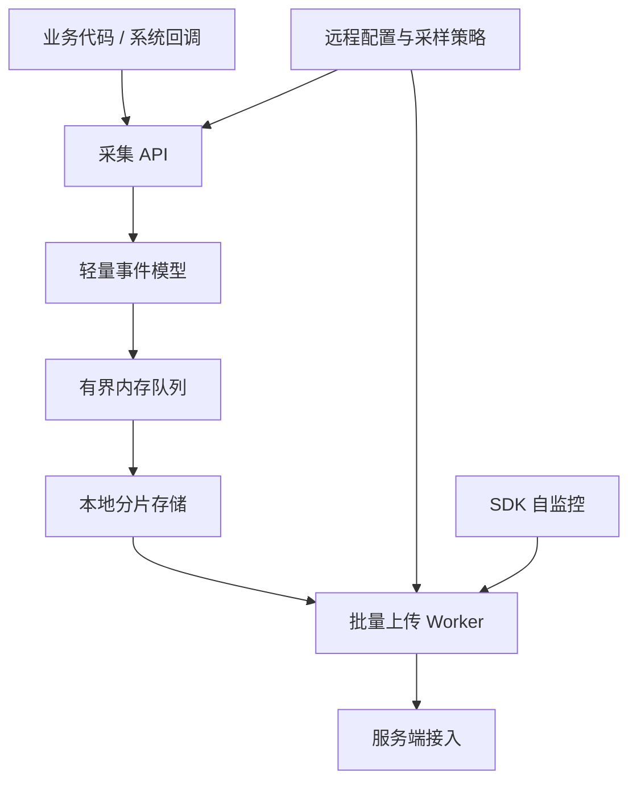

# 26.1 App 可观测性架构设计

App 可观测性需要回答四个问题：影响了多少用户、现场留下了哪些证据、可能由哪个模块负责、修复上线后同口径指标是否恢复。新版本的崩溃（Crash）率异常时，应先确认受影响的用户、机型和版本，再关联崩溃堆栈、发布记录与经过控制的用户操作摘要。指标（Metrics）用于观察群体趋势，日志（Logs）用于还原单次事件，追踪（Traces）用于解释耗时路径。整体架构可从数据模型、端侧采集、服务端处理和问题流转四个层面展开。

平台锚点为 Android 17 / API 37 / `android-17.0.0_r1`。可观测性协议大多由应用与服务端共同定义，第三方 SDK（Software Development Kit，软件开发工具包）的字段不属于 Android 平台保证。时间基准和线上系统性能剖析资料（profile）的边界，分别以 Android 17 的 `SystemClock` 与 `ProfilingManager` 实现为准。

## 指标、日志与追踪分别回答什么问题

三类证据的粒度和用途不同：指标适合观察群体趋势，日志适合还原单次现场，追踪适合解释时间线中的慢点。混用同一套存储、标签和采样规则，会让成本与查询方式同时失去控制。

| 类型 | 典型数据 | 适合回答的问题 | 不适合处理的问题 |
| --- | --- | --- | --- |
| 指标（Metrics） | Crash 率、ANR（Application Not Responding，应用无响应）率、启动 P95（第 95 百分位）、慢帧率、网络失败率、WakeLock（唤醒锁）异常率 | 这个版本是否变差、影响哪些机型、是否达到告警阈值 | 还原单个用户当时发生了什么 |
| 日志（Logs） | 业务日志、诊断日志、Crash 附加信息、用户反馈时间窗日志 | 这个用户的操作路径、请求参数摘要、错误码、降级原因 | 长期保存全部明细并做高频聚合 |
| 追踪（Traces） | Perfetto（Android 系统追踪工具）数据、方法耗时片段、网络阶段耗时、会话时间线 | 一次启动、卡顿或网络请求慢在哪个阶段 | 替代日常指标看板，或面向全部用户长期采集 |

Android vitals 侧重指标：在用户允许采集的前提下，Google Play 汇总稳定性、性能、电量和权限等质量数据。当前核心指标包括用户感知崩溃率（user-perceived crash rate）、用户感知 ANR 率（user-perceived ANR rate）和部分唤醒锁使用过量（excessive partial wake locks）。Play 使用最近 28 天的数据评估应用质量，并每天检查 28 天平均值。它可以作为 Play 分发侧的质量基线，但不提供应用自定义业务场景和内部日志；团队仍需补充页面、场景、构建版本与渠道等维度。[Android Vitals 官方说明](https://developer.android.com/topic/performance/vitals)

Firebase Performance Monitoring 更接近应用内部性能观测：它可自动采集启动、HTTP/S 请求和按屏幕统计的渲染数据，并允许添加自定义代码追踪（custom code trace）、自定义指标（custom metrics）与筛选属性（attributes）。这里的 trace 是两个时间点之间的任务记录及其指标，不是 Perfetto 文件；attributes 可按国家、设备、应用版本和系统版本筛选数据。[Firebase Performance Monitoring 官方说明](https://firebase.google.com/docs/perf-mon)

应用自建体系可以组合两类数据：Android vitals 提供 Play 侧质量结果，自建指标补充内部维度，日志和追踪提供现场证据。只看 vitals 能发现质量变化，但无法解释变化出现在哪个业务场景、由什么触发。

### 事件数据模型设计示例

指标、日志和追踪在端侧的编码方式不同，但需要共享关联字段。下面的 JSON 展示一份最小公共信封，即包在各类事件外层、用于关联和解码的一组公共字段。字段名属于应用协议示例，不是 Android 平台 API。

```json
{
  "$common": {
    "schema_version": "obs.event.v3",
    "event_id": "0198f1a4-...",
    "event_type": "startup_metric",
    "wall_time_ms": 1785312000123,
    "elapsed_realtime_ns": 418273600012345,
    "session_id": "resettable-session-id",
    "trace_id": "9f0c...",
    "scene_id": "MainActivity_onResume",
    "scene_seq": 12,
    "app_version": "8.4.2",
    "build_number": 8420,
    "os_version": "Android 17",
    "api_level": 37,
    "device_model": "example-model",
    "device_brand": "Google",
    "network_type": "WIFI",
    "app_in_foreground": true,
    "inclusion_probability": 0.1,
    "sampling_rule_id": "baseline-startup-v3"
  }
}
```

`wall_time_ms` 记录现实时间（wall clock），用于和发布、告警对时，但用户或网络都可能调整它；会话内排序与耗时计算应使用单调递增的 `elapsed_realtime_ns`。Android 的 `SystemClock.elapsedRealtimeNanos()` 包含深度睡眠时间，适合测量间隔，但设备重启后会归零，因此还需要 `session_id`（会话标识）和 `scene_seq`（场景内顺序号）划定边界。`event_id` 用于重试去重，`trace_id` 用于关联不同信号，`schema_version` 表示事件结构版本。

下面的指标片段展示启动事件专属字段。为节省篇幅，`$common` 只保留 `event_type`；生产事件仍应携带完整公共信封。

```json
{
  "$common": { "event_type": "startup_metric" },
  "startup": {
    "type": "cold",
    "ttid_ms": 1820,
    "ttfd_ms": 2350,
    "attach_base_ms": 120,
    "oncreate_ms": 450,
    "first_screen_ms": 1250,
    "dag_critical_path_ms": 1400,
    "thread_pool_wait_max_ms": 80,
    "provider_init_count": 12,
    "provider_init_total_ms": 320,
    "sdk_init_count": 8,
    "blocked_by_network": true,
    "network_requests": [
      { "name": "config_fetch", "duration_ms": 520, "cached": false },
      { "name": "ab_test", "duration_ms": 180, "cached": true }
    ]
  }
}
```

`ttid_ms` 表示首次显示时间（Time to Initial Display，TTID），`ttfd_ms` 表示完全显示时间（Time to Full Display，TTFD）；其他阶段名属于应用自定义协议，必须给出统一的起止点。日常事件适合保存阶段耗时、计数和阻塞原因，无需为每次启动保存系统追踪。指标出现回归后，再对受控样本采集性能剖析资料。

下面的日志片段只携带允许上报的模板标识与分类字段，避免把自由文本当成默认协议。

```json
{
  "$common": { "event_type": "user_log" },
  "log": {
    "level": "ERROR",
    "tag": "PaymentFlow",
    "message_template_id": "payment_confirm_timeout",
    "message_fingerprint": "hmac-sha256:abc123...",
    "error_code": 504,
    "user_visible": true,
    "prev_scene_id": "PaymentConfirmActivity",
    "stack_trace_hash": "hmac-sha256:def456..."
  }
}
```

普通上报应优先使用枚举模板和允许列表字段。对原始文本直接计算 SHA-256 摘要并不等于匿名化：低熵内容的可能取值很少，错误消息、手机号或 URL 仍可能被枚举猜出。需要稳定聚合时，应先移除敏感字段，再用受控密钥生成 HMAC（Hash-based Message Authentication Code，基于哈希的消息认证码）指纹。详细日志只能在明确的数据政策、用户告知或同意、目标时间窗、配额和自动过期约束下按目标取回（回捞）。

下面的追踪片段展示应用埋点生成的 span 摘要。span 表示追踪中的一个有起点和持续时间的工作区间；它可以与日志共享 `trace_id`，但不等同于系统追踪。

```json
{
  "$common": { "event_type": "method_trace" },
  "trace": {
    "span_id": "37ab...",
    "parent_span_id": "a011...",
    "span_name": "MainActivity.onCreate",
    "start_elapsed_realtime_ns": 418273600320000,
    "duration_ms": 145,
    "thread": "main",
    "sub_spans": [
      { "name": "setContentView", "duration_ms": 45 },
      { "name": "findViewById", "duration_ms": 12 },
      { "name": "ViewModel.init", "duration_ms": 68 }
    ]
  }
}
```

`trace_id`、`span_id` 和 `parent_span_id` 构成父子关联，单调时钟给出同设备会话内的起点与时长。Android 15 / API 35 起，普通应用可通过 `ProfilingManager` 请求系统追踪（system trace）、Java 堆转储（heap dump）、原生堆采样（heap profile）或调用栈采样（stack sampling）；请求受系统限流且不保证执行，结果会脱敏并只包含请求应用的相关信息。Android 16 / API 36 起可注册系统触发器；Android 17 / API 37 又增加冷启动（`TRIGGER_TYPE_COLD_START`）、异常行为（`TRIGGER_TYPE_ANOMALY`）等类型。该能力不保证异常后取得完整设备 Perfetto 数据；回调失败、文件配额、用户数据政策与上传策略都要单独处理。

数据模型不能依赖“字段永不删除”的约定维持兼容。每条事件都要携带数据结构（schema）版本；服务端至少兼容当前版本和迁移窗口内的旧版本。新增字段必须有缺省语义；废弃字段应先让服务端同时读取新旧格式，验证新格式数据后再停止发送旧字段。最小版本只需要事件类型、双时钟、构建版本、会话/场景 ID、采样纳入概率与业务核心字段。高基数字段的不同取值数量很大，不能直接放入指标标签集合。

## 应用侧监控体系分层设计

应用侧架构需要满足四项约束：采集入口低开销、缓冲区有容量上限、证据按价值分级、上传受配额控制。监控 SDK 不应在业务线程内完成编码、写盘或网络请求；故障期间，这些额外工作可能进一步增加延迟或资源压力。

下图展示采集、缓冲、存储、上传和远程控制之间的数据方向：



端侧至少分成五层：

- 采集层：接入 Crash、ANR、启动、卡顿、内存、网络、耗电、业务场景等信号。采集代码只记录时间戳、场景 ID、错误码和摘要字段，不能同步写文件或发网络请求。
- 缓冲层：使用有界队列或 `RingBuffer`（环形缓冲区）处理高频事件。队列满时按事件等级丢弃，丢弃数进入 SDK 自监控字段。
- 存储层：普通性能样本进入小块分片文件；Crash、ANR、HPROF（Java 堆转储文件）、Perfetto trace 等大文件使用独立目录和配额。详见 19.22 节的端侧 APM（Application Performance Monitoring，应用性能监控）存储设计。
- 上传层：按事件优先级、网络类型、前后台状态和服务端限流批量上传。弱网下优先上传摘要，延后上传大文件；Worker 指负责这项后台工作的调度单元。
- 控制层：服务端下发采样率、事件开关、远程诊断命令和熔断规则。熔断是在异常或成本超限时自动关闭高成本采集；每条配置都要带签名、版本号、过期时间、作用范围和回滚策略。

这个分层还要遵守两个执行约束。主线程只提交原始事件；分析和聚合通常放到服务端，端侧只做必要的聚合、压缩、脱敏和失败恢复。`mmap`（内存映射）也会产生首次缺页、文件扩容、同步和存储压力，不能据此假定主线程写入没有开销。19.22 节说明了 APM SDK 的持久化、编码协议、网络投递和自监控实现。

Crash 还需要一条不依赖普通异步队列的最小保全路径。进程异常退出时，后台线程可能来不及消费队列；Java 未捕获异常（uncaught exception）与原生信号（native signal）能安全执行的操作也不同。实现应预分配必要结构，避免在原生信号处理器中调用不具备异步信号安全性（async-signal-safe）的操作，并在下次启动时校验和补传未完成记录。具体边界见 26.2。

## 从采集到告警的完整数据路径

一套可用的应用可观测性系统通常经过：端侧采集 → 本地暂存 → 批量上传 → 接入清洗 → 实时聚合或离线聚合 → 告警 → 证据查询 → 修复验证。

| 阶段 | 主要任务 | 失败表现 |
| --- | --- | --- |
| 采集 | 定义事件结构，补齐版本、设备、页面、场景、网络、前后台等公共字段 | 指标无法按场景拆分，异常样本缺少现场信息 |
| 上报 | 合并小事件，优先发送高价值摘要，保留失败重试和服务端限流处理 | 崩溃后数据丢失，弱网下低价值事件挤占通道 |
| 存储 | 明细、聚合、索引分开；大文件单独配额和保留期 | 查询慢、成本高、敏感文件长期留存 |
| 分析 | 按版本、机型、Android 版本、渠道、页面、用户分群看分布和趋势 | 全局均值正常，重点机型已经恶化 |
| 告警 | 绑定可执行的处理条件，例如某版本用户感知 ANR 率、启动 TTFD P95、慢会话比例 | 告警噪声多，工程团队不再信任 |
| 证据查询 | 从指标进入样本，再关联日志、追踪、崩溃栈和发布记录 | 看得到异常，看不到现场 |
| 验证 | 修复版本上线后，对比线上指标和基准测试结果 | 修复效果只能靠主观判断 |

Android 官方启动优化文档区分 TTID 和 TTFD：TTID 表示首帧出现，TTFD 表示应用达到自行上报的完全绘制、可用状态。启动监控不能只看一个总耗时；`reportFullyDrawn()` 的调用位置必须对应产品定义的可用状态。Macrobenchmark（Jetpack 宏基准测试库）的 `StartupTimingMetric` 可用于线下基准测试，线上再用端侧指标观察真实分布。[App startup analysis and optimization](https://developer.android.com/topic/performance/appstartup/analysis-optimization)

渲染也要区分指标和现场。Android 官方文档分别定义慢帧（slow frames）、冻帧（frozen frames）和 ANR；Perfetto FrameTimeline（帧时间线）可用于追踪慢帧或冻帧原因。线上指标负责指出哪些版本、页面和机型发生回归，设备实验或受控线上性能剖析负责解释具体样本。[Slow rendering](https://developer.android.com/topic/performance/vitals/render)

服务端分析层要保留几类关联键：`event_id`、`session_id`、`trace_id`、`span_id`、`scene_id`、`build_version`、`device_model`、`android_version` 和 `network_type`。这些字段让 Crash、ANR、性能指标、用户日志和发布记录能够互相查询。`session_id` 应是短期、可重置且用途受限的标识，不能用永久设备 ID 代替。详见 15.9 节的采集到治理过程设计。

## 采样策略与数据量控制

可观测性系统的成本来自端侧 CPU / I/O、用户流量以及服务端存储与计算。采样策略要同时控制这些成本。容量评估不能只按 DAU（Daily Active Users，日活跃用户数）猜测，应使用“活跃设备数 × 每设备事件频率 × 编码后字节 × 保留期 × 副本数”计算，再用灰度实测校正压缩率和一次查询实际读取的数据量。

常用策略可以分成四类：

- 高优先级基线：在用户数据政策允许的范围内，优先保留 Crash / ANR 摘要、构建版本、设备维度和关键页面启动指标；仍需单设备限额、去重和熔断，“全量”不代表无限写入。
- 用户级采样：对高频性能事件按用户做确定性分桶，即用稳定规则把同一用户映射到同一采样组，避免逐事件随机采样造成会话时间线断裂。命中用户在一个时间窗内保持同一策略，便于还原连续会话。
- 异常补采：基线指标发现异常后，对目标版本、机型和渠道短期开启更高采样率；性能剖析采集还要满足平台限流、设备状态、隐私和文件配额。
- 大文件限额：HPROF、系统追踪和完整日志包必须限制单设备次数、文件大小、上传网络和保留时间。

采样配置要有版本号。客户端每次成功上报时带上本地配置版本，服务端可以随响应返回新配置；这条路径不保证即时到达，因此客户端还要为配置过期、长期离线和签名校验失败定义保守缺省值。配置应支持紧急关闭开关（kill switch），用于迅速停用异常或成本失控的采集能力；可关闭范围必须受限，避免远程配置破坏 Crash / ANR 等最低诊断能力。

采样后的数据必须携带 `sampling_rule_id`、分层字段和该事件的 `inclusion_probability`（纳入样本的概率）。只有抽样设计与纳入概率已知时，服务端才能按权重估计总体；异常补采、失败全量和成功抽样混合后，必须按层分别计算，不能把所有样本简单除以一个采样率。单用户排查界面也要显示采样命中与丢弃原因，避免把“没有采到”误判成“没有发生”。

## 可观测性建设的常见陷阱

从零建设可观测性系统时，下面六类问题最常见。

### 陷阱 1：把所有东西都上报，然后「服务端再筛」

端侧若默认“先全量上报，服务端再过滤”，写入、索引和高基数聚合会随事件频率增长。高基数表示字段有大量不同取值，例如完整 URL 或永久用户 ID；它会扩大索引和分组成本。服务端账单出现变化前，端侧已经消耗了 CPU、I/O 与用户流量。

设计时应先为每类事件估算频率、编码大小、基数和保留用途，再选择端侧聚合、确定性采样或原始事件。只上报异常会失去分母与正常基线；失败事件和成功样本可以采用不同层级，并在事件中记录各自的纳入概率。用户 ID、原始 URL、自由文本和堆栈全文等高基数字段不应直接进入指标标签。

### 陷阱 2：用指标替代日志和追踪

团队如果只关注指标看板，看到 Crash 率上升后，既没有日志定位页面、场景和操作摘要，也没有追踪解释耗时路径。

指标可以指出版本回归，日志可以给出支付确认事件的错误分类，追踪可以显示等待发生在哪个 span。三类信号的存储和采样方式不同，但要共享统一的关联信息；OpenTelemetry（开放式可观测性规范与工具体系）也使用 trace 与 span 标识连接日志和追踪，不只依赖相近时间戳。

### 陷阱 3：采样策略按事件随机，破坏了会话时间线

高频事件若逐条独立抽样，一个会话中只会留下不连续片段：日志显示用户打开了支付页，但前面的场景切换可能没有采到，排查时无法还原路径。

需要连续会话时，可使用 `HMAC(sampling_key, resettable_id | sampling_rule_id)` 生成稳定分桶，并让命中结果在配置时间窗内保持一致。客户端不上传原始标识；`sampling_key` 是服务控制的密钥，密钥轮换与标识重置都会改变分桶。这里的 HMAC 只用于稳定分组，不能证明标识已经匿名化。支付、地区或机型等分层若采用不同概率，估计总体时必须保留分层和纳入概率。

### 陷阱 4：端侧采集在主线程做编码和落盘

采集 API 常从主线程调用。如果 SDK 在调用栈内完成 JSON 序列化、文件扩容、压缩或同步写入，存储抖动会直接进入页面耗时；`mmap` 写入也可能因缺页和回写产生长尾。

采集入口应只读取必要的原始值并尝试写入有界队列，序列化和写盘放到专用线程。性能预算不能照搬固定数字，应在目标设备档位上测量入口的 P50、P95、P99（第 50、95、99 百分位）、分配次数、队列丢弃率和主线程长尾，并把 SDK 自身开销纳入发版门禁。

### 陷阱 5：把诊断数据当成默认开启的能力

用户日志回捞、远程诊断命令和系统性能剖析都属于高敏感、高成本能力，默认应关闭；只有命中明确策略并满足用户数据政策后才短期开启。全量自由文本日志不能作为基线能力。

可以区分两类数据通道：基线通道发送经过最小化的 Crash / ANR 摘要、启动/帧指标和网络结果；诊断通道处理日志回捞、`ProfilingManager` 结果和远程只读检查。诊断策略必须限定目标、时间窗、单设备配额和保留期，并允许从客户端和服务端两侧关闭。

### 陷阱 6：服务端告警阈值与用户感知脱节

固定的绝对增量没有考虑基线、样本量、设备分布和产品场景，同样的变化在不同页面可能含义完全不同。告警应绑定用户可感知的 SLO（Service Level Objective，服务等级目标），例如产品定义的 TTFD 慢会话比例、用户感知 ANR/Crash 率或冻帧会话比例，并同时检查置信区间、持续时间和版本/机型分层。Android vitals 的不良行为阈值（bad behavior threshold）采用 Play 分发口径；内部告警可以更早，但必须明确两者的分母不同。

### 用户日志与远程诊断：现场证据层

指标告诉团队哪里异常，日志和远程诊断帮助团队还原现场。可观测性架构除了指标看板，还要能在必要时为特定用户、特定版本、特定机型补采现场证据。

可执行的设计通常包含三类能力：

- 用户日志回捞：只拉取目标用户、目标时间窗、目标 tag（日志分类标签）的日志。日志正文默认脱敏，URL 查询参数（query）、认证令牌（token）、手机号和定位字段默认不入库。
- 远程诊断命令：对网络、存储、权限、配置和缓存状态执行允许列表内的只读检查，结果以结构化字段上报。命令必须带过期时间、设备配额、重放保护和服务端签名，不能提供任意 shell 命令、任意文件读取或动态代码执行入口。
- 异常触发补采：Crash、ANR、冻帧或启动超出产品阈值后，下一次启动优先上传摘要；命中灰度策略时，再请求受平台限制的性能剖析资料或目标日志。

Firebase Performance Monitoring 对 HTTP 请求使用不含查询参数的 URL 构造聚合模式，并声明不永久保存个人可识别信息。自建系统也应在采集前完成字段允许列表、脱敏与用途分级；哈希不是删除个人信息的替代方案。[Firebase Performance Monitoring：User data](https://firebase.google.com/docs/perf-mon/#user_data)

## Android 17 平台源码边界

Android 17 的 [`SystemClock.java`](https://android.googlesource.com/platform/frameworks/base/+/refs/tags/android-17.0.0_r1/core/java/android/os/SystemClock.java) 区分三种时间：可被调整的现实时间（wall clock）、深度睡眠期间暂停的运行时间（uptime clock），以及包含深度睡眠且单调递增的经过时间（elapsed realtime）。事件协议同时保留现实时间和单调时间，分别用于跨系统对时与本机会话排序；一次 `System.currentTimeMillis()` 不能同时满足两种用途。

Android 17 的 [`ProfilingManager.java`](https://android.googlesource.com/platform/packages/modules/Profiling/+/refs/tags/android-17.0.0_r1/framework/java/android/os/ProfilingManager.java) 写明请求受限流且不保证执行，返回结果经过脱敏并限定到请求进程。线上架构应把性能剖析资料视为稀缺的补充证据：先用指标确定目标群体，再用 span 和日志摘要缩小范围，随后在系统允许时采集。没有回调或没有制品都属于正常分支，诊断流程不能依赖它必定成功。

这里不使用 Linux 内核私有接口，也不从 eBPF（extended Berkeley Packet Filter，内核可编程追踪机制）、`/proc`（内核导出的进程与系统状态伪文件系统）或调度器实现推导应用协议，因此不引入内核源码标签。涉及内核采集路径的专题统一以 `android17-6.18-2026-06_r6` 为内核源码锚点。

## 最小可用架构

团队不必一开始建设完整平台。最小版本可以从下面几项开始：

1. Crash / ANR 摘要：进程、线程、堆栈、版本、设备、前后台状态、最近场景。
2. 启动与渲染指标：TTID、TTFD、慢帧 / 冻帧、关键页面场景 ID。
3. 网络指标：DNS（Domain Name System，域名解析）、连接、TLS（Transport Layer Security，传输层安全协议）、首包、总耗时、错误码、网络类型。
4. 受控日志：按分类标签和敏感级别区分、本地有界滚动、按目标会话与时间窗回捞。
5. 采样与配置：带签名和过期时间的配置、确定性会话采样、纳入概率、异常补采与紧急关闭开关。
6. 证据查询入口：从告警进入样本，再关联日志、span、性能剖析资料、发布版本和修复任务。

这些能力分别对应 26.2 的 Crash 上报、26.3 的性能指标采集、26.4 的 ANR 监控和 26.5 的线上排查；各专题在同一事件标识、时钟和采样协议上继续扩展。

## 参考资料

- [Android Vitals](https://developer.android.com/topic/performance/vitals)：Play 质量指标、核心指标与 28 天评估窗口。
- [App startup analysis and optimization](https://developer.android.com/topic/performance/appstartup/analysis-optimization)：TTID、TTFD 与启动追踪。
- [Slow rendering](https://developer.android.com/topic/performance/vitals/render)：慢帧、冻帧、ANR 与 FrameTimeline。
- [Firebase Performance Monitoring](https://firebase.google.com/docs/perf-mon)：自动追踪、自定义指标、筛选属性与用户数据说明。
- [SystemClock API](https://developer.android.com/reference/android/os/SystemClock)：现实时间、运行时间与经过时间的语义。
- [ProfilingManager API](https://developer.android.com/reference/android/os/ProfilingManager)：性能剖析类型、限流、回调与结果边界。
- [ProfilingTrigger API](https://developer.android.com/reference/android/os/ProfilingTrigger)：Android 16—17 的系统触发类型。
- [Android privacy checklist](https://developer.android.com/privacy-and-security/about)：数据访问审计、可重置标识、告知与敏感日志要求。
- [OpenTelemetry logs](https://opentelemetry.io/docs/specs/otel/logs/)：使用 trace/span 关联信息连接日志与追踪。
- [AOSP `SystemClock.java` @ Android 17](https://android.googlesource.com/platform/frameworks/base/+/refs/tags/android-17.0.0_r1/core/java/android/os/SystemClock.java)：平台时钟实现边界。
- [AOSP `ProfilingManager.java` @ Android 17](https://android.googlesource.com/platform/packages/modules/Profiling/+/refs/tags/android-17.0.0_r1/framework/java/android/os/ProfilingManager.java)：线上性能剖析请求、触发器与限流边界。
