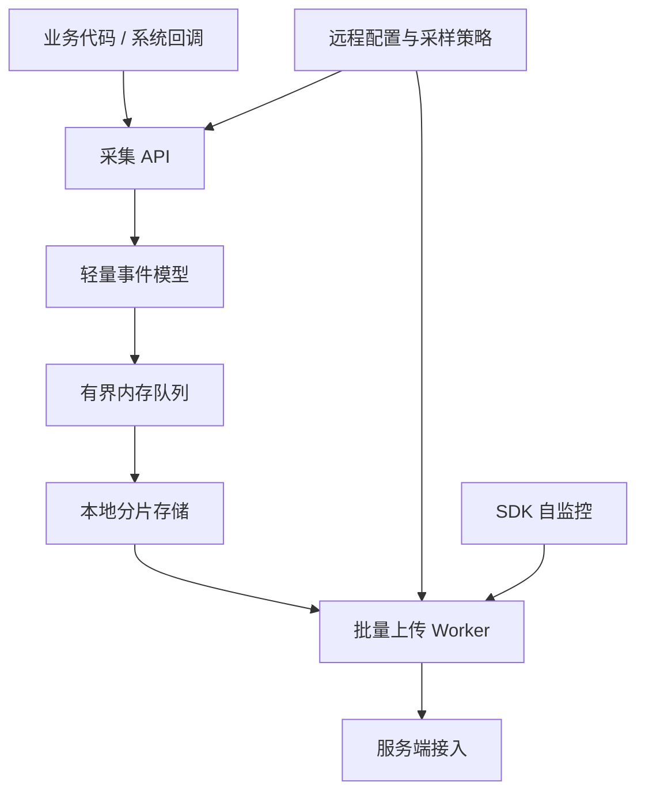

# App 可观测性架构设计

<!-- outline-start -->
## 本节要点大纲

### 锚点（必须覆盖）

- 🔹 可观测性三支柱：Metrics / Logs / Traces
- 🔹 App 侧监控体系分层设计
- 🔹 数据采集 / 上报 / 存储 / 分析 / 告警完整路径
- 🔹 采样策略与数据量控制

### 扩展（可选深入）

- 🔸 （待扩展）

### OpenClaw 加工指引

> **锚点**是最低覆盖要求，加工时必须逐条落实并标注验证结果。
> **扩展**视素材丰富程度选择性深入。
> 如果从 Obsidian 素材或 AOSP 源码中发现大纲未列出但与本节强相关的知识点，
> 可**就地插入**最相关的锚点之后，并用 `[自动发现]` 标注，方便后续 review。
> 锚点内容需 L1/L2 验证，扩展内容至少 L2 验证，自动发现内容至少标注来源。
<!-- outline-end -->

App 可观测性要解决线上问题处理里的四件事：判断影响面、取得现场证据、找到责任方向，并在线上验证修复结果。新版本上线后 crash 率异常，应先回答「影响多少用户、集中在哪些机型和版本」，再关联 crash 堆栈、发布记录和受控的用户操作摘要；修复进入灰度后，还要验证同口径指标是否恢复。这四个环节分别需要 Metrics（看趋势）、Logs（还原事件）、Traces（解释耗时路径）和回验。本节从数据模型、端侧采集、服务端处理与问题流转四个层面说明总架构。

本文的平台锚点是 Android 17 / API 37 / `android-17.0.0_r1`。可观测性协议大多由应用与服务端共同定义，不能把某个第三方 SDK 的字段误写成平台保证；涉及时间基准和线上系统 profile 时，分别以 Android 17 的 `SystemClock` 与 `ProfilingManager` 实现边界为准。

## Metrics / Logs / Traces 分别回答什么问题

Metrics、Logs、Traces 是三类不同粒度的证据，混在一起设计会让系统很快失控。Metrics 适合看群体趋势，Logs 适合还原单次现场，Traces 适合解释时间线上哪一段慢。

| 类型 | 典型数据 | 适合回答的问题 | 不适合处理的问题 |
| --- | --- | --- | --- |
| Metrics | Crash 率、ANR 率、启动 P95、慢帧率、网络失败率、WakeLock 异常率 | 这个版本是否变差、影响哪些机型、是否达到告警阈值 | 还原单个用户当时发生了什么 |
| Logs | 业务日志、诊断日志、Crash 附加信息、用户反馈时间窗日志 | 这个用户的操作路径、请求参数摘要、错误码、降级原因 | 长期保存全部明细并做高频聚合 |
| Traces | Perfetto trace、方法耗时片段、网络阶段耗时、会话时间线 | 一次启动、卡顿或网络请求到底慢在哪个阶段 | 替代日常指标大盘，或全量长期采集 |

Android Vitals 侧重 Metrics：在用户允许采集的前提下，Google Play 汇总稳定性、性能、电量和权限等质量数据；当前核心指标包括 user-perceived crash rate、user-perceived ANR rate 和 excessive partial wake locks，Play 每天以最近 28 天的平均值检查关键质量指标。它适合作为 Play 分发侧的质量基线，但不会提供应用自定义的业务场景和内部日志。团队仍需用自己的数据模型补充页面、场景、构建版本与渠道等维度。[Android Vitals 官方说明](https://developer.android.com/topic/performance/vitals)

Firebase Performance Monitoring 的模型更接近 App 内部性能观测：它可自动采集启动、HTTP/S 请求和屏幕渲染 trace，并允许自定义 code trace、custom metrics 与 attributes。这里的 trace 是一段任务的起止时间及附加指标，不是 Perfetto 文件；attributes 用于按国家、设备、版本和系统等维度筛选。[Firebase Performance Monitoring 官方说明](https://firebase.google.com/docs/perf-mon)

App 自建体系要把两者结合：Vitals 给外部质量结果，自建 Metrics 给内部维度，Logs 和 Traces 给现场证据。单看 Vitals 只能知道质量已经变差；没有 Logs 和 Traces，仍然很难解释变差发生在哪个场景、由什么触发。

### 事件数据模型设计示例

Metrics、Logs、Traces 在端侧的编码方式不同，但需要共享关联字段。下面的 JSON 展示一份最小公共信封；字段名是应用协议示例，不是 Android 平台 API。

```json
{
  "$common": {
    "schema_version": "obs.event.v3",
    "event_id": "0198f1a4-...",
    "event_type": "startup_metric",
    "wall_time_ms": 1785312000123,
    "elapsed_realtime_ns": 418273600012345,
    "session_id": "resettable-session-id",
    "trace_id": "9f0c...",
    "scene_id": "MainActivity_onResume",
    "scene_seq": 12,
    "app_version": "8.4.2",
    "build_number": 8420,
    "os_version": "Android 17",
    "api_level": 37,
    "device_model": "example-model",
    "device_brand": "Google",
    "network_type": "WIFI",
    "app_in_foreground": true,
    "inclusion_probability": 0.1,
    "sampling_rule_id": "baseline-startup-v3"
  }
}
```

`wall_time_ms` 用于和发布、告警等现实时间对齐，但用户或网络可以调整墙上时钟；会话内排序与耗时计算应使用单调递增的 `elapsed_realtime_ns`。Android 的 `SystemClock.elapsedRealtimeNanos()` 包含深度睡眠时间，适合通用间隔测量，但设备重启后会归零，因此还需要 `session_id` 和 `scene_seq` 划定边界。`event_id` 用于重试去重，`trace_id` 用于跨信号关联，`schema_version` 用于解码与迁移。

下面的 Metrics 片段展示启动事件的专属字段；为节省篇幅，`$common` 只保留 `event_type`，生产事件仍应携带上面的完整公共信封。

```json
{
  "$common": { "event_type": "startup_metric" },
  "startup": {
    "type": "cold",
    "ttid_ms": 1820,
    "ttfd_ms": 2350,
    "attach_base_ms": 120,
    "oncreate_ms": 450,
    "first_screen_ms": 1250,
    "dag_critical_path_ms": 1400,
    "thread_pool_wait_max_ms": 80,
    "provider_init_count": 12,
    "provider_init_total_ms": 320,
    "sdk_init_count": 8,
    "blocked_by_network": true,
    "network_requests": [
      { "name": "config_fetch", "duration_ms": 520, "cached": false },
      { "name": "ab_test", "duration_ms": 180, "cached": true }
    ]
  }
}
```

`ttid_ms` 和 `ttfd_ms` 分别对应平台定义的首次显示与完全显示时间；其他阶段名属于应用自定义协议，必须给出统一的起止点。日常事件适合保存阶段耗时、计数和阻塞原因，而不是为每次启动保存系统 trace。指标出现回归后，再对受控样本采集 profile。

下面的 Logs 片段只携带允许上报的模板标识与分类字段，避免把自由文本当成默认协议。

```json
{
  "$common": { "event_type": "user_log" },
  "log": {
    "level": "ERROR",
    "tag": "PaymentFlow",
    "message_template_id": "payment_confirm_timeout",
    "message_fingerprint": "hmac-sha256:abc123...",
    "error_code": 504,
    "user_visible": true,
    "prev_scene_id": "PaymentConfirmActivity",
    "stack_trace_hash": "sha256:def456..."
  }
}
```

普通上报应优先使用枚举化模板和允许列表字段。对原始文本直接做普通 SHA-256 不是匿名化：低熵错误消息、手机号或 URL 仍可能被猜测；需要稳定聚合时，应先移除敏感字段，再用受控密钥生成 HMAC 指纹。详细日志只能在明确的数据政策、用户告知或同意、目标时间窗、配额和自动过期约束下回捞。

下面的 Traces 片段展示应用自己埋点的 span 摘要，它可以与日志共享 `trace_id`，但不等同于系统 trace。

```json
{
  "$common": { "event_type": "method_trace" },
  "trace": {
    "span_id": "37ab...",
    "parent_span_id": "a011...",
    "span_name": "MainActivity.onCreate",
    "start_elapsed_realtime_ns": 418273600320000,
    "duration_ms": 145,
    "thread": "main",
    "sub_spans": [
      { "name": "setContentView", "duration_ms": 45 },
      { "name": "findViewById", "duration_ms": 12 },
      { "name": "ViewModel.init", "duration_ms": 68 }
    ]
  }
}
```

`trace_id`、`span_id` 和 `parent_span_id` 构成关联关系，单调时钟给出同设备会话内的起点与时长。Android 15 / API 35 起，普通应用可通过 `ProfilingManager` 请求 system trace、heap dump、heap profile 或 stack sampling；请求受系统限流且不保证执行，结果经过裁剪，只包含请求应用的相关信息。Android 16 / API 36 起可注册系统触发器，Android 17 / API 37 又增加 cold start、anomaly 等触发类型。应用不能把该能力描述成“异常后必定取得完整设备 Perfetto”；回调失败、文件配额、用户数据政策与上传策略都要单独处理。

数据模型不能依赖“字段永不删除”的约定维持兼容。每条事件都要携带 schema 版本；服务端至少兼容当前与迁移窗口内的旧版本，新增字段必须有缺省语义，废弃字段经过读写双轨和数据验证后再停止发送。最小版本只需要事件类型、双时钟、构建版本、会话/场景 ID、采样纳入概率与业务核心字段；高基数字段不能直接进入 Metrics 标签集合。
## App 侧监控体系分层设计

App 侧架构要按“入口轻、缓冲可控、证据分级、上传受限”设计。监控 SDK 不应把业务线程变成编码、落盘或网络线程；否则故障发生时，监控系统会放大故障。



端侧至少分成五层：

- 采集层：接入 Crash、ANR、启动、卡顿、内存、网络、耗电、业务场景等信号。采集代码只做时间戳、场景 ID、错误码、摘要字段，不能同步写文件或发网络请求。
- 缓冲层：使用有界队列或 `RingBuffer`（环形缓冲区）承接高频事件。队列满时按事件等级丢弃，丢弃数进入 SDK 自监控字段。
- 存储层：普通性能样本进入小块分片文件；Crash、ANR、HPROF、Perfetto trace 这类大文件走独立目录和配额。详见 19.27 节的端侧 APM 存储设计。
- 上传层：按事件优先级、网络类型、前后台状态和服务端限流批量上传。弱网下优先上传摘要，延后上传大文件。
- 控制层：服务端下发采样率、事件开关、远程诊断命令和熔断规则；每条配置带版本号、过期时间和作用范围。

这个分层里有两个约束。采集入口要足够便宜，主线程只提交事实；分析和聚合要放到服务端，端侧只做必要的压缩、脱敏和容灾。19.27 节已经展开 APM SDK 的 `mmap`、编码协议、网络投递和自监控，本节不重复实现细节。

## 从采集到告警的完整数据路径

一套可用的 App 可观测性系统，路径通常是：端侧采集 → 本地暂存 → 批量上传 → 接入清洗 → 实时聚合 / 离线聚合 → 告警 → 回查 → 修复验证。

| 阶段 | 主要任务 | 失败表现 |
| --- | --- | --- |
| 采集 | 定义事件 schema，补齐版本、设备、页面、场景、网络、前后台等公共字段 | 指标无法按场景拆分，异常样本缺少上下文 |
| 上报 | 合并小事件，优先发送高价值摘要，保留失败重试和服务端限流处理 | 崩溃后数据丢失，弱网下低价值事件挤占通道 |
| 存储 | 明细、聚合、索引分开；大文件单独配额和保留期 | 查询慢、成本高、敏感文件长期留存 |
| 分析 | 按版本、机型、Android 版本、渠道、页面、用户分群看分布和趋势 | 全局均值正常，重点机型已经恶化 |
| 告警 | 绑定可行动阈值，例如某版本 user-perceived ANR rate、启动 TTFD（Time to full display）P95、慢会话比例 | 告警噪音多，工程团队不再信任 |
| 回查 | 从指标跳到样本，再跳到日志、trace、崩溃栈和发布记录 | 看得到异常，看不到现场 |
| 验证 | 修复版本上线后，对比线上指标和基准测试结果 | 修复效果只能靠主观判断 |

Android 官方启动优化文档把 TTID 和 TTFD 区分开：TTID 表示首帧出现，TTFD 更接近用户可交互的完整状态。启动监控不能只看一个总耗时，要把“用户看到东西”和“用户能开始操作”分开记录；Macrobenchmark 的 `StartupTimingMetric` 可用于线下基准测试，线上再用端侧指标观测真实分布。[已验证: 官方文档, developer.android.com/topic/performance/appstartup/analysis-optimization；developer.android.com/topic/performance/benchmarking/macrobenchmark-overview]

渲染也要区分指标和现场。Android 官方文档把 slow frames、frozen frames、ANR 归为不同 jank 形态；Android 12（API 31）及以上的 Perfetto FrameTimeline 可用于追踪慢帧或冻帧原因。线上 Metrics 负责告诉团队哪些版本、页面、机型变差；Perfetto / 会话 trace 负责解释某个样本为何变差。[已验证: 官方文档, developer.android.com/topic/performance/vitals/render]

服务端分析层要保留几类稳定连接键：`session_id`、`trace_id`、`scene_id`、`build_version`、`device_model`、`android_version`、`network_type`。这些字段让 Crash、ANR、性能指标、用户日志和发布记录能够互相跳转。详见 15.9 节的采集到治理过程设计。

## 采样策略与数据量控制

可观测性系统的成本主要来自三处：端侧 CPU / I/O、用户流量、服务端存储和计算。采样策略要同时控制这三类成本。如果不做控制，端侧高频事件（如每秒帧率指标）会让 CPU 持续占用，用户流量被大量数据上传消耗，服务端存储成本线性增长——DAU 100 万的 App，日增上亿条记录并不夸张。

常用策略可以分成四类：

- 基线全量：Crash 摘要、ANR 摘要、版本号、设备维度、关键页面启动指标。事件少、价值高，优先保证完整。
- 用户级采样：对高频性能事件按用户分桶，避免每次事件随机采样造成会话时间线断裂。命中用户在一个时间窗内保持同一策略，便于拼出会话时间线。
- 异常补采：基线指标发现异常后，对目标版本、机型、渠道短期开启更高采样率或 trace 采集。
- 大文件限额：HPROF、Perfetto trace、完整日志包必须限制单设备次数、文件大小、上传网络和保留时间。

[结构参考: Clippings/线上疑难问题该如何排查和跟踪？-Android开发高手课-极客时间 33.md]

采样配置要有版本号。客户端每次成功上报时带上本地配置版本，服务端发现版本落后就把新配置随响应返回。这样不依赖推送，也能在下一次成功上报后更新策略。配置还要支持 kill switch；一旦某个事件写入量、上传量或崩溃率异常，服务端可以立即关闭对应能力。

采样后的数据必须带上采样率和采样规则版本。服务端计算比例时按采样权重还原，排查单用户问题时也能知道为什么某些日志缺失。没有这些字段，平台会把“没有采到”误判成“没有发生”。

## 可观测性建设的常见陷阱

以下问题在团队从零建设可观测性系统时反复出现，提前了解能少走弯路。

### 陷阱 1：把所有东西都上报，然后「服务端再筛」

端侧采集的默认心态是「先全量上报，服务端做过滤」。结果上线第一周，存储成本远超预期，查询也慢到无法使用。

实际工作中，端侧上报量通常被严重低估。一个 DAU 100 万的 App，启动指标（设为每次启动上报一次）每天就产生 100 万条；如果加了页面级别指标，量级再乘 5-10。加上网络请求指标（每次网络请求上报一次），DAU 100 万很容易做到日增上亿条记录。

正确做法：端侧先决定「什么不需要上报」——正常值不上报（只报异常）、低频场景不上报（用户确认流程、一次性向导）、可推导指标不上报（服务端能从其他指标计算的）。常见优化：网络指标只上报失败或超时的请求 + 抽样 1% 的成功请求作为基线。

### 陷阱 2：用 Metrics 替代 Logs 和 Traces

团队只关注 Metrics 大盘，看到 crash 率上升后没有 Logs 来定位哪个页面、哪个场景、哪个操作路径触发的，也没有 Traces 来解释「慢在哪里」。

Metrics 说「这个版本变差了」，Logs 说「变差发生在支付确认页面」，Traces 说「支付确认慢在网络请求超时」。三样缺一不可。Vitals 或 Firebase Performance Monitoring 给的是外部视角的结果指标；内部自建体系要补剩下两块。

### 陷阱 3：采样策略按事件随机，破坏了会话时间线

高频事件按 10% 随机采样，每个事件独立决定「采或不采」。结果一个用户的会话中只保留了片段——日志说用户打开了支付页，但前面的商品页事件没采到，排查时不知道用户从哪进来的、看了什么。

切换到用户级采样：用 `hash(user_id) % 100` 决定该用户是否进入采样组，同一个用户在一个时间窗内要么全采，要么全不采。采样组用户的所有事件连续上报，会话时间线完整。

### 陷阱 4：端侧采集在主线程做编码和落盘

采集 API 在主线程被调用，SDK 内部做了 JSON 序列化 + mmap 写入。这两个操作在主线程上各花 1-3ms，高频场景下累积成 ANR。

监控 SDK 的设计原则：采集入口只收集原始值（时间戳、int、string ref），序列化和落盘全部在后台线程做。入口方法必须保证 < 0.1ms 的执行时间——只做字段赋值和原子变量更新。

### 陷阱 5：把诊断数据当成默认开启的能力

用户日志回捞、远程诊断命令、Perfetto trace 触发——这些能力的开关应该是「默认关闭，按需开启」。不要把全量用户日志采集当作基线能力。

区分两类数据通道：基线通道（Crash/ANR 摘要、启动/帧率指标、网络失败率）默认开启、轻量固定；诊断通道（用户日志回捞、Perfetto 采集、远程诊断）默认关闭，命中灰度策略或用户反馈后才开启，并设置自动过期时间。

### 陷阱 6：服务端告警阈值与用户感知脱节

服务端告警「启动 P95 上升 50ms」，工程团队排查 3 天没发现用户有明显抱怨。后发现：P95 从 1800ms 变成 1850ms，用户完全不感知。而「慢会话比例上升 0.5 个百分点」这个指标对应的用户在首屏等待时间从 2.5 秒变成 4 秒，这些用户才是真的受影响。

告警阈值要绑在「用户能感知的变化」上：TTFD 超过 3 秒的比例、ANR 率（不是次数）、冻帧次数、Crash 率。不要为每个指标都设告警——只告警那些直接反映用户体验恶化的指标。


### 用户日志与远程诊断：现场证据层

Metrics 告诉团队哪里异常，Logs 和远程诊断帮助团队回到现场。本节补上了指标之外的现场证据层：可观测性架构除了指标看板，还要能在必要时为特定用户、特定版本、特定机型补采现场。

可执行的设计通常包含三类能力：

- 用户日志回捞：只拉取目标用户、目标时间窗、目标 tag 的日志。日志正文默认脱敏，URL query、token、手机号、定位字段默认不入库。
- 远程诊断命令：对网络、存储、权限、配置、缓存状态做只读检查，结果以结构化字段上报。命令必须带过期时间、设备配额和服务端签名。
- 异常触发补采：Crash、ANR、冻帧、启动超阈值后，下一次启动优先上传摘要；命中灰度策略时再补传 trace 或更详细日志。

Firebase Performance Monitoring 文档明确提到 HTTP network request 监控会用不含 URL parameters 的 URL 生成聚合模式，且不永久保存个人可识别信息。自建系统也应采用类似原则：采集前就做脱敏和字段分级，避免把清洗延后到入库之后。[已验证: 官方文档, firebase.google.com/docs/perf-mon]

## 最小可用架构

团队不必一开始建设完整平台。最小版本可以从下面几项开始：

1. Crash / ANR 摘要：进程、线程、堆栈、版本、设备、前后台、最近场景。
2. 启动与渲染指标：TTID、TTFD、慢帧 / 冻帧、关键页面场景 ID。
3. 网络指标：DNS、连接、TLS、首包、总耗时、错误码、网络类型。
4. 用户日志：按 tag 分级、本地滚动文件、按用户和时间窗回捞。
5. 采样与配置：服务端配置版本、用户级采样、异常补采、kill switch。
6. 回查入口：从告警跳到样本，再跳到日志、trace、发布版本和关联修复任务。

这套最小版本能支撑 26.2 的 Crash 上报、26.3 的性能指标采集、26.4 的 ANR 监控以及 26.5 的线上排查。后续小节只需要往各自能力里深入，不必重复解释总架构。

## 参考资料

- [结构参考: Clippings/线上疑难问题该如何排查和跟踪？-Android开发高手课-极客时间 1.md]
- [结构参考: Clippings/线上疑难问题该如何排查和跟踪？-Android开发高手课-极客时间 33.md]
- [结构参考: Clippings/线上疑难问题该如何排查和跟踪？-Android开发高手课-极客时间 34.md]
- [结构参考: Clippings/线上疑难问题该如何排查和跟踪？-Android开发高手课-极客时间 35.md]
- Android Vitals: https://developer.android.com/topic/performance/vitals
- App startup analysis and optimization: https://developer.android.com/topic/performance/appstartup/analysis-optimization
- Slow rendering: https://developer.android.com/topic/performance/vitals/render
- Firebase Performance Monitoring: https://firebase.google.com/docs/perf-mon
