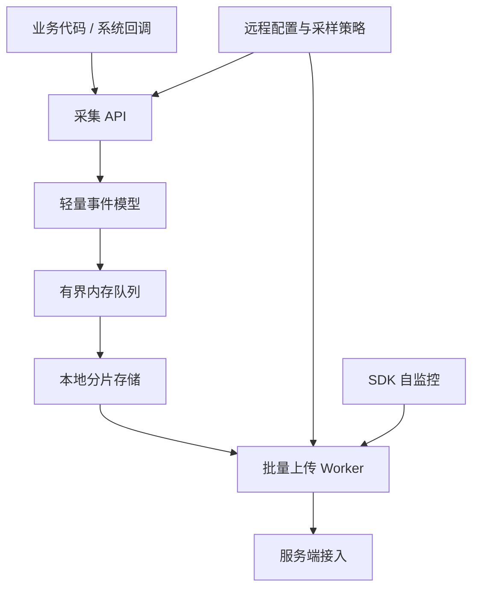

# App 可观测性架构设计

<!-- outline-start -->
## 本节要点大纲

### 锚点（必须覆盖）

- 🔹 可观测性三支柱：Metrics / Logs / Traces
- 🔹 App 侧监控体系分层设计
- 🔹 数据采集 / 上报 / 存储 / 分析 / 告警完整路径
- 🔹 采样策略与数据量控制

### 扩展（可选深入）

- 🔸 （待扩展）

### OpenClaw 加工指引

> **锚点**是最低覆盖要求，加工时必须逐条落实并标注验证结果。
> **扩展**视素材丰富程度选择性深入。
> 如果从 Obsidian 素材或 AOSP 源码中发现大纲未列出但与本节强相关的知识点，
> 可**就地插入**最相关的锚点之后，并用 `[自动发现]` 标注，方便后续 review。
> 锚点内容需 L1/L2 验证，扩展内容至少 L2 验证，自动发现内容至少标注来源。
<!-- outline-end -->

App 可观测性要解决线上问题处理里的四件事：判断影响面、拿到现场证据、找到责任方向，并把修复结果拉回线上验证。本节把可观测性拆成四层：数据模型、端侧采集、服务端处理、问题流转。Part 5 后续小节会展开 Crash、ANR、性能指标和案例，本文聚焦总架构。

[结构参考: Clippings/线上疑难问题该如何排查和跟踪？-Android开发高手课-极客时间 1.md]

## Metrics / Logs / Traces 分别回答什么问题

Metrics、Logs、Traces 是三类不同粒度的证据，混在一起设计会让系统很快失控。Metrics 适合看群体趋势，Logs 适合还原单次现场，Traces 适合解释时间线上哪一段慢。

| 类型 | 典型数据 | 适合回答的问题 | 不适合承担的职责 |
| --- | --- | --- | --- |
| Metrics | Crash 率、ANR 率、启动 P95、慢帧率、网络失败率、WakeLock 异常率 | 这个版本是否变差、影响哪些机型、是否达到告警阈值 | 还原单个用户当时发生了什么 |
| Logs | 业务日志、诊断日志、Crash 附加信息、用户反馈时间窗日志 | 这个用户的操作路径、请求参数摘要、错误码、降级原因 | 长期保存全部明细并做高频聚合 |
| Traces | Perfetto trace、方法耗时片段、网络阶段耗时、会话时间线 | 一次启动、卡顿或网络请求到底慢在哪个阶段 | 替代日常指标大盘，或全量长期采集 |

Android Vitals 侧重 Metrics：Google Play 会收集稳定性、性能、电量和权限等质量数据，核心指标包括 user-perceived crash rate、user-perceived ANR rate、excessive partial wake locks；Play 用最近 28 天数据评估应用质量。它适合做外部质量基线，但不提供业务场景、用户操作路径和内部日志。团队仍要建设自己的端侧可观测性系统，把页面、场景、版本、渠道、设备等维度接进来。[已验证: 官方文档, developer.android.com/topic/performance/vitals]

Firebase Performance Monitoring 的模型更接近 App 内部性能观测：自动采集启动、网络请求、屏幕渲染等 trace，并允许自定义 code trace、custom metrics 和 attributes。这里的 trace 指一段任务的起止时间与附加指标，区别于 Perfetto 文件；attributes 用来按国家、设备、版本、系统等维度筛选。[已验证: 官方文档, firebase.google.com/docs/perf-mon]

App 自建体系要把两者结合：Vitals 给外部质量结果，自建 Metrics 给内部维度，Logs 和 Traces 给现场证据。单看 Vitals 只能知道质量已经变差；没有 Logs 和 Traces，仍然很难解释变差发生在哪个场景、由什么触发。

## App 侧监控体系分层设计

App 侧架构要按“入口轻、缓冲可控、证据分级、上传受限”设计。监控 SDK 不应把业务线程变成编码、落盘或网络线程；否则故障发生时，监控系统会放大故障。

端侧至少分成五层：

- 采集层：接入 Crash、ANR、启动、卡顿、内存、网络、耗电、业务场景等信号。采集代码只做时间戳、场景 ID、错误码、摘要字段，不能同步写文件或发网络请求。
- 缓冲层：使用有界队列或 `RingBuffer`（环形缓冲区）承接高频事件。队列满时按事件等级丢弃，丢弃数进入 SDK 自监控字段。
- 存储层：普通性能样本进入小块分片文件；Crash、ANR、HPROF、Perfetto trace 这类大文件走独立目录和配额。详见 19.27 节的端侧 APM 存储设计。
- 上传层：按事件优先级、网络类型、前后台状态和服务端限流批量上传。弱网下优先上传摘要，延后上传大文件。
- 控制层：服务端下发采样率、事件开关、远程诊断命令和熔断规则；每条配置带版本号、过期时间和作用范围。

[结构参考: Clippings/线上疑难问题该如何排查和跟踪？-Android开发高手课-极客时间 33.md]

这个分层里有两个约束。采集入口要足够便宜，主线程只提交事实；分析和聚合要放到服务端，端侧只做必要的压缩、脱敏和容灾。19.27 节已经展开 APM SDK 的 `mmap`、编码协议、网络投递和自监控，本节不重复实现细节。

## 从采集到告警的完整数据路径

一套可用的 App 可观测性系统，路径通常是：端侧采集 → 本地暂存 → 批量上传 → 接入清洗 → 实时聚合 / 离线聚合 → 告警 → 回查 → 修复验证。

| 阶段 | 主要任务 | 失败表现 |
| --- | --- | --- |
| 采集 | 定义事件 schema，补齐版本、设备、页面、场景、网络、前后台等公共字段 | 指标无法按场景拆分，异常样本缺少上下文 |
| 上报 | 合并小事件，优先发送高价值摘要，保留失败重试和服务端限流处理 | 崩溃后数据丢失，弱网下低价值事件挤占通道 |
| 存储 | 明细、聚合、索引分开；大文件单独配额和保留期 | 查询慢、成本高、敏感文件长期留存 |
| 分析 | 按版本、机型、Android 版本、渠道、页面、用户分群看分布和趋势 | 全局均值正常，重点机型已经恶化 |
| 告警 | 绑定可行动阈值，例如某版本 user-perceived ANR rate、启动 TTFD（Time to full display）P95、慢会话比例 | 告警噪音多，工程团队不再信任 |
| 回查 | 从指标跳到样本，再跳到日志、trace、崩溃栈和发布记录 | 看得到异常，看不到现场 |
| 验证 | 修复版本上线后，对比线上指标和基准测试结果 | 修复效果只能靠主观判断 |

Android 官方启动优化文档把 TTID 和 TTFD 区分开：TTID 表示首帧出现，TTFD 更接近用户可交互的完整状态。启动监控不能只看一个总耗时，要把“用户看到东西”和“用户能开始操作”分开记录；Macrobenchmark 的 `StartupTimingMetric` 可用于线下基准测试，线上再用端侧指标观测真实分布。[已验证: 官方文档, developer.android.com/topic/performance/appstartup/analysis-optimization；developer.android.com/topic/performance/benchmarking/macrobenchmark-overview]

渲染也要区分指标和现场。Android 官方文档把 slow frames、frozen frames、ANR 归为不同 jank 形态；Perfetto 中的 FrameTimeline 可用于追踪慢帧或冻帧原因。线上 Metrics 负责告诉团队哪些版本、页面、机型变差；Perfetto / 会话 trace 负责解释某个样本为何变差。[已验证: 官方文档, developer.android.com/topic/performance/vitals/render]

服务端分析层要保留几类稳定连接键：`session_id`、`trace_id`、`scene_id`、`build_version`、`device_model`、`android_version`、`network_type`。这些字段让 Crash、ANR、性能指标、用户日志和发布记录能够互相跳转。详见 15.9 节的采集到治理过程设计。

## 采样策略与数据量控制

可观测性系统的成本主要来自三处：端侧 CPU / I/O、用户流量、服务端存储和计算。采样策略要同时控制这三类成本。

常用策略可以分成四类：

- 基线全量：Crash 摘要、ANR 摘要、版本号、设备维度、关键页面启动指标。事件少、价值高，优先保证完整。
- 用户级采样：对高频性能事件按用户分桶，避免每次事件随机采样造成会话时间线断裂。命中用户在一个时间窗内保持同一策略，便于拼出会话时间线。
- 异常补采：基线指标发现异常后，对目标版本、机型、渠道短期开启更高采样率或 trace 采集。
- 大文件限额：HPROF、Perfetto trace、完整日志包必须限制单设备次数、文件大小、上传网络和保留时间。

[结构参考: Clippings/线上疑难问题该如何排查和跟踪？-Android开发高手课-极客时间 33.md]

采样配置要有版本号。客户端每次成功上报时带上本地配置版本，服务端发现版本落后就把新配置随响应返回。这样不依赖推送，也能在下一次成功上报后更新策略。配置还要支持 kill switch；一旦某个事件写入量、上传量或崩溃率异常，服务端可以立即关闭对应能力。

采样后的数据必须带上采样率和采样规则版本。服务端计算比例时按采样权重还原，排查单用户问题时也能知道为什么某些日志缺失。没有这些字段，平台会把“没有采到”误判成“没有发生”。

## [自动发现] 用户日志与远程诊断是现场证据层

Metrics 告诉团队哪里异常，Logs 和远程诊断帮助团队回到现场。高爷课程素材把用户日志、动态调试、远程诊断放在疑难问题排查章节里。放到 26.1，这部分补上了指标之外的现场证据层：可观测性架构除了指标看板，还要能在必要时为特定用户、特定版本、特定机型补采现场。

[结构参考: Clippings/线上疑难问题该如何排查和跟踪？-Android开发高手课-极客时间 35.md]

可执行的设计通常包含三类能力：

- 用户日志回捞：只拉取目标用户、目标时间窗、目标 tag 的日志。日志正文默认脱敏，URL query、token、手机号、定位字段默认不入库。
- 远程诊断命令：对网络、存储、权限、配置、缓存状态做只读检查，结果以结构化字段上报。命令必须带过期时间、设备配额和服务端签名。
- 异常触发补采：Crash、ANR、冻帧、启动超阈值后，下一次启动优先上传摘要；命中灰度策略时再补传 trace 或更详细日志。

Firebase Performance Monitoring 文档明确提到 HTTP network request 监控会用不含 URL parameters 的 URL 生成聚合模式，且不永久保存个人可识别信息。自建系统也应采用类似原则：采集前就做脱敏和字段分级，避免把清洗延后到入库之后。[已验证: 官方文档, firebase.google.com/docs/perf-mon]

## 最小可用架构

团队不必一开始建设完整平台。最小版本可以从下面几项开始：

1. Crash / ANR 摘要：进程、线程、堆栈、版本、设备、前后台、最近场景。
2. 启动与渲染指标：TTID、TTFD、慢帧 / 冻帧、关键页面场景 ID。
3. 网络指标：DNS、连接、TLS、首包、总耗时、错误码、网络类型。
4. 用户日志：按 tag 分级、本地滚动文件、按用户和时间窗回捞。
5. 采样与配置：服务端配置版本、用户级采样、异常补采、kill switch。
6. 回查入口：从告警跳到样本，再跳到日志、trace、发布版本和关联修复任务。

这套最小版本能支撑 26.2 的 Crash 上报、26.3 的性能指标采集、26.4 的 ANR 监控以及 26.5 的线上排查。后续小节只需要往各自能力里深入，不必重复解释总架构。

## 参考资料

- [结构参考: Clippings/线上疑难问题该如何排查和跟踪？-Android开发高手课-极客时间 1.md]
- [结构参考: Clippings/线上疑难问题该如何排查和跟踪？-Android开发高手课-极客时间 33.md]
- [结构参考: Clippings/线上疑难问题该如何排查和跟踪？-Android开发高手课-极客时间 34.md]
- [结构参考: Clippings/线上疑难问题该如何排查和跟踪？-Android开发高手课-极客时间 35.md]
- Android Vitals: https://developer.android.com/topic/performance/vitals
- App startup analysis and optimization: https://developer.android.com/topic/performance/appstartup/analysis-optimization
- Slow rendering: https://developer.android.com/topic/performance/vitals/render
- Firebase Performance Monitoring: https://firebase.google.com/docs/perf-mon
