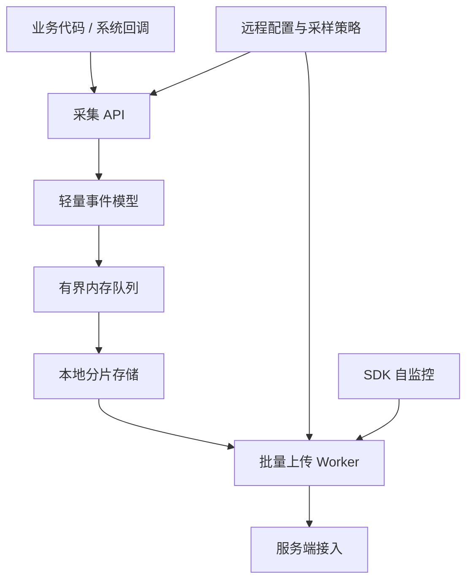

# 26.1 App 可观测性架构设计

App 可观测性要解决线上问题处理里的四件事：判断影响面、取得现场证据、找到责任方向，并在线上验证修复结果。新版本上线后 crash 率异常，应先回答「影响多少用户、集中在哪些机型和版本」，再关联 crash 堆栈、发布记录和受控的用户操作摘要；修复进入灰度后，还要验证同口径指标是否恢复。这四个环节分别需要 Metrics（看趋势）、Logs（还原事件）、Traces（解释耗时路径）和回验。总架构可从数据模型、端侧采集、服务端处理与问题流转四个层面展开。

平台锚点为 Android 17 / API 37 / `android-17.0.0_r1`。可观测性协议大多由应用与服务端共同定义，不能把某个第三方 SDK 的字段误写成平台保证；涉及时间基准和线上系统 profile 时，分别以 Android 17 的 `SystemClock` 与 `ProfilingManager` 实现边界为准。

## Metrics / Logs / Traces 分别回答什么问题

Metrics、Logs、Traces 是三类不同粒度的证据，混在一起设计会让系统很快失控。Metrics 适合看群体趋势，Logs 适合还原单次现场，Traces 适合解释时间线上哪一段慢。

| 类型 | 典型数据 | 适合回答的问题 | 不适合处理的问题 |
| --- | --- | --- | --- |
| Metrics | Crash 率、ANR 率、启动 P95、慢帧率、网络失败率、WakeLock 异常率 | 这个版本是否变差、影响哪些机型、是否达到告警阈值 | 还原单个用户当时发生了什么 |
| Logs | 业务日志、诊断日志、Crash 附加信息、用户反馈时间窗日志 | 这个用户的操作路径、请求参数摘要、错误码、降级原因 | 长期保存全部明细并做高频聚合 |
| Traces | Perfetto trace、方法耗时片段、网络阶段耗时、会话时间线 | 一次启动、卡顿或网络请求到底慢在哪个阶段 | 替代日常指标大盘，或全量长期采集 |

Android Vitals 侧重 Metrics：在用户允许采集的前提下，Google Play 汇总稳定性、性能、电量和权限等质量数据；当前核心指标包括 user-perceived crash rate、user-perceived ANR rate 和 excessive partial wake locks，Play 每天以最近 28 天的平均值检查关键质量指标。它适合作为 Play 分发侧的质量基线，但不会提供应用自定义的业务场景和内部日志。团队仍需用自己的数据模型补充页面、场景、构建版本与渠道等维度。[Android Vitals 官方说明](https://developer.android.com/topic/performance/vitals)

Firebase Performance Monitoring 的模型更接近 App 内部性能观测：它可自动采集启动、HTTP/S 请求和屏幕渲染 trace，并允许自定义 code trace、custom metrics 与 attributes。这里的 trace 是一段任务的起止时间及附加指标，不是 Perfetto 文件；attributes 用于按国家、设备、版本和系统等维度筛选。[Firebase Performance Monitoring 官方说明](https://firebase.google.com/docs/perf-mon)

App 自建体系要把两者结合：Vitals 给外部质量结果，自建 Metrics 给内部维度，Logs 和 Traces 给现场证据。单看 Vitals 只能知道质量已经变差；没有 Logs 和 Traces，仍然很难解释变差发生在哪个场景、由什么触发。

### 事件数据模型设计示例

Metrics、Logs、Traces 在端侧的编码方式不同，但需要共享关联字段。下面的 JSON 展示一份最小公共信封；字段名是应用协议示例，不是 Android 平台 API。

```json
{
  "$common": {
    "schema_version": "obs.event.v3",
    "event_id": "0198f1a4-...",
    "event_type": "startup_metric",
    "wall_time_ms": 1785312000123,
    "elapsed_realtime_ns": 418273600012345,
    "session_id": "resettable-session-id",
    "trace_id": "9f0c...",
    "scene_id": "MainActivity_onResume",
    "scene_seq": 12,
    "app_version": "8.4.2",
    "build_number": 8420,
    "os_version": "Android 17",
    "api_level": 37,
    "device_model": "example-model",
    "device_brand": "Google",
    "network_type": "WIFI",
    "app_in_foreground": true,
    "inclusion_probability": 0.1,
    "sampling_rule_id": "baseline-startup-v3"
  }
}
```

`wall_time_ms` 用于和发布、告警等现实时间对齐，但用户或网络可以调整墙上时钟；会话内排序与耗时计算应使用单调递增的 `elapsed_realtime_ns`。Android 的 `SystemClock.elapsedRealtimeNanos()` 包含深度睡眠时间，适合通用间隔测量，但设备重启后会归零，因此还需要 `session_id` 和 `scene_seq` 划定边界。`event_id` 用于重试去重，`trace_id` 用于跨信号关联，`schema_version` 用于解码与迁移。

下面的 Metrics 片段展示启动事件的专属字段；为节省篇幅，`$common` 只保留 `event_type`，生产事件仍应携带上面的完整公共信封。

```json
{
  "$common": { "event_type": "startup_metric" },
  "startup": {
    "type": "cold",
    "ttid_ms": 1820,
    "ttfd_ms": 2350,
    "attach_base_ms": 120,
    "oncreate_ms": 450,
    "first_screen_ms": 1250,
    "dag_critical_path_ms": 1400,
    "thread_pool_wait_max_ms": 80,
    "provider_init_count": 12,
    "provider_init_total_ms": 320,
    "sdk_init_count": 8,
    "blocked_by_network": true,
    "network_requests": [
      { "name": "config_fetch", "duration_ms": 520, "cached": false },
      { "name": "ab_test", "duration_ms": 180, "cached": true }
    ]
  }
}
```

`ttid_ms` 和 `ttfd_ms` 分别对应平台定义的首次显示与完全显示时间；其他阶段名属于应用自定义协议，必须给出统一的起止点。日常事件适合保存阶段耗时、计数和阻塞原因，而不是为每次启动保存系统 trace。指标出现回归后，再对受控样本采集 profile。

下面的 Logs 片段只携带允许上报的模板标识与分类字段，避免把自由文本当成默认协议。

```json
{
  "$common": { "event_type": "user_log" },
  "log": {
    "level": "ERROR",
    "tag": "PaymentFlow",
    "message_template_id": "payment_confirm_timeout",
    "message_fingerprint": "hmac-sha256:abc123...",
    "error_code": 504,
    "user_visible": true,
    "prev_scene_id": "PaymentConfirmActivity",
    "stack_trace_hash": "hmac-sha256:def456..."
  }
}
```

普通上报应优先使用枚举化模板和允许列表字段。对原始文本直接做普通 SHA-256 不是匿名化：低熵错误消息、手机号或 URL 仍可能被猜测；需要稳定聚合时，应先移除敏感字段，再用受控密钥生成 HMAC 指纹。详细日志只能在明确的数据政策、用户告知或同意、目标时间窗、配额和自动过期约束下回捞。

下面的 Traces 片段展示应用自己埋点的 span 摘要，它可以与日志共享 `trace_id`，但不等同于系统 trace。

```json
{
  "$common": { "event_type": "method_trace" },
  "trace": {
    "span_id": "37ab...",
    "parent_span_id": "a011...",
    "span_name": "MainActivity.onCreate",
    "start_elapsed_realtime_ns": 418273600320000,
    "duration_ms": 145,
    "thread": "main",
    "sub_spans": [
      { "name": "setContentView", "duration_ms": 45 },
      { "name": "findViewById", "duration_ms": 12 },
      { "name": "ViewModel.init", "duration_ms": 68 }
    ]
  }
}
```

`trace_id`、`span_id` 和 `parent_span_id` 构成关联关系，单调时钟给出同设备会话内的起点与时长。Android 15 / API 35 起，普通应用可通过 `ProfilingManager` 请求 system trace、heap dump、heap profile 或 stack sampling；请求受系统限流且不保证执行，结果经过裁剪，只包含请求应用的相关信息。Android 16 / API 36 起可注册系统触发器，Android 17 / API 37 又增加 cold start、anomaly 等触发类型。应用不能把该能力描述成“异常后必定取得完整设备 Perfetto”；回调失败、文件配额、用户数据政策与上传策略都要单独处理。

数据模型不能依赖“字段永不删除”的约定维持兼容。每条事件都要携带 schema 版本；服务端至少兼容当前与迁移窗口内的旧版本，新增字段必须有缺省语义，废弃字段经过读写双轨和数据验证后再停止发送。最小版本只需要事件类型、双时钟、构建版本、会话/场景 ID、采样纳入概率与业务核心字段；高基数字段不能直接进入 Metrics 标签集合。

## App 侧监控体系分层设计

App 侧架构要按“入口轻、缓冲可控、证据分级、上传受限”设计。监控 SDK 不应把业务线程变成编码、落盘或网络线程；否则故障发生时，监控系统会放大故障。

下图展示采集、缓冲、存储、上传和远程控制之间的数据方向：



端侧至少分成五层：

- 采集层：接入 Crash、ANR、启动、卡顿、内存、网络、耗电、业务场景等信号。采集代码只做时间戳、场景 ID、错误码、摘要字段，不能同步写文件或发网络请求。
- 缓冲层：使用有界队列或 `RingBuffer`（环形缓冲区）处理高频事件。队列满时按事件等级丢弃，丢弃数进入 SDK 自监控字段。
- 存储层：普通性能样本进入小块分片文件；Crash、ANR、HPROF、Perfetto trace 这类大文件走独立目录和配额。详见 19.22 节的端侧 APM 存储设计。
- 上传层：按事件优先级、网络类型、前后台状态和服务端限流批量上传。弱网下优先上传摘要，延后上传大文件。
- 控制层：服务端下发采样率、事件开关、远程诊断命令和熔断规则；每条配置带签名、版本号、过期时间、作用范围和回滚策略。

这个分层有两个基本约束。采集入口要足够便宜，主线程只提交事实；分析和聚合通常放到服务端，端侧只做必要的聚合、压缩、脱敏和容灾。`mmap` 不是“主线程写入无开销”的保证，首次缺页、扩容、同步和存储压力仍可能产生延迟。19.22 节已经展开 APM SDK 的持久化、编码协议、网络投递和自监控，这里不重复实现细节。

Crash 还需要一条不依赖普通异步队列的最小保全路径。进程异常退出时，后台线程可能来不及消费队列；Java uncaught exception 与 native signal 的可用能力也不同。实现应预分配必要结构、避免在 native signal handler 中调用非 async-signal-safe 操作，并在下次启动校验和补传未完成记录。具体边界见 26.2。

## 从采集到告警的完整数据路径

一套可用的 App 可观测性系统，路径通常是：端侧采集 → 本地暂存 → 批量上传 → 接入清洗 → 实时聚合 / 离线聚合 → 告警 → 回查 → 修复验证。

| 阶段 | 主要任务 | 失败表现 |
| --- | --- | --- |
| 采集 | 定义事件 schema，补齐版本、设备、页面、场景、网络、前后台等公共字段 | 指标无法按场景拆分，异常样本缺少上下文 |
| 上报 | 合并小事件，优先发送高价值摘要，保留失败重试和服务端限流处理 | 崩溃后数据丢失，弱网下低价值事件挤占通道 |
| 存储 | 明细、聚合、索引分开；大文件单独配额和保留期 | 查询慢、成本高、敏感文件长期留存 |
| 分析 | 按版本、机型、Android 版本、渠道、页面、用户分群看分布和趋势 | 全局均值正常，重点机型已经恶化 |
| 告警 | 绑定可行动阈值，例如某版本 user-perceived ANR rate、启动 TTFD（Time to full display）P95、慢会话比例 | 告警噪音多，工程团队不再信任 |
| 回查 | 从指标跳到样本，再跳到日志、trace、崩溃栈和发布记录 | 看得到异常，看不到现场 |
| 验证 | 修复版本上线后，对比线上指标和基准测试结果 | 修复效果只能靠主观判断 |

Android 官方启动优化文档区分 TTID 和 TTFD：TTID 表示首帧出现，TTFD 表示应用达到自行上报的 fully drawn、可用状态。启动监控不能只看一个总耗时；`reportFullyDrawn()` 的调用位置必须对应产品定义的可用状态。Macrobenchmark 的 `StartupTimingMetric` 可用于线下基准测试，线上再用端侧指标观察真实分布。[App startup analysis and optimization](https://developer.android.com/topic/performance/appstartup/analysis-optimization)

渲染也要区分指标和现场。Android 官方文档分别定义 slow frames、frozen frames 和 ANR；Perfetto FrameTimeline 可用于追踪慢帧或冻帧原因。线上 Metrics 负责指出哪些版本、页面和机型发生回归，设备实验或受控线上 profile 负责解释具体样本。[Slow rendering](https://developer.android.com/topic/performance/vitals/render)

服务端分析层要保留几类连接键：`event_id`、`session_id`、`trace_id`、`span_id`、`scene_id`、`build_version`、`device_model`、`android_version` 和 `network_type`。这些字段让 Crash、ANR、性能指标、用户日志和发布记录能够互相跳转。`session_id` 应是短期、可重置且用途受限的标识，不能用永久设备 ID 代替。详见 15.9 节的采集到治理过程设计。

## 采样策略与数据量控制

可观测性系统的成本来自端侧 CPU / I/O、用户流量以及服务端存储与计算。采样策略要同时控制这些成本。容量评估不能靠 DAU 猜测，应按“活跃设备数 × 每设备事件频率 × 编码后字节 × 保留期 × 副本数”计算，并使用灰度实测校正压缩率和查询放大。

常用策略可以分成四类：

- 高优先级基线：在用户数据政策允许的范围内，优先保留 Crash / ANR 摘要、构建版本、设备维度和关键页面启动指标；仍需单设备限额、去重和熔断，不能把“全量”理解为无限写入。
- 用户级采样：对高频性能事件按用户分桶，避免每次事件随机采样造成会话时间线断裂。命中用户在一个时间窗内保持同一策略，便于拼出会话时间线。
- 异常补采：基线指标发现异常后，对目标版本、机型和渠道短期开启更高采样率；profile 采集还要满足平台限流、设备状态、隐私和文件配额。
- 大文件限额：HPROF、system trace 和完整日志包必须限制单设备次数、文件大小、上传网络和保留时间。

采样配置要有版本号。客户端每次成功上报时带上本地配置版本，服务端可以随响应返回新配置；这条路径不保证即时到达，因此客户端还要为配置过期、长期离线和签名校验失败定义保守缺省值。配置应支持紧急关闭开关（kill switch），并限制可关闭的能力范围，避免远程配置破坏 Crash / ANR 等最低诊断能力。

采样后的数据必须携带 `sampling_rule_id`、分层字段和该事件的 `inclusion_probability`。只有抽样设计与纳入概率已知时，服务端才能按权重估计总体；异常补采、失败全量和成功抽样混合后，必须按层分别计算，不能把所有样本简单除以一个采样率。单用户排查界面也要显示采样命中与丢弃原因，避免把“没有采到”误判成“没有发生”。

## 可观测性建设的常见陷阱

以下问题在团队从零建设可观测性系统时反复出现，提前了解能少走弯路。

### 陷阱 1：把所有东西都上报，然后「服务端再筛」

端侧若默认“先全量上报，服务端再过滤”，写入、索引和高基数聚合会随事件频率增长。成本问题往往在服务端显现，但 CPU、I/O 与流量已经由用户设备支付。

设计时应先为每类事件估算频率、编码大小、基数和保留用途，再选择端侧聚合、确定性采样或原始事件。只上报异常会失去分母与正常基线；更稳妥的做法是对失败事件和成功样本采用不同层级，并在事件中记录各自纳入概率。用户 ID、原始 URL、自由文本和堆栈全文等高基数字段不应直接进入 Metrics 标签。

### 陷阱 2：用 Metrics 替代 Logs 和 Traces

团队只关注 Metrics 大盘，看到 crash 率上升后没有 Logs 来定位页面、场景和操作摘要，也没有 Traces 来解释耗时路径。

Metrics 可以指出版本回归，Logs 可以给出支付确认事件的错误分类，Traces 可以显示等待发生在哪个 span。三类信号的存储和采样方式不同，但要用统一上下文建立关联；OpenTelemetry 也通过 trace/span context 将日志与 trace 关联，而不是只靠相近时间戳。

### 陷阱 3：采样策略按事件随机，破坏了会话时间线

高频事件若逐条独立抽样，一个会话中只会留下不连续片段：日志显示用户打开了支付页，但前面的场景切换可能没有采到，排查时无法还原路径。

需要连续会话时，可使用 `HMAC(sampling_key, resettable_id | sampling_rule_id)` 生成稳定桶，并让命中结果在配置时间窗内保持一致。客户端不上传原始标识，key 轮换与标识重置会改变分桶；这里的 HMAC 用于稳定分桶，不代表标识已经匿名化。支付、地区或机型等分层若采用不同概率，估计总体时必须保留分层和纳入概率。

### 陷阱 4：端侧采集在主线程做编码和落盘

采集 API 常从主线程调用。如果 SDK 在调用栈内完成 JSON 序列化、文件扩容、压缩或同步写入，存储抖动会直接进入页面耗时；`mmap` 写入也可能因缺页和回写产生长尾。

采集入口应只读取必要的原始值并尝试写入有界队列，序列化和落盘放到专用线程。性能预算不能照搬固定数字，应在目标设备档位上测量入口的 P50/P95/P99、分配次数、队列丢弃率和主线程长尾，并把 SDK 自身开销纳入发版门禁。

### 陷阱 5：把诊断数据当成默认开启的能力

用户日志回捞、远程诊断命令和系统 profile 都是高敏感、高成本能力，默认应关闭；只有命中明确策略并满足用户数据政策后才短期开启。全量自由文本日志不能作为基线能力。

可以区分两类数据通道：基线通道发送经过最小化的 Crash / ANR 摘要、启动/帧指标和网络结果；诊断通道处理日志回捞、`ProfilingManager` 结果和远程只读检查。诊断策略必须限定目标、时窗、单设备配额和保留期，并提供本地与服务端两侧的关闭能力。

### 陷阱 6：服务端告警阈值与用户感知脱节

固定的绝对增量没有考虑基线、样本量、设备分布和产品场景，同样的变化在不同页面可能含义完全不同。告警应绑定用户可感知的 SLO，例如产品定义的 TTFD 慢会话比例、user-perceived ANR/crash rate 或冻帧会话比例，并同时检查置信区间、持续时间和版本/机型分层。Android Vitals 的 bad behavior threshold 是 Play 分发口径，内部告警可以更早，但必须明确两者分母不同。

### 用户日志与远程诊断：现场证据层

Metrics 告诉团队哪里异常，Logs 和远程诊断帮助团队回到现场。可观测性架构除了指标看板，还要能在必要时为特定用户、特定版本、特定机型补采现场证据。

可执行的设计通常包含三类能力：

- 用户日志回捞：只拉取目标用户、目标时间窗、目标 tag 的日志。日志正文默认脱敏，URL query、token、手机号、定位字段默认不入库。
- 远程诊断命令：对网络、存储、权限、配置和缓存状态做允许列表内的只读检查，结果以结构化字段上报。命令必须带过期时间、设备配额、重放保护和服务端签名，不能提供任意 shell、任意文件读取或动态代码执行入口。
- 异常触发补采：Crash、ANR、冻帧或启动超出产品阈值后，下一次启动优先上传摘要；命中灰度策略时，再请求受平台限制的 profile 或目标日志。

Firebase Performance Monitoring 对 HTTP 请求使用不含 URL parameters 的 URL 构造聚合模式，并声明不永久保存个人可识别信息。自建系统也应在采集前完成字段允许列表、脱敏与用途分级；哈希不是删除个人信息的替代方案。[Firebase Performance Monitoring：User data](https://firebase.google.com/docs/perf-mon/#user_data)

## Android 17 平台源码边界

Android 17 的 [`SystemClock.java`](https://android.googlesource.com/platform/frameworks/base/+/refs/tags/android-17.0.0_r1/core/java/android/os/SystemClock.java) 明确区分可被调整的 wall clock、暂停于深度睡眠的 uptime clock，以及包含深度睡眠且单调递增的 elapsed realtime。事件协议同时保留现实时间和单调时间，是为了分别处理跨系统对时与本机会话排序，不能用一次 `System.currentTimeMillis()` 同时完成两项工作。

Android 17 的 [`ProfilingManager.java`](https://android.googlesource.com/platform/packages/modules/Profiling/+/refs/tags/android-17.0.0_r1/framework/java/android/os/ProfilingManager.java) 明确写出请求受限流且不保证执行，返回结果经过裁剪并限定到请求进程。线上架构因此要把 profile 视为稀缺的补充证据：先用 Metrics 找到目标群体，再用 span/log 摘要缩小范围，随后在系统允许时采集 profile。没有回调或没有制品是正常分支，不能让诊断流程依赖它必定成功。

这里不使用 Linux kernel 私有接口，也不从 eBPF、`/proc` 或调度器实现推导应用协议，因此不引入 kernel tag。涉及内核采集路径的专题统一以 `android17-6.18-2026-06_r6` 为 kernel 锚点。

## 最小可用架构

团队不必一开始建设完整平台。最小版本可以从下面几项开始：

1. Crash / ANR 摘要：进程、线程、堆栈、版本、设备、前后台、最近场景。
2. 启动与渲染指标：TTID、TTFD、慢帧 / 冻帧、关键页面场景 ID。
3. 网络指标：DNS、连接、TLS、首包、总耗时、错误码、网络类型。
4. 受控日志：按 tag 和敏感级别分类、本地有界滚动、按目标会话与时间窗回捞。
5. 采样与配置：带签名和过期时间的配置、确定性会话采样、纳入概率、异常补采与紧急关闭开关。
6. 回查入口：从告警跳到样本，再跳到日志、span/profile、发布版本和关联修复任务。

这套最小版本能支撑 26.2 的 Crash 上报、26.3 的性能指标采集、26.4 的 ANR 监控以及 26.5 的线上排查。后续小节只需要往各自能力里深入，不必重复解释总架构。

## 参考资料

- [Android Vitals](https://developer.android.com/topic/performance/vitals)：Play 质量指标、核心指标与 28 天评估窗口。
- [App startup analysis and optimization](https://developer.android.com/topic/performance/appstartup/analysis-optimization)：TTID、TTFD 与启动 trace。
- [Slow rendering](https://developer.android.com/topic/performance/vitals/render)：slow/frozen frame、ANR 与 FrameTimeline。
- [Firebase Performance Monitoring](https://firebase.google.com/docs/perf-mon)：自动 trace、自定义指标、attributes 与用户数据说明。
- [SystemClock API](https://developer.android.com/reference/android/os/SystemClock)：wall、uptime 与 elapsed realtime 的语义。
- [ProfilingManager API](https://developer.android.com/reference/android/os/ProfilingManager)：profile 类型、限流、回调与结果边界。
- [ProfilingTrigger API](https://developer.android.com/reference/android/os/ProfilingTrigger)：Android 16—17 的系统触发类型。
- [Android privacy checklist](https://developer.android.com/privacy-and-security/about)：数据访问审计、可重置标识、告知与敏感日志要求。
- [OpenTelemetry logs](https://opentelemetry.io/docs/specs/otel/logs/)：使用 trace/span context 关联 Logs 与 Traces。
- [AOSP `SystemClock.java` @ Android 17](https://android.googlesource.com/platform/frameworks/base/+/refs/tags/android-17.0.0_r1/core/java/android/os/SystemClock.java)：平台时钟实现边界。
- [AOSP `ProfilingManager.java` @ Android 17](https://android.googlesource.com/platform/packages/modules/Profiling/+/refs/tags/android-17.0.0_r1/framework/java/android/os/ProfilingManager.java)：线上 profile 请求、触发器与限流边界。
