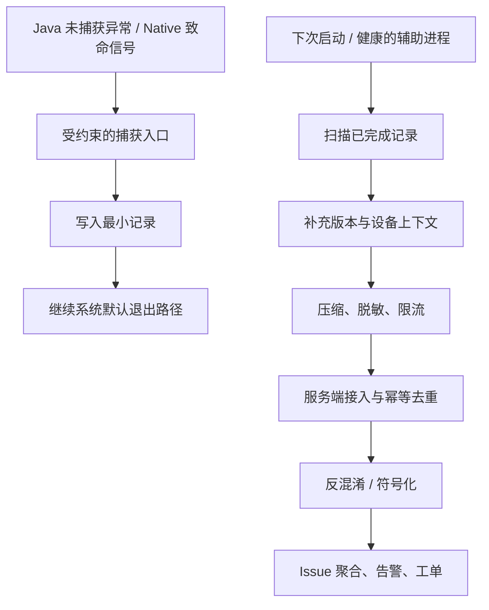
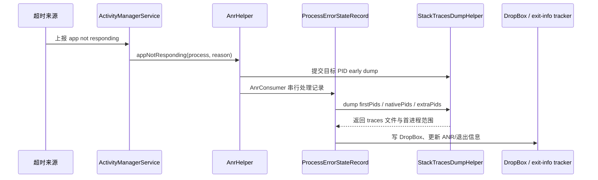

# Crash 与 ANR 监控体系

崩溃（Crash）上报体系需要在进程退出前尽量保存定位证据，并在后续可用的执行窗口把证据送到分析系统。Java Crash 指未处理的 Java/Kotlin 异常，Native Crash 指 C/C++ 等原生代码触发的致命信号；捕获机制见 20.2、20.3 和 17.9。本节关注本地留存、多进程归集、符号化、告警和发布门禁。符号化是把混淆名或二进制地址还原成可读的函数名、文件名和行号的过程。

平台源码上界为 Android 17 / API 37 / `android-17.0.0_r1`。崩溃主路径位于 Android 框架、bionic C 库与 debuggerd 等用户空间组件，不依赖 Android 17 的某项内核专有实现，因此不附加内核源码标签。

Crash 监控依赖异常或信号处置路径，ANR 监控依赖主线程、系统超时或退出记录。两者可以共享事件模型、设备信息和上传通道，但现场采集时机与可靠性不同。

## Java、Native Crash 现场与上报

### Crash SDK 的四段路径：捕获、序列化、持久化、上报

崩溃发生后，当前线程、堆、锁、文件描述符和线程池都可能处于异常状态。崩溃入口只保存最小现场；进程退出后，由下次启动或健康的辅助进程补充设备与版本信息、上传并重试；服务端负责符号化、聚合和告警。

下面的流程图用于区分崩溃现场与后续处理窗口。

`B → C` 对应崩溃现场，不能假设应用运行环境健康；网络请求、数据库索引和复杂对象序列化应放在后续的 `E → H` 阶段。

#### 捕获：Java 与 Native 不是同一种执行环境

Java 未捕获异常的公开入口是 `Thread.UncaughtExceptionHandler`，即线程的未捕获异常处理器。在 Android 17 的 [`RuntimeInit.java`](https://android.googlesource.com/platform/frameworks/base/+/refs/tags/android-17.0.0_r1/core/java/com/android/internal/os/RuntimeInit.java) 中，`LoggingHandler` 记录 `FATAL EXCEPTION`，`KillApplicationHandler` 向 ActivityManager（系统活动与进程管理服务）报告崩溃，并在 `finally` 中执行 `Process.killProcess()` 与 `System.exit(10)`。`mCrashing` 状态位用于阻止崩溃处理再次递归进入。

自定义 Java handler（处理器）应在安装时保存前一个处理器，并在最小记录逻辑结束后调用它。调用应放在 `finally` 中且只发生一次；不调用前一个处理器会改变平台的日志、报告与进程退出语义。处理器运行在发生异常的线程上，因此 Java 路径也不适合等待网络、获取业务锁或遍历大型对象图。

Android 平台的 Native Crash 路径约束更多。debuggerd 是 Android 的原生崩溃诊断机制；Android 17 的 [`debuggerd_handler.cpp`](https://android.googlesource.com/platform/system/core/+/refs/tags/android-17.0.0_r1/debuggerd/handler/debuggerd_handler.cpp) 会预先准备备用栈，并以 `SA_RESTART | SA_SIGINFO | SA_ONSTACK | SA_EXPOSE_TAGBITS` 标志注册信号处理。收到致命信号后，它在专门准备的环境中启动辅助进程 `crash_dump`，读取崩溃进程的状态。[`crash_dump.cpp`](https://android.googlesource.com/platform/system/core/+/refs/tags/android-17.0.0_r1/debuggerd/crash_dump.cpp) 通过 Linux 进程追踪接口 `ptrace` 读取线程状态，再经负责集中保存记录的 tombstoned 服务写出 tombstone。tombstone 是包含信号、寄存器、线程栈和内存映射等信息的原生崩溃诊断记录。

这条路径需要明确两个边界：

- 信号处理代码在目标进程一侧初始化；debuggerd 守护进程不会进入应用替它注册 `sigaction`，`crash_dump` 与 tombstoned 只参与后续抓取和保存。
- 平台处理器依赖预分配栈、管道、专用辅助进程和平台权限，普通 Crash SDK 不能照搬。自定义信号处理函数只能使用经过审计的异步信号安全（async-signal-safe）操作和预分配内存；现场不能构造 JSON、申请堆内存、获取普通互斥锁或发起网络请求。

第三方应用通常无权读取 `/data/tombstones`。应用侧一般通过经过验证的 Native Crash SDK 生成 minidump（只保存诊断所需线程、寄存器和选定内存信息的小型转储），或在后续启动时查询记录近期进程退出原因的系统 API `ApplicationExitInfo`。tombstone、bugreport（系统诊断包）、logcat（Android 日志工具）与 `ndk-stack` 主要用于开发和平台诊断；`ndk-stack` 是 NDK（Native Development Kit，Android 原生开发工具包）自带的地址符号化工具。

#### 最小记录：字段用于关联，不堆积现场信息

捕获入口可以围绕一份版本化的 `CrashEnvelope` 组织数据。CrashEnvelope 是崩溃事件的外层数据结构，其中存放摘要和附件索引；Java 与 Native 路径能够安全写出的字段集合不同。

| 字段 | 用途 | 采集边界 |
| --- | --- | --- |
| `schema_version` | 让服务端兼容旧客户端 | 表示数据结构版本；废弃字段仍保留解析能力 |
| `crash_id` / `sequence` | 幂等上传和端侧关联；幂等表示同一事件重复提交时只记一次 | 尽量提前生成；不要在 Native 信号处理器内临时创建 UUID（Universally Unique Identifier，通用唯一标识符） |
| `event_time_wall_ms` | 与发布、日志和服务端事件对时 | 系统日期时间可能被校准，不单独用于计算耗时 |
| `elapsed_realtime_ms` | 进程内排序和启动后时长 | 使用只递增、不受系统日期校时影响的单调时钟；该值不能跨设备比较 |
| `process_name` / `pid` / `thread_name` | 区分应用进程、进程 ID（PID）与线程 | Native 样本优先使用 minidump 或 tombstone 中已有字段 |
| `exception_type` / `signal` | 区分 Java 异常和 Native 致命信号 | 端侧不做复杂根因推断 |
| `raw_stack` / `top_frame` | 反混淆、符号化和初步聚合 | Native 侧还需 `.so` 共享库、相对地址、ABI（应用二进制接口）与 Build ID（构建时写入二进制的唯一标识） |
| `application_id` / `version_code` / `git_sha` | 绑定发布产物、R8 映射文件（mapping）和原生符号文件（symbols） | `git_sha` 是 Git 提交哈希；这些字段由构建流水线注入，不在崩溃现场拼装 |
| `breadcrumbs` | 提供崩溃前的有限操作轨迹；breadcrumb 是预先记录的关键事件摘要 | 平时写入固定容量环形缓冲区，现场只读取已完成槽位 |
| `privacy_policy_version` | 追踪脱敏与字段许可规则 | 不保存用户明文输入、认证令牌（token）或完整 URL |

对 Java 路径，可以在受控上限内输出异常类型和堆栈；对 Native 路径，推荐让成熟 SDK 或平台机制保存寄存器、线程和内存映射。若某个字段必须通过分配、锁或 Binder（Android 进程间通信机制）调用获取，就不属于 Native 信号处理器的最小字段。

#### 序列化：摘要与附件分开演进

Crash 样本不宜直接复用普通业务埋点格式。它的单条价值更高，附件大小差异也更大，还需要跨多个线上版本保持可解析。可以把数据分为两层：

- 摘要：`crash_id`、数据结构版本、异常或信号、进程、线程、构建标识、栈顶帧（top frame）、采样策略版本。
- 附件：完整 Java 堆栈、minidump、可公开取得的 tombstone 数据、受限日志片段、崩溃前的有限操作记录或诊断追踪。

每个附件应记录类型、字节数、压缩方式、脱敏策略版本和内容摘要。服务端先接收小型摘要并完成幂等登记，再根据问题组（issue）的出现时间、样本价值和流量策略请求附件。issue 是服务端把同一根因候选的多条崩溃归在一起形成的问题组。字段新增应保持向后兼容；任一端不认识新字段时，仍要允许最小样本入库。

#### 持久化：按捕获环境选择写入方式

“临时文件 → 把数据同步到存储（例如调用 `fsync`）→ 原子重命名（rename）”适合健康执行环境或经过约束的 Java 崩溃记录，但不能直接套用到 Native 信号处理器。

对 Java 路径和后续整理进程，可以采用以下规则：

1. 每个应用进程写独立目录或独立文件，避免共享可变索引。
2. 先完成临时文件，再将其原子重命名为可扫描文件；需要抵御掉电时，还要考虑文件与父目录的持久化语义。
3. 下次启动只处理完整记录，损坏或半写文件进入隔离区，不反复阻塞上传队列。
4. 设置字节配额和保留策略，优先保存未上传的致命崩溃（fatal）样本及新问题组的代表附件。

SQLite 可以用于进程恢复后的索引，并记录“待上传、上传中、已确认”等状态转换，但不应成为崩溃现场唯一的写入路径。崩溃线程可能正持有数据库锁，事务和连接状态也未必可用。

对 Native 路径，应使用经过验证的 minidump 实现、预打开文件描述符与固定大小缓冲区，或把复杂抓取交给健康的进程外组件。平台 debuggerd 采用专用架构，不能作为应用层任意信号处理器的通用模板。

#### 上报：崩溃进程不负责把请求发完

上传由下次启动或健康的辅助进程执行。处理顺序通常是：扫描完整记录、补充设备与版本字段、脱敏、上传摘要、按服务端策略上传附件、确认后回收本地文件。fatal 表示会导致进程退出的未处理崩溃，non-fatal 表示应用捕获并继续运行的异常记录；二者不能混用同一统计口径。

| 优先级示例 | 样本 | 处理方式 |
| --- | --- | --- |
| P0 | 新版本启动致命崩溃、核心交易路径致命崩溃 | 尽快上传摘要；附件仍受网络、隐私和大小策略限制 |
| P1 | 新问题组、Native Crash、影响面快速扩大的问题组 | 提高代表样本保留率，并核对符号文件状态 |
| P2 | 已知问题组的重复样本、非致命异常 | 保留计数和分层抽样，减少重复附件 |
| P3 | 大型日志或追踪文件 | 默认不进入崩溃首批上传，只在授权诊断流程中获取 |

服务端以 `crash_id` 和附件内容摘要实现幂等，也就是同一份数据重复上传时只入库一次，不能把客户端重试计为多个受影响事件。采样记录还要包含策略版本与纳入概率，否则服务端无法在分层采样后解释趋势。上传模块自身应公开待上传字节数、丢弃原因、重试次数和最近成功时间，避免“采集失效”被误读为“稳定性改善”。

### 多进程 Crash 上报的可靠性保证

“多进程”至少包含三类对象：应用自己声明的普通进程、isolated service（隔离服务）进程，以及 WebView renderer（WebView 渲染进程，负责解析和绘制网页内容的独立进程）。后两类由不同的系统约束管理，三者不能使用同一套初始化假设。

#### 普通应用进程：各自捕获，统一归集

对应用清单（manifest）中以 `android:process` 声明的普通应用进程，可以在每个进程安装轻量捕获模块，但只让主进程或专用上传进程拉取配置并执行网络上传。

| 层次 | 设计 | 需要验证的失败场景 |
| --- | --- | --- |
| 初始化 | 每个目标应用进程安装异常处理器，初始化要幂等 | 子进程早于主进程启动或直接崩溃 |
| 本地文件 | 以稳定的进程角色和唯一文件名隔离写入 | 多进程同时崩溃、PID 被系统复用 |
| 配置 | 主进程写版本化只读快照，其他进程读取 | 快照写到一半、配置过期、回滚 |
| 上传 | 一个健康进程扫描所有应用进程目录 | 主进程无法启动、上传中途再次被杀 |
| 服务端 | 事件幂等与问题组聚合分开 | 同一退出记录被 SDK 与系统历史重复发现 |

进程 ID 只在一次进程生命周期内有意义，不能单独作为崩溃事件 ID。可以用预生成 ID，或用“无法还原原始安装标识的派生值 + 进程序列 + 单调时间 + 构建标识”形成事件关联键，并在服务端检测键冲突。

#### WebView 渲染进程：由宿主应用观察退出

WebView 渲染进程由系统和 WebView 实现管理，不是应用可以安装普通 Crash SDK 的业务进程。API 26 起，[`WebViewClient.onRenderProcessGone()`](https://developer.android.com/reference/android/webkit/WebViewClient#onRenderProcessGone(android.webkit.WebView,%20android.webkit.RenderProcessGoneDetail)) 会把渲染进程退出通知宿主应用。

回调中的 `WebView` 已不可继续使用。宿主必须把它从视图层级移除、销毁并清理引用，再决定是否创建新实例。返回 `true` 表示应用已经处理该退出；如果任一共享该渲染进程的 `WebView` 返回 `false`，系统会按渲染进程的退出情况终止应用，崩溃退出会表现为应用崩溃。多个 `WebView` 可能共享同一个渲染进程，因此每个受影响实例都要正确处理回调。上报字段应来自宿主回调提供的 `RenderProcessGoneDetail`（包含是否崩溃及渲染进程优先级等退出信息）、页面的脱敏标识和宿主版本，不能假设应用能够读取渲染进程内部的 Java 栈。

#### 隔离服务：不能假设具备上传权限

应用清单中设置 [`android:isolatedProcess="true"`](https://developer.android.com/guide/topics/manifest/service-element#isolated) 的 Service（Android 服务组件）会在特殊隔离进程中运行。该进程没有自己的应用权限，只能通过 Service 的启动或绑定接口与应用交互。它虽然来自同一个 APK，也不能被视为可以直接访问应用私有状态或发起网络上传。

可行的设计是：应用的管理进程通过受控 IPC（Inter-Process Communication，进程间通信）接收隔离服务平时产生的有限诊断数据；进程退出后，再用 `ApplicationExitInfo` 对照进程名、Linux 用户标识（UID）、时间和退出原因补齐记录。隔离进程崩溃后已无法保证 Binder 调用继续执行，因此收尾保存不能依赖崩溃发生后的跨进程调用。

#### 动态特性模块：记录是否安装，不虚构独立版本

动态特性模块（dynamic feature）通常跟随同一个应用发布产物管理版本。Crash 记录应包含已安装的分包（split）和模块集合、功能开关及实验配置，并继续使用应用构建标识关联 R8 映射文件与原生符号文件。只有业务系统确有独立插件版本时才记录插件版本；普通动态特性模块不能被描述成同一 `versionCode` 下可任意变化的模块版本。

### 用 `ApplicationExitInfo` 补偿退出记录

API 30 起，应用可以通过 [`ActivityManager.getHistoricalProcessExitReasons()`](https://developer.android.com/reference/android/app/ActivityManager#getHistoricalProcessExitReasons(java.lang.String,%20int,%20int)) 查询近期进程退出信息。它适合发现 SDK 没有保存到的低内存终止、ANR、Java Crash 和 Native Crash，也能帮助核对多进程退出。

这项 API 不是无限期、无损的崩溃档案库：

- 返回值来自有界历史记录，按时间从新到旧排列；调用方应保存上次处理到的时间戳，以及由进程名和退出原因等字段组成的记录指纹，并容忍旧记录被淘汰。
- `ApplicationExitInfo` 的 trace（诊断追踪数据）存放在单独的全局循环存储中，可能被包括其他应用在内的后续记录覆盖；`getTraceInputStream()` 允许返回 `null`。
- API 30 的 trace 主要用于 ANR（Application Not Responding，应用无响应）；API 31 起，`REASON_CRASH_NATIVE` 可以返回以 Protocol Buffers 编码的 tombstone 数据流。Protocol Buffers 是一种结构化二进制序列化格式。
- 同一个事件可能同时被 Crash SDK 和系统历史发现。去重应综合应用构建、进程名、相近的发生时间、退出原因、SDK 事件 ID，以及可用的致命信号、Build ID 或栈顶帧，不能只拼接“进程 ID + 时间戳”。

Android 17 的公开模型见 [`ApplicationExitInfo.java`](https://android.googlesource.com/platform/frameworks/base/+/refs/tags/android-17.0.0_r1/core/java/android/app/ApplicationExitInfo.java)，服务端记录与诊断追踪数据管理可从 [`AppExitInfoTracker.java`](https://android.googlesource.com/platform/frameworks/base/+/refs/tags/android-17.0.0_r1/services/core/java/com/android/server/am/AppExitInfoTracker.java) 继续追踪。

### 符号化与反混淆服务

原始混淆名和 Native 地址不能稳定对应源码。每个可发布构建都要把应用包、R8 映射文件和原生符号文件归档为同一组不可变产物。

#### Java / Kotlin：R8 映射文件是发布产物的一部分

官方 [`retrace`](https://developer.android.com/tools/retrace) 使用 R8 映射文件还原混淆后的类、方法和行号；工具位于 SDK 命令行工具（Command-Line Tools）的 `cmdline-tools/<version>/bin/retrace`。Firebase Crashlytics 的 [反混淆说明](https://firebase.google.com/docs/crashlytics/android/get-deobfuscated-reports) 则说明其 Gradle 插件会检测混淆并上传映射文件。

自建系统至少应绑定这些键：

- `application_id`、构建变体（variant）、`version_code` 与 `version_name`；
- 构建 ID 或 Git 提交哈希；
- R8 映射文件的内容摘要；
- 最终 APK（Android 应用安装包）或 AAB（Android App Bundle，应用商店发布包）的内容摘要，以及发布系统中的产物 ID。

同一版本号可能被重新构建，单靠 `versionCode` 不能选出正确的 R8 映射文件。构建流水线应在发布前验证应用包与映射文件已经同时归档；启用混淆却缺失映射文件时，应直接阻断发布，避免上线后只能把栈标记为“无法反混淆”。

Kotlin 的协程（coroutine）、内联函数（inline function）与匿名函数（lambda）会改变栈的形态。问题分组不能只取原始栈顶帧文本；应先用 retrace 反混淆，再结合异常类型、规范化后的异常消息、完整调用栈和构建范围生成候选签名。

#### Native：用 Build ID 找到准确的共享库

Android 的发布构建（release build）默认会从 Native 库中剥离调试信息，以减小安装包。官方 [Native debug symbols 文档](https://developer.android.com/build/include-native-symbols) 说明，`SYMBOL_TABLE` 可提供函数名，`FULL` 还可提供源码文件和行号；App Bundle 可以携带相应符号，APK 构建也会生成可单独上传的符号压缩包。用于分析的未剥离库或符号文件应保存在受控产物库中，不随应用发布给用户。

Native 样本和符号产物至少要通过以下信息匹配：

| 信息 | 作用 |
| --- | --- |
| ABI | 区分同一共享库针对不同指令集生成的产物 |
| `.so` 文件名与 ELF Build ID | 选择准确的二进制和符号文件；ELF（Executable and Linkable Format，可执行与可链接格式）是 Android 原生二进制采用的文件格式 |
| 程序计数器（pc）、相对地址与加载映射（load map） | 计算模块内地址，并处理 ASLR（Address Space Layout Randomization，地址空间布局随机化）造成的装载地址变化 |
| NDK、编译器和链接参数 | 解释栈展开（unwind）、内联与帧指针（frame pointer）的差异；NDK 是 Android 的 Native 开发工具包 |
| 未剥离产物或独立符号文件 | 恢复函数名、源码文件和行号 |

对第三方或非默认目录的 Native 库，不能只验证主模块中 Native 构建工具 CMake 的输出。以 Crashlytics 为例，额外库可能需要通过 `unstrippedNativeLibsDir` 指定未剥离库的目录；自建流水线同样应枚举最终 APK 或 AAB 中的每个 `.so` 文件，检查其 Build ID，并确认产物库中存在匹配的符号文件。缺失任一目标 ABI 的符号文件时，都应阻断相应发布产物。

#### 问题聚合：符号化成功后再生成签名

混淆名、绝对地址和随构建变化的程序计数器都不适合作为跨版本问题组的主键。应把“事件的固定 ID”和“可重新计算的问题签名”分开：

1. Java/Kotlin 候选签名：异常类型、反混淆后的稳定调用帧序列、规范化后的异常消息、构建范围。
2. Native 候选签名：致命信号、模块 Build ID、符号化后的函数、模块内偏移区间、ABI。
3. 服务端保留原始事件与问题组的对应关系；映射文件、符号文件或聚类算法更新后，可以重新符号化和归组，但不改动原始事件。

### Crash 实时告警与分级响应

“出现新问题组”只是一个信号。告警还要结合受影响用户、版本暴露量（实际使用该版本的用户数或会话数）、发生场景、相对稳定版本的变化和统计不确定性，否则低暴露版本容易因偶发样本触发误报，高暴露版本又可能因绝对数量大而长期告警。

#### 先把指标分母说清楚

[Android Vitals](https://developer.android.com/topic/performance/vitals/crash) 的 crash rate（崩溃用户率）是“每日活跃用户中至少经历一次崩溃的用户比例”；user-perceived crash rate（用户感知崩溃率）只统计应用处于活跃使用状态时发生崩溃的用户比例，并属于核心质量指标。

自建平台还常用 crash-free（无崩溃率）指标，它与 Vitals 的统计口径不同：

- `Crash-free users = 1 - 发生目标致命崩溃的去重用户数 / 同口径活跃用户数`，表示无崩溃用户比例。
- `Crash-free sessions = 1 - 包含目标致命崩溃的会话数 / 有效会话总数`，表示无崩溃会话比例。
- `Issue impact` 表示单个问题组的影响面，记录受影响用户、事件数、版本、设备、首次发生时间与最近发生时间。

这里的“目标致命崩溃”“活跃用户”“有效会话”和统计窗口必须写进指标定义。致命崩溃、非致命异常与业务主动捕获的异常应分别统计；非致命异常不能混入 Vitals 风格的用户感知崩溃率。

#### 告警使用暴露量、基线和严重性

S0/S1/S2 在这里仅作为内部响应级别示例；Android 平台没有这套分级标准。

| 级别 | 触发信号示例 | 响应动作 |
| --- | --- | --- |
| S0 | 启动或核心交易路径出现高影响致命崩溃；灰度版本相对稳定基线显著恶化 | 暂停放量或回滚，通知值班负责人，保留代表性完整附件 |
| S1 | 单个问题组的影响持续增长；特定机型、系统版本或同一 `.so` 文件的 Build ID 明显集中 | 分派模块负责人，调整分层采样，评估热修或小版本 |
| S2 | 低影响非致命异常、老版本存量问题、已知问题组的稳定重复 | 进入排期或继续观察，不中断当前发布 |

阈值应由产品流量、基线波动、样本纳入概率和事故容忍度校准，不能把固定的每日活跃用户数（DAU）、事件数或等待时间写成通用答案。告警页面至少要同时展示分母、趋势、置信区间或可信区间（表示估计的不确定范围）、版本与设备分布、符号化状态、近期发布记录和代表样本，值班人员才能判断这是发布回归、机型兼容还是数据质量问题。

#### 发布门禁检查可诊断性

灰度平台可以根据以下条件决定是否自动扩大版本覆盖范围：

- 新版本暴露不足或不确定性过大时保持当前灰度，不根据几个样本自动扩量或回滚。
- 使用相同分母和窗口，对比候选版本与稳定基线；采样变化时先根据每层样本的纳入概率还原整体趋势。
- 未处置的高严重性新问题组阻止自动扩量。
- 启用 R8 却缺少映射文件，或包含 Native 库却缺少对应符号文件或 Build ID 时，阻断发布。
- Crash SDK 的本地丢弃率、上传成功率和符号化成功率异常时，将稳定性指标标记为数据不完整。

这类门禁把“应用是否稳定”和“出问题后是否能定位”同时纳入发布判断。

### Crash 数据隐私与成本控制

Crash 附件可能包含 URL、请求参数、用户输入、文件路径、设备标识和日志片段。采集前就要确定字段许可与保留策略：

- 端侧使用允许字段清单；操作轨迹摘要写入环形缓冲区前完成脱敏。
- URL 默认只保留必要的主机名（host）、路径模板和错误码，丢弃查询参数（query）、片段标识（fragment）与身份凭据。
- 日志按标签（tag）和字段清单截取，不上传认证令牌、Cookie、账号、手机号或用户正文。
- 大附件设定单独的字节配额、保留期和下载审计，过期后只保留统计摘要。
- 服务端实施项目隔离和最小权限，原始附件访问需要可审计的诊断理由。

成本控制不能只做统一抽样。新问题组、稀有设备、Native Crash 与核心场景需要分层保留代表样本；已知重复问题组可以降低附件采集率，但仍要记录用于估算总体事件数的纳入概率。看板还要呈现被丢弃事件数、配额占用、重试次数、附件大小分位数和符号化失败率，因为采集缺口会让无崩溃率指标偏高。

### Android 10–17 的能力边界

下表只列与 Crash 上报直接相关的公开能力。`ApplicationExitInfo` 从 Android 11 开始提供，Android 10 没有这项 API。

| 平台版本 | API | 相关变化 |
| --- | ---: | --- |
| Android 10 | 29 | 没有 `ApplicationExitInfo`；应用依赖自己的 Crash SDK、平台日志和开发诊断工具 |
| Android 11 | 30 | 新增 `ApplicationExitInfo` 与 `getHistoricalProcessExitReasons()`；`getTraceInputStream()` 主要返回 ANR 诊断追踪数据 |
| Android 12 | 31 | `REASON_CRASH_NATIVE` 的 `getTraceInputStream()` 可以返回以 Protocol Buffers 编码的 tombstone 数据流 |
| Android 15 | 35 | 新增 `ProfilingManager`；它受频率限制且请求不保证执行，不是 Crash 捕获 API |
| Android 16 | 36 | 新增 `ProfilingTrigger`，可按受支持事件请求诊断采集 |
| Android 17 | 37 | 诊断触发器新增冷启动、OOM（内存耗尽）、CPU 使用过量、异常行为和应用兼容性等类型 |

`ProfilingManager` 支持系统追踪（`PROFILING_TYPE_SYSTEM_TRACE`）、Java 堆转储（`PROFILING_TYPE_JAVA_HEAP_DUMP`）、堆性能剖析（`PROFILING_TYPE_HEAP_PROFILE`）和调用栈采样（`PROFILING_TYPE_STACK_SAMPLING`）等类型。`ProfilingTrigger.TRIGGER_TYPE_APP_FULLY_DRAWN` 对应应用调用 `reportFullyDrawn()`，表示应用认为界面已经完整绘制，并不等同于“首帧完成”。

Android 17 的 `TRIGGER_TYPE_OOM` 还明确要求自定义 `Thread.UncaughtExceptionHandler` 继续调用默认处理器，否则系统无法使用该触发器。因此，自定义 Java 处理器仍须调用默认处理链。这些 API 适合收集性能诊断资料，不能代替 Java 未捕获异常处理器、Native 崩溃机制或退出历史查询。

### Crash 部分小结

可靠的 Crash 上报系统依赖三条边界：

- 崩溃现场只执行与捕获环境相符的最小操作。Java 未捕获异常处理器要继续平台默认退出链，Native 信号处理器要遵守异步信号安全约束。
- 普通应用进程、WebView 渲染进程与隔离服务分别处理；`ApplicationExitInfo` 用于补偿和核对近期退出，不能被当作永久档案。
- R8 映射文件、原生符号文件与发布包组成同一组构建产物。服务端完成符号化后再聚合，并以明确分母、暴露量和严重性驱动告警。

## 主线程监控、系统 ANR 与退出记录

Crash 在进程终止路径中采集，ANR 可能在进程仍存活时持续。监控方案要区分预警、正式 ANR 和历史 ApplicationExitInfo。

### ANR 监控解决什么问题

ANR（Application Not Responding，应用无响应）监控解决两个问题：用户遇到无响应时能否被统计，研发拿到记录后能否还原现场。只看系统弹窗或 Play Console，通常只能知道“发生过 ANR”；只做主线程卡顿监控，又容易把长卡顿误判成系统 ANR。

ANR 监控可以分成四层：系统 ANR 记录、Google Play Android vitals 指标、端侧卡顿预警、现场快照。系统记录确认事件，端侧快照补足现场信息，Android vitals 提供发布质量阈值。ANR 根因分析流程详见 9.2 节，治理策略详见 20.4 节，Crash / ANR 捕获实现详见 17.9 节。

平台源码上界为 Android 17 / API 37 / `android-17.0.0_r1`。ANR 的判定、队列和 trace（线程转储）生成位于 Android 框架、ART（Android Runtime，Android 运行时）与 debuggerd（系统崩溃和线程转储服务）等用户空间组件，不依赖 Android 17 内核的专有实现，因此这些结论不绑定内核版本标签。

### 能力与证据分层

同一个“ANR 监控 SDK”在不同权限和系统版本上拿到的证据并不相同。主线程哨兵是定期向 Looper 投递标记任务、再检查任务是否按期执行的端侧监控；breadcrumb 则是记录关键操作或阶段的轻量事件。事件需要写明证据来源，不能把缺失字段伪装成同一口径：

| 部署层级 | 可用入口 | 能证明什么 | 主要边界 |
|---|---|---|---|
| 普通 App，Android 8—10 | 主线程哨兵、Looper 历史、自有 breadcrumb | 运行期出现过可疑长卡顿 | 不是系统确认的 ANR，不能读取 `/data/anr` |
| 普通 App，Android 11+ | 前述能力 + `ApplicationExitInfo` | 本 UID 的历史退出与 `REASON_ANR`，trace 可能可读 | 历史接口，不保证实时、完整或始终有 trace |
| 普通 App，Android 17 | 前述能力 + `AnrWarningResult` 预警、`ApplicationExitInfo.AnrInfo` | 接近超时时的尽力预警，以及系统确认后的类型、ID 和超时信息 | API 37；预警可能不投递，也可能来不及执行 |
| 系统 / 设备厂商（OEM）、root 或 userdebug | DropBox、`/data/anr`、完整日志、statsd、bugreport、Perfetto | 跨 UID 与系统依赖的完整现场 | 需要平台权限、SELinux 策略或调试环境 |

表中的 UID 是用户标识，root 表示最高系统权限，userdebug 是保留调试能力的系统构建类型。DropBox 用于保存系统诊断条目，statsd 是系统统计守护进程，bugreport 是系统诊断包，Perfetto 是系统追踪工具，SELinux 是 Android 的强制访问控制机制。普通 App 不具备这些平台级权限。

`getProcessesInErrorState()` 返回调用时仍处于错误状态的瞬时快照，正常时可以为 `null`；Android 13 起，普通应用在没有 `DUMP` 权限时只能看到本 UID，轮询还可能重复读取或错过快速恢复事件。它适合作为补充信号，不能用作事件账本。`ApplicationExitInfo` 是 Android 11+ 的历史退出入口，但非空 trace 不能覆盖系统记录的实际退出原因：进程可能从 ANR 恢复，稍后因其他原因退出，而记录仍附带先前的 ANR trace。

事件模型至少要保留证据来源字段 `authority`：系统退出、当前错误状态、Android 17 预警、端侧疑似卡顿、Play 聚合或 OEM 系统事件分别入库，之后再关联。

API 37 的 `ActivityManager.registerAnrWarningListener()` 会在应用接近 ANR 超时时，以 `AnrWarningResult` 传递已消耗时长、总期限、ANR 类型和关联 ID；执行器不应使用主线程。该回调采用 best-effort（尽力通知、不保证到达）方式，系统也可能没有留出执行时间，因此收到预警不表示已经判定 ANR。`ApplicationExitInfo.AnrInfo` 则只属于 `REASON_ANR` 退出记录。API 与系统生产路径详见 [§9.7 Android 17 ANR 预警回调](../../part2-performance/ch09-anr/07-android17-anr-prewarning.md)。

### 系统侧 ANR 记录与 trace 采集

系统 ANR 的触发点不在 App SDK 里。输入派发、Service 执行、广播、ContentProvider 查询和 JobService 响应等超时会沿各自路径进入 system_server（Android 核心系统服务进程）的 ANR 处理逻辑；具体时限随 ANR 类型、平台版本和 OEM 实现变化。AOSP（Android Open Source Project，Android 开源项目）`android-17.0.0_r1` 中，`AnrHelper.appNotResponding()` 会拒绝同一 PID（进程标识）正在预抓取、排队或处理的重复记录，先提交目标进程的 early dump（提前线程转储），再由 `AnrConsumer` 串行调用 `ProcessErrorStateRecord.appNotResponding()`。

下面的时序图只表达 Android 17 system_server 中的主要职责，不把 trace 文件写入与退出历史记录误画成同一个调用。

图中 early dump 与完整处理分开执行，用于尽早保存目标进程现场，同时避免多个 ANR 同时发生时并发执行成本较高的完整线程转储。

`StackTracesDumpHelper` 对一次完整抓取使用总预算，并乘以 `Build.HW_TIMEOUT_MULTIPLIER`：Android 17 源码中的基础总预算为 20 秒，单个 Native dump（原生线程转储）基础预算为 2 秒，early dump 基础预算为 10 秒。Java 路径调用 `Debug.dumpJavaBacktraceToFileTimeout()` 获取 Java 调用栈；输出失败或过小时再尝试 Native backtrace（原生调用栈）。其 `getExtraPids()` 使用 `ProcessCpuTracker` 从候选 Java 进程中选择最多两个 CPU 活跃进程追加栈，用于发现目标进程是否在等待其他进程。这里的数字是 `android-17.0.0_r1` 的抓取预算，不是 App 判定 ANR 的通用阈值。

#### SIGQUIT 在平台抓栈中的位置

Android 17 的 `Debug.dumpJavaBacktraceToFileTimeout()` 经 JNI（Java Native Interface，Java 原生接口）调用 debuggerd 的 Java backtrace 路径。ART 的 `SignalCatcher` 线程通过 `sigwait()` 等待 `SIGQUIT` 信号，随后执行 `Runtime::DumpForSigQuit()` 并把结果交给 tombstoned（系统转储存储服务）。它没有在主线程安装普通信号处理函数，也不提供 App SDK 可用的“ANR 已确认”回调。

第三方 SDK 不应替换平台的 `SIGQUIT` 处理、阻断信号传递，或自行把该信号解释成“ANR 已确认”。新系统会把 ANR trace 写入 `/data/anr/anr_*`，普通应用不能直接读取该目录；具备 root 或调试条件的设备可以用 ADB（Android Debug Bridge，Android 调试桥）获取。生产环境 App 应把系统确认与端侧预警分开处理：API 30 及以上查询 `ApplicationExitInfo`，运行期通过低成本主线程监控保存自己的现场信息。

### Android 11+：用 ApplicationExitInfo 补系统确认

Android 11 引入 `ApplicationExitInfo` 后，App 可以在后续进程启动时通过 `ActivityManager.getHistoricalProcessExitReasons()` 查询退出历史。`REASON_ANR` 是系统确认 ANR 的直接证据，`getTraceInputStream()` 则可能返回进程死亡前保存的 trace。两者不能用一条 `reason == REASON_ANR` 分支绑定：如果进程从 ANR 中恢复，后来又因其他原因退出，ANR trace 可能附在后一次退出记录上。采集器应按时间倒序检查尚未处理的记录，保留系统给出的实际 reason，并独立判断 trace 是否存在。

这条路径有四个边界：

- 这是历史查询接口，不提供实时 ANR 回调。用户遇到卡顿后进程恢复，当前进程仍需依赖运行期快照保存现场。
- trace 使用独立的系统级环形缓冲区，新的崩溃或 ANR（包括其他应用产生的记录）可能覆盖旧内容，`getTraceInputStream()` 允许返回 `null`。发现可读流后，应立即在字节上限内复制到应用私有目录，关闭输入流，并记录文件大小与摘要；不能把系统侧流当作长期归档。
- trace 主要提供线程和进程现场，不包含完整业务语义。页面、经过脱敏的用户动作、请求阶段和实验分组仍需由端侧采集器保存。
- API 31 及以上的 Native crash 记录也可能通过该接口返回采用 Protocol Buffers 编码的 tombstone（原生崩溃转储）。消费端要连同 `reason` 识别数据类型，不能把所有非空 trace 都标成 ANR。

### ANR 率统计与 Android vitals 比对

ANR 指标要分两套口径：内部治理口径和 Google Play Android vitals 口径。内部口径面向排查，关注版本、场景、页面、设备和线程状态；Android vitals 口径面向分发质量，关注 user-perceived ANR rate（用户感知 ANR 率）。

Play 当前把用户感知 ANR 率列为 core vital（会影响应用可发现性的核心质量指标）。官方口径中，只有 `Input dispatching timed out` 计入用户感知 ANR；它不等于应用全部 ANR。公开的不良行为阈值为：全设备维度至少 0.47% 的日活用户遇到用户感知 ANR，单机型维度至少 8%。Google Play 每日使用最近 28 天的平均值评估应用质量；超过阈值可能降低应用在 Google Play 的可发现性，也可能在商品详情中显示警告。

Play 的“用户”按设备和自然日去重：同一账号在两台设备上会计为两个日活用户，同一设备上的多个账号计为一个。Android vitals 又以从 Google Play 安装、通过 Play 认证且选择共享使用情况与诊断信息的设备数据为基础。内部用户 ANR 率可以采用相同的分子和分母定义来比较趋势，但不能宣称与 Play Console 数值逐条一致。

内部指标不应照搬“ANR 次数 / 启动次数”。更稳的拆法是：

| 指标 | 推荐口径 | 用途 |
|---|---|---|
| 用户 ANR 率 | 当日遇到至少一次 ANR 的设备用户数 / DAU | 接近 Play 的聚合方式，评估用户影响 |
| 用户感知 ANR 率 | 当日遇到至少一次输入派发超时 ANR 的设备用户数 / DAU | 与当前 Play core vital 的事件类型比较 |
| 会话 ANR 率 | 出现 ANR 的前台会话数 / 前台会话数 | 观察发布后回归 |
| 场景 ANR 率 | 某页面或操作下 ANR 用户数 / 进入该场景用户数 | 定位问题入口 |
| 设备 ANR 率 | 设备型号 + Android 版本维度的用户 ANR 率 | 发现厂商系统（ROM）、低端机和特定芯片问题 |
| 可恢复长卡顿率 | 主线程卡住超过阈值但未形成系统 ANR 的会话占比 | 提前预警输入超时风险 |

表中的 DAU（Daily Active Users）指日活用户数。告警规则分成“全量 + 维度分组”两层：全量指标观察版本发布质量，分组指标观察机型、系统版本、页面和实验组。0.47% 与 8% 是 Play 的不良行为阈值，不应直接充当企业内部一级、二级事故的分级线。内部告警应结合历史基线、版本增量、曝光量与统计置信度设定，并在指标逼近 Play 阈值前触发人工判断；是否暂停发布，还要结合增量版本、实验组和场景分布确认影响范围。

### 主线程卡顿监控与 ANR 预警

主线程监控在系统 ANR 之前保存现场，不负责判定系统 ANR。工程上通常用三类信号组合：

- Looper 消息耗时：Looper 是 Android 线程处理消息队列的循环机制，`Looper.setMessageLogging(Printer)` 可以观察消息派发的开始和结束，但打印文本不是稳定的结构化协议，后安装的 `Printer` 也可能与已有监控冲突。需要 `what`、`callback`、`target` 等字段时，应使用经过版本验证的框架埋点或应用自己的调度包装，并准备降级路径。
- Choreographer / FrameMetrics / JankStats：这些帧级 API 记录帧延迟与页面状态，补充用户看到的渲染表现。它们只覆盖参与渲染的帧，不能证明每一次长卡顿都已达到系统 ANR 条件。
- 轻量线程快照：在主线程超出阈值时抓取主线程栈、Binder 线程栈和业务线程池栈，适合还原锁等待、Binder（Android 跨进程调用机制）同步调用、磁盘 I/O（输入 / 输出）和数据库事务等现场。

阈值应分层，但没有适用于所有应用的固定时间表。可以依次设置“记录慢任务”“抓主线程栈”“补充有限的相关线程”“持久化疑似事件”几个阶段，具体时限由消息或任务预算、设备性能分布、屏幕刷新率、系统 ANR 类型和误报成本共同决定。官方给出的 AOSP/Pixel 输入派发默认超时可帮助理解系统行为，OEM 仍可能调整；它不应成为端侧采集器唯一的五秒倒计时。

监控时长要使用单调时钟，避免系统日期时间被校准后出现跳变。看门狗线程也可能因 CPU 饥饿或调度延迟而晚醒，因此“观察到的阻塞时长”要连同进程 CPU、系统负载和采样延迟一起解释。

主线程快照采集要控制成本。全线程 `Thread.getAllStackTraces()` 可能带来停顿，也会放大低端机问题；高频抓栈会扰动被观测进程。端侧实现应采用退避策略，即连续触发时逐步延长采集间隔，并设置字节预算：同一会话、同一页面只保留有限样本，栈摘要相同时累加计数，应用进入后台后降低频率。相关线程优先由锁、Binder 调用或自有线程池线索选择，避免每个阶段都遍历全部线程。

### ANR 快照字段设计

ANR 现场还原依赖快照质量。只上传一段主线程栈，很多问题会停在“主线程在等锁 / 等 Binder / 等 I/O”，但不知道锁被谁拿着、Binder 对端是谁、I/O 对哪个文件发生。快照字段应围绕“时间、线程、资源、场景、环境”设计。

| 字段 | 采集方式 | 排查价值 |
|---|---|---|
| `event_id` / `session_id` | 端侧生成，贯穿一次前台会话 | 关联日志、性能指标和崩溃记录 |
| 前台状态 | Activity / Fragment / Compose 页面可见状态 | 区分前台交互 ANR 与后台任务超时 |
| `last_user_action` | 点击、滑动、返回等经过脱敏的动作类型，不记录输入文本 | 匹配输入派发 ANR 的入口并控制隐私风险 |
| `main_thread_stack` | 超阈值时抓取主线程栈 | 判断卡在 I/O、锁、Binder、布局、数据库还是业务逻辑 |
| `peer_thread_stacks` | Binder 线程、持锁线程、线程池活跃任务 | 找到主线程等待的对端 |
| `looper_message` | 可观测时记录任务标识、单调时钟耗时和队列摘要 | 找到阻塞主线程的任务来源 |
| 帧状态 | 有界的近期帧耗时摘要、掉帧和页面标识 | 区分渲染卡顿与输入无响应 |
| 资源状态 | 可获得时记录 CPU、内存压力、磁盘 I/O 和网络状态 | 判断系统负载和设备性能的影响 |
| `build_bucket` | App 版本、灰度批次、实验组、设备型号、系统版本 | 支持发布回滚和按维度告警 |
| `system_exit_info` | `ApplicationExitInfo` 的实际 `reason`、`status`、`description`、时间戳和 trace 摘要 | 补系统确认并防止误标事件类型 |

这些字段不要求每次都全量上报。运行期可先写本地环形缓冲区（ring buffer，容量固定、写满后覆盖最旧记录）；疑似 ANR 出现时，按可配置的时间窗与字节上限截取关键记录。后续拿到退出历史时，再以进程、时间戳、session_id 和 trace 摘要做关联；关联失败的记录保持独立，不能为了得到完整事件而强行拼接。

### 事件、落盘与去重

设备侧应把“事实”和“推断”分开保存。最小事件外层记录（envelope）包含稳定的 `event_id`、`schema_version`、`event_kind`、`authority`、设备与应用构建、进程身份、观测时间、原始附件摘要，以及独立的 `derived` 区域；`derived` 专门保存服务端根据原始证据推导出的结果。服务端解析器只能按版本填写该区域，不能改写退出原因和原始时间戳，也不能改写用于校验附件内容是否相同的摘要（digest）。

ANR 发生时主线程已不可依赖，进程也可能很快被终止。平稳期维护有界环形缓冲区，故障时只固定索引与少量元数据；本地持久化队列（spool）按证据价值分级：

| 优先级 | 内容 | 策略 |
|---|---|---|
| P0 | 系统退出记录、预警关联键、trace / 性能剖析附件清单 | 独立配额；确认持久化写入后才推进查询游标 |
| P1 | 主线程哨兵、有限重复栈 | 每进程、每场景限频，合并同一次卡顿事件 |
| P2 | breadcrumb、资源趋势、普通样本 | 环形覆盖，拥塞时优先丢弃 |

本地持久化队列还要限制总容量、单文件大小、文件数和保留期，提供校验和（checksum）、数据结构版本、截断恢复与多进程写入策略。上传使用至少一次（at-least-once）语义：同一记录可能重传，服务端必须去重。连续失败时采用指数退避并加入随机偏移；收到服务端确认后再删除本地记录，响应丢失时依靠稳定的事件 ID 安全重传。

去重分三层进行：传输层按事件 ID 与附件内容摘要做幂等处理，即重复提交不会新增记录；事故层使用 Android 17 的 `(anrType, anrId)`，或带时间约束的进程身份，关联预警、主线程哨兵与系统退出；问题层在符号化后按检测规则、主线程卡点、锁或 Binder 对端和构建版本聚类。关联后的信号仍保留各自证据来源，避免把同一次事故的预警、疑似卡顿和系统退出计成三次 ANR。

### 服务端处理与治理

典型服务端由接入网关、原始事件库、附件对象存储、R8 / Native 符号化服务、可重放解析器、版本化聚类、指标告警和诊断工作台组成。R8 是 Android 的代码压缩与混淆工具；符号化服务负责把混淆后的方法名或 Native 地址还原成可读调用栈。组件选型可以变化，但数据契约必须明确：原始附件在保留期内不被解析器改写，解析器版本与聚类规则版本可追溯，解析失败可以重放；R8 mapping（混淆映射文件）按 `versionCode` 和 mapping ID 匹配，Native 符号按构建标识（build ID）匹配。

候选归因必须保存支持证据 `supporting_evidence[]`、反证 `contradictions[]`、缺失证据 `missing_evidence[]` 与规则版本。只有 `BinderProxy.transact()` 栈不能证明 Binder 对端处理缓慢；只有 I/O 等待或缺页事件不能证明存储就是根因；只有系统负载数值也不能证明进程遭遇 CPU 饥饿。机器学习适合在数据结构、符号化和人工标签稳定后做候选排序，不应直接改变工单归属或自动回滚。

指标至少区分系统确认 ANR、受影响用户、用户感知 ANR、预警后恢复、疑似卡顿、trace / 性能剖析附件可用率和符号化成功率。自建平台与 Android vitals 的数据来源、采样和分母不同，趋势可以比较，数值不能合并成一条“统一 ANR 率”。

trace、breadcrumb、URL、文件路径、Intent 和线程名都可能含敏感信息。设备侧优先保存枚举化的场景 ID，去除 URL 查询参数和片段，不上传输入文本、账号、认证令牌或完整的 Intent extras（附加参数）；原始 trace、R8 mapping 和 Native 符号使用独立权限、保留期、下载审计与删除流程。远程诊断配置必须带签名、TTL（Time To Live，配置有效期）、目标 cohort（指定的用户或设备群）、采样和资源上限，并且只能执行预编译的允许列表（allowlist）能力。

建设顺序应先稳定证据来源、事件 ID、隐私字段与原始事件库，再接入 `ApplicationExitInfo`、有界 breadcrumb / 主线程哨兵、符号化服务与聚类，随后关联 Play 发布维度。API 36 可以按需接入 `ProfilingTrigger.TRIGGER_TYPE_ANR`，API 37 再接入 ANR warning 与 `ApplicationExitInfo.AnrInfo`；OEM trace、DropBox 和 Perfetto 放在独立的特权能力层。验证至少覆盖 CPU 循环、Java monitor 锁、Binder、I/O 与内存回收、各类组件超时、ANR 后恢复或被终止、多进程、离线重传、trace 被覆盖及 SDK 自身资源回归。

### 现场还原的分析顺序

拿到一条 ANR 记录后，排查顺序应从“是否系统确认”开始，再看主线程当时等什么。

1. 确认事件来源：Android vitals、`ApplicationExitInfo.REASON_ANR`、端侧疑似 ANR 三者分开标记。只有端侧疑似事件时，先按长卡顿处理。
2. 看 ANR 类型：输入派发、广播、Service、ContentProvider 的排查入口不同。类型判断详见 9.1 节。
3. 看主线程状态：Java 栈里的 `RUNNABLE` 只表示线程具备运行条件，不能单独证明它持续占用 CPU；还要结合 Perfetto 调度切片、CPU 计数或持续采样判断。`BLOCKED` 指向 Java monitor 锁竞争，`WAITING` / `TIMED_WAITING` 则需结合栈顶调用判断是在等锁、Binder、条件变量、数据库连接还是线程池结果。
4. 找等待对端：主线程等待 Binder 时查对端处理线程；等待锁时查持锁线程；等待 I/O 时查文件、数据库、网络和调用栈。
5. 回到发布维度：按版本、实验组、页面、设备、系统版本聚合，确认是新增问题、存量问题恶化，还是特定机型问题。

这个顺序可以减少两个常见误判：把每个固定时长的卡顿都叫 ANR，或只盯主线程栈而忽略对端线程。有效的 ANR 记录应当给出下一步排查动作，而非单纯增加事件数量。

### 扩展

以下两个场景在多进程和协程项目中常见，作为 ANR 监控的补充边界。

#### 多进程 ANR 监控边界

多进程 App 不能只在主进程安装 ANR SDK。播放器、推送、插件容器和图片编辑等应用进程都可能触发系统 ANR，也可能拖住主进程。对允许执行应用初始化代码的普通子进程，可以安装最小采集器：进程名、任务类型、主线程慢消息、线程池状态和最近一次跨进程调用。isolated process（权限与身份受限的隔离进程）还受文件访问约束，应通过受控 IPC（Inter-Process Communication，进程间通信）把必要摘要交给宿主，不能假设它与主进程共享全部采集能力。

上报侧按 `process_name` 聚合，不要把子进程 ANR 直接归到主进程页面。主进程等待子进程 Binder 返回时，主进程记录的是等待现场，子进程记录的是执行现场，两条记录通过调用 ID、`session_id` 或时间窗口关联。

WebView renderer（渲染进程）是单独边界：应用不能在该进程内安装通用采集器。API 29 及以上可在宿主侧通过 `WebViewRenderProcessClient.onRenderProcessUnresponsive()` 观察 renderer 对某个 WebView 未响应，并用 `onRenderProcessResponsive()` 识别恢复；回调可能重复，同一 renderer 也可能被多个 WebView 共享。这是 WebView 渲染进程信号，不等于 system_server 已确认宿主 App 发生 ANR。若选择终止 renderer，还必须为所有受影响的 WebView 正确处理 `WebViewClient.onRenderProcessGone()`。

#### Kotlin 协程与 ANR 现场

协程不会改变 ANR 的系统判定：主线程无法及时处理输入或生命周期回调，仍会进入系统 ANR。协程带来的差异在于现场更容易分散：主线程可能卡在 `runBlocking`、`withContext` 回切、`Mutex`、`Deferred.await()`，对端任务在 `DefaultDispatcher` 或自定义线程池里。

协程项目的 ANR 快照至少保留主线程栈，并在可观测时补充调度线程栈与自定义 dispatcher（协程调度器）/ executor（任务执行器）的队列摘要。Kotlin 公共 API 不保证应用可以在发布构建中安全枚举全部活跃协程；没有稳定观测接口时，应保留线程栈和业务任务标识，避免把调试探针设为生产环境必选项。`Dispatchers.IO` 或 `Default` 中的任务饱和不会直接触发系统 ANR；主线程等待任务结果或回调无法及时执行时，才形成与 ANR 相关的现场。Java 崩溃与协程异常处理详见 20.2 节，ANR 治理策略详见 20.4 节。

### ANR 部分小结

ANR 监控要把系统确认、端侧预警和现场快照分层处理。Android vitals 提供发布质量阈值，`ApplicationExitInfo` 补充系统 ANR trace，主线程监控保存发生前后的现场信息。端侧只把“疑似 ANR”当预警，分析仍要回到系统原因、主线程状态、等待对端和发布维度分组。

## 全文小结

Crash 与 ANR 可以共享事件信封、构建标识、附件存储、符号化和告警平台，但不能共享同一套现场假设：Crash 路径只在受约束的退出窗口保存最小证据，ANR 路径则要区分运行期疑似卡顿、系统预警与正式确认。最终事件始终保留证据来源，再通过 `ApplicationExitInfo`、R8/Native 符号产物和发布维度完成去重、归因与门禁。

## 参考资料

- [Thread.UncaughtExceptionHandler](https://developer.android.com/reference/java/lang/Thread.UncaughtExceptionHandler)
- [Android Vitals：Crash](https://developer.android.com/topic/performance/vitals/crash)
- [ApplicationExitInfo](https://developer.android.com/reference/android/app/ApplicationExitInfo)
- [ActivityManager.getHistoricalProcessExitReasons](https://developer.android.com/reference/android/app/ActivityManager#getHistoricalProcessExitReasons(java.lang.String,%20int,%20int))
- [WebView renderer 退出处理](https://developer.android.com/develop/ui/views/layout/webapps/handle-termination)
- [ProfilingManager](https://developer.android.com/reference/android/os/ProfilingManager)
- [ProfilingTrigger](https://developer.android.com/reference/android/os/ProfilingTrigger)
- [Android 17：profiling triggers](https://developer.android.com/about/versions/17/features#profiling-triggers)
- [R8 retrace](https://developer.android.com/tools/retrace)
- [NDK stack](https://developer.android.com/ndk/guides/ndk-stack)
- [为 App Bundle 或 APK 添加 Native debug symbols](https://developer.android.com/build/include-native-symbols)
- [Firebase Crashlytics 反混淆](https://firebase.google.com/docs/crashlytics/android/get-deobfuscated-reports)
- [Firebase Crashlytics NDK 报告](https://firebase.google.com/docs/crashlytics/ndk-reports)
- [AOSP Android 17：RuntimeInit.java](https://android.googlesource.com/platform/frameworks/base/+/refs/tags/android-17.0.0_r1/core/java/com/android/internal/os/RuntimeInit.java)
- [AOSP Android 17：debuggerd_handler.cpp](https://android.googlesource.com/platform/system/core/+/refs/tags/android-17.0.0_r1/debuggerd/handler/debuggerd_handler.cpp)
- [AOSP Android 17：crash_dump.cpp](https://android.googlesource.com/platform/system/core/+/refs/tags/android-17.0.0_r1/debuggerd/crash_dump.cpp)
- [AOSP Android 17：tombstone.cpp](https://android.googlesource.com/platform/system/core/+/refs/tags/android-17.0.0_r1/debuggerd/libdebuggerd/tombstone.cpp)
- [AOSP Android 17：tombstone.proto](https://android.googlesource.com/platform/system/core/+/refs/tags/android-17.0.0_r1/debuggerd/proto/tombstone.proto)
- [AOSP Android 17：ApplicationExitInfo.java](https://android.googlesource.com/platform/frameworks/base/+/refs/tags/android-17.0.0_r1/core/java/android/app/ApplicationExitInfo.java)
- [AOSP Android 17：AppExitInfoTracker.java](https://android.googlesource.com/platform/frameworks/base/+/refs/tags/android-17.0.0_r1/services/core/java/com/android/server/am/AppExitInfoTracker.java)

- [ANR：Android vitals](https://developer.android.com/topic/performance/vitals/anr)
- [诊断并修复 ANR](https://developer.android.com/topic/performance/anrs/diagnose-and-fix-anrs)
- [`ApplicationExitInfo.AnrInfo` API](https://developer.android.com/reference/android/app/ApplicationExitInfo.AnrInfo)
- [`AnrWarningResult` API](https://developer.android.com/reference/android/app/AnrWarningResult)
- [`WebViewRenderProcessClient` API](https://developer.android.com/reference/android/webkit/WebViewRenderProcessClient)
- [Google Play 技术质量说明](https://support.google.com/googleplay/android-developer/answer/9844486)
- [AOSP Android 17：`AnrHelper`](https://android.googlesource.com/platform/frameworks/base/+/refs/tags/android-17.0.0_r1/services/core/java/com/android/server/am/AnrHelper.java)
- [AOSP Android 17：`ProcessErrorStateRecord`](https://android.googlesource.com/platform/frameworks/base/+/refs/tags/android-17.0.0_r1/services/core/java/com/android/server/am/ProcessErrorStateRecord.java)
- [AOSP Android 17：`StackTracesDumpHelper`](https://android.googlesource.com/platform/frameworks/base/+/refs/tags/android-17.0.0_r1/services/core/java/com/android/server/am/StackTracesDumpHelper.java)
- [AOSP Android 17：ART `SignalCatcher`](https://android.googlesource.com/platform/art/+/refs/tags/android-17.0.0_r1/runtime/signal_catcher.cc)
