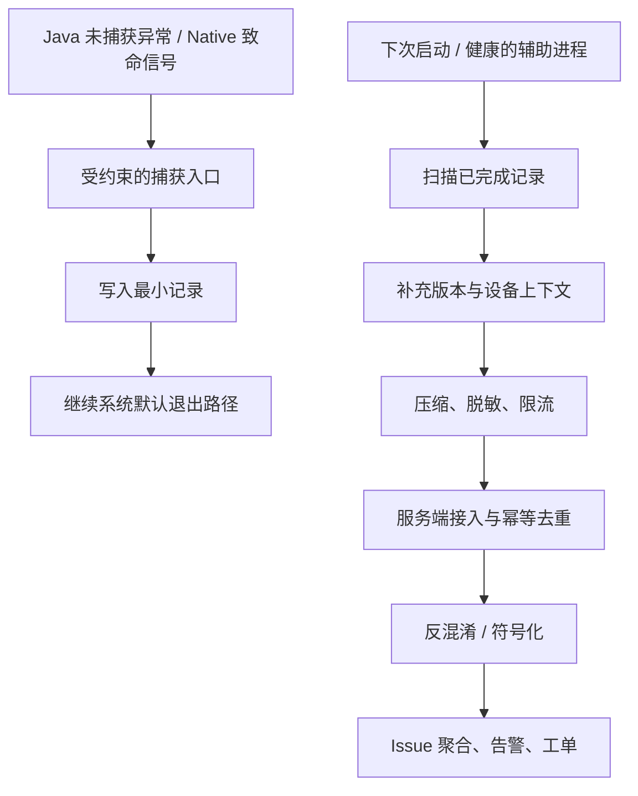

---

title: "Crash 上报体系搭建"
chapter: "26.2"
section: "26.2"
status: finalized
applicable_versions: "Android 10 (API 29) - Android 17 (API 37)"
last_verified: "2026-05-15"
last_verified_against: "AOSP android-16.0.0_r1, Android Developers docs, Firebase Crashlytics docs, Clippings structure references"
confidence: medium
drafted_date: "2026-05-15"
polish_count: 0
sources:
  - type: clipping
    path: "Clippings/线上疑难问题该如何排查和跟踪?-Android开发高手课-极客时间 1.md"
  - type: clipping
    path: "Clippings/线上疑难问题该如何排查和跟踪?-Android开发高手课-极客时间 2.md"
  - type: clipping
    path: "Clippings/线上疑难问题该如何排查和跟踪?-Android开发高手课-极客时间 3.md"
  - type: clipping
    path: "Clippings/线上疑难问题该如何排查和跟踪?-Android开发高手课-极客时间 33.md"
  - type: clipping
    path: "Clippings/线上疑难问题该如何排查和跟踪?-Android开发高手课-极客时间 35.md"
  - type: clipping
    path: "Clippings/Android 应用稳定性剖析与优化 - Java Crash 监控:实现自定义 Crash 处理器.md"
  - type: clipping
    path: "Clippings/Android 应用稳定性剖析与优化 - Native Crash 监控:为我们应用插上监控 Native Crash 的电子眼.md"
  - type: official
    path: "https://developer.android.com/reference/java/lang/Thread.UncaughtExceptionHandler"
  - type: official
    path: "https://developer.android.com/topic/performance/vitals/crash"
  - type: official
    path: "https://developer.android.com/tools/retrace"
  - type: official
    path: "https://developer.android.com/ndk/guides/ndk-stack"
  - type: official
    path: "https://developer.android.com/build/include-native-symbols"
  - type: official
    path: "https://firebase.google.com/docs/crashlytics/android/get-deobfuscated-reports"
  - type: official
    path: "https://firebase.google.com/docs/crashlytics/ndk-reports"
  - type: aosp
    path: "frameworks/base/core/java/com/android/internal/os/RuntimeInit.java"
  - type: aosp
    path: "system/core/debuggerd/crash_dump.cpp"
tags: [crash-reporting, symbolication, deobfuscation, alerting]
related_chapters: ["26.1", "20.2", "20.3", "19.24", "20.8"]
pipeline_stage: "ready-to-publish"
task6_state: "reviewed"
task9_state: reviewed
task2b_state: fixed
task6_result: pass-light-edit
reviewed_by: openclaw-task6
reviewed_date: "2026-06-05"
last_task6_at: "2026-06-05T21:09:00+08:00"
last_task6_review_log: "logs/review/2026-06-05-11-review.md"
task6_reviewed_at: "2026-05-15T02:12:00+08:00"
task6_reviewed_by: openclaw-task6
task6_review_notes: "2026-06-05 Task6 revisiting re-review: pass-light-edit. task9 auto-fixed(API/源码路径修正)后复检，L1/L2 全部通过(禁用词0/高频词0/元叙述0)。无B类大问题。task9_result=auto-fixed, 不触发自动晋升。pipeline_stage→ready-to-publish。"
task9_reviewed_date: 2026-06-05
last_task9_at: "2026-06-05T20:33:28+08:00"
last_task9_review_log: "logs/deep-review/2026-06-05-20-deep-review.md"
task9_result: auto-fixed
task9_review_notes: "2026-06-05 Task9 auto-fixed: corrected ProfilingManager/ProfilingTrigger API, ApplicationExitInfo public API wording, and downgraded unverified Breakpad/Crashpad paths."
task2b_result: fixed
last_task2b_lite_at: 2026-06-04
task2b_recovery_note: "2026-06-05: body recovered from git 49794e89 (initial draft); orphaned YAML lines removed."
last_task9_autofix_at: 2026-06-05
task9_reviewed_by: openclaw-task9
deepseek_cn_review_state: done
last_deepseek_cn_review_at: 2026-06-06
---

# Crash 上报体系搭建

Crash 上报体系的任务很明确：进程即将退出时，尽可能保存足以定位问题的证据，并在后续可用的执行窗口把证据送到分析系统。Java Crash、Native Crash 的捕获机制在 20.2、20.3 和 19.24 中展开；这里关注端到端工程设计，包括本地留存、多进程归集、符号化、告警和发布门禁。

平台源码上界为 Android 17 / API 37 / `android-17.0.0_r1`。崩溃主路径位于 framework、bionic 与 debuggerd 等用户空间组件，不依赖某项 Android 17 内核专有实现，因此不为结论附加 kernel tag。

## Crash SDK 的四段路径：捕获、序列化、持久化、上报

崩溃发生后，当前线程、堆、锁、文件描述符和线程池都可能处于异常状态。合理的职责划分是：崩溃入口只保存最小现场；进程退出后，由下次启动或健康的辅助进程补充上下文、上传并重试；服务端负责符号化、聚合和告警。

下面的流程图用于区分崩溃现场与后续处理窗口。

图中的关键约束是：`B → C` 不能假设应用运行环境健康，网络请求、数据库索引和复杂对象序列化都应放在 `E → H`。

### 捕获：Java 与 Native 不是同一种执行环境

Java 未捕获异常的公开入口是 `Thread.UncaughtExceptionHandler`。在 Android 17 的 [`RuntimeInit.java`](https://android.googlesource.com/platform/frameworks/base/+/refs/tags/android-17.0.0_r1/core/java/com/android/internal/os/RuntimeInit.java) 中，`LoggingHandler` 记录 `FATAL EXCEPTION`，`KillApplicationHandler` 向 ActivityManager 报告崩溃，并在 `finally` 中执行 `Process.killProcess()` 与 `System.exit(10)`。`KillApplicationHandler` 还用 `mCrashing` 防止异常处理递归进入。

自定义 Java handler 应在安装时保存前一个 handler，并在自己的最小记录逻辑结束后调用它。调用应放在 `finally` 中且只发生一次；吞掉前一个 handler 会改变平台的日志、报告与进程退出语义。handler 运行在发生异常的线程上，因此即使是 Java 路径，也不适合等待网络、获取业务锁或遍历大型对象图。

Android 平台的 Native Crash 路径更受约束。Android 17 的 [`debuggerd_handler.cpp`](https://android.googlesource.com/platform/system/core/+/refs/tags/android-17.0.0_r1/debuggerd/handler/debuggerd_handler.cpp) 会预先准备处理所需的栈，并以 `SA_RESTART | SA_SIGINFO | SA_ONSTACK | SA_EXPOSE_TAGBITS` 注册信号处理；收到致命信号后，它使用专门准备的执行环境启动 `crash_dump`。[`crash_dump.cpp`](https://android.googlesource.com/platform/system/core/+/refs/tags/android-17.0.0_r1/debuggerd/crash_dump.cpp) 再通过 ptrace 获取线程状态，并经 tombstoned 写出 tombstone。

这里容易出现两个误解：

- 不是“debuggerd 守护进程进入应用并替应用注册 `sigaction`”。信号处理代码在目标进程一侧初始化，`crash_dump` 与 tombstoned 参与后续抓取和保存。
- 平台 handler 能做的事不等于普通 Crash SDK 可以照搬。它依赖预分配栈、管道、专用 helper 和平台权限。自定义信号处理函数应限制在经过审计的 async-signal-safe 操作与预分配内存内，不能在现场构造 JSON、申请堆内存、获取普通互斥锁或发起网络请求。

`/data/tombstones` 也不是第三方应用可普遍读取的目录。应用侧通常通过经过验证的 Native Crash SDK 生成 minidump，或在后续启动时查询 `ApplicationExitInfo`；开发和平台诊断场景才会使用 tombstone、bugreport、logcat 与 `ndk-stack`。

### 最小记录：字段要服务于关联，而不是堆积上下文

捕获入口可以围绕一份版本化的 `CrashEnvelope` 组织数据，但 Java 与 Native 路径能够安全写出的字段集合不同。

| 字段 | 用途 | 采集边界 |
| --- | --- | --- |
| `schema_version` | 让服务端兼容旧客户端 | 只增不改；废弃字段仍保留解析能力 |
| `crash_id` / `sequence` | 幂等上传和端侧关联 | 尽量提前生成；不要在 Native signal handler 内临时创建 UUID |
| `event_time_wall_ms` | 与发布、日志和服务端事件对时 | 墙上时钟可能被校时，不单独用于计算耗时 |
| `elapsed_realtime_ms` | 进程内排序和启动后时长 | 单调时钟不能跨设备比较 |
| `process_name` / `pid` / `thread_name` | 区分应用进程与线程 | Native 样本优先使用 minidump 或 tombstone 中已有字段 |
| `exception_type` / `signal` | 区分 Java 异常和 Native 致命信号 | 端侧不做复杂根因推断 |
| `raw_stack` / `top_frame` | 反混淆、符号化和初步聚合 | Native 侧还需 so、相对地址、ABI 与 Build ID |
| `application_id` / `version_code` / `git_sha` | 绑定发布产物、mapping 和 symbols | 由构建流水线注入，不在崩溃现场拼装 |
| `breadcrumbs` | 提供崩溃前的有限操作上下文 | 平时写入固定容量环形缓冲区，现场只读取已完成槽位 |
| `privacy_policy_version` | 追踪脱敏与字段许可规则 | 不保存用户明文输入、token 或完整 URL |

对 Java 路径，可以在受控上限内输出异常类型和堆栈；对 Native 路径，推荐让成熟 SDK 或平台机制保存寄存器、线程和内存映射。若某个字段必须通过分配、锁或 Binder 调用获取，就不属于 Native signal handler 的最小字段。

### 序列化：摘要与附件分开演进

Crash 样本不宜直接复用普通业务埋点格式。它的单条价值更高，附件大小差异也更大，还需要跨多个线上版本保持可解析。可以把数据分为两层：

- 摘要：`crash_id`、schema、异常或信号、进程、线程、构建标识、top frame、采样策略版本。
- 附件：完整 Java 堆栈、minidump、可公开取得的 tombstone 数据、受限日志片段、行为窗口或诊断 trace。

每个附件应记录类型、字节数、压缩方式、脱敏策略版本和内容摘要。服务端先接收小型摘要并完成幂等登记，再根据 issue 新鲜度、样本价值和流量策略请求附件。字段新增保持向后兼容；客户端不认识的服务端字段和服务端不认识的客户端字段都不应阻止最小样本入库。

### 持久化：按捕获环境选择写入方式

“临时文件 → 同步数据 → 原子 rename”适合健康执行环境或经过约束的 Java 崩溃记录，但不能直接套用到 Native signal handler。

对 Java 路径和后续整理进程，可以采用以下规则：

1. 每个应用进程写独立目录或独立文件，避免共享可变索引。
2. 先完成临时文件，再将其原子 rename 为可扫描文件；需要抵御掉电时，还要考虑文件与父目录的持久化语义。
3. 下次启动只处理完整记录，损坏或半写文件进入隔离区，不反复阻塞上传队列。
4. 设置字节配额和保留策略，优先保存未上传 fatal 样本及新 issue 的代表附件。

SQLite 可以用于进程恢复后的索引和状态机，但不应成为崩溃现场唯一的写入路径。崩溃线程可能正持有数据库锁，事务和连接状态也未必可用。

对 Native 路径，应使用经过验证的 minidump 实现、预打开文件描述符与固定大小缓冲区，或把复杂抓取交给健康的进程外组件。平台 debuggerd 的实现是专用架构，不是应用层任意 signal handler 的通用模板。

### 上报：崩溃进程不负责把请求发完

上传由下次启动或健康的辅助进程执行。处理顺序通常是：扫描完整记录、补充非现场字段、脱敏、上传摘要、按服务端策略上传附件、确认后回收本地文件。

| 优先级示例 | 样本 | 处理方式 |
| --- | --- | --- |
| P0 | 新版本启动 fatal、核心交易路径 fatal | 尽快上传摘要；附件仍受网络、隐私和大小策略限制 |
| P1 | 新 issue、Native Crash、影响面快速扩大的 issue | 提高代表样本保留率，并核对符号文件状态 |
| P2 | 已知 issue 的重复样本、non-fatal | 保留计数和分层抽样，减少重复附件 |
| P3 | 大型日志或 trace | 默认不进入 crash 首包，只在授权诊断流程中获取 |

服务端以 `crash_id` 和附件内容摘要实现幂等，不能把客户端重试计为多个受影响事件。采样记录还要包含策略版本与纳入概率，否则服务端无法在分层采样后解释趋势。上传模块自身应公开待上传字节数、丢弃原因、重试次数和最近成功时间，避免“采集失效”被误读为“稳定性改善”。

## 多进程 Crash 上报的可靠性保证

“多进程”至少包含三类不同对象：应用自己声明的普通进程、权限受限的 isolated service 进程，以及系统管理的 WebView renderer。三者不能使用同一套初始化假设。

### 普通应用进程：各自捕获，统一归集

对 manifest 中以 `android:process` 声明的应用进程，可以在每个进程安装轻量捕获模块，但只让主进程或专用上传进程运行配置拉取与网络上传。

| 层次 | 设计 | 需要验证的失败场景 |
| --- | --- | --- |
| 初始化 | 每个目标应用进程安装 handler，初始化要幂等 | 子进程早于主进程启动或直接崩溃 |
| 本地文件 | 以稳定的进程角色和唯一文件名隔离写入 | 多进程同时崩溃、PID 被系统复用 |
| 配置 | 主进程写版本化只读快照，其他进程读取 | 快照写到一半、配置过期、回滚 |
| 上传 | 一个健康进程扫描所有应用进程目录 | 主进程无法启动、上传中途再次被杀 |
| 服务端 | 事件幂等与 issue 聚合分开 | 同一退出记录被 SDK 与系统历史重复发现 |

`pid` 只在一次进程生命周期内有意义，不能单独作为崩溃 ID。推荐用预生成 ID 或“安装标识的隐私安全派生值 + 进程序列 + 单调时间 + 构建标识”形成事件关联键，并在服务端保留冲突检测。

### WebView renderer：由宿主观察退出

WebView renderer 是系统/WebView 实现管理的渲染进程，不是应用可以安装普通 Crash SDK 的业务进程。API 26 起，[`WebViewClient.onRenderProcessGone()`](https://developer.android.com/reference/android/webkit/WebViewClient#onRenderProcessGone(android.webkit.WebView,%20android.webkit.RenderProcessGoneDetail)) 会把 renderer 退出通知宿主。

回调中的 `WebView` 已不可继续使用，宿主必须把它从视图层级移除、销毁并清理引用，再决定是否创建新实例。返回 `true` 表示应用已处理；返回 `false` 时，renderer 如果因崩溃退出，应用也会崩溃；renderer 如果被系统终止，应用会被终止。多个 `WebView` 还可能共享同一个 renderer，每个受影响实例都要正确处理回调。上报字段应来自宿主回调提供的 `RenderProcessGoneDetail`、页面的脱敏标识和宿主版本，而不是假设能读取 renderer 内部的 Java 栈。

### Isolated service：不能假设具备上传权限

manifest 中设置 [`android:isolatedProcess="true"`](https://developer.android.com/guide/topics/manifest/service-element#isolated) 的 Service 在特殊隔离进程运行，该进程没有自己的权限，只能通过 Service 的启动或绑定接口与应用交互。它不能因为属于同一个 APK 就被假定能够直接访问应用私有状态或发起网络上传。

可行的设计是：父进程通过受控 IPC 接收平时产生的有限诊断数据；退出后再用 `ApplicationExitInfo` 对照进程名、UID、时间和退出原因补齐记录。若 isolated 进程本身已崩溃，不能依赖“临终 Binder 调用”完成保存。

### 动态特性：记录模块存在性，不虚构独立版本

动态特性模块通常随同一个应用发布产物受版本管理。Crash 记录应包含已安装 split/module 集合、功能开关和实验配置，并继续使用应用构建标识关联 mapping 与 symbols。只有业务系统确有独立插件版本时才记录插件版本；不能把普通 dynamic feature 描述成同一 `versionCode` 下任意漂移的模块版本。

## 用 `ApplicationExitInfo` 补偿退出记录

API 30 起，应用可以通过 [`ActivityManager.getHistoricalProcessExitReasons()`](https://developer.android.com/reference/android/app/ActivityManager#getHistoricalProcessExitReasons(java.lang.String,%20int,%20int)) 查询近期进程退出信息。它适合发现 SDK 没有保存到的低内存终止、ANR、Java Crash 和 Native Crash，也能帮助核对多进程退出。

这项 API 不是无限期、无损的 crash archive：

- 返回值来自有界历史记录，按时间从新到旧排列；调用方应保存上次成功处理的游标并容忍记录被淘汰。
- `ApplicationExitInfo` 的 trace 存在单独的全局循环存储中，可能被包括其他应用在内的后续记录覆盖；`getTraceInputStream()` 允许返回 `null`。
- API 30 的 trace 主要用于 ANR；API 31 起，`REASON_CRASH_NATIVE` 可以返回 tombstone protobuf 流。
- 同一个事件可能同时被 Crash SDK 和系统历史发现。去重应综合应用构建、进程名、时间邻域、退出原因、SDK 事件 ID，以及可用的 signal、Build ID 或 top frame，不能只拼接 `pid + timestamp`。

Android 17 的公开模型见 [`ApplicationExitInfo.java`](https://android.googlesource.com/platform/frameworks/base/+/refs/tags/android-17.0.0_r1/core/java/android/app/ApplicationExitInfo.java)，服务端记录与 trace 管理可从 [`AppExitInfoTracker.java`](https://android.googlesource.com/platform/frameworks/base/+/refs/tags/android-17.0.0_r1/services/core/java/com/android/server/am/AppExitInfoTracker.java) 继续追踪。

## 符号化与反混淆服务

原始混淆名和 Native 地址不能稳定对应源码。每一个可发布构建都要把应用包、R8 mapping 和 Native symbols 绑定为同一组不可变产物。

### Java / Kotlin：mapping 是发布产物的一部分

官方 [`retrace`](https://developer.android.com/tools/retrace) 使用 R8 mapping 还原混淆后的类、方法和行号；工具位于 SDK Command-Line Tools 的 `cmdline-tools/<version>/bin/retrace`。Firebase Crashlytics 的 [反混淆说明](https://firebase.google.com/docs/crashlytics/android/get-deobfuscated-reports) 则说明其 Gradle 插件会检测混淆并上传 mapping。

自建系统至少应绑定这些键：

- `application_id`、variant、`version_code` 与 `version_name`；
- 构建 ID 或 Git 提交；
- mapping 文件的内容摘要；
- 最终 APK/AAB 的内容摘要或发布系统产物 ID。

同一版本号可能被重新构建，单靠 `versionCode` 不能选出正确 mapping。流水线应在发布前验证产物与 mapping 已同时归档；对启用混淆却缺失 mapping 的构建直接阻断发布，比上线后标记“无法反混淆”更可靠。

Kotlin 的 coroutine、inline 与 lambda 会影响栈形态。Issue 分组不能只取原始 top frame 文本，应先 retrace，再结合异常类型、规范化 message、完整栈和构建范围生成候选签名。

### Native：Build ID 把地址绑定到准确的 so

Android release 构建默认剥离 Native 库中的调试信息。官方 [Native debug symbols 文档](https://developer.android.com/build/include-native-symbols) 说明，`SYMBOL_TABLE` 可提供函数名，`FULL` 还可提供源码文件和行号；App Bundle 可以携带相应符号，APK 构建也会生成可单独上传的 symbol archive。用于分析的未剥离库或符号文件应保存在受控产物库中，不随应用发布给用户。

Native 样本和符号产物至少要通过以下信息匹配：

| 信息 | 作用 |
| --- | --- |
| ABI | 区分同一库的不同指令集产物 |
| so 名与 ELF Build ID | 选择准确的二进制和符号文件 |
| pc、相对地址与 load map | 计算模块内地址并处理 ASLR |
| NDK、编译器和链接参数 | 解释 unwind、内联与 frame pointer 差异 |
| 未剥离产物或独立 symbols | 恢复函数、文件和行号 |

对第三方或非默认目录的 native 库，不能只验证主模块的 CMake 输出。以 Crashlytics 为例，额外库可能需要配置 `unstrippedNativeLibsDir`；自建流水线同样应枚举最终 APK/AAB 中的每个 so，检查其 Build ID，并确认产物库中存在匹配符号。缺失任一目标 ABI 的符号都应阻断相应发布产物。

### Issue 聚合：符号化成功后再生成签名

混淆名、绝对地址和构建间变化的 pc 都不适合作为跨版本 issue 主键。推荐把“事件不变 ID”和“可重新计算的 issue 签名”分开：

1. Java/Kotlin 候选签名：异常类型、反混淆后的稳定 frame 序列、规范化 message、构建范围。
2. Native 候选签名：signal、模块 Build ID、符号化函数、模块内偏移区间、ABI。
3. 服务端保留原始事件到 issue 的映射；mapping、symbols 或聚类算法更新后，可以重新符号化和归组，不改动事件事实。

## Crash 实时告警与分级响应

“出现新 issue”只是一个信号。告警还要结合受影响用户、版本暴露量、发生场景、相对稳定版本的变化和统计不确定性，否则低暴露版本容易因偶发样本触发误报，高暴露版本又可能因绝对数量大而长期告警。

### 先把指标分母说清楚

[Android Vitals](https://developer.android.com/topic/performance/vitals/crash) 的 crash rate 是“每日活跃用户中至少经历一次 crash 的用户比例”；user-perceived crash rate 只统计应用处于活跃使用状态时发生 crash 的用户比例，并属于核心质量指标。

自建平台常用的 crash-free 指标不是 Vitals 的同名替代：

- `Crash-free users = 1 - 发生目标 fatal 事件的去重用户数 / 同口径活跃用户数`。
- `Crash-free sessions = 1 - 包含目标 fatal 事件的会话数 / 有效会话总数`。
- `Issue impact` 记录单个 issue 的受影响用户、事件数、版本、设备、首次与最近发生时间。

这里的“目标 fatal”“活跃用户”“有效会话”和统计窗口必须写进指标定义。fatal、non-fatal 与业务捕获异常分别统计；不能把 non-fatal 混入 Vitals 风格的用户感知 crash rate。

### 告警使用暴露量、基线和严重性

下面的 S0/S1/S2 只是内部响应级别示例，不是 Android 平台标准。

| 级别 | 触发信号示例 | 响应动作 |
| --- | --- | --- |
| S0 | 启动或核心交易路径出现高影响 fatal；灰度版本相对稳定基线显著恶化 | 暂停放量或回滚，通知值班负责人，保留代表性完整附件 |
| S1 | 单个 issue 影响持续增长；特定机型、系统版本或同一 so Build ID 明显集中 | 分派模块负责人，调整分层采样，评估热修或小版本 |
| S2 | 低影响 non-fatal、老版本存量问题、已知 issue 的稳定重复 | 进入排期或继续观察，不中断当前发布 |

阈值应由产品流量、基线波动、样本纳入概率和事故容忍度校准，而不是把固定 DAU、事件数或等待时间写成通用答案。告警页面至少要同时展示分母、趋势、置信区间或可信区间、版本与设备分布、符号化状态、近期发布记录和代表样本，值班人员才能判断这是回滚问题、机型问题还是数据质量问题。

### 发布门禁检查可诊断性

灰度平台可以把以下条件作为自动放量输入：

- 新版本暴露不足或不确定性过大时保持当前灰度，不根据几个样本自动扩量或回滚。
- 使用相同分母和窗口，对比候选版本与稳定基线；采样变化时先完成权重校正。
- 未处置的高严重性新 issue 阻止自动扩量。
- 启用 R8 却缺 mapping、包含 Native 库却缺对应 symbols 或 Build ID 时阻断发布。
- Crash SDK 的本地丢弃率、上传成功率和符号化成功率异常时，将稳定性指标标记为数据不完整。

这类门禁把“应用是否稳定”和“出问题后是否能定位”同时纳入发布判断。

## Crash 数据隐私与成本控制

Crash 附件可能包含 URL、请求参数、用户输入、文件路径、设备标识和日志片段。采集前就要确定字段许可与保留策略：

- 端侧使用允许字段清单；breadcrumb 写入环形缓冲区前完成脱敏。
- URL 默认只保留必要的 host、路径模板和错误码，丢弃 query、fragment 与凭据。
- 日志按 tag 和字段清单截取，不上传 token、Cookie、账号、手机号或用户正文。
- 大附件设定单独的字节配额、保留期和下载审计，过期后只保留统计摘要。
- 服务端实施项目隔离和最小权限，原始附件访问需要可审计的诊断理由。

成本控制不能只做统一抽样。新 issue、稀有设备、Native Crash 与核心场景需要分层保留代表样本；已知重复 issue 可以降低附件采集率，但仍保留无偏计数所需的纳入概率。看板还要呈现 dropped events、配额占用、重试、附件大小分位数和符号化失败率，因为采集缺口会让 crash-free 指标偏高。

## Android 10–17 的能力边界

下表只列与 Crash 上报直接相关的公开能力。`ApplicationExitInfo` 从 Android 11 开始提供，不能写成 Android 10 已支持。

| 平台版本 | API | 相关变化 |
| --- | ---: | --- |
| Android 10 | 29 | 没有 `ApplicationExitInfo`；应用依赖自己的 Crash SDK、平台日志和开发诊断工具 |
| Android 11 | 30 | 新增 `ApplicationExitInfo` 与 `getHistoricalProcessExitReasons()`；`getTraceInputStream()` 主要返回 ANR trace |
| Android 12 | 31 | `REASON_CRASH_NATIVE` 的 `getTraceInputStream()` 可以返回 tombstone protobuf |
| Android 15 | 35 | 新增 `ProfilingManager`；它受频率限制且请求不保证执行，不是 Crash 捕获 API |
| Android 16 | 36 | 新增 `ProfilingTrigger`，可按受支持事件请求诊断采集 |
| Android 17 | 37 | 源码验证上界；新增 cold start、OOM、过量 CPU、anomaly 和 app compatibility 等 profiling trigger |

`ProfilingManager` 支持 `PROFILING_TYPE_SYSTEM_TRACE`、`PROFILING_TYPE_JAVA_HEAP_DUMP`、`PROFILING_TYPE_HEAP_PROFILE` 和 `PROFILING_TYPE_STACK_SAMPLING` 等类型。`ProfilingTrigger.TRIGGER_TYPE_APP_FULLY_DRAWN` 对应应用调用 `reportFullyDrawn()`，不是“首帧完成”。Android 17 的 `TRIGGER_TYPE_OOM` 还明确要求自定义 `Thread.UncaughtExceptionHandler` 继续调用默认 handler，否则系统无法使用该 trigger；这与前文的 Java handler 链规则一致。这些 API 适合收集性能诊断资料，不能代替 Java handler、Native 崩溃机制或退出历史查询。

## 小结

可靠的 Crash 上报系统依赖三条边界：

- 崩溃现场只执行与当前捕获环境相符的最小操作。Java handler 要继续平台默认退出链，Native handler 要遵守 signal 安全约束。
- 普通应用进程、WebView renderer 与 isolated service 分别处理；`ApplicationExitInfo` 用于补偿和核对近期退出，不被当作永久档案。
- mapping、Native symbols 与发布包组成同一组构建产物。服务端完成符号化后再聚合，并以明确分母、暴露量和严重性驱动告警。

## 参考资料

- [Thread.UncaughtExceptionHandler](https://developer.android.com/reference/java/lang/Thread.UncaughtExceptionHandler)
- [Android Vitals：Crash](https://developer.android.com/topic/performance/vitals/crash)
- [ApplicationExitInfo](https://developer.android.com/reference/android/app/ApplicationExitInfo)
- [ActivityManager.getHistoricalProcessExitReasons](https://developer.android.com/reference/android/app/ActivityManager#getHistoricalProcessExitReasons(java.lang.String,%20int,%20int))
- [WebView renderer 退出处理](https://developer.android.com/develop/ui/views/layout/webapps/handle-termination)
- [ProfilingManager](https://developer.android.com/reference/android/os/ProfilingManager)
- [ProfilingTrigger](https://developer.android.com/reference/android/os/ProfilingTrigger)
- [Android 17：profiling triggers](https://developer.android.com/about/versions/17/features#profiling-triggers)
- [R8 retrace](https://developer.android.com/tools/retrace)
- [NDK stack](https://developer.android.com/ndk/guides/ndk-stack)
- [为 App Bundle 或 APK 添加 Native debug symbols](https://developer.android.com/build/include-native-symbols)
- [Firebase Crashlytics 反混淆](https://firebase.google.com/docs/crashlytics/android/get-deobfuscated-reports)
- [Firebase Crashlytics NDK 报告](https://firebase.google.com/docs/crashlytics/ndk-reports)
- [AOSP Android 17：RuntimeInit.java](https://android.googlesource.com/platform/frameworks/base/+/refs/tags/android-17.0.0_r1/core/java/com/android/internal/os/RuntimeInit.java)
- [AOSP Android 17：debuggerd_handler.cpp](https://android.googlesource.com/platform/system/core/+/refs/tags/android-17.0.0_r1/debuggerd/handler/debuggerd_handler.cpp)
- [AOSP Android 17：crash_dump.cpp](https://android.googlesource.com/platform/system/core/+/refs/tags/android-17.0.0_r1/debuggerd/crash_dump.cpp)
- [AOSP Android 17：tombstone.cpp](https://android.googlesource.com/platform/system/core/+/refs/tags/android-17.0.0_r1/debuggerd/libdebuggerd/tombstone.cpp)
- [AOSP Android 17：tombstone.proto](https://android.googlesource.com/platform/system/core/+/refs/tags/android-17.0.0_r1/debuggerd/proto/tombstone.proto)
- [AOSP Android 17：ApplicationExitInfo.java](https://android.googlesource.com/platform/frameworks/base/+/refs/tags/android-17.0.0_r1/core/java/android/app/ApplicationExitInfo.java)
- [AOSP Android 17：AppExitInfoTracker.java](https://android.googlesource.com/platform/frameworks/base/+/refs/tags/android-17.0.0_r1/services/core/java/com/android/server/am/AppExitInfoTracker.java)
