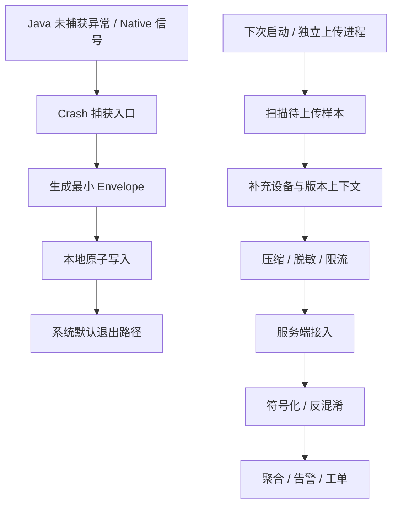

---


title: "Crash 上报体系搭建"
chapter: "26.2"
section: "26.2"
status: finalized  # updated by task2b-verifier 2026-06-06
applicable_versions: "Android 10 (API 29) - Android 17 (API 37)"
last_verified: "2026-05-15"
last_verified_against: "AOSP android-16.0.0_r1, Android Developers docs, Firebase Crashlytics docs, Clippings structure references"
confidence: medium
drafted_date: "2026-05-15"
polish_count: 0
sources:
  - type: clipping
    path: "Clippings/线上疑难问题该如何排查和跟踪?-Android开发高手课-极客时间 1.md"
  - type: clipping
    path: "Clippings/线上疑难问题该如何排查和跟踪?-Android开发高手课-极客时间 2.md"
  - type: clipping
    path: "Clippings/线上疑难问题该如何排查和跟踪?-Android开发高手课-极客时间 3.md"
  - type: clipping
    path: "Clippings/线上疑难问题该如何排查和跟踪?-Android开发高手课-极客时间 33.md"
  - type: clipping
    path: "Clippings/线上疑难问题该如何排查和跟踪?-Android开发高手课-极客时间 35.md"
  - type: clipping
    path: "Clippings/Android 应用稳定性剖析与优化 - Java Crash 监控:实现自定义 Crash 处理器.md"
  - type: clipping
    path: "Clippings/Android 应用稳定性剖析与优化 - Native Crash 监控:为我们应用插上监控 Native Crash 的电子眼.md"
  - type: official
    path: "https://developer.android.com/reference/java/lang/Thread.UncaughtExceptionHandler"
  - type: official
    path: "https://developer.android.com/topic/performance/vitals/crash"
  - type: official
    path: "https://developer.android.com/tools/retrace"
  - type: official
    path: "https://developer.android.com/ndk/guides/ndk-stack"
  - type: official
    path: "https://developer.android.com/build/include-native-symbols"
  - type: official
    path: "https://firebase.google.com/docs/crashlytics/android/get-deobfuscated-reports"
  - type: official
    path: "https://firebase.google.com/docs/crashlytics/ndk-reports"
  - type: aosp
    path: "frameworks/base/core/java/com/android/internal/os/RuntimeInit.java"
  - type: aosp
    path: "system/core/debuggerd/crash_dump.cpp"
tags: [crash-reporting, symbolication, deobfuscation, alerting]
related_chapters: ["26.1", "20.2", "20.3", "19.24", "20.8"]
pipeline_stage: "ready-to-publish"
task6_state: "reviewed"
task9_state: reviewed
task2b_state: fixed
task6_result: pass-light-edit
reviewed_by: openclaw-task6
reviewed_date: "2026-06-05"
last_task6_at: "2026-06-05T21:09:00+08:00"
last_task6_review_log: "logs/review/2026-06-05-11-review.md"
task6_reviewed_at: "2026-05-15T02:12:00+08:00"
task6_reviewed_by: openclaw-task6
task6_review_notes: "2026-06-05 Task6 revisiting re-review: pass-light-edit. task9 auto-fixed(API/源码路径修正)后复检，L1/L2 全部通过(禁用词0/高频词0/元叙述0)。无B类大问题。task9_result=auto-fixed, 不触发自动晋升。pipeline_stage→ready-to-publish。"
task9_reviewed_date: 2026-06-05
last_task9_at: "2026-06-05T20:33:28+08:00"
last_task9_review_log: "logs/deep-review/2026-06-05-20-deep-review.md"
task9_result: auto-fixed
task9_review_notes: "2026-06-05 Task9 auto-fixed: corrected ProfilingManager/ProfilingTrigger API, ApplicationExitInfo public API wording, and downgraded unverified Breakpad/Crashpad paths."
task2b_result: fixed
last_task2b_lite_at: 2026-06-04
task2b_recovery_note: "2026-06-05: body recovered from git 49794e89 (initial draft); orphaned YAML lines removed."
last_task9_autofix_at: 2026-06-05
task9_reviewed_by: openclaw-task9
deepseek_cn_review_state: done
last_deepseek_cn_review_at: 2026-06-06
---


# Crash 上报体系搭建

<!-- outline-start -->
## 本节要点大纲

### 锚点（必须覆盖）

- 🔹 Crash SDK 核心流程：捕获 / 序列化 / 持久化 / 上报
- 🔹 多进程 Crash 上报的可靠性保证
- 🔹 符号化与反混淆服务
- 🔹 Crash 实时告警与分级响应

### 扩展（可选深入）

- 🔸 Crash 数据隐私与成本控制

### OpenClaw 加工指引

> **锚点**是最低覆盖要求，加工时必须逐条落实并标注验证结果。
> **扩展**视素材丰富程度选择性深入。
> 如果从 Obsidian 素材或 AOSP 源码中发现大纲未列出但与本节强相关的知识点，
> 可**就地插入**最相关的锚点之后，并用 `[自动发现]` 标注，方便后续 review。
> 锚点内容需 L1/L2 验证，扩展内容至少 L2 验证，自动发现内容至少标注来源。
<!-- outline-end -->

Crash 上报体系要解决的是一件事：进程即将退出时，崩溃证据必须留存下来并送达分析系统。Java Crash、Native Crash 的底层捕获机制在 20.2、20.3 和 19.24 已经展开；本节只聚焦 App 侧和服务端：怎么把崩溃样本稳定送到位，怎么让值班同学在几分钟内判断出影响面。


## Crash SDK 的四段路径：捕获、序列化、持久化、上报

Crash SDK 的端侧路径要足够短。崩溃发生时，应用线程可能已经处在异常状态，文件系统、日志系统、线程池、数据库都不能假设还可靠；端侧只保留最小现场，完整分析放到下次启动和服务端完成。

这张图描述 Crash 样本从进程内进入服务端的路径，重点看“崩溃当下”和“下次启动”两段的职责分离。



### 捕获：只拿入口能安全拿到的信息

Java Crash 的入口是 `Thread.UncaughtExceptionHandler`。Android 官方文档说明，线程因为未捕获异常即将终止时，虚拟机会查询该线程的 handler，并调用 `uncaughtException(thread, exception)`。AOSP `RuntimeInit.java` 中的 `LoggingHandler` 负责写 `FATAL EXCEPTION` 日志，`KillApplicationHandler` 负责结束进程；自定义 Crash SDK 不能吞掉原 handler，否则进程退出语义会被改坏。Java Crash 机制详见 20.2，本节只保留上报设计。[已验证: 官方文档, developer.android.com/reference/java/lang/Thread.UncaughtExceptionHandler][已验证: AOSP android-16.0.0_r1, frameworks/base/core/java/com/android/internal/os/RuntimeInit.java]

Native Crash 的入口通常是 `sigaction`、Breakpad / Crashpad client 或厂商 APM 的信号处理器。Android 官方 NDK 文档把 tombstone 放在 `/data/tombstones/`，`ndk-stack` 可把 logcat 或 tombstone 里的 native 地址还原成源码文件和行号；AOSP `crash_dump.cpp` 通过读取 `siginfo_t`、寄存器和进程信息生成崩溃 dump。Native 信号处理函数里不能做复杂分配、加锁和网络请求，详细捕获路径见 20.3 和 19.24。[已验证: 官方文档, developer.android.com/ndk/guides/ndk-stack][已验证: AOSP android-16.0.0_r1, system/core/debuggerd/crash_dump.cpp]

端侧捕获入口建议只产出一份 `CrashEnvelope`：

| 字段 | 用途 | 采集边界 |
| --- | --- | --- |
| `crash_id` | 去重和幂等上传 | UUID 或 hash，生成后不再改写 |
| `process_name` / `pid` / `thread_name` | 区分主进程、推送进程、WebView 进程和后台 Service | Java 入口可直接拿线程名；Native 样本优先取 tombstone / minidump 字段 |
| `exception_type` / `signal` | 区分 Java 异常、`SIGSEGV`、`SIGABRT`、`SIGBUS` 等 | 不在端侧做复杂归因 |
| `top_frame` / `raw_stack` | 服务端聚合和符号化输入 | Java 保留原始堆栈；Native 保留地址、so 名、Build ID |
| `build_version` / `version_code` / `git_sha` | 对应发布记录、mapping 和符号文件 | 这组字段必须来自构建产物，不从运行时拼接 |
| `breadcrumbs` | 崩溃前最近操作、页面、网络请求摘要 | 使用固定大小环形缓冲区，避免崩溃时扩容 |
| `device_context` | 机型、Android 版本、ABI、前后台、内存水位、磁盘水位 | 不采集用户明文输入和完整 URL |


### 序列化：格式要稳定，字段要可演进

Crash 序列化格式不应直接复用业务埋点格式。崩溃样本和普通埋点有三点不同：单条样本价值高、体积波动大、字段需要长期向后兼容。建议使用带 schema 版本的二进制或 JSON envelope，把大字段拆成附件。

- 摘要字段进入主 envelope：`crash_id`、异常类型、进程、线程、版本、设备、页面、top frame、采样策略版本。
- 大字段进入附件：完整 Java 堆栈、tombstone、minidump、logcat 尾部、用户行为窗口、Perfetto 片段。
- 每个附件带类型、大小、压缩方式、脱敏版本和 SHA-256，用于上传校验和服务端去重。
- schema 只做向后兼容新增；字段废弃时保留解析能力，避免老版本 Crash 无法入库。

这个拆分让首包足够小。服务端能先靠摘要触发告警和聚合，再异步拉取大附件做归因分析。

### 持久化：崩溃当下只做原子写入

崩溃现场最怕写一半的文件被下次启动当作完整样本。端侧存储要遵守三条规则：

1. 先写临时文件，`fsync` 后原子 `rename` 到完成目录；下次扫描只处理完成目录。
2. 单个进程写自己的目录，例如 `crash/main/`、`crash/push/`、`crash/web/`，避免多进程同时写同一个索引文件。
3. 目录设置配额和保留期，优先保留未上传的 fatal crash，低优先级 non-fatal 和大附件可被淘汰。

SQLite 不适合作为崩溃当下的唯一落盘路径。数据库可能持有锁，进程崩溃时事务状态也不确定。更稳的做法是文件化 envelope + 后台索引：崩溃时写文件，下次启动再把文件索引进 SQLite 或服务端队列。


### 上报：优先保证摘要送达，再补附件

Crash 上传不要依赖“本次崩溃进程还能把网络请求发完”。稳定方案是下次启动或独立上传进程扫描本地 crash store，先上传摘要，再按服务端返回的需求上传附件。

上传策略建议分成四级：

| 优先级 | 样本 | 上传策略 |
| --- | --- | --- |
| P0 | 新版本 fatal crash、启动阶段 crash、支付/登录等核心场景 crash | Wi-Fi / 蜂窝均可上传摘要，附件受流量策略限制 |
| P1 | Top issue 样本、灰度版本新增 issue、Native crash | 摘要立即上传，附件按服务端拉取比例上传 |
| P2 | non-fatal、已知 issue 的重复样本 | 采样上传，只保留少量完整附件 |
| P3 | 调试日志、低价值 breadcrumb、超大 trace | 默认不随 crash 首包上传，按诊断命令补拉 |

服务端要支持幂等。客户端重试时携带 `crash_id` 和附件 hash；服务端已接收过的样本直接返回成功，避免弱网下重复计数。上传接口还要返回远程采样策略版本，让客户端在下一次上报时拿到最新限流规则。26.1 已经讲过可观测性系统的数据路径，本节不重复平台层设计。

## 多进程 Crash 上报的可靠性保证

Android App 常见多进程：主进程、推送进程、WebView / render 进程、远程 Service、独立播放器或下载进程。Crash 上报如果只在主进程初始化，就会漏掉后台进程的崩溃；如果每个进程都启动完整 SDK，又容易产生多份配置拉取、文件锁竞争和重复上传。

多进程方案建议采用“各进程采集，本地隔离，上传归口”的设计。

| 层次 | 设计 | 失败时的表现 |
| --- | --- | --- |
| 初始化 | 每个业务进程都安装 Crash handler；上传模块可只在主进程或独立 `:crash` 进程启用 | 子进程崩溃也能留样本，避免只看到主进程数据 |
| 本地目录 | 按进程名或进程 role 分目录，文件名带 `pid`、时间戳和 `crash_id` | 多进程并发写不会互相覆盖 |
| 配置缓存 | 远程配置写入只读快照，各进程启动时读取本地快照 | 配置服务不可用时仍能按旧策略采样 |
| 上传归口 | 主进程或独立上传进程扫描所有子目录，统一执行限流和重试 | 避免每个进程各自抢网络和重复上报 |
| 去重 | 服务端按 `crash_id`、top frame、异常类型、构建版本、进程名聚合 | 同一次崩溃不会被多进程样本放大 |

多进程还要处理“崩溃连锁”。例如主进程崩溃后，推送进程仍在运行并继续上报；或者 WebView renderer 崩溃只影响某个页面，不代表整个 App 进程 fatal。Crash envelope 里必须把 `process_name`、`is_main_process`、`foreground_state`、`component` 带上，否则服务端无法判断这是全局稳定性问题还是隔离进程问题。

对 WebView renderer、isolated process 和动态特性模块，Crash SDK 要把进程名与模块版本一起上报。只用 App `versionCode` 聚合，会把同一个基础包下不同模块版本的崩溃混在一起。这个点在动态化、插件化和灰度发布场景里很容易误判。

## 符号化与反混淆服务

没有符号化和反混淆，Crash 上报只能告诉团队“哪里挂了一个地址或混淆名”。线上系统要把构建产物、mapping、native symbols 和 crash 样本绑定起来，服务端才能把 raw stack 还原成可分派的问题。

### Java / Kotlin：R8 mapping 必须跟版本绑定

R8 retrace 官方文档说明，`retrace` 通过 mapping 文件把混淆后的类名和方法名还原为原始定义。Firebase Crashlytics 文档也说明，Gradle plugin 可上传 mapping 文件，Crashlytics 服务端用它生成可读 crash 报告。[已验证: 官方文档, developer.android.com/tools/retrace][已验证: 官方文档, firebase.google.com/docs/crashlytics/android/get-deobfuscated-reports]

服务端 mapping 管理建议绑定四个键：

- `application_id`：区分不同 App 或白标包。
- `version_code` + `version_name`：对应线上版本。
- `build_id` / `git_sha`：区分同版本号下的重打包。
- `minify_config_hash`：识别 R8 规则变化。

构建流水线要把 mapping 上传作为发版门禁。mapping 缺失时，新版本仍可发布，但 Crash 告警要标红“不可反混淆”，并阻止把 issue 自动分派给代码 owner；否则值班同学拿到的是 `a.b.c(:42)` 这类无效栈。

Kotlin 栈还要保留 coroutine、inline、lambda 相关元信息。Firebase 文档提到 Kotlin 与 R8 场景下 issue labeling 可能受影响；自建系统不要只用 top frame 文本聚合，应把异常类型、完整栈、线程名、message 归一化后再聚类。[已验证: 官方文档, firebase.google.com/docs/crashlytics/android/get-deobfuscated-reports]

### Native：符号文件、Build ID 和 ABI 缺一不可

Android 官方文档说明，release 构建默认会剥离 native 库里的符号表和调试信息；要在 Play Console 看到带函数名的 native crash，需要上传 native debug symbols。`ndk.debugSymbolLevel = SYMBOL_TABLE` 可提供函数名，`FULL` 可提供更完整调试信息；本地还原可使用 `ndk-stack`。[已验证: 官方文档, developer.android.com/build/include-native-symbols][已验证: 官方文档, developer.android.com/ndk/guides/ndk-stack]

Native 符号化服务建议保存这些信息：

| 信息 | 用途 |
| --- | --- |
| ABI | 区分 `arm64-v8a`、`armeabi-v7a`、`x86_64` 的不同 so |
| so 名和 Build ID | 防止同名 so 在不同构建中地址不同 |
| load address / pc offset | 把 tombstone 中的地址映射到符号表 |
| stripped so 与 unstripped symbols | 线上包保留体积优势，服务端保留还原能力 |
| NDK / compiler 版本 | 排查 unwind 异常、inline 展开和符号缺失 |

Firebase Crashlytics NDK 文档要求为 native crash 报告配置符号上传；自建系统也应在 CI 中自动上传 unstripped symbols，并在服务端校验每个 AAB / APK 的 so 是否都有对应符号文件。[已验证: 官方文档, firebase.google.com/docs/crashlytics/ndk-reports]

### Issue 聚合：反混淆后再归并

Crash 聚合应放在符号化之后。混淆栈和 native 地址在不同构建之间不稳定，直接用 raw top frame 聚合会把同一问题拆散，也会把不同问题合在一起。更稳的分组键可以按优先级组合：

1. Java / Kotlin：异常类型 + 反混淆后 top frame + 关键 message 归一化 + 版本范围。
2. Native：signal + so Build ID + 符号化后函数 + pc offset bucket + ABI。
3. 多路径问题：同一 failure point 下保留 variation，按入口路径、机型、Android 版本拆二级视图。

20.8 已经展开 Crash 聚合与归因算法，本节只强调依赖关系：没有准确符号化，聚合算法的输入就是脏的。

## Crash 实时告警与分级响应

Crash 告警不能只看“新 issue 出现”。线上新版本、灰度比例、活跃用户规模、影响场景和崩溃率变化都要进入判断，否则告警会在小样本和重复崩溃里被噪音淹没。

Android Vitals 官方文档把 crash 定义为未处理异常或信号导致的意外退出，并用“每日活跃用户中经历过任意 crash 的比例”衡量 crash rate。这个口径适合作为外部质量基线；自建系统要再补版本、渠道、场景、用户分群和 release 阶段。[已验证: 官方文档, developer.android.com/topic/performance/vitals/crash]

### 指标口径

Crash 看板至少保留三组指标：

| 指标 | 说明 | 使用场景 |
| --- | --- | --- |
| Crash-free users | 未发生 fatal crash 的用户占比 | 管理层、发版质量、版本横向对比 |
| Crash-free sessions | 未发生 fatal crash 的会话占比 | 评估高频使用场景，避免重度用户被均值掩盖 |
| Issue impact | 单个 issue 影响用户数、设备数、版本数、首现时间 | 值班分派和修复优先级 |

同时要区分 fatal、non-fatal 和 caught exception。non-fatal 可帮助提前发现风险，但不能和 fatal crash 混算进用户感知崩溃率。

### 告警分级

| 级别 | 触发条件示例 | 响应动作 |
| --- | --- | --- |
| S0 | 新版本启动阶段 fatal crash 快速上升；支付、登录、首页等核心路径出现 Top crash；灰度版本 crash-free users 低于门禁 | 暂停灰度或回滚，值班 owner 立即介入，保留完整附件样本 |
| S1 | 单个 issue 影响用户数持续增长；某机型 / Android 版本异常集中；Native crash 在同一 so Build ID 上聚集 | 拉对应模块 owner，扩大样本采集比例，验证是否需要热修或小版本 |
| S2 | 低频 non-fatal、老版本存量 crash、已知 issue 重复出现 | 进入排期或按采样观察，不打断发版节奏 |

告警系统要把“告警”和“样本详情”连起来。值班同学从告警卡片进入后，应能看到趋势图、版本分布、设备分布、top stack、最近发布记录、mapping / symbols 状态、相关用户日志和附件下载入口。只给一个异常堆栈，很难在 10 分钟内判断是否需要回滚。


### 发版阶段的门禁用法

灰度阶段建议把 Crash 告警接入发布平台：

- 新版本样本数不足时，只做观察，不自动放量。
- 达到最小 DAU 或 session 样本后，对比上一稳定版本同口径 crash-free users。
- 新增 S0 / S1 issue 未关闭前，禁止自动扩大灰度比例。
- mapping 或 native symbols 缺失时，允许阻断发布；缺符号的 crash 无法在服务端完成归因。

这个策略会让 Crash 上报体系进入发布流程，而不是只在事故发生后给一份报表。26.7 会继续展开发版质量门禁，本节只给 Crash 侧输入字段。

## Crash 数据隐私与成本控制

Crash 样本天然携带高敏感信息：URL、请求参数、用户输入、文件路径、设备标识、日志片段都可能进入附件。端侧和服务端要同时做字段治理。

- 端侧采集前定义 allowlist，只允许上传已登记字段；业务日志进入 breadcrumb 前先做脱敏。
- 完整 URL 拆成 host、path 模板和错误码，query 参数默认丢弃。
- logcat 尾部按 tag allowlist 截取，禁止上传系统账户、手机号、token、Cookie。
- 大附件设置保留期和下载审计，超过排查窗口后只保留摘要。
- 服务端对 Crash 样本做租户隔离，调试下载需要工单或值班权限。

数据成本也要被监控。Crash SDK 自身要上报 dropped count、store quota used、upload retry count、payload size P95、symbolication failure rate。这些指标不面向业务用户，却决定 Crash 系统是否可信；如果 SDK 自己丢样本，服务端看到的 crash-free users 会偏乐观。


## 本节小结

Crash 上报体系的主线是：崩溃当下只写最小现场，下次启动或独立上传进程补齐上下文，服务端完成符号化、聚合、告警和分派。Java / Native 的捕获机制在 20.2、20.3、19.24 已经展开；26.2 更关注工程系统的可靠性边界：多进程不漏报，mapping 和 symbols 不缺失，告警能直接服务发版决策。

## 附录：Android 线上诊断能力版本边界

以下内容来自源码调研，作为正文诊断能力的版本参考，列出 `ApplicationExitInfo`、`ProfilingManager` 和 `ProfilingTrigger` 在各 API level 的行为差异。

*关联章节：§26.5、§13.2、§15.5、§20.3*

### A.1 ApplicationExitInfo 版本行为差异

| API Level | ANR Trace | Native Tombstone | 备注 |
|-----------|-----------|------------------|------|
| 30 | `getTraceInputStream()` ✅ | ❌ | 仅 Java ANR trace |
| 31+ | ✅ | ✅ (`tombstone.proto`) | `REASON_CRASH_NATIVE` 返回 protobuf |

**SDK envelope 与系统 exit reason 去重键**:pid + timestamp + process_name + reason + tombstone/build_id + top_frame

### A.2 ProfilingManager(API 35+)

Android 15 `ProfilingManager.requestProfiling()` 支持 App-driven system trace / heap / stack profiling:

```java
public void requestProfiling(
    int profilingType,        // PROFILING_TYPE_SYSTEM_TRACE | HEAP_DUMP | HEAP_PROFILE | STACK_TRACE
    Bundle parameters,
    String tag,
    CancellationSignal cancellationSignal,
    Executor executor,
    Consumer<ProfilingResult> listener
)
```

**Result 回调**:
```java
ProfilingResult#getResultFilePath()  // trace 文件路径(系统管理,应用只读)
ProfilingResult#getErrorCode()       // ERROR_NONE / rate limit / 执行失败等错误码
```

**限制**:Rate limiter 存在(结果去重、频率控制);连续 profiling 类型建议提前开始、及时取消

### A.3 ProfilingTrigger(API 36+)

Android 16 事件触发采集:

**Trigger 类型**:
- `TRIGGER_TYPE_APP_FULLY_DRAWN`:app 报告首帧完成并可交互后触发
- `TRIGGER_TYPE_ANR`:系统识别到 ANR 后触发；它不等价于进程一定因 ANR 被杀

Android 16 `ProfilingTrigger` 源码中没有 `TRIGGER_TYPE_CRASH`；App 主动采集走 `ProfilingManager.requestProfiling()`，不属于 trigger 类型。

**使用模式**:
```java
val triggerBuilder = ProfilingTrigger.Builder(ProfilingTrigger.TRIGGER_TYPE_APP_FULLY_DRAWN)
    .setRateLimitingPeriodHours(1)
profilingManager.registerForAllProfilingResults(executor, callback)
profilingManager.addProfilingTriggers(listOf(triggerBuilder.build()))
```

### A.4 Android 线上诊断能力版本表

| 能力 | Android 10-14 (API 29-34) | Android 15 (API 35) | Android 16+ (API 36) |
|------|---------------------------|---------------------|----------------------|
| 退出原因查询 | `getHistoricalProcessExitReasons()` ✅ | ✅ | ✅ |
| ANR Trace | `getTraceInputStream()` ✅ | ✅ | ✅ |
| Native Tombstone | ✅ (API 31+) | ✅ | ✅ |
| App-driven Profiling | ❌ | `ProfilingManager` ✅ | ✅ |
| Trigger-based Profiling | ❌ | ❌ | `ProfilingTrigger` ✅ |
| 系统 trace 路径 | Perfetto / bugreport | ✅ | ✅ |

### A.5 Native Crash Signal Handler 边界(未经一手验证)

- Signal handler 必须是 async-signal-safe:不能调用 `malloc`/`free`、不能使用锁、不能分配内存
- Crashpad Android client 使用 out-of-process handler 模型
- `sigaction()` 设置 `SA_SIGINFO` 获取 signal number 和 siginfo_t 地址


---

## 补充:Native Crash 与 ApplicationExitInfo 补偿链路(源码级验证)

### 关键源码路径

| 组件 | 源码路径 |
|------|----------|
| ApplicationExitInfo Java API | `frameworks/base/core/java/android/app/ApplicationExitInfo.java` |
| AMS 历史退出原因服务 | `frameworks/base/services/core/java/com/android/server/am/ActivityManagerService.java` |
| Breakpad / Crashpad 客户端 | AOSP `android-16.0.0_r1` 未确认 `external/google-breakpad/client/crashpad_client.cc` 或 `external/crashpad/client/crashpad_client.cc`，发布前不要作为源码锚点 |

### 退出原因常量(API 30+)

- `REASON_SIGNALED` (2):进程被信号终止
- `REASON_CRASH` (4):Java 未捕获异常
- `REASON_CRASH_NATIVE` (5):Native 代码崩溃--补偿链路核心

### Native Crash 信号捕获链路

1. **信号注册**:第三方 Breakpad / Crashpad SDK 通常注册 `SIGSEGV`、`SIGABRT` 等信号处理器
2. **minidump 生成**:minidump 文件路径、handler 进程模型和退出方式取决于具体 SDK 实现，不能用未确认的 AOSP 路径当作平台结论
3. **AMS 感知**:Zygote 通知 AMS,AMS 记录进程退出原因
4. **补偿读取**:下次启动通过 `getHistoricalProcessExitReasons()` 拉取 `REASON_CRASH_NATIVE`

### 版本差异

| 版本 | API Level | 变化 |
|------|-----------|------|
| Android 11 | 30 | 引入 `ApplicationExitInfo`,`REASON_CRASH_NATIVE`=5 |
| Android 12 | 31 | `REASON_CRASH_NATIVE` 可通过 `traceInputStream` 读取 tombstone protobuf |

### 已知未验证项

- crashpad_client 信号注册具体时机(需进一步源码确认)
- minidump 路径与 `ApplicationExitInfo` 的字段关联
- Android 15+ 是否从 Breakpad 完全迁移到 crashpad 官方仓库


### 源码级补充:Native Crash Signal Handler 边界(2026-05-19)

**来源**:DeepResearch/2026-05-19-native-crash-applicationexitinfo-compensation-chain.md

**debuggerd 架构三层**:
- debuggerd 常驻进程:通过 `sigaction()` 注册信号处理
- crash_dump fork 子进程:执行实际 dump
- tombstone 写入:`/data/tombstones/tombstone_XX`(Android 10+ 逐步 proto 化)

**async-signal-safe 严格边界**:
- 允许:`write()`, `pipe()`, `sigprocmask()`, `sync()`
- 禁止:`malloc()`, `free()`, `printf()`, `std::string`, 任何堆操作
- debuggerd handler 通过 `write()` 向 debuggerd 写管道,不在进程内堆分配

**源码路径**:
- `system/core/debuggerd/crash_dump.cpp l.303, l.497` - 主流程与 tombstone 写入路径
- `system/core/debuggerd/libdebuggerd/tombstone.cpp l.336` - tombstone 写入实现
- `system/core/debuggerd/proto/tombstone.proto` - proto 格式定义

**ApplicationExitInfo 补偿入口**(API 30+):
- `REASON_CRASH_NATIVE` = 5,对应 tombstone 文件
- 公开 API 使用 `getTraceInputStream()` 读取 trace/tombstone；`getTraceFile()` 是 `@hide` 内部接口
- 服务端追踪:`ActivityManagerService.java l.5213`
- 系统记录:`AppExitInfoTracker.java`

**版本边界**:
- Android 9 以下:无 ApplicationExitInfo,需自建 Signal Handler
- Android 11+:引入 `ApplicationExitInfo` 与 `getTraceInputStream()`；ANR trace 是主要公开读取对象
- Android 12+:`REASON_CRASH_NATIVE` 可通过 `getTraceInputStream()` 返回 tombstone protobuf

### 源码调研补充(2026-05-25)

**调研议题**:Android 版本化线上诊断能力--ApplicationExitInfo、ProfilingManager 与 ProfilingTrigger

**关键发现**:

1. **debuggerd async-signal-safe 约束**(已在 §26.2 中标注源码路径,此处补充验证)
   - 允许:`write()`, `pipe()`, `sigprocmask()`, `sync()`
   - 禁止:`malloc()`, `free()`, `printf()`, `std::string`,任何堆操作
   - 源码:`system/core/debuggerd/crash_dump.cpp l.303, l.497`

2. **Crashpad Out-of-Process Handler 模型**(未经一手 AOSP 源码验证,建议读 对应 SDK/upstream Breakpad 或 Crashpad 仓库)
   - signal handler 必须是 async-signal-safe
   - minidump 写入由独立 handler 进程完成,不阻塞应用主线程
   - 双策略:RequestCrashDumpHandler(与已运行 handler 通信)/ LaunchAtCrashHandler(crash 时启动)

3. **ApplicationExitInfo 补偿入口版本差异**
   - API 30:`getTraceInputStream()` 仅对 ANR 返回 trace
   - API 31+:`REASON_CRASH_NATIVE` 返回 native tombstone protobuf

**信息源**:developer.android.com NDK debug 文档(✅)
