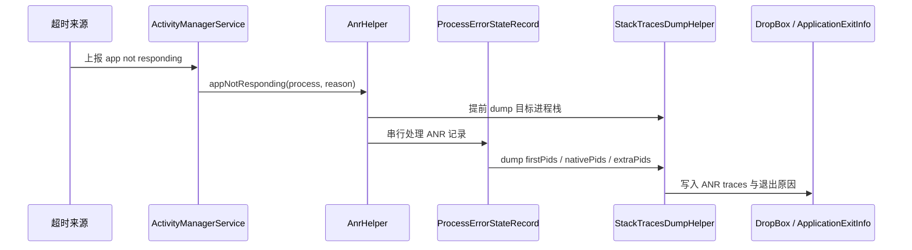

# ANR 监控体系

<!-- outline-start -->
## 本节要点大纲

### 锚点（必须覆盖）

- 🔹 ANR 信号捕获（SIGQUIT）与 traces 采集
- 🔹 ANR 率统计与 Play Vitals 对标
- 🔹 主线程卡顿监控与预警
- 🔹 ANR 快照与现场还原

### 扩展（可选深入）

- 🔸 （待扩展）

### OpenClaw 加工指引

> **锚点**是最低覆盖要求，加工时必须逐条落实并标注验证结果。
> **扩展**视素材丰富程度选择性深入。
> 如果从 Obsidian 素材或 AOSP 源码中发现大纲未列出但与本节强相关的知识点，
> 可**就地插入**最相关的锚点之后，并用 `[自动发现]` 标注，方便后续 review。
> 锚点内容需 L1/L2 验证，扩展内容至少 L2 验证，自动发现内容至少标注来源。
<!-- outline-end -->

## 为什么要做 ANR 监控

ANR 监控解决的是两个问题：用户遇到无响应时能不能被统计到，研发拿到一条记录后能不能还原现场。只看系统弹窗或 Play Console，通常只能知道“发生过 ANR”；只做主线程卡顿监控，又容易把长卡顿误判成系统 ANR。

ANR 监控可以拆成四层：系统 ANR 记录、Play Vitals 指标、端侧卡顿预警、现场快照。系统 ANR 负责确认事件，端侧快照负责补足上下文，Play Vitals 负责提供发布质量红线。ANR 根因分析流程详见 9.3 节，治理策略详见 20.4 节，Crash / ANR 捕获底层实现详见 19.24 节。

## 系统侧 ANR 记录与 traces 采集

系统 ANR 的触发点不在 App SDK 里。输入派发超时、前台 Service 超时、广播超时、ContentProvider 发布超时等路径最终会进入 system_server 的 ANR 处理逻辑。AOSP android-17.0.0_r1 基准里，`ActivityManagerService` 把事件交给 `AnrHelper.appNotResponding()`，再由 `AnrConsumer` 串行处理队列，避免同一个进程重复进入 ANR dump。

`StackTracesDumpHelper` 的 dump 有固定预算：Java 栈通过 `Debug.dumpJavaBacktraceToFileTimeout()` 写入，失败时会尝试 native backtrace；native 进程栈通过 `Debug.dumpNativeBacktraceToFileTimeout()` 补充。源码里还会从 `ProcessCpuTracker` 选出最多两个 CPU 活跃的 Java 进程追加栈信息，用来定位“不是目标进程卡住，但目标进程在等别人”的场景。

老版本监控方案常提到监听 `/data/anr/traces.txt` 或依赖 SIGQUIT 产生 traces。这条路径只能作为历史背景参考：高版本系统对 `/data/anr/` 访问限制增加，端侧 SDK 不能稳定读取系统 ANR 文件；Android 17 基准的 system_server 路径也不等同于“App 自己处理 SIGQUIT”。App 侧更可靠的做法是把系统确认与端侧快照分开：Android 11 及以上用 `ApplicationExitInfo` 读取退出原因与系统 traces，运行期用主线程监控保存自己的现场。

[已验证: AOSP android-17.0.0_r1, frameworks/base/services/core/java/com/android/server/am/AnrHelper.java]
[已验证: AOSP android-17.0.0_r1, frameworks/base/services/core/java/com/android/server/am/ProcessErrorStateRecord.java]
[已验证: AOSP android-17.0.0_r1, frameworks/base/services/core/java/com/android/server/am/StackTracesDumpHelper.java]
[已验证: 官方文档, developer.android.com/topic/performance/vitals/anr]

## Android 11+：用 ApplicationExitInfo 补系统确认

[自动发现] Android 11 引入 `ApplicationExitInfo` 后，ANR 监控多了一条系统确认路径。App 下次启动时可通过 `ActivityManager.getHistoricalProcessExitReasons()` 查询历史退出原因；当 reason 为 `REASON_ANR` 时，再读取 `getTraceInputStream()` 保存系统生成的 traces。这个能力适合补齐“上一次进程已经被系统处理，端侧 SDK 来不及上报”的空洞。

这条路径有三个边界：

- 只能拿到历史退出记录，不能替代运行期预警。用户遇到卡顿但进程恢复时，`ApplicationExitInfo` 未必产生 ANR 退出记录。
- traces 是系统在 ANR 处理时生成的结果，不保证包含业务现场。页面、用户动作、网络请求、实验分组仍要由端侧 SDK 自己保存。
- 记录数量和保留策略由系统控制，端侧读取后应立即转存到私有目录，再进入上报队列。

[已验证: 官方文档, developer.android.com/topic/performance/vitals/anr]
[已验证: AOSP android-17.0.0_r1, frameworks/base/core/java/android/app/ApplicationExitInfo.java]

## ANR 率统计与 Play Vitals 对标

ANR 指标要分两套口径：内部治理口径和 Play Vitals 口径。内部口径面向排查，关注版本、场景、页面、设备、线程状态；Play Vitals 口径面向分发质量，关注 user-perceived ANR rate。

Play 当前把 user-perceived ANR rate 列为 core vitals。公开阈值是：全设备维度，至少 0.47% 日活用户遇到 user-perceived ANR 会进入 bad behavior；单机型维度，至少 8% 日活用户遇到 user-perceived ANR 会进入 per-device bad behavior。Play 用近 28 天数据评估质量，超过阈值可能影响应用在 Google Play 的曝光。

内部指标不应照搬“ANR 次数 / 启动次数”。更稳的拆法是：

| 指标 | 推荐口径 | 用途 |
|---|---|---|
| 用户 ANR 率 | 当日遇到至少一次 ANR 的用户数 / DAU | 与 Play Vitals 口径一致，评估用户伤害 |
| 会话 ANR 率 | 出现 ANR 的前台会话数 / 前台会话数 | 观察发布后回归 |
| 场景 ANR 率 | 某页面或操作下 ANR 用户数 / 进入该场景用户数 | 定位问题入口 |
| 设备 ANR 率 | 设备型号 + Android 版本维度的用户 ANR 率 | 发现 ROM、低端机和特定芯片问题 |
| 可恢复长卡顿率 | 主线程卡住超过阈值但未形成系统 ANR 的会话占比 | 提前预警输入超时风险 |

告警规则按“全量 + 分桶”两层设计。全量指标盯版本发布质量，分桶指标盯机型、系统版本、页面、实验组。某个低端机型超过 8% 的 Play 线，哪怕全量 ANR 率还低，也要按 P1 处理；全量 user-perceived ANR rate 接近 0.47% 时，发版节奏应暂停，先确认增量版本、实验组和场景分布。

[已验证: 官方文档, developer.android.com/topic/performance/vitals/anr]
## 主线程卡顿监控与 ANR 预警

主线程监控的任务不是“判定 ANR”，而是在系统 ANR 之前保存现场。工程上通常用三类信号组合：

- Looper 消息耗时：通过 `Printer` 或框架埋点记录单个 message 的开始、结束、what、callback、target，适合定位主线程被哪个任务占住。
- Choreographer / FrameMetrics / JankStats：记录帧耗时、掉帧和页面状态，适合把“无响应”与渲染卡顿分开。
- 轻量线程快照：在主线程超出阈值时抓取主线程栈、Binder 线程栈、业务线程池栈，适合还原锁等待、Binder 同步调用、磁盘 I/O、数据库事务等现场。

阈值不要只设一个 5s。一个可用的分层策略是：100ms 记录慢消息，300ms 记录页面与用户动作，700ms 抓主线程栈，2s 抓全线程快照并持久化，5s 进入 ANR 疑似事件。阈值要按 App 场景调，不同业务可有不同采样率；相机、地图、游戏这类高负载场景，应单独看前台交互和渲染帧数据。

主线程快照采集要控制成本。全线程 `Thread.getAllStackTraces()` 可能带来停顿，也会放大低端机问题；高频抓栈会污染被观测对象。端侧实现应采用退避策略：同一会话内相同页面只抓有限次数，栈相似时只计数不重复上传，后台态降低采样率。

[已验证: 官方文档, developer.android.com/topic/performance/anrs/diagnose-and-fix-anrs]
[已验证: 官方文档, developer.android.com/topic/performance/anrs/find-unresponsive-thread]
## ANR 快照字段设计

ANR 现场还原依赖快照质量。只上传一段主线程栈，很多问题会停在“主线程在等锁 / 等 Binder / 等 I/O”，但不知道锁被谁拿着、Binder 对端是谁、I/O 对哪个文件发生。快照字段应围绕“时间、线程、资源、场景、环境”设计。

| 字段 | 采集方式 | 排查价值 |
|---|---|---|
| event_id / session_id | 端侧生成，贯穿一次前台会话 | 串起日志、性能指标和崩溃记录 |
| 前台状态 | Activity / Fragment / Compose 页面可见状态 | 区分前台交互 ANR 与后台任务超时 |
| last_user_action | 点击、滑动、返回、输入框编辑等最近动作 | 匹配 input dispatch ANR 的入口 |
| main_thread_stack | 超阈值时抓取主线程栈 | 判断卡在 I/O、锁、Binder、布局、数据库还是业务逻辑 |
| peer_thread_stacks | Binder 线程、持锁线程、线程池活跃任务 | 找到主线程等待的对端 |
| looper_message | message target、callback、耗时、队列积压 | 找到阻塞主线程的任务来源 |
| 帧状态 | 最近 N 帧耗时、掉帧、页面标识 | 区分渲染卡顿与输入无响应 |
| 资源状态 | CPU 忙闲、内存压力、磁盘 I/O、网络状态 | 判断系统负载和低端机放大效应 |
| build_bucket | app 版本、灰度批次、实验组、设备型号、系统版本 | 支持发布回滚和分桶告警 |
| system_exit_info | `ApplicationExitInfo` reason、status、trace 文件摘要 | 补系统确认与历史 traces |

这些字段不要求每次都全量上报。运行期可先写本地 ring buffer；疑似 ANR 出现时把前后 30 到 60 秒的关键记录切出来。系统确认的 ANR 在下次启动补传，和上一段 ring buffer 通过 session_id 关联。

## 现场还原的分析顺序

拿到一条 ANR 记录后，排查顺序应从“是否系统确认”开始，再看主线程当时等什么。

1. 确认事件来源：Play Vitals、`ApplicationExitInfo.REASON_ANR`、端侧疑似 ANR 三者分开标记。只有端侧疑似事件时，先按长卡顿处理。
2. 看 ANR 类型：input dispatch、broadcast、service、provider 的排查入口不同。类型判断详见 9.2 节。
3. 看主线程状态：RUNNABLE 且 CPU 高，优先查主线程计算、布局、序列化；WAITING / BLOCKED，优先查锁、Binder、数据库连接池和线程池饱和。
4. 找等待对端：主线程等待 Binder 时查 reply 线程；等待锁时查持锁线程；等待 I/O 时查文件、数据库、网络和调用栈。
5. 回到发布维度：按版本、实验组、页面、设备、系统版本聚合，确认是新增问题、存量问题恶化，还是特定机型问题。

这个顺序能避免两个常见误判：把每个 5s 长卡顿都叫 ANR，或只盯主线程栈而忽略对端线程。ANR 监控的价值不在于多报几条事件，而在于每条事件都能给出下一步排查动作。

[已验证: 官方文档, developer.android.com/topic/performance/anrs/find-unresponsive-thread]
## 扩展

以下两个场景在多进程和协程项目中常见，作为 ANR 监控的补充边界。

### 多进程 ANR 监控边界

多进程 App 不能只在主进程安装 ANR SDK。播放器、WebView、推送、插件容器、图片编辑等子进程都可能触发系统 ANR，也可能拖住主进程。端侧监控应在每个进程初始化最小采集器：进程名、页面或任务类型、主线程慢消息、线程池状态、最近一次跨进程调用。

上报侧按 process_name 聚合，不要把子进程 ANR 直接归到主进程页面。主进程等待子进程 Binder 返回时，主进程记录的是等待现场，子进程记录的是执行现场，两条记录通过调用 ID、session_id 或时间窗口关联。

### Kotlin Coroutine 与 ANR 现场

协程不会改变 ANR 的系统判定：主线程无法及时处理输入或生命周期回调，仍会进入系统 ANR。协程带来的差异在于现场更容易分散：主线程可能卡在 `runBlocking`、`withContext` 回切、`Mutex`、`Deferred.await()`，对端任务在 `DefaultDispatcher` 或自定义线程池里。

协程项目的 ANR 快照至少记录三类信息：主线程栈、活跃协程调度线程栈、自定义 dispatcher / executor 的队列长度。`Dispatchers.IO` 或 `Default` 中的任务饱和，不会直接判定 ANR；当主线程同步等待这些任务结果时，才会变成用户可感知无响应。Java Crash 与协程异常处理详见 20.2 节，ANR 治理策略详见 20.4 节。

## 小结

ANR 监控要把系统确认、端侧预警和现场快照分层处理。Play Vitals 给发布质量红线，`ApplicationExitInfo` 补系统 ANR traces，主线程监控保存发生前后的上下文。端侧只把“疑似 ANR”当预警，最终分析仍要回到系统原因、主线程状态、等待对端和发布分桶。
