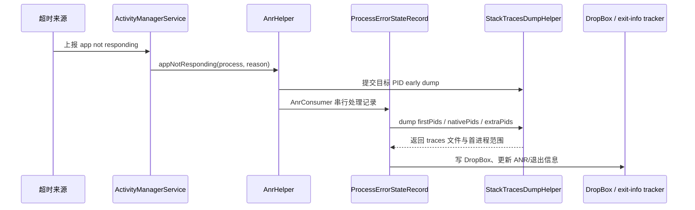

---

title: "ANR 监控体系"
chapter: "26.4"
section: "26.4"
status: "finalized"
applicable_versions: "Android 8 (API 26) - Android 17 (API 37)"
last_verified: "2026-08-04"
last_verified_against: "AOSP android-17.0.0_r1 + Android Developers ANR / Android vitals docs + Clippings structure references"
confidence: medium-high
sources:
- type: aosp
  path: frameworks/base/core/java/android/app/ApplicationExitInfo.java
- type: official
  path: developer.android.com/reference/android/app/ActivityManager#getHistoricalProcessExitReasons(java.lang.String,int,int)
- type: official
  path: developer.android.com/topic/performance/vitals/anr
tags: [anr-monitoring, sigquit, main-thread-monitor, play-vitals, application-exit-info]
related_chapters: ["26.1", "20.4", "9.3", "9.9", "19.19", "19.22"]
consolidated_from:
- src/part2-performance/ch09-anr/9.11-enterprise-anr-monitoring-platform-design.md
pipeline_stage: "ready-to-publish"
task6_state: "reviewed"
task9_state: "reviewed"
task2b_state: "fixed"
---
# 26.4 ANR 监控体系

## ANR 监控解决什么问题

ANR 监控解决的是两个问题：用户遇到无响应时能不能被统计到，研发拿到一条记录后能不能还原现场。只看系统弹窗或 Play Console，通常只能知道“发生过 ANR”；只做主线程卡顿监控，又容易把长卡顿误判成系统 ANR。

ANR 监控可以拆成四层：系统 ANR 记录、Play Vitals 指标、端侧卡顿预警、现场快照。系统 ANR 负责确认事件，端侧快照负责补足上下文，Play Vitals 负责提供发布质量红线。ANR 根因分析流程详见 9.3 节，治理策略详见 20.4 节，Crash / ANR 捕获底层实现详见 19.19 节。

平台源码上界为 Android 17 / API 37 / `android-17.0.0_r1`。ANR 的判定、队列和 trace 生成位于 framework、ART 与 debuggerd 等用户空间组件，不依赖 Android 17 kernel 的专有实现，因此不为这些结论附加 kernel tag。

## 能力与证据分层

同一个“ANR 监控 SDK”在不同权限和系统版本上拿到的证据并不相同。平台应把能力层级写入事件，而不是把缺失字段伪装成同一口径：

| 部署层级 | 可用入口 | 能证明什么 | 主要边界 |
|---|---|---|---|
| 普通 App，Android 8—10 | 主线程哨兵、Looper 历史、自有 breadcrumb | 运行期出现过可疑长卡顿 | 不是系统确认的 ANR，不能读取 `/data/anr` |
| 普通 App，Android 11+ | 上述能力 + `ApplicationExitInfo` | 本 UID 的历史退出与 `REASON_ANR`，trace 可能可读 | 历史接口，不保证实时、完整或始终有 trace |
| 普通 App，Android 17 | 上述能力 + ANR warning、结构化 `AnrInfo` | 部分 deadline 前预警及关联 ID/类型 | API 37、best-effort，覆盖与限流受平台实现约束 |
| system/OEM、root 或 userdebug | DropBox、`/data/anr`、完整日志、statsd、bugreport、Perfetto | 跨 UID 与系统依赖的完整现场 | 需要平台权限、SELinux 策略或调试环境 |

`getProcessesInErrorState()` 返回的是调用时仍处于错误状态的瞬时快照，正常时可以为 `null`；Android 13 起普通应用只能看到本 UID，轮询还可能重复读取或错过快速恢复事件。它适合作为补充信号，不应承担事件账本。`ApplicationExitInfo` 才是 Android 11+ 的历史退出入口，但非空 trace 也不能覆盖真实的 `exit_reason`：进程可能从 ANR 恢复，稍后因其他原因退出，而记录仍附带先前的 ANR trace。

因此事件模型至少要保留 `authority`：系统退出、当前错误状态、Android 17 warning、端侧 suspected stall、Play 聚合或 OEM 系统事件分别入库，之后再关联。ANR warning 只是 deadline 前的 best-effort 信号，不等于系统已经判定 ANR；其 API、`AnrInfo` 和生产者覆盖见 [§9.9 Android 17 ANR 预警回调](../../part2-performance/ch09-anr/09-android17-anr-warning-callback.md)。

## 系统侧 ANR 记录与 traces 采集

系统 ANR 的触发点不在 App SDK 里。输入派发、执行 Service、广播、ContentProvider 查询和 JobService 响应等超时会沿各自路径进入 system_server 的 ANR 处理逻辑；具体时限随 ANR 类型、平台版本和 OEM 实现变化。AOSP `android-17.0.0_r1` 中，`AnrHelper.appNotResponding()` 会拒绝同一 PID 正在预抓、排队或处理的重复记录，提交目标进程的 early dump，再由 `AnrConsumer` 串行调用 `ProcessErrorStateRecord.appNotResponding()`。

下面的时序图只表达 Android 17 system_server 中的主要职责，不把 trace 文件写入与退出历史记录误画成同一个调用。

图中 early dump 与完整处理分开执行，目的是尽早保存目标进程现场，同时避免多个 ANR 同时发生时并发执行整套重型抓栈。

`StackTracesDumpHelper` 对一次完整抓取使用总预算，并乘以 `Build.HW_TIMEOUT_MULTIPLIER`：Android 17 源码中的基础总预算为 20 秒，单个 Native dump 基础预算为 2 秒，early dump 基础预算为 10 秒。Java 路径调用 `Debug.dumpJavaBacktraceToFileTimeout()`；输出失败或过小时再尝试 Native backtrace。`ProcessCpuTracker` 还会从候选 Java 进程中选择最多两个 CPU 活跃进程追加栈，用于发现目标进程等待其他进程的情况。这里的数字是 `android-17.0.0_r1` 实现预算，不是 App 判定 ANR 的通用阈值。

### SIGQUIT 在平台抓栈中的位置

Android 17 的 `Debug.dumpJavaBacktraceToFileTimeout()` 经 JNI 调用 debuggerd Java backtrace 路径。ART 的 `SignalCatcher` 线程通过 `sigwait()` 等待 `SIGQUIT`，随后执行 `Runtime::DumpForSigQuit()` 并把结果写给 tombstoned。它不是在主线程安装普通 signal handler，也不是给 App SDK 的“ANR 已确认”回调。

第三方 SDK 不应抢占、吞掉或自行解释平台的 `SIGQUIT`。新系统会把 ANR trace 写入 `/data/anr/anr_*`，普通应用不能直接读取该目录；具备 root/调试条件的设备可以用 adb 获取，线上 App 则把系统确认与端侧预警分开处理：API 30 及以上查询 `ApplicationExitInfo`，运行期通过低成本主线程监控保存自己的上下文。

## Android 11+：用 ApplicationExitInfo 补系统确认

Android 11 引入 `ApplicationExitInfo` 后，App 可以在后续进程启动时通过 `ActivityManager.getHistoricalProcessExitReasons()` 查询退出历史。`REASON_ANR` 是系统确认 ANR 的直接证据，`getTraceInputStream()` 则可能返回进程死亡前保存的 trace。两者不能用一条 `reason == REASON_ANR` 分支简单绑定：如果进程从 ANR 中恢复，后来又因其他原因退出，ANR trace 可能附在后一次退出记录上。因此，采集器应按时间倒序检查尚未处理的记录，保留系统给出的实际 reason，并独立判断 trace 是否存在。

这条路径有四个边界：

- 这是历史查询接口，不提供实时 ANR 回调。用户遇到卡顿后进程恢复，当前进程仍需依赖运行期快照保存现场。
- trace 使用独立的系统级环形缓冲区，新的崩溃或 ANR（包括其他应用产生的记录）可能覆盖旧内容，`getTraceInputStream()` 允许返回 `null`。发现可读流后，应立即在字节上限内复制到应用私有目录，关闭输入流，并记录文件大小与摘要；不能把系统侧流当作长期归档。
- trace 主要提供线程和进程现场，不包含完整业务语义。页面、经过脱敏的用户动作、请求阶段和实验分组仍需由端侧采集器保存。
- API 31 及以上的 Native crash 记录也可能通过该接口返回 protobuf tombstone。消费端要连同 reason 识别数据类型，不能把所有非空 trace 都标成 ANR。

## ANR 率统计与 Play Vitals 对标

ANR 指标要分两套口径：内部治理口径和 Play Vitals 口径。内部口径面向排查，关注版本、场景、页面、设备、线程状态；Play Vitals 口径面向分发质量，关注 user-perceived ANR rate。

Play 当前把 user-perceived ANR rate 列为 core vital。官方口径中，只有 `Input dispatching timed out` 计入 user-perceived ANR；它不等于应用全部 ANR。公开 bad behavior 阈值为：全设备维度至少 0.47% 的日活用户遇到 user-perceived ANR，单机型维度至少 8%。Google Play 通常依据最近 28 天数据评估质量，指标突增时也可能更早采取措施；超过阈值会影响应用在 Google Play 的可发现性。

Play 的“用户”按设备和自然日去重：同一账号在两台设备上会计为两个日活用户，同一设备上的多个账号计为一个。Android vitals 又以从 Google Play 安装、通过 Play 认证且选择共享使用情况与诊断信息的设备数据为基础。内部用户 ANR 率可以采用相同分子、分母定义以便比较趋势，但不能宣称与 Play Console 数值逐条对齐。

内部指标不应照搬“ANR 次数 / 启动次数”。更稳的拆法是：

| 指标 | 推荐口径 | 用途 |
|---|---|---|
| 用户 ANR 率 | 当日遇到至少一次 ANR 的设备用户数 / DAU | 接近 Play 的聚合方式，评估用户影响 |
| 用户感知 ANR 率 | 当日遇到至少一次输入派发超时 ANR 的设备用户数 / DAU | 对标当前 Play core vital 的事件类型 |
| 会话 ANR 率 | 出现 ANR 的前台会话数 / 前台会话数 | 观察发布后回归 |
| 场景 ANR 率 | 某页面或操作下 ANR 用户数 / 进入该场景用户数 | 定位问题入口 |
| 设备 ANR 率 | 设备型号 + Android 版本维度的用户 ANR 率 | 发现 ROM、低端机和特定芯片问题 |
| 可恢复长卡顿率 | 主线程卡住超过阈值但未形成系统 ANR 的会话占比 | 提前预警输入超时风险 |

告警规则按“全量 + 分桶”两层设计。全量指标观察版本发布质量，分桶指标观察机型、系统版本、页面和实验组。0.47% 与 8% 是 Play 的 bad behavior 阈值，不应直接充当企业内部的 P1/P2 分级线。内部告警应结合历史基线、版本增量、曝光量与统计置信度设定，并在指标逼近 Play 阈值前触发人工判断；是否暂停发布，还要结合增量版本、实验组和场景分布确认影响范围。

## 主线程卡顿监控与 ANR 预警

主线程监控在系统 ANR 之前保存现场，不负责判定系统 ANR。工程上通常用三类信号组合：

- Looper 消息耗时：`Looper.setMessageLogging(Printer)` 可以观察消息派发的开始和结束，但打印文本不是稳定的结构化协议，后安装的 `Printer` 也可能与已有监控冲突。需要 what、callback、target 等字段时，应使用经过版本验证的框架埋点或应用自己的调度包装，并准备降级路径。
- Choreographer / FrameMetrics / JankStats：记录帧延迟与页面状态，补充用户看到的渲染表现。它们只覆盖参与渲染的帧，不能证明每一次长卡顿都已达到系统 ANR 条件。
- 轻量线程快照：在主线程超出阈值时抓取主线程栈、Binder 线程栈、业务线程池栈，适合还原锁等待、Binder 同步调用、磁盘 I/O、数据库事务等现场。

阈值应分层，但没有适用于所有应用的固定时间表。可以依次设置“记录慢任务”“抓主线程栈”“补充有限的相关线程”“持久化疑似事件”几个阶段，具体时限由消息或任务预算、设备性能分布、屏幕刷新率、系统 ANR 类型和误报成本共同决定。官方给出的 AOSP/Pixel 输入派发默认超时可帮助理解系统行为，OEM 仍可能调整；它不应成为端侧采集器唯一的五秒倒计时。

监控时长要使用单调时钟，避免墙上时钟跳变。看门狗线程也可能因 CPU 饥饿或调度延迟而晚醒，因此“观察到的阻塞时长”要连同进程 CPU、系统负载和采样延迟一起解释。

主线程快照采集要控制成本。全线程 `Thread.getAllStackTraces()` 可能带来停顿，也会放大低端机问题；高频抓栈会扰动被观测进程。端侧实现应采用退避和字节预算：同一会话、同一页面只保留有限样本，栈摘要相同时累加计数，应用进入后台后降低频率。相关线程优先由锁、Binder 调用或自有线程池线索选择，避免每个阶段都遍历全部线程。

## ANR 快照字段设计

ANR 现场还原依赖快照质量。只上传一段主线程栈，很多问题会停在“主线程在等锁 / 等 Binder / 等 I/O”，但不知道锁被谁拿着、Binder 对端是谁、I/O 对哪个文件发生。快照字段应围绕“时间、线程、资源、场景、环境”设计。

| 字段 | 采集方式 | 排查价值 |
|---|---|---|
| event_id / session_id | 端侧生成，贯穿一次前台会话 | 串起日志、性能指标和崩溃记录 |
| 前台状态 | Activity / Fragment / Compose 页面可见状态 | 区分前台交互 ANR 与后台任务超时 |
| last_user_action | 点击、滑动、返回等经过脱敏的动作类型，不记录输入文本 | 匹配 input dispatch ANR 的入口并控制隐私风险 |
| main_thread_stack | 超阈值时抓取主线程栈 | 判断卡在 I/O、锁、Binder、布局、数据库还是业务逻辑 |
| peer_thread_stacks | Binder 线程、持锁线程、线程池活跃任务 | 找到主线程等待的对端 |
| looper_message | 可观测时记录任务标识、单调时钟耗时和队列摘要 | 找到阻塞主线程的任务来源 |
| 帧状态 | 有界的近期帧耗时摘要、掉帧和页面标识 | 区分渲染卡顿与输入无响应 |
| 资源状态 | 可获得时记录 CPU、内存压力、磁盘 I/O 和网络状态 | 判断系统负载和设备性能的影响 |
| build_bucket | app 版本、灰度批次、实验组、设备型号、系统版本 | 支持发布回滚和分桶告警 |
| system_exit_info | `ApplicationExitInfo` 的实际 reason、status、description、时间戳和 trace 摘要 | 补系统确认并防止误标事件类型 |

这些字段不要求每次都全量上报。运行期可先写本地 ring buffer；疑似 ANR 出现时按可配置的时间窗与字节上限截取关键记录。后续拿到退出历史时，再以进程、时间戳、session_id 和 trace 摘要做关联；关联失败的记录保持独立，不能为了得到完整事件而强行拼接。

## 事件、落盘与去重

设备侧应把“事实”和“推断”分开保存。最小事件 envelope 包含稳定 `event_id`、`schema_version`、`event_kind`、`authority`、设备与应用构建、进程身份、观测时间、原始附件摘要，以及独立的 `derived` 区域。服务端解析器只能版本化地填写 `derived`，不能改写退出原因、原始时间戳或附件 digest。

ANR 发生时主线程已不可依赖，进程也可能很快被杀。平稳期维护有界 ring buffer，故障时只冻结索引与少量元数据；本地 spool 按证据价值分级：

| 优先级 | 内容 | 策略 |
|---|---|---|
| P0 | 系统 exit、warning key、trace/profile manifest | 独立配额；durable write 后才推进查询游标 |
| P1 | 主线程哨兵、有限重复栈 | 每进程/场景限频，合并同一 episode |
| P2 | breadcrumb、资源趋势、普通样本 | 环形覆盖，拥塞时优先丢弃 |

spool 还要限制总容量、单文件大小、文件数和保留期，提供 checksum、schema version、截断恢复与多进程写入策略。上传使用 at-least-once 语义、指数退避和随机抖动；服务端确认后再删除，响应丢失时依靠稳定 event id 安全重传。

去重分三层进行：传输层按 event id 与附件 digest 幂等；事故层用 Android 17 的 `(anrType, anrId)` 或带时间约束的进程身份关联 warning、watchdog 与 exit；问题层在符号化后按 detector、主线程卡点、锁/Binder 对端和构建版本聚类。关联后的信号仍保留各自 authority，避免把一场事故的 warning、疑似卡顿和系统退出计成三次 ANR。

## 服务端闭环与治理

完整链路通常由接入网关、原始事件库、附件对象存储、R8/native 符号服务、可重放解析器、版本化聚类、指标告警和诊断工作台组成。组件选型可以变化，数据契约不能含糊：原始附件不可丢，parser 与 cluster revision 可追溯，解析失败可重放，mapping 按 versionCode/mapping id、native 符号按 build id 精确匹配。

候选归因必须保存 `supporting_evidence[]`、`contradictions[]`、`missing_evidence[]` 与规则版本。只有 `BinderProxy.transact()` 栈不能证明服务端慢，只有 iowait 或 fault 不能证明存储根因，只有 load 也不能证明 CPU 饥饿。机器学习更适合在稳定 schema、符号化和人工标签之后做候选排序，不应直接改工单归属或自动回滚。

指标至少区分系统确认 ANR、受影响用户、user-perceived ANR、warning 后恢复、suspected stall、trace/profile 可用率和符号化成功率。自建平台与 Play Vitals 的数据来源、采样和分母不同，趋势可以对照，数值不能合并成一条“统一 ANR 率”。

trace、breadcrumb、URL、文件路径、Intent 和线程名都可能含敏感信息。设备侧优先保存枚举 scene id，去除 URL query/fragment，不上传输入文本、账号、token 或完整 extras；原始 trace、R8 mapping 和 native symbols 使用独立权限、保留期、下载审计与删除流程。远程诊断配置必须带签名、TTL、目标 cohort、采样和资源上限，并只执行预编译 allowlist 能力。

建设顺序应先稳定 authority、事件 ID、隐私字段与原始事件库，再接 `ApplicationExitInfo`、有界 breadcrumb/哨兵、符号服务与聚类，随后对接 Play 发布维度；Android 17 warning/`AnrInfo` 和 Profiling trigger 按版本加入，OEM trace/DropBox/Perfetto 放在独立特权能力层。验证至少覆盖 CPU 循环、monitor、Binder、I/O/reclaim、各类组件超时、ANR 后恢复/被杀、多进程、离线重传、trace 被覆盖及 SDK 自身资源回归。

## 现场还原的分析顺序

拿到一条 ANR 记录后，排查顺序应从“是否系统确认”开始，再看主线程当时等什么。

1. 确认事件来源：Play Vitals、`ApplicationExitInfo.REASON_ANR`、端侧疑似 ANR 三者分开标记。只有端侧疑似事件时，先按长卡顿处理。
2. 看 ANR 类型：input dispatch、broadcast、service、provider 的排查入口不同。类型判断详见 9.2 节。
3. 看主线程状态：Java 栈里的 `RUNNABLE` 只表示线程具备运行条件，不能单独证明它持续占用 CPU；还要结合 Perfetto 调度切片、CPU 计数或持续采样判断。`BLOCKED` 指向 monitor 竞争，`WAITING` / `TIMED_WAITING` 则需结合栈顶调用判断是在等锁、Binder、条件变量、数据库连接还是线程池结果。
4. 找等待对端：主线程等待 Binder 时查 reply 线程；等待锁时查持锁线程；等待 I/O 时查文件、数据库、网络和调用栈。
5. 回到发布维度：按版本、实验组、页面、设备、系统版本聚合，确认是新增问题、存量问题恶化，还是特定机型问题。

这个顺序可以减少两个常见误判：把每个固定时长的卡顿都叫 ANR，或只盯主线程栈而忽略对端线程。ANR 监控的价值不在于多报几条事件，而在于每条事件都能给出下一步排查动作。

## 扩展

以下两个场景在多进程和协程项目中常见，作为 ANR 监控的补充边界。

### 多进程 ANR 监控边界

多进程 App 不能只在主进程安装 ANR SDK。播放器、推送、插件容器和图片编辑等应用进程都可能触发系统 ANR，也可能拖住主进程。对允许执行应用初始化代码的普通子进程，可以安装最小采集器：进程名、任务类型、主线程慢消息、线程池状态和最近一次跨进程调用。isolated process 还受权限和文件访问约束，应通过受控 IPC 把必要摘要交给宿主，不能假设它与主进程共享全部采集能力。

上报侧按 process_name 聚合，不要把子进程 ANR 直接归到主进程页面。主进程等待子进程 Binder 返回时，主进程记录的是等待现场，子进程记录的是执行现场，两条记录通过调用 ID、session_id 或时间窗口关联。

WebView renderer 是单独边界：应用不能在该 renderer 内安装通用采集器。API 29 及以上可在宿主侧通过 `WebViewRenderProcessClient.onRenderProcessUnresponsive()` 观察 renderer 对某个 WebView 未响应，并用 `onRenderProcessResponsive()` 识别恢复；回调可能重复，renderer 也可能被多个 WebView 共享。这是 WebView 渲染进程信号，不等于 system_server 已确认宿主 App 发生 ANR。若选择终止 renderer，还必须为所有受影响的 WebView 正确处理 `WebViewClient.onRenderProcessGone()`。

### Kotlin Coroutine 与 ANR 现场

协程不会改变 ANR 的系统判定：主线程无法及时处理输入或生命周期回调，仍会进入系统 ANR。协程带来的差异在于现场更容易分散：主线程可能卡在 `runBlocking`、`withContext` 回切、`Mutex`、`Deferred.await()`，对端任务在 `DefaultDispatcher` 或自定义线程池里。

协程项目的 ANR 快照至少保留主线程栈，并在可观测时补充调度线程栈与自定义 dispatcher / executor 的队列摘要。Kotlin 公共 API 不保证应用可以在 release 环境安全枚举全部活跃协程；没有稳定观测接口时，应保留线程栈和业务任务标识，避免依赖调试探针作为线上必选项。`Dispatchers.IO` 或 `Default` 中的任务饱和不会直接触发系统 ANR；主线程等待任务结果或回调无法及时执行时，才形成与 ANR 相关的现场。Java Crash 与协程异常处理详见 20.2 节，ANR 治理策略详见 20.4 节。

## 小结

ANR 监控要把系统确认、端侧预警和现场快照分层处理。Play Vitals 给发布质量红线，`ApplicationExitInfo` 补系统 ANR traces，主线程监控保存发生前后的上下文。端侧只把“疑似 ANR”当预警，最终分析仍要回到系统原因、主线程状态、等待对端和发布分桶。

## 参考资料

- [ANR：Android vitals](https://developer.android.com/topic/performance/vitals/anr)
- [诊断并修复 ANR](https://developer.android.com/topic/performance/anrs/diagnose-and-fix-anrs)
- [`ApplicationExitInfo` API](https://developer.android.com/reference/android/app/ApplicationExitInfo)
- [`WebViewRenderProcessClient` API](https://developer.android.com/reference/android/webkit/WebViewRenderProcessClient)
- [Google Play 技术质量说明](https://support.google.com/googleplay/android-developer/answer/9844486)
- [AOSP Android 17：`AnrHelper`](https://android.googlesource.com/platform/frameworks/base/+/refs/tags/android-17.0.0_r1/services/core/java/com/android/server/am/AnrHelper.java)
- [AOSP Android 17：`ProcessErrorStateRecord`](https://android.googlesource.com/platform/frameworks/base/+/refs/tags/android-17.0.0_r1/services/core/java/com/android/server/am/ProcessErrorStateRecord.java)
- [AOSP Android 17：`StackTracesDumpHelper`](https://android.googlesource.com/platform/frameworks/base/+/refs/tags/android-17.0.0_r1/services/core/java/com/android/server/am/StackTracesDumpHelper.java)
- [AOSP Android 17：ART `SignalCatcher`](https://android.googlesource.com/platform/art/+/refs/tags/android-17.0.0_r1/runtime/signal_catcher.cc)
