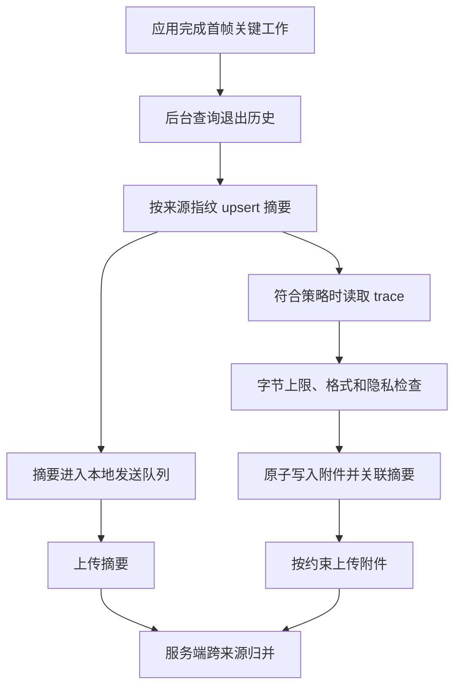

# 26.8 ApplicationExitInfo 与进程退出归因

`ApplicationExitInfo` 是 Android 保存的近期进程退出记录，提供系统对退出事件的分类与现场信息。进程可能来不及执行崩溃采集 SDK 的回调，Android 仍可保存退出原因（`reason`）、退出状态（`status`）、进程重要性（`importance`）、时间、最近一次内存采样和部分跟踪记录（trace）。Android 11 / API 30 起，应用可以在新进程启动后查询这些记录，用于分类崩溃、应用无响应（ANR）、低内存终止、用户操作和包状态变化。

本文核对的源码来自 Android 开放源代码项目（AOSP）的 Android 17 / API 37 / `android-17.0.0_r1` 标签。相关内容集中在 Android 框架和应用接口，不涉及某个 Linux 内核版本特有的机制，所以无需记录内核标签（kernel tag）。`ApplicationExitInfo` 的历史容量有限，字段也可能缺失。它需要与崩溃采集 SDK、ANR 监控和原生代码符号化（把程序地址还原为函数或源码位置）配合使用，单独一条退出记录无法证明某段业务代码就是退出原因。

## 进程退出归因的观测目标

Java 崩溃处理器记录未捕获异常，原生崩溃 SDK 记录操作系统信号（signal）和自身生成的现场，ANR 监控记录主线程状态与系统超时。`ApplicationExitInfo` 在进程结束后补充系统记录。服务端要保存各来源的原始事件，再依据进程、时间、构建和现场特征归并；直接相加会把同一次故障重复计数。

一条退出记录至少要回答六个问题：

| 问题 | 字段或来源 | 用途 |
| --- | --- | --- |
| 哪个进程退出 | 查询包名、`processName`、`pid`，以及 package UID、real UID、defining UID | 区分主进程、独立进程和外部服务进程；UID 是 Linux 用来区分应用身份与权限的用户标识 |
| 系统怎样分类 | `reason`、`status`、`description` | 区分 Java 崩溃、原生崩溃、ANR、低内存和用户或包状态变化 |
| 退出前的重要性 | `importance` 与应用自己保存的前后台场景 | 估计用户影响；`importance` 不等同某个页面的生命周期 |
| 何时退出 | `timestamp`、构建与配置版本、应用本地事件 | 关联发布、配置变更和用户反馈 |
| 可用的内存证据 | `pss`、`rss` 与应用最近一次资源摘要 | PSS 是按比例分摊共享页后的物理内存，RSS 是包含共享页的驻留物理内存；两者都是最近一次系统采样，可能为 0 |
| 是否有系统附件 | `traceInputStream`、Android 17 的 `AnrInfo` | 补充 ANR 跟踪记录或 tombstone（系统生成的原生崩溃现场文件）；附件和结构化信息都可能缺失 |

package UID 是安装包被分配的 UID；real UID 是进程实际运行时使用的内核 UID，隔离进程中两者可能不同；defining UID 在外部服务使用应用 Zygote（预先加载运行环境并派生应用进程的模板进程）时标识服务提供方。普通单进程应用里这些值常常相同，多进程和外部服务场景仍要分别保留。

公开 `ApplicationExitInfo` 没有 `getSubReason()`。AOSP 服务内部的细分原因（subreason）不属于第三方应用可读取的 SDK 合约，也不应成为普通应用数据结构（schema）的必填字段。`description` 只供人阅读，系统不保证它在不同设备或版本上的格式稳定，服务端不能依靠解析字符串恢复内部 subreason。

退出归因还要区分事件分类与产品严重度。`REASON_CRASH`、`REASON_CRASH_NATIVE` 和 `REASON_ANR` 通常可直接进入内部稳定性事件流；`REASON_LOW_MEMORY` 要结合 `importance` 和场景判断；用户、包更新、权限与多用户状态变化通常作为时间线背景。计算指标前必须跨来源去重，并明确分子、分母和“用户可感知”的定义。

## API 30+ 的 ApplicationExitInfo

Android 11 引入 `ActivityManager.getHistoricalProcessExitReasons(packageName, pid, maxNum)`。结果按时间从新到旧排列：

- `packageName = null` 匹配调用者 UID 下的包；查询其他 UID 的包需要系统级 `DUMP` 权限，普通第三方应用不能依赖这种能力。
- `pid = 0` 表示不按进程 ID（PID）过滤。PID 会被系统复用，不能单独作为跨进程启动周期的事件 ID。
- `maxNum = 0` 表示返回当前仍保留的全部匹配记录，历史范围仍受系统容量限制。
- 通过 `BIND_EXTERNAL_SERVICE` 绑定的外部服务进程也可能出现在调用包的退出记录中，归因时要保留进程名与 UID 字段。

公开文档只承诺历史信息位于环形缓冲区（ring buffer，容量满后会淘汰旧记录）。AOSP `android-17.0.0_r1` 的默认资源 `config_app_exit_info_history_list_size` 是每包 16 条，但设备厂商可以覆盖这个资源值，它不属于 SDK 合约。Android 17 的 `AppExitInfoContainer` 使用 `ArrayList<ApplicationExitInfo>`，容量超限时删除时间最早的记录；同一 PID 可以保留多次退出。因此，基于旧实现得出的“以 PID 为键，同一 PID 必然覆盖”不适用于该标签。

这段代码只读取轻量元数据，不在调用线程复制 trace。调用应放到应用自己的 I/O 执行器（executor）中；`maxNum = 0` 读取系统当前保留的记录，服务端或本地处理游标（记录已处理位置）负责去重。

```kotlin
@RequiresApi(Build.VERSION_CODES.R)
fun readExitSummaries(
    context: Context,
    maxNum: Int = 0
): List<ExitSummary> {
    require(maxNum >= 0)

    val activityManager = context.getSystemService(ActivityManager::class.java)
    val records = activityManager.getHistoricalProcessExitReasons(
        context.packageName,
        0,
        maxNum
    )

    return records.map { info ->
        val anrInfo = if (Build.VERSION.SDK_INT >= 37) info.anrInfo else null
        ExitSummary(
            processName = info.processName,
            pid = info.pid,
            reason = info.reason,
            status = info.status,
            importance = info.importance,
            timestampMs = info.timestamp,
            pssKb = info.pss,
            rssKb = info.rss,
            description = info.description,
            processStateSummary = info.processStateSummary,
            anrId = anrInfo?.anrId,
            anrType = anrInfo?.anrType,
            anrTimeoutMs = anrInfo?.timeoutMillis,
            anrUserPerceptible = anrInfo?.isUserPerceptible
        )
    }
}
```

`ExitSummary` 是项目自定义的数据传输对象（DTO），只负责在层之间传递退出摘要。`description` 只能用于受控明细，不能参与稳定分组；`processStateSummary` 与 ANR 字段都可能为 `null`。查询会通过 Binder 进行进程间通信，批量返回的对象也会占用内存，所以不能在首帧关键路径同步执行。

`reason` 是分类主字段，`status` 的解释取决于 `reason`：进程调用 `exit()` 时，它保存退出码；进程因操作系统信号结束时，它保存信号编号。业务协议应保存 SDK 枚举值与采集设备的 API 级别，不要自行复制 `reason` 的整数常量。

部分设备不支持低内存终止（LMK）分类上报，应先调用 `ActivityManager.isLowMemoryKillReportSupported()`。在不支持的设备上，内存压力终止可能表现为 `REASON_SIGNALED`，且 `status` 为 `SIGKILL`。即使设备支持，`REASON_LOW_MEMORY` 也只说明系统当时存在内存压力，无法单独证明应用存在内存泄漏。

`importance` 记录进程死亡前的系统重要性级别，可以区分前台、前台服务、可见、服务、缓存等进程状态，但不能恢复具体页面。应用仍要保存最近场景、最近一次 Activity 恢复（resume）、首帧是否完成和升级迁移状态。

PSS/RSS 是系统最近一次采样，进程在采样前死亡时可能为 0。服务端应把 0 标记为“不可用”，不能插值，也不能视为进程死亡时刻的精确内存。`timestamp` 来自可被校时调整的墙上时钟（wall clock）；应用性能事件常用只向前递增的单调时钟（elapsed time）。关联两类时间戳时，要使用应用记录的 wall/elapsed 校准点，不能直接相减。

`ActivityManager.setProcessStateSummary()` 可保存最多 128 字节的应用状态，系统可能限制高频调用并抛出 `RuntimeException`。这里适合保存不含个人数据的场景码、实验或配置版本和短状态位，不适合恢复界面，也不能保存账号、令牌或自由文本。只在状态变化时更新，并把服务端实验分组记录（assignment）作为实验归属的权威来源。

## ANR 与原生崩溃的现场关联

`getTraceInputStream()` 从 API 30 开始存在，常见内容是系统 ANR 跟踪记录。Android 12 / API 31 起，`reason` 为 `REASON_CRASH_NATIVE` 时可返回符合 AOSP `tombstone.proto` 的 Protocol Buffers（protobuf，一种二进制结构化数据格式）。ANR 文本与 tombstone protobuf 的格式不同，不能根据文件扩展名或“流非空”统一按文本解析。

trace 还有三个容易误判的边界：

- trace 保存在独立的系统级环形缓冲区，可能被包括其他应用在内的新记录覆盖，因此返回 `null` 属于允许的结果。
- 应用发生 ANR 后恢复，又因其他原因退出时，之前的 ANR trace 可能附在后一次退出记录上。实际退出原因与附件类型必须分别保存。
- 读取流会发生输入/输出（I/O）操作；应用应在后台按字节上限复制到私有临时文件，校验写入成功后再发布为待上传附件。超过配额、解析失败和缺失都要作为明确状态上报。

ANR 事件可以按以下证据关联：

1. 应用轻量监控记录主线程停顿、页面、操作，以及同一单调时钟上的 I/O 和网络摘要。
2. 后续进程读取历史退出记录，保留 `reason`、进程名、`timestamp`、`importance` 和 trace 是否存在。
3. 服务端在允许的时间误差内，用进程、构建、场景和堆栈特征寻找同一事件的候选来源；无法唯一匹配时保留多条事件，不强行合并。
4. 取得系统 trace 后再分析锁等待、Binder、I/O、调度、垃圾回收（GC）与消息执行。一次采样堆栈不能独立证明根因。

Android 17 / API 37 的 `getAnrInfo()` 还提供 ANR ID、类型、系统等待的超时时长和 `isUserPerceptible()`。其中 `isUserPerceptible()` 表示系统是否向用户显示了 ANR 对话框。`AnrInfo` 只在 `reason` 为 `REASON_ANR` 时才可能存在；旧版本不能通过解析 `description` 构造等价字段。ANR ID 只保证在同一种 ANR 类型内唯一，跨类型或跨数据源去重仍要带上类型、进程和时间。

API 37 还增加 `ActivityManager.registerAnrWarningListener()`。它会在应用接近 ANR 超时时尽力回调，执行回调的 executor 不应使用主线程。该回调可能不执行，也可能没有足够时间完成工作，只适合写入已经预分配的轻量摘要或触发受控采集，不能作为 ANR 覆盖率保证。

原生崩溃事件可以把 Crashpad、Breakpad 或自研 SDK 生成的小型转储（minidump）及事件封装（envelope），与 `REASON_CRASH_NATIVE` 对应的 tombstone 作为独立原始来源。服务端用构建 ID、应用二进制接口（ABI）、操作系统信号、故障地址（fault address）、崩溃线程和符号化后的栈顶帧匹配候选。SDK 现场缺失时，tombstone 可以补充证据；tombstone 缺失时也要保留 SDK 事件，不能因为某个附件不存在而删除事故记录。

Play Console、Crashlytics 与自研应用性能监控（APM）各有不同的安装来源、采样、去重和用户口径，`ApplicationExitInfo` 则保存系统的近期进程记录。同一次崩溃或 ANR 可能出现在多个来源，统一报表必须先归并事件，并保留来源事件 ID 列表（`source_event_ids`）与归并置信度。

## Android 11 以下的替代路径

API 29 及以下没有公开的历史退出原因 API。应用可以保存退出前状态并在下次启动生成“异常退出候选”，但无法可靠区分 `SIGKILL`、低内存终止、系统重启、厂商进程管理和用户移除任务。

低版本可用路径如下：

| 目标 | 低版本方案 | 边界 |
| --- | --- | --- |
| Java 崩溃 | `Thread.UncaughtExceptionHandler` 写入最小事件封装，并继续调用原处理器 | 内存不足（OOM）、磁盘故障或进程快速终止时可能写不完 |
| 原生崩溃 | 用 `sigaction` 注册信号处理器，准备备用信号栈和预留资源，或采用经验证的 Crashpad/Breakpad | 信号处理器只能调用异步信号安全（async-signal-safe，即允许在信号处理器中安全调用）的函数；还要正确转交给已有处理器 |
| ANR | 主线程 Looper（消息循环）的消息耗时、线程采样、用户明确协助生成的系统诊断包（bug report） | 应用自建看门狗（watchdog）只能观察卡顿，不代表系统已经判定 ANR；普通应用无权读取 `/data/anr/` |
| 低内存或系统终止 | 启动标记、前后台状态、周期性内存摘要 | `SIGKILL` 不可捕获，结果只能标为候选原因 |
| Java 堆诊断 | 调试环境使用公开堆转储；生产环境只在严格采样和授权下采用经验证方案 | HPROF（Java 堆转储文件）体积大且敏感，会增加内存、I/O 和存储压力 |

低版本方案依赖提前保存的轻量状态。应用启动时写入带设备启动周期和应用会话标识的 `launch_started`，业务达到可用状态后写入 `launch_finished`；Java 崩溃处理器只追加最小 `crash_pending`。下次启动发现未完成标记时，先生成“上次进程未完成启动”的候选，再结合设备是否重启、应用是否升级、最近前后台状态与内存摘要分类。

系统或应用崩溃可能发生在标记落盘中途，状态文件需要原子替换、版本号和校验。标记还会受清除数据、备份恢复和时钟变化影响，不能把一次残留标记直接计为 LMK。

开源内存监控库 KOOM 采用的一类 fork-dump（派生子进程执行转储）方案会暂停 Android Runtime（ART），通过 `fork` 创建子进程，再由子进程生成 HPROF。它依赖 ART 私有符号、动态链接和特定版本兼容代码，不属于 Android SDK 能力。若项目采用此类方案，应把支持版本、厂商系统（ROM）验证、失败回退、隐私、磁盘峰值和停用开关作为准入条件；Android 17 的正式发布构建不能因为兼容旧版本而默认启用私有 ART 依赖。

API 30+ 仍可保留轻量状态机，用来提供业务场景和发现系统记录缺失，但 reason 以公开系统字段为主。低版本状态机只能输出带置信度的候选类别。

### 低版本证据等级与统一事件模型

Android 5–10 的退出推断必须把结论、置信度和原始证据分开保存。一个未闭合的会话标记只说明上次进程没有完成预期写入，不能区分 `SIGKILL`、LMK、设备重启、用户停止、包更新或写盘失败。建议使用下面的证据等级：

| 应用结论 | 最低证据 | 对外口径 |
| --- | --- | --- |
| `JAVA_CRASH_CONFIRMED` | 完整未捕获异常记录可对应上一会话 | 应用确认的 Java 崩溃 |
| `NATIVE_CRASH_CONFIRMED` | 完整 minidump 或经校验的信号报告 | 应用确认的原生崩溃 |
| `ANR_CONFIRMED_EXTERNAL` | Play、bugreport 或厂商系统 trace 可与会话匹配 | 外部平台确认的 ANR |
| `ANR_SUSPECTED` | watchdog 连续保存主线程与调度现场 | 应用观测到卡死，不等于系统 ANR |
| `LOW_MEMORY_SUSPECTED` | 会话未闭合且退出前内存、线程、文件描述符（FD）或堆证据异常 | 疑似内存压力，不写成低内存终止守护进程（LMKD）已确认 |
| `ABNORMAL_END_UNKNOWN` | 只有未闭合标记，或多类证据冲突 | 原因未知 |

统一数据域中，`system_reason_code` 只接收 API 30+ `ApplicationExitInfo` 的公开 `reason`；`legacy_reason` 只接收应用规则结论；`reason_source` 区分 `android_system`、`external_platform`、`app_confirmed` 和 `app_inferred`。两类原因不能用 `coalesce()`（返回第一个非空值的数据库函数）合成一个字段，否则会丢失证据来源。事件还应保留 `session_id`、`process_name`、设备启动周期、前一进程启动的单调时间、发现旧会话的时间、`confidence`、原始证据数组 `evidence[]`、附件引用、采集器与规则版本。

低版本没有可靠退出时间，下一次启动时间只表示何时发现旧会话未闭合。PID 也会复用；关联时应使用会话、进程、构建、设备启动周期和证据指纹（evidence fingerprint，由多项稳定特征生成的匹配键）。外部 ANR 或崩溃记录无法唯一匹配时，保留候选及分数，不要为了生成一个统一事件而丢掉来源关系。

调试环境中的 `/data/anr/`、系统事件日志、`dumpsys`（导出系统服务状态的诊断命令）和 LMKD 记录可以补充证据，但普通发布包不能把它们当成稳定的生产接口。KOOM 一类 fork-dump 方案只能在进程仍有执行机会时保存 Java 堆现场，并依赖 ART 私有实现；这类记录可以进入 `evidence[]`，但不能把疑似内存压力升级为系统确认。所有 minidump、HPROF、内存映射（maps）、线程栈和日志附件都要分别控制采样、存储、加密、访问和删除。

## 端侧存储与上报设计

退出历史容量有限，应用需要在后续活跃进程中及时查询，但查询和附件 I/O 不应进入首帧关键路径。可以在应用可交互后由后台 executor 读取轻量元数据，再由受系统调度约束的任务处理 trace 与上传。

流程图把元数据与大附件分开处理。trace 复制失败不会阻止退出摘要进入队列；上传成功后仍保留来源键（key），避免下一次启动重复计数。图中的 upsert 表示“来源指纹已存在则更新，不存在则插入”。



系统稍后可能为已有记录补上 ANR trace，因此这里需要 upsert。若本地只保存“已看过 `timestamp`”并永久跳过该记录，就可能漏掉后来出现的附件。

`ExitEnvelope` 是项目自定义的退出事件封装，可以使用以下公开字段：

| 字段 | 说明 |
| --- | --- |
| `source_fingerprint` | 查询包名、进程名、包 UID、PID、`timestamp`、`reason`、`status` 的稳定编码，用于同来源 upsert |
| `source` | `application_exit_info`、`crash_sdk`、`watchdog`、`manual_marker` 等 |
| `reason` / `status` / `description` | `reason` 和 `status` 原样保存；`description` 只作为受控明细 |
| `importance` / `foreground_state` | 一起保存，服务端决定严重等级 |
| `pss_kb` / `rss_kb` / `memory_sample_available` | 明确单位，并区分 0、缺失与有效系统采样 |
| `process_state_summary` | 应用自己设置的最多 128 字节状态；解码时带数据结构版本（schema version） |
| `anr_id` / `anr_type` / `anr_timeout_ms` / `anr_user_perceptible` | API 37 的结构化 ANR 字段 |
| `local_markers` | 上次启动标记、页面、升级状态、灰度配置版本 |
| `resource_snapshot` | 最近一次内存、文件描述符数、线程数和磁盘可用空间采样 |
| `attachment_type` / `attachment_state` / `attachment_id` | 区分 ANR 文本、tombstone protobuf、缺失、超限和解析失败 |

`source_fingerprint` 只标识同一采集来源中的记录，不能充当跨来源统一事件 ID。崩溃 SDK 与系统退出记录的时间精度、进程标识和到达顺序不同，服务端应输出“确定匹配、候选匹配、未匹配”，不要在端侧提前合并并丢失原始关系。

隐私要求优先于字段完整度。ANR trace、tombstone、堆转储与日志可能包含线程名、文件路径、URL、系统属性或内存片段。进入上传队列前要限制字节数、验证格式、删除不需要的数据，并应用项目的数据授权、保留和删除策略。无法可靠脱敏的附件不应上传。

采样和容量策略不能写成全项目固定比例。摘要预算按事件率、用户影响和上传成本确定；附件还要按网络、电量、磁盘、用户授权和诊断价值二次决策。崩溃循环时，端侧保留少量代表样本和丢弃计数，服务端按版本、进程和由退出原因与堆栈生成的故障签名限流。

## 误判与边界

多进程应用容易出现归因错位。`getHistoricalProcessExitReasons(null, 0, maxNum)` 会匹配调用者 UID 下的包，外部服务进程记录也可能被纳入。主进程读取到推送进程或外部服务进程的 `REASON_LOW_MEMORY`，不能直接算作主进程启动失败。查询包名、`processName`、package UID、real UID 和 defining UID 都要进入明细。

`REASON_USER_REQUESTED` 不能细分“在设置中强行停止（Force stop）”与“从最近任务（Recents）移除”。在 Android 14 / API 34 以前，包更新或组件状态变化还可能使用该 `reason`；API 34 才加入 `REASON_PACKAGE_UPDATED` 与 `REASON_PACKAGE_STATE_CHANGE`。跨版本报表必须结合系统 API 级别解释，不能把旧系统的全部 `REASON_USER_REQUESTED` 都标成用户行为。

`REASON_USER_STOPPED` 指多用户设备上的系统用户或工作资料被停止，与用户点击 Force stop 是两种事件。`REASON_SIGNALED` 只说明进程因操作系统信号退出；在不支持 LMK 分类上报的设备上，低内存终止可能表现为 `SIGKILL`，但其他原因也可能发送 `SIGKILL`。没有更多证据时，不能从信号编号反推唯一原因。

Android 17 的 `AppExitInfoTracker.preventExitInfoUpdate()` 会保护已有 `REASON_ANR`、`REASON_CRASH` 和 `REASON_CRASH_NATIVE` 记录，后续显式终止信息会形成新记录，减少相邻终止动作覆盖故障原因。这是 `android-17.0.0_r1` 的实现细节，不能外推为所有设备厂商或旧版本都一致的 SDK 保证。

Android 框架会把退出历史持久化，并在系统服务就绪（system ready）后加载，但公开 API 只承诺近期环形缓冲区记录。应用不能依赖固定文件路径、固定条数或跨重启永久保留。没有历史记录可能由缓冲淘汰、系统尚未记录、数据被清除或厂商实现差异造成，不能据此断定“进程未异常退出”。

## 退出原因与稳定性指标体系的映射

`ApplicationExitInfo` 可以补充 26.2 的 Crash 上报和 26.5 的证据包。服务端可按下表建立内部分类，但统计前要完成跨来源去重：

| 层级 | 事件 | 进入指标方式 |
| --- | --- | --- |
| 明确故障 | `REASON_CRASH`、`REASON_CRASH_NATIVE`、`REASON_ANR` | 进入对应内部事件流；用户率和事件率分别计算 |
| 资源相关 | `REASON_LOW_MEMORY`、`REASON_EXCESSIVE_RESOURCE_USAGE` | 按 `importance`、设备内存与场景分层，不能自动标成内存泄漏 |
| 需要排查 | `REASON_INITIALIZATION_FAILURE`、`REASON_DEPENDENCY_DIED`、`REASON_FREEZER`、未知信号 | 独立观察趋势并调查样本，不并入崩溃或 ANR 指标 |
| 用户或系统状态 | `REASON_USER_REQUESTED`、`REASON_USER_STOPPED`、包或权限状态变化、`REASON_EXIT_SELF` | 作为时间线背景；按 API 级别处理旧版本复用语义 |

无崩溃用户比例（crash-free users）、ANR 率等产品指标需要稳定的用户分母和来源去重，不能只凭退出记录数量生成。报告同时保留用户可感知故障率、内部退出事件率与数据完整性；三者分别描述用户影响、系统记录数量和数据可信程度。

当前在线 API 参考还显示 `REASON_MEMORY_LIMITER` 与 `REASON_ANOMALY`，但两者标注为 API 10000，且不在 Android 17 / API 37 的公开 SDK 与 `android-17.0.0_r1` 源码中。覆盖 API 37 的数据协议不应提前引用这两个预览常量。

## ApplicationExitInfo 与 GWP-ASan / MTE 报告拼接

GWP-ASan（抽样检测堆内存越界与释放后使用）、MTE（硬件内存标记扩展）和 HWASan（基于地址标记的原生内存错误检测器）发现内存安全错误时，进程可能以原生崩溃或 `abort` 结束。原生崩溃事件封装应保存构建是否启用相关工具、ABI、操作系统信号、故障地址、构建 ID 和工具提供的结构化信息；后续再用 `REASON_CRASH_NATIVE` 与 tombstone protobuf 补充系统现场。

关联时间容差要根据两类采集来源的时间精度、排队延迟和设备 wall clock 质量确定。`processName`、ABI、操作系统信号、故障地址、原生栈顶帧与构建 ID 一致时，可以提高匹配置信度。工具报告用于解释内存错误类型，tombstone 用于补充线程、寄存器、内存映射和系统现场信息；原始来源仍需保留。GWP-ASan/MTE 原理见 14.26、19.19 和 20.3。

## 低版本可观测性能力对照表

| Android 版本 | 系统退出记录 | ANR 系统 trace | 原生 tombstone 端侧读取 | 推荐策略 |
| --- | --- | --- | --- | --- |
| API 21-29 | 无公开 API | 普通应用不能直接读取 `/data/anr/` | 普通应用不能直接读取 `/data/tombstones/` | 自建崩溃采集、watchdog 与资源采样，用启动标记补充判断 |
| API 30 | `ApplicationExitInfo` 可用 | `traceInputStream` 可补充 ANR trace | 原生 tombstone 仍无公开 protobuf 入口 | 用系统 `reason` 补充 ANR 与 LMK，原生崩溃依赖 Crashpad 或 Breakpad |
| API 31-33 | `ApplicationExitInfo` 可用 | 同 API 30 | `REASON_CRASH_NATIVE` 可读取 tombstone protobuf，但可能为 `null` | 归并系统 tombstone、崩溃 SDK 与资源摘要 |
| API 34-36 | 包更新和组件状态拥有独立 `reason` | 同 API 30 | 同 API 31 | 避免把新版包更新误计为 `REASON_USER_REQUESTED` |
| API 37 | 增加结构化 `AnrInfo` | trace 仍可读取；`AnrInfo` 另行提供 ANR ID、类型、超时和用户感知字段 | 同 API 31 | 使用结构化 ANR 字段；保留旧版本兼容路径 |

版本分支要以运行时 API 检测为准。API 30 及以上优先保存系统 `reason`，API 31 及以上尝试读取原生 tombstone，API 37 再读取 `AnrInfo`；任何一步缺失都回到轻量业务标记与独立的崩溃或 ANR 来源。系统记录提供分类证据，不能自动给出根因。

## 小结

`ApplicationExitInfo` 可以补充进程来不及上报的退出分类，并把 ANR trace、原生 tombstone、最近一次 `importance` 与应用状态放到同一份证据记录中。公开 API 不提供 subreason，PSS/RSS 只是最近一次采样值，历史条数与附件都可能缺失；服务端必须保留缺失状态和来源关系。

Android 17 的 `AnrInfo` 与 ANR 预警监听器增加了结构化诊断信息，AOSP 也减少了崩溃或 ANR 记录被后续显式终止信息覆盖的情况。应用仍要结合崩溃采集 SDK、轻量时间线、符号文件和可重复实验确认根因。

## 参考资料

- [AOSP Android 17：`ApplicationExitInfo`](https://android.googlesource.com/platform/frameworks/base/+/refs/tags/android-17.0.0_r1/core/java/android/app/ApplicationExitInfo.java)
- [AOSP Android 17：`ActivityManager`](https://android.googlesource.com/platform/frameworks/base/+/refs/tags/android-17.0.0_r1/core/java/android/app/ActivityManager.java)
- [AOSP Android 17：`AppExitInfoTracker`](https://android.googlesource.com/platform/frameworks/base/+/refs/tags/android-17.0.0_r1/services/core/java/com/android/server/am/AppExitInfoTracker.java)
- [AOSP Android 17：退出历史默认容量配置](https://android.googlesource.com/platform/frameworks/base/+/refs/tags/android-17.0.0_r1/core/res/res/values/config.xml)
- [AOSP Android 17：`NativeTombstoneManager`](https://android.googlesource.com/platform/frameworks/base/+/refs/tags/android-17.0.0_r1/services/core/java/com/android/server/os/NativeTombstoneManager.java)
- [AOSP Android 17：`tombstone.proto`](https://android.googlesource.com/platform/system/core/+/refs/tags/android-17.0.0_r1/debuggerd/proto/tombstone.proto)
- [`ApplicationExitInfo` API](https://developer.android.com/reference/android/app/ApplicationExitInfo)
- [`ApplicationExitInfo.AnrInfo` API 37](https://developer.android.com/reference/android/app/ApplicationExitInfo.AnrInfo)
- [`ActivityManager` 退出历史与进程状态摘要 API](https://developer.android.com/reference/android/app/ActivityManager)
- [Android ANR 诊断](https://developer.android.com/topic/performance/vitals/anr)
- [Android NDK Native crash 调试](https://developer.android.com/ndk/guides/debug)
- [KOOM 源码仓库](https://github.com/KwaiAppTeam/KOOM)
