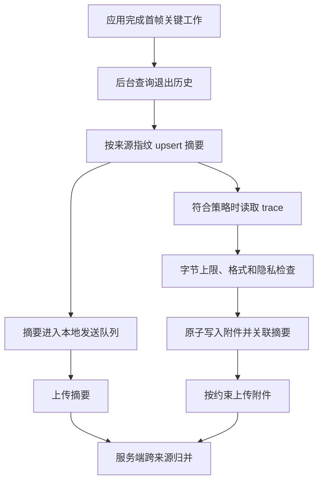

# 26.9 ApplicationExitInfo 与进程退出归因

`ApplicationExitInfo` 补充的是系统视角的近期进程退出记录。进程可能来不及执行 Crash SDK 的回调，Android 仍可保存 reason、status、importance、时间、最近一次内存采样和部分 trace。Android 11 / API 30 起，应用可以在后续进程中查询这些记录，用于分类 Crash、ANR、低内存终止、用户操作和包状态变化。

源码上界为 Android 17 / API 37 / `android-17.0.0_r1`。相关内容聚焦 framework 与应用侧接口，不涉及 Linux 内核专有机制，因此不附加 kernel tag。`ApplicationExitInfo` 是有容量限制且字段可能缺失的历史记录，不能替代 Crash SDK、ANR 监控、Native symbolication，也不能独立证明某段业务代码导致进程退出。

## 进程退出归因的观测目标

Java Crash handler 观察未捕获异常，Native crash SDK 观察 signal 与自身生成的现场，ANR 监控观察主线程和系统超时。`ApplicationExitInfo` 在进程结束后提供另一条证据线。服务端要保存各来源的原始事件，再依据进程、时间、构建和现场特征归并，不能把不同来源的计数直接相加。

一条退出记录至少要回答六个问题：

| 问题 | 字段或来源 | 用途 |
| --- | --- | --- |
| 哪个进程退出 | 查询的 package、`processName`、`pid`、package/real/defining UID | 区分主进程、独立进程和 external service |
| 系统怎样分类 | `reason`、`status`、`description` | 区分 Java crash、Native crash、ANR、低内存和用户/包状态变化 |
| 退出前的重要性 | `importance` 与应用自己保存的前后台场景 | 估计用户影响；`importance` 不等同某个页面的生命周期 |
| 何时退出 | `timestamp`、build/config 版本、应用本地事件 | 与发布、配置和用户反馈对齐 |
| 可用的内存证据 | `pss`、`rss` 与应用最近一次资源摘要 | PSS/RSS 是最近一次系统采样，可能为 0，不代表死亡瞬间 |
| 是否有系统附件 | `traceInputStream`、Android 17 的 `AnrInfo` | 补充 ANR 或 Native tombstone；附件和结构化信息都可能缺失 |

公开 `ApplicationExitInfo` 没有 `getSubReason()`。AOSP 服务内部存在的 subreason 不能当成第三方应用可读取的 SDK 合约，也不应出现在普通 App 的必填 schema。`description` 只供人阅读，系统不保证它在设备或版本之间格式稳定，服务端不能通过字符串解析恢复内部 subreason。

退出归因还要区分事件分类与产品严重度。`REASON_CRASH`、`REASON_CRASH_NATIVE` 和 `REASON_ANR` 通常可直接进入内部稳定性事件流；`REASON_LOW_MEMORY` 要结合 importance 和场景判断；用户、包更新、权限与多用户状态变化通常作为时间线背景。最终指标必须先跨来源去重，并明确分子、分母和用户可感知定义。

## API 30+ 的 ApplicationExitInfo

Android 11 引入 `ActivityManager.getHistoricalProcessExitReasons(packageName, pid, maxNum)`。结果按时间从新到旧排列：

- `packageName = null` 匹配调用者 UID 下的包；查询其他 UID 的包需要 `DUMP`，普通第三方应用不能依赖。
- `pid = 0` 表示不按 PID 过滤。PID 会复用，不能单独作为跨启动事件 ID。
- `maxNum = 0` 表示返回当前仍保留的全部匹配记录，不表示无限历史。
- 绑定到 `BIND_EXTERNAL_SERVICE` 的外部服务进程也可能出现在调用包的退出记录中，归因时要保留 process 与 UID 字段。

公开文档只承诺历史信息位于 ring buffer。AOSP `android-17.0.0_r1` 的默认资源 `config_app_exit_info_history_list_size` 是每包 16 条，但该资源可由产品覆盖，不是 SDK 合约。Android 17 的 `AppExitInfoContainer` 使用 `ArrayList<ApplicationExitInfo>` 并按时间淘汰旧记录；同一 PID 可以保留多次退出。旧实现分析中“以 PID 为 key，所以同 PID 必然覆盖”的结论不适用于该标签。

下面的代码只读取轻量元数据，不在调用线程复制 trace。它适合放到应用自己的 I/O executor；`maxNum = 0` 读取的是系统当前保留记录，服务端或本地游标负责去重。

```kotlin
@RequiresApi(Build.VERSION_CODES.R)
fun readExitSummaries(
    context: Context,
    maxNum: Int = 0
): List<ExitSummary> {
    require(maxNum >= 0)

    val activityManager = context.getSystemService(ActivityManager::class.java)
    val records = activityManager.getHistoricalProcessExitReasons(
        context.packageName,
        0,
        maxNum
    )

    return records.map { info ->
        val anrInfo = if (Build.VERSION.SDK_INT >= 37) info.anrInfo else null
        ExitSummary(
            processName = info.processName,
            pid = info.pid,
            reason = info.reason,
            status = info.status,
            importance = info.importance,
            timestampMs = info.timestamp,
            pssKb = info.pss,
            rssKb = info.rss,
            description = info.description,
            processStateSummary = info.processStateSummary,
            anrId = anrInfo?.anrId,
            anrType = anrInfo?.anrType,
            anrTimeoutMs = anrInfo?.timeoutMillis,
            anrUserPerceptible = anrInfo?.isUserPerceptible
        )
    }
}
```

`ExitSummary` 是项目自定义 DTO。`description` 只能用于受控明细，不能参与稳定分组；`processStateSummary` 与 ANR 字段都可能为 `null`。查询是 Binder 调用，批量对象也有分配成本，不能在首帧关键路径同步执行。

`reason` 是分类主字段，`status` 的解释取决于 reason：进程调用 `exit()` 时它是退出码，因 signal 结束时它是 signal number。不要在业务协议中复制 reason 的整数常量，直接保存 SDK 枚举值与采集设备 API level。

并非所有设备都支持低内存 kill 上报。先调用 `ActivityManager.isLowMemoryKillReportSupported()`；不支持的设备上，内存压力终止可能表现为 `REASON_SIGNALED` 且 status 为 `SIGKILL`。即使设备支持，`REASON_LOW_MEMORY` 也只说明系统处于内存压力，不等价于应用存在内存泄漏。

`importance` 记录进程死亡前的重要性。它可以区分 foreground、foreground service、visible、service、cached 等状态，但不能恢复具体页面。应用仍要保存最近场景、最近一次 Activity resume、首帧是否完成和升级迁移状态。

PSS/RSS 是系统最近一次采样，进程在采样前死亡时可能为 0。服务端应把 0 标记为 unavailable，不能插值，也不能视为进程死亡时刻的精确内存。`timestamp` 来自 wall clock；与 App 单调时钟事件关联时，需要经过本地 wall/elapsed 对齐点，不能直接相减。

`ActivityManager.setProcessStateSummary()` 可保存最多 128 字节的应用状态，系统可能对高频调用限流并抛出 `RuntimeException`。这里适合保存无个人数据的场景码、实验/配置版本和短状态位，不适合恢复 UI，也不能保存账号、令牌或自由文本。只在状态变化时更新，并保留服务端 assignment 作为实验归属主记录。

## ANR 与 native crash 的现场拼接

`getTraceInputStream()` 从 API 30 开始存在，常见内容是系统 ANR trace。Android 12 / API 31 起，reason 为 `REASON_CRASH_NATIVE` 时可返回符合 AOSP `tombstone.proto` 的 protobuf。两类内容格式不同，不能根据文件扩展名或“流非空”统一按文本解析。

trace 还有三个容易误判的边界：

- trace 保存在独立的系统级环形缓冲区，可能被包括其他应用在内的新记录覆盖，因此返回 `null` 是正常结果。
- 应用发生 ANR 后恢复，又因其他原因退出时，之前的 ANR trace 可能附在后一次退出记录上。actual reason 与 attachment type 必须分别保存。
- 读取流会发生 I/O；应用应在后台按字节上限复制到私有临时文件，校验写入成功后再发布为待上传附件。超过配额、解析失败和缺失都作为明确状态上报。

ANR 事件可以按以下证据关联：

1. 应用轻量监控记录主线程停顿、页面、操作与同一单调时钟上的 I/O/网络摘要。
2. 后续进程读取历史退出记录，保留 reason、process、timestamp、importance 和 trace 是否存在。
3. 服务端在允许的时间误差内，用 process、build、场景和堆栈特征寻找同一事件的候选来源；无法唯一匹配时保持多条事件，不强行合并。
4. 取得系统 trace 后再分析锁等待、Binder、I/O、调度、GC 与消息执行。一次采样堆栈不能独立证明根因。

Android 17 / API 37 的 `getAnrInfo()` 进一步提供 ANR ID、type、系统等待的 timeout 和 `isUserPerceptible()`。`AnrInfo` 只在 reason 为 `REASON_ANR` 时才可能存在；旧版本不能通过解析 `description` 构造等价字段。ANR ID 只保证在每个 ANR type 内唯一，跨类型或跨数据源去重仍要带 type、process 与时间。

API 37 还增加 `ActivityManager.registerAnrWarningListener()`。它会在应用接近 ANR timeout 时尽力回调，executor 不应使用主线程。该回调可能不执行，也可能没有足够时间完成工作，只适合写入已经预分配的轻量摘要或触发受控采集，不能作为 ANR 覆盖率保证。

Native crash 事件可把 Crashpad/Breakpad 或自研 SDK 的 minidump/envelope，与 `REASON_CRASH_NATIVE` 的 tombstone 作为两个原始来源。服务端使用 build ID、ABI、signal、fault address、崩溃线程和符号化 top frame 排序匹配候选。SDK 现场缺失时 tombstone 可以补充证据；tombstone 缺失时也保留 SDK 事件，不能因为某个附件不存在而删除事故。

Play Console、Crashlytics 与自研 APM 有各自的安装来源、采样、去重和用户口径。`ApplicationExitInfo` 又是系统的近期进程记录。同一次 Crash 或 ANR 可能出现在多个来源，统一报表必须先归并事件，并保留 `source_event_ids` 与归并置信度。

## Android 11 以下的替代路径

API 29 及以下没有公开的历史退出原因 API。应用可以保存退出前状态并在下次启动生成“异常退出候选”，但无法可靠区分 `SIGKILL`、低内存终止、系统重启、厂商进程管理和用户移除任务。

低版本可用路径如下：

| 目标 | 低版本方案 | 边界 |
| --- | --- | --- |
| Java crash | `Thread.UncaughtExceptionHandler` 写最小 envelope，并继续调用原 handler | OOM、磁盘故障或进程快速终止时可能写不完 |
| Native crash | `sigaction`、备用 signal stack、预留资源，或经验证的 Crashpad/Breakpad | signal handler 只能调用 async-signal-safe 操作；还要正确链接既有 handler |
| ANR | Looper/消息耗时、线程采样、用户明确协助的 bug report | App watchdog 不是系统 ANR 判定；普通 App 无权读取 `/data/anr/` |
| 低内存或系统终止 | 启动标记、前后台状态、周期性内存摘要 | `SIGKILL` 不可捕获，结果只能标为候选原因 |
| Java heap 诊断 | 调试环境使用公开 heap dump；线上只在严格采样和授权下采用经验证方案 | HPROF 体积大且敏感，会增加内存、I/O 和存储压力 |

低版本方案的核心是提前保存轻量状态。应用启动时写入带 boot/session 标识的 `launch_started`，完成业务 ready 后写入 `launch_finished`；Java crash handler 只追加最小 `crash_pending`。下次启动发现未完成标记时，先生成“上次进程未完成启动”的候选，再结合设备是否重启、应用是否升级、最近前后台状态与内存摘要分类。

系统或应用崩溃可能发生在标记落盘中途，状态文件需要原子替换、版本号和校验。标记还会受清除数据、备份恢复和时钟变化影响，不能把一次残留标记直接计为 LMK。

KOOM 一类 fork-dump 方案会暂停 ART、fork 子进程并在子进程生成 HPROF。它依赖 ART 私有符号、动态链接和特定版本兼容代码，不是 Android SDK 能力。若项目采用此类方案，应把支持版本、ROM 验证、失败回退、隐私、磁盘峰值和停用开关作为准入条件；Android 17 的正式发布构建不能因为旧版本方案而默认启用私有 ART 依赖。

API 30+ 仍可保留轻量状态机，用来提供业务场景和发现系统记录缺失，但 reason 以公开系统字段为主。低版本状态机只能输出带置信度的候选类别。

## 端侧存储与上报设计

退出历史容量有限，应用需要在后续活跃进程中及时查询，但查询和附件 I/O 不应进入首帧关键路径。可以在应用可交互后或合适的后台 executor 读取轻量元数据，再由受约束任务处理 trace 与上传。

下面的流程图强调元数据与大附件分离。trace 复制失败不会阻止退出摘要进入队列；上传成功后仍保留来源 key，避免下一次启动重复计数。



该图中的 upsert 很重要：系统稍后可能为已有记录补上 ANR trace。若本地只保存“已看过 timestamp”并永远跳过该记录，可能漏掉后来出现的附件。

`ExitEnvelope` 可以使用以下公开字段：

| 字段 | 说明 |
| --- | --- |
| `source_fingerprint` | query package、process、package UID、pid、timestamp、reason、status 的稳定编码，用于同来源 upsert |
| `source` | `application_exit_info`、`crash_sdk`、`watchdog`、`manual_marker` 等 |
| `reason` / `status` / `description` | reason/status 原样保存；description 只作为受控明细 |
| `importance` / `foreground_state` | 一起保存，服务端决定严重等级 |
| `pss_kb` / `rss_kb` / `memory_sample_available` | 明确单位，并区分 0/缺失与有效系统采样 |
| `process_state_summary` | App 自己设置的最多 128 字节状态；解码时带 schema version |
| `anr_id` / `anr_type` / `anr_timeout_ms` / `anr_user_perceptible` | API 37 的结构化 ANR 字段 |
| `local_markers` | 上次启动标记、页面、升级状态、灰度配置版本 |
| `resource_snapshot` | 最近一次内存、FD、线程数、磁盘水位采样 |
| `attachment_type` / `attachment_state` / `attachment_id` | 区分 ANR 文本、tombstone protobuf、缺失、超限和解析失败 |

`source_fingerprint` 不是跨来源统一事件 ID。Crash SDK 与系统退出记录的时间精度、process 标识和到达顺序不同，服务端应输出“确定匹配、候选匹配、未匹配”，不要在端侧提前合并后丢失原始关系。

隐私过滤优先于字段完整度。ANR trace、tombstone、heap 与日志可能包含线程名、文件路径、URL、系统属性或内存片段。进入上传队列前要限制字节数、验证格式、删除不需要的数据，并应用项目的数据授权、保留和删除策略。无法可靠脱敏的附件不应上传。

采样和容量策略不能写成全项目固定比例。摘要预算按事件率、用户影响和上传成本确定；附件还要按网络、电量、磁盘、用户授权和诊断价值二次决策。崩溃循环时，端侧保留少量代表样本和丢弃计数，服务端按版本、process 与归并签名限流。

## 误判与边界

多进程应用容易出现归因错位。`getHistoricalProcessExitReasons(null, 0, maxNum)` 会匹配调用者 UID 下的包，external service 记录也可能被纳入。主进程读取到推送进程或外部服务进程的 `REASON_LOW_MEMORY`，不能直接算作主进程启动失败。查询 package、processName、package/real/defining UID 都要进入明细。

`REASON_USER_REQUESTED` 也不能细分“设置页 Force stop”与“从 Recents 移除”。在 Android 14 / API 34 以前，包更新或组件状态变化还可能使用该 reason；API 34 才加入 `REASON_PACKAGE_UPDATED` 与 `REASON_PACKAGE_STATE_CHANGE`。跨版本报表必须把 OS API level 带入解释，不能把旧系统的全部 `REASON_USER_REQUESTED` 都标成用户行为。

`REASON_USER_STOPPED` 指多用户设备上的 Android user 被停止，不是用户点击 Force stop。`REASON_SIGNALED` 只说明进程因 signal 退出；在不支持 LMK report 的设备上，低内存终止可能表现为 `SIGKILL`，但其他 `SIGKILL` 来源也存在。没有更多证据时，不能从 signal 反推唯一原因。

Android 17 的 `AppExitInfoTracker.preventExitInfoUpdate()` 会保护已有 `REASON_ANR`、`REASON_CRASH` 和 `REASON_CRASH_NATIVE` 记录，后续显式 kill 信息会形成新记录，减少相邻终止动作覆盖故障原因。这是 `android-17.0.0_r1` 的实现，不应外推为所有 OEM/旧版本完全一致的 SDK 保证。

framework 会把退出历史持久化并在 system ready 后加载，但公开 API 只承诺近期 ring buffer 记录。应用不能依赖固定文件路径、固定条数或跨重启永久保留。没有历史记录可能表示缓冲淘汰、系统尚未记录、数据被清除或厂商实现差异，不能解释为“进程未异常退出”。

## 退出原因与稳定性指标体系的映射

`ApplicationExitInfo` 可以补充 26.2 的 Crash 上报和 26.5 的证据包。服务端可按下表建立内部分类，但统计前要完成跨来源去重：

| 层级 | 事件 | 进入指标方式 |
| --- | --- | --- |
| 明确故障 | `REASON_CRASH`、`REASON_CRASH_NATIVE`、`REASON_ANR` | 进入对应内部事件流；用户率和事件率分别计算 |
| 资源相关 | `REASON_LOW_MEMORY`、`REASON_EXCESSIVE_RESOURCE_USAGE` | 按 importance、设备内存与场景分层，不能自动标成内存泄漏 |
| 需要排查 | `REASON_INITIALIZATION_FAILURE`、`REASON_DEPENDENCY_DIED`、`REASON_FREEZER`、未知 signal | 独立趋势与样本调查，不并入 Crash/ANR |
| 用户或系统状态 | `REASON_USER_REQUESTED`、`REASON_USER_STOPPED`、包/权限状态变化、`REASON_EXIT_SELF` | 作为时间线；按 API level 处理旧版本复用语义 |

Crash-free users、ANR rate 等产品指标需要稳定的用户分母和来源去重，不能只凭退出记录数量生成。报告同时保留用户可感知故障率、内部退出事件率与数据完整性；三者回答的问题不同。

## ApplicationExitInfo 与 GWP-ASan / MTE 报告拼接

GWP-ASan、MTE、HWASan 发现内存安全错误时，进程可能以 Native crash 或 abort 结束。Native crash envelope 应保存构建是否启用相关工具、ABI、signal、fault address、build ID 和工具提供的结构化信息；后续再用 `REASON_CRASH_NATIVE` 与 tombstone protobuf 补充系统现场。

关联时间容差要根据两条采集链路的时间精度、排队延迟和设备 wall clock 质量确定。processName、ABI、signal、fault address、top native frame 与 build ID 一致时可提高匹配置信度。工具报告用于解释内存错误类型，tombstone 用于补充线程、寄存器、内存映射和系统上下文；原始来源仍需保留。GWP-ASan/MTE 原理见 14.26、19.19 和 20.3。

## 低版本可观测性能力对照表

| Android 版本 | 系统退出记录 | ANR 系统 trace | native tombstone 端侧读取 | 推荐策略 |
| --- | --- | --- | --- | --- |
| API 21-29 | 无公开 API | 普通 App 不能直接读取 `/data/anr/` | 普通 App 不能直接读取 `/data/tombstones/` | 自建 crash / watchdog / 资源采样，启动标记补判 |
| API 30 | `ApplicationExitInfo` 可用 | `traceInputStream` 可补 ANR traces | native tombstone 仍无公开 protobuf 入口 | 用系统 reason 补 ANR 与 LMK，native 依赖 Crashpad / Breakpad |
| API 31-33 | `ApplicationExitInfo` 可用 | 同 API 30 | `REASON_CRASH_NATIVE` 可读取 tombstone protobuf，但可能为 `null` | 归并系统 tombstone、Crash SDK 与资源摘要 |
| API 34-36 | 包更新/组件状态 reason 独立 | 同 API 30 | 同 API 31 | 不再把新版包更新误计为 `REASON_USER_REQUESTED` |
| API 37 | 增加结构化 `AnrInfo` | trace 加 ANR ID/type/timeout/用户感知字段 | 同 API 31 | 使用结构化 ANR 字段；保留旧版本降级路径 |

版本分支要以运行时 API 检测为准。API 30+ 优先保存系统 reason，API 31+ 尝试读取 Native tombstone，API 37 再读取 `AnrInfo`；任何一步缺失都回到轻量业务标记与独立 Crash/ANR 来源。系统记录给出的是分类证据，不是自动根因。

## 小结

`ApplicationExitInfo` 的工程价值在于补充进程来不及上报的退出分类，并把 ANR trace、Native tombstone、最近 importance 与应用状态放到同一份证据记录中。公开 API 不提供 subreason，PSS/RSS 不是死亡瞬间值，历史条数与附件都可能缺失；服务端必须保留缺失状态和来源关系。

Android 17 的 `AnrInfo` 与 ANR warning listener 提高了结构化 ANR 诊断能力，AOSP 也改进了 Crash/ANR 记录被后续 kill 信息覆盖的问题。应用仍要依靠 Crash SDK、轻量时间线、符号文件和可重复实验确认根因。

## 参考资料

- [AOSP Android 17：`ApplicationExitInfo`](https://android.googlesource.com/platform/frameworks/base/+/refs/tags/android-17.0.0_r1/core/java/android/app/ApplicationExitInfo.java)
- [AOSP Android 17：`ActivityManager`](https://android.googlesource.com/platform/frameworks/base/+/refs/tags/android-17.0.0_r1/core/java/android/app/ActivityManager.java)
- [AOSP Android 17：`AppExitInfoTracker`](https://android.googlesource.com/platform/frameworks/base/+/refs/tags/android-17.0.0_r1/services/core/java/com/android/server/am/AppExitInfoTracker.java)
- [AOSP Android 17：退出历史默认容量配置](https://android.googlesource.com/platform/frameworks/base/+/refs/tags/android-17.0.0_r1/core/res/res/values/config.xml)
- [AOSP Android 17：`NativeTombstoneManager`](https://android.googlesource.com/platform/frameworks/base/+/refs/tags/android-17.0.0_r1/services/core/java/com/android/server/os/NativeTombstoneManager.java)
- [AOSP Android 17：`tombstone.proto`](https://android.googlesource.com/platform/system/core/+/refs/tags/android-17.0.0_r1/debuggerd/proto/tombstone.proto)
- [`ApplicationExitInfo` API](https://developer.android.com/reference/android/app/ApplicationExitInfo)
- [`ApplicationExitInfo.AnrInfo` API 37](https://developer.android.com/reference/android/app/ApplicationExitInfo.AnrInfo)
- [`ActivityManager` 退出历史与进程状态摘要 API](https://developer.android.com/reference/android/app/ActivityManager)
- [Android ANR 诊断](https://developer.android.com/topic/performance/vitals/anr)
- [Android NDK Native crash 调试](https://developer.android.com/ndk/guides/debug)
- [KOOM 源码仓库](https://github.com/KwaiAppTeam/KOOM)
