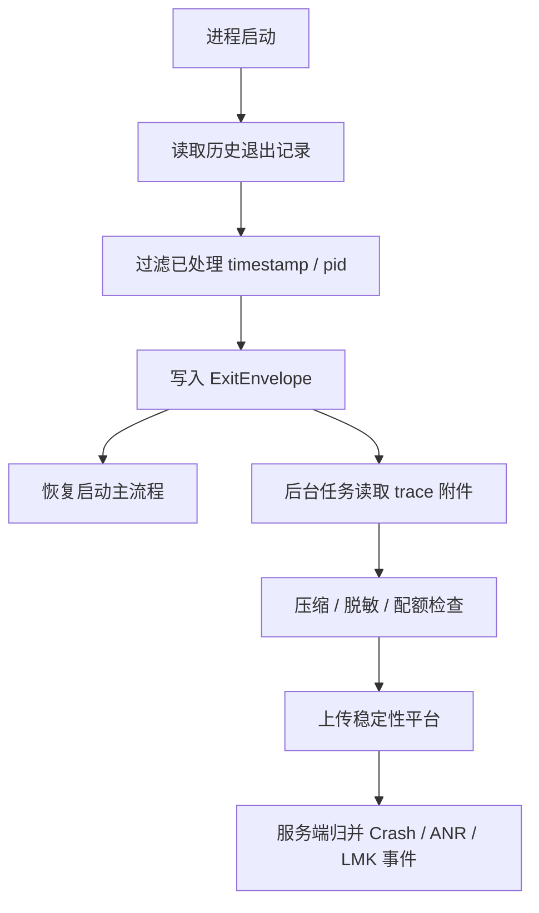

# 26.9 ApplicationExitInfo 与进程退出归因

<!-- outline-start -->
## 要点

### 🔹 进程退出归因的观测目标
- crash、native crash、ANR、LMK、用户终止的区分
- 一次退出记录需要保留的字段
- 与 Crash / ANR / OOM 上报的关系

### 🔹 API 30+ 的 ApplicationExitInfo
- getHistoricalProcessExitReasons() 的调用方式
- reason、importance、timestamp、traceInputStream 的含义
- 系统保留数量和历史记录边界

### 🔹 ANR 与 native crash 的现场拼接
- ANR trace 的读取和上报
- native tombstone 与 REASON_CRASH_NATIVE
- 与 Play Console / Crashlytics 数据的差异

### 🔹 Android 11 以下的替代路径
- Signal Handler 自建 native crash 现场
- LMKd / dumpsys / /data/anr 的权限边界
- KOOM fork dump 等低版本保现场策略

### 🔹 端侧存储与上报设计
- 进程重启后读取上一轮退出原因
- 去重、采样和隐私过滤
- 与发版、设备、内存状态维度关联

### 🔹 误判与边界
- 多进程应用的归因错位
- 系统回收与用户杀进程的区分
- 不同厂商系统的记录完整性差异

## 扩展

### 🔸 退出原因与稳定性指标体系的映射
- 见正文扩展：按强故障、前台资源故障、背景退出、用户或版本动作拆分统计口径

### 🔸 ApplicationExitInfo 与 GWP-ASan / MTE 报告拼接
- 见正文扩展：用工具报告解释内存错误类型，用 tombstone 补系统现场

### 🔸 低版本可观测性能力对照表
- 见正文扩展：按 API 21-29、API 30、API 31+ 拆能力边界

<!-- outline-end -->

ApplicationExitInfo 解决的是稳定性看板里最容易缺的一块：进程没有给 Crash SDK 留下正常回调机会，但系统仍然知道它为什么退出。Android 11 之后，应用可以在下次启动时读取历史退出记录，把 ANR、native crash、LMK、用户强停、包更新、权限变更这类事件纳入同一套归因口径。

这里关注的是进程结束之后，Java crash、native crash、ANR 三类现场如何进入同一份证据包。（各项的具体机制见 20.2、20.3、19.24、20.4。）

## 进程退出归因的观测目标

Crash SDK 能拿到 Java 未捕获异常，native crash SDK 能拿到信号和 minidump，ANR Watchdog 能在主线程卡住时抓一份堆栈。ApplicationExitInfo 的职责不在采集阶段：它不替代 Crash SDK、Watchdog 这些入口，而是在进程结束后提供一份系统视角的退出记录。

一条退出记录至少要回答六个问题：

| 问题 | 字段或来源 | 用途 |
| --- | --- | --- |
| 哪个进程退出 | `processName`、`pid`、`packageName` | 区分主进程、推送进程、WebView 进程和独立上传进程 |
| 为什么退出 | `reason`、`subReason`、`status` | 区分 Java crash、native crash、ANR、LMK、用户强停、包更新等场景 |
| 退出时处于什么优先级 | `importance`、前后台状态、是否前台服务 | 判断用户可感知程度，避免把后台缓存进程回收误报为严重事故 |
| 退出发生在什么时候 | `timestamp`、本地启动标记、服务端时间偏移量 | 把发版、灰度、配置变更和用户反馈合并到同一条时间线 |
| 当时资源水位怎样 | `pss`、`rss`、端侧内存/FD/线程数快照 | 判断低内存、线程爆炸、FD 泄漏是否参与退出 |
| 是否有系统现场附件 | `traceInputStream`、tombstone protobuf、ANR traces | 作为 Crash / ANR 样本的补偿证据 |


退出归因和稳定性指标的关系可以按“用户是否感知”和“是否可行动”拆开。`REASON_CRASH`、`REASON_CRASH_NATIVE`、`REASON_ANR` 通常属于强可行动事件；`REASON_LOW_MEMORY` 要结合 `importance` 判断，前台 LMK 和后台缓存回收不是同一个等级；`REASON_USER_REQUESTED`、`REASON_PACKAGE_UPDATED`、`REASON_PERMISSION_CHANGE` 多数不进入故障告警，只作为时间线背景。

## API 30+ 的 ApplicationExitInfo

Android 11 引入 `ActivityManager.getHistoricalProcessExitReasons(packageName, pid, maxNum)`。返回值按“最近到最旧”排序：`packageName = null` 表示查询调用方 UID 下的所有包；`pid = 0` 不按进程 ID 过滤；`maxNum = 0` 表示返回所有匹配记录。系统内部用环形缓冲保存历史记录，所以查询结果不是长期审计日志。


这段示例代码展示下次启动时怎样拉取退出记录，并把 trace 附件落到 App 私有目录。重点看三处：只在 API 30+ 调用；`traceInputStream` 可能为 `null`；附件写入后再交给异步上传任务处理。

```kotlin
@RequiresApi(Build.VERSION_CODES.R)
fun collectExitReasons(context: Context, maxNum: Int = 16): List<ExitSample> {
    val activityManager = context.getSystemService(ActivityManager::class.java)
    val records = activityManager.getHistoricalProcessExitReasons(
        context.packageName,
        0,
        maxNum
    )

    return records.map { info ->
        val traceFile = copyTraceIfPresent(context, info)
        ExitSample(
            processName = info.processName,
            pid = info.pid,
            reason = info.reason,
            status = info.status,
            importance = info.importance,
            timestampMs = info.timestamp,
            pssKb = info.pss,
            rssKb = info.rss,
            tracePath = traceFile?.absolutePath
        )
    }
}

@RequiresApi(Build.VERSION_CODES.R)
private fun copyTraceIfPresent(
    context: Context,
    info: ApplicationExitInfo
): File? {
    val input = info.traceInputStream ?: return null
    val dir = File(context.filesDir, "exit-traces").apply { mkdirs() }
    val file = File(dir, "${info.timestamp}-${info.pid}-${info.reason}.bin")
    input.use { source ->
        file.outputStream().use { target -> source.copyTo(target) }
    }
    return file
}
```

这段代码只是采集入口。生产环境还要加去重、大小限制、磁盘配额和隐私清洗；`traceInputStream` 不应该在主线程读取，大文件写入也不应该阻塞冷启动路径。

`reason` 是归因的主字段。AOSP 中 `REASON_CRASH = 4`、`REASON_CRASH_NATIVE = 5`、`REASON_ANR = 6`、`REASON_LOW_MEMORY = 3`；`REASON_SIGNALED = 2` 表示进程因 OS signal 退出，例如 `SIGKILL`。要注意的是，并非所有设备都支持低内存 kill 上报；不支持时，内存压力导致的 kill 可能只表现为 `REASON_SIGNALED`。


`importance` 记录退出前的进程重要性。它不等价于页面状态，但能帮助区分“前台用户正在操作时退出”和“后台缓存进程被系统回收”。端侧还应保存自己的生命周期标记，例如最近 Activity resume 时间、是否存在前台服务、是否完成首帧、是否处于升级迁移窗口。

`timestamp` 是系统记录的进程死亡时间，适合与本地 crash envelope、服务端配置下发、灰度批次、用户反馈时间合并。多进程应用要把 `processName + pid + timestamp + reason` 作为基础去重键，再结合 crash top frame 或 tombstone build id 做二次归并。

## ANR 与 native crash 的现场拼接

`getTraceInputStream()` 是 ApplicationExitInfo 最有价值的补偿字段：它返回系统在进程死亡前采集的 traces，通常在 `REASON_ANR` 时可用；从 Android 12（API 31）起，`REASON_CRASH_NATIVE` 也可以返回 tombstone protobuf。tombstone 保存在单独的全局环形缓冲里，可能被较新的 native crash 覆盖，所以返回 `null` 是正常边界。


ANR 样本的拼接方式：

1. Watchdog 或线上卡顿监控记录本进程主线程卡顿、页面、业务操作、最近 I/O 和网络摘要。
2. 进程如果随后被系统判定为 ANR 并结束，下次启动通过 `ApplicationExitInfo` 拉到 `REASON_ANR`。
3. 如果 `traceInputStream` 存在，把系统 ANR traces 作为附件，服务端按 `processName + timestamp` 与端侧卡顿样本合并。
4. 合并后再判定是主线程锁等待、Binder 阻塞、I/O 放大、CPU 抢占还是 GC 抖动；判定逻辑详见 20.4。

Native crash 样本的拼接方式：

1. Crashpad / Breakpad 或自研 native crash SDK 在信号路径写最小 minidump 或 envelope。
2. 下次启动读取 `REASON_CRASH_NATIVE`，拉取 tombstone protobuf。
3. 服务端用 build id、崩溃线程、signal、fault address、top native frame 合并 minidump 与 tombstone。
4. 如果 SDK 现场缺失，tombstone 可作为补偿；如果 tombstone 被覆盖或 `null`，仍保留 SDK 的 minidump 路径。Native crash 机制详见 20.3 和 19.24。

Play Console、Crashlytics、自研 APM 的数据口径不同。Play Console 更偏用户可感知的稳定性指标；Crashlytics 偏 SDK 可捕获的 Java / native crash；ApplicationExitInfo 是系统保留的进程死亡记录。三者不能直接相加，否则同一次 native crash 可能被重复计算。推荐做法是保留原始来源字段，在服务端建立统一事件：`exit_event_id` 归并多个来源，告警和报表读取归并后的事件。

## Android 11 以下的替代路径

Android 10 及以下没有公开的历史退出原因 API。端侧只能自己建立“退出前标记 + 下次启动补判”的系统，能力比 ApplicationExitInfo 弱很多。

低版本可用路径如下：

| 目标 | 低版本方案 | 边界 |
| --- | --- | --- |
| Java crash | `Thread.UncaughtExceptionHandler` 写本地 envelope | OOM、死锁、进程被杀时可能写不完；必须调用原 handler |
| native crash | `sigaction`、Breakpad / Crashpad、备用 signal stack、预留 FD | 信号处理函数只能做 async-signal-safe 操作；复杂逻辑放独立 handler 进程 |
| ANR | Watchdog、消息队列卡顿、SIGQUIT 方案、厂商合作读取 traces | `/data/anr/` 对普通 App 不可读；主动 SIGQUIT 会增加开销和兼容性风险 |
| LMK / 系统回收 | 启动标记、前后台状态、内存水位采样、`/proc/self/status` 快照 | `SIGKILL` 不可捕获；只能通过下次启动和历史采样推断 |
| Java heap OOM 现场 | KOOM 一类 fork dump：SuspendVM → fork → Resume → 子进程 dump hprof | 依赖 ART 内部行为和兼容性处理；适合灰度和高价值样本 |

低版本方案的主线是“预先留下足够轻的状态”。比如应用启动时写 `launch_started`，首帧或首页 ready 后改成 `launch_finished`；进程主动退出前写 `exit_self`；Java crash handler 写 `crash_pending`；下次启动发现 `launch_started` 未清理，就把它归入启动异常退出候选，再结合前后台、内存水位、上次页面和是否升级做分类。

这套状态机不能把 LMK、用户从最近任务移除、系统重启、厂商管控完全分开。它的价值是发现异常退出趋势，而不是给每条样本打出绝对原因。到了 API 30+，同样的状态机仍然保留，但它从“主判断”变成 ApplicationExitInfo 的交叉验证材料。

## 端侧存储与上报设计

ApplicationExitInfo 应该在冷启动早期读取，但不能拖慢首帧。推荐把流程拆成两段：启动早期只拿轻量摘要并写入本地队列；trace 附件读取、压缩、脱敏和上传交给后台任务。



ExitEnvelope 建议固定字段：

| 字段 | 说明 |
| --- | --- |
| `exit_event_id` | `package + process + pid + timestamp + reason` 生成，保证重复启动不会重复上报 |
| `source` | `application_exit_info`、`crash_sdk`、`watchdog`、`manual_marker` 等 |
| `reason` / `sub_reason` / `status` | 原样保存系统字段，不在端侧改写 |
| `importance` / `foreground_state` | 一起保存，服务端决定严重等级 |
| `process_state_summary` | 如果业务调用过 `ActivityManager.setProcessStateSummary()`，保存对应摘要 |
| `local_markers` | 上次启动标记、页面、升级状态、灰度配置版本 |
| `resource_snapshot` | 最近一次内存、FD、线程数、磁盘水位采样 |
| `trace_attachment_id` | trace 或 tombstone 附件的本地 ID，上传后替换为服务端 ID |

隐私过滤比字段完整度优先。ANR traces 和 tombstone 可能包含线程名、文件路径、URL 片段、日志尾部和 native 内存片段；上传前要做大小限制、路径裁剪、账号与 token 清洗。对外部 SDK 或第三方库的路径，服务端可以保留包名和 so build id，不保存用户目录下的完整文件名。

采样策略按事件类型分层：

- `REASON_CRASH`、`REASON_CRASH_NATIVE`、`REASON_ANR`：默认全量摘要，附件按体积和用户采样控制。
- 前台 `REASON_LOW_MEMORY`：摘要全量，附件按设备内存和版本采样。
- 后台 `REASON_LOW_MEMORY`、`REASON_USER_REQUESTED`、包更新、权限变更：低采样或只做本地统计，不触发告警。
- 同一用户同一版本同一 top frame：服务端限流，避免崩溃循环把队列打满。

## 误判与边界

多进程应用最容易出现归因错位。`getHistoricalProcessExitReasons(null, 0, maxNum)` 会返回调用方 UID 下匹配的记录，服务端必须按 `processName` 分组。主进程启动时读取到推送进程的 `REASON_LOW_MEMORY`，不能直接算作主进程启动失败。

系统回收和用户杀进程也要分开。`REASON_LOW_MEMORY` 表示系统处于内存压力；`REASON_USER_REQUESTED` 可能来自设置页强停或最近任务移除。它们对用户体验的含义不同：前台页面被低内存杀掉要进入稳定性治理；用户主动划掉后台任务更多是行为背景。

厂商系统可能调整记录数量、低内存上报能力和 trace 保留策略。历史记录来自环形缓冲，native tombstone 也可能被全局缓冲覆盖。线上系统不能把“没有 trace”当成“没有 ANR / native crash”，只能标记为附件缺失。


## 退出原因与稳定性指标体系的映射

ApplicationExitInfo 可以补齐 26.2 Crash 上报体系和 26.5 线上排障证据包之间的缺口。建议服务端把退出事件分成四层：

| 层级 | 事件 | 进入指标方式 |
| --- | --- | --- |
| 强故障 | `REASON_CRASH`、`REASON_CRASH_NATIVE`、`REASON_ANR` | 进入 crash / ANR / crash-free users 指标，参与告警 |
| 前台资源故障 | 前台 `REASON_LOW_MEMORY`、启动未完成后退出 | 进入异常退出率和启动失败率，单独看设备内存分布 |
| 背景退出 | 后台 `REASON_LOW_MEMORY`、freezer、系统维护类退出 | 进入资源趋势，不直接触发稳定性事故 |
| 用户或版本动作 | 用户强停、包更新、权限变化 | 作为排障时间线，不计入故障率 |

这张表的目的不是压低故障数字，而是避免不同语义的退出混在同一个分母里。稳定性报表要同时保留“用户可感知故障率”和“系统退出趋势”，前者用于发布决策，后者用于容量、内存和后台策略治理。

## ApplicationExitInfo 与 GWP-ASan / MTE 报告拼接

GWP-ASan、MTE、HWASan 这类内存安全工具经常以 native crash 或 abort 形式结束进程。端侧可以把工具开关、采样命中状态、allocator 报告 ID 写入 crash envelope；下次启动再用 `REASON_CRASH_NATIVE` 和 tombstone protobuf 补系统视角。

拼接键建议使用 `timestamp ± 5s + processName + signal + fault address + top native frame + build id`。如果 MTE 报告和 tombstone 同时存在，服务端以工具报告解释内存错误类型，以 tombstone 补线程、寄存器和系统上下文。GWP-ASan / MTE 原理详见 14.13、19.24 和 20.3。

## 低版本可观测性能力对照表

| Android 版本 | 系统退出记录 | ANR 系统 trace | native tombstone 端侧读取 | 推荐策略 |
| --- | --- | --- | --- | --- |
| API 21-29 | 无公开 API | 普通 App 不能直接读取 `/data/anr/` | 普通 App 不能直接读取 `/data/tombstones/` | 自建 crash / watchdog / 资源采样，启动标记补判 |
| API 30 | `ApplicationExitInfo` 可用 | `traceInputStream` 可补 ANR traces | native tombstone 仍无公开 protobuf 入口 | 用系统 reason 补 ANR 与 LMK，native 依赖 Crashpad / Breakpad |
| API 31+ | `ApplicationExitInfo` 可用 | 同 API 30 | `REASON_CRASH_NATIVE` 可通过 `traceInputStream` 读取 tombstone protobuf，但可能为 `null` | 归并系统 tombstone、Crash SDK、端侧资源快照 |

这张表给工程实现划边界：API 30+ 用系统记录做主归因；API 31+ 对 native crash 多拉一份 tombstone；API 29 及以下靠端侧状态机和自建采样兜底。所有版本都保留本地启动标记，因为它能发现“系统没有给出完整解释”的异常退出。
