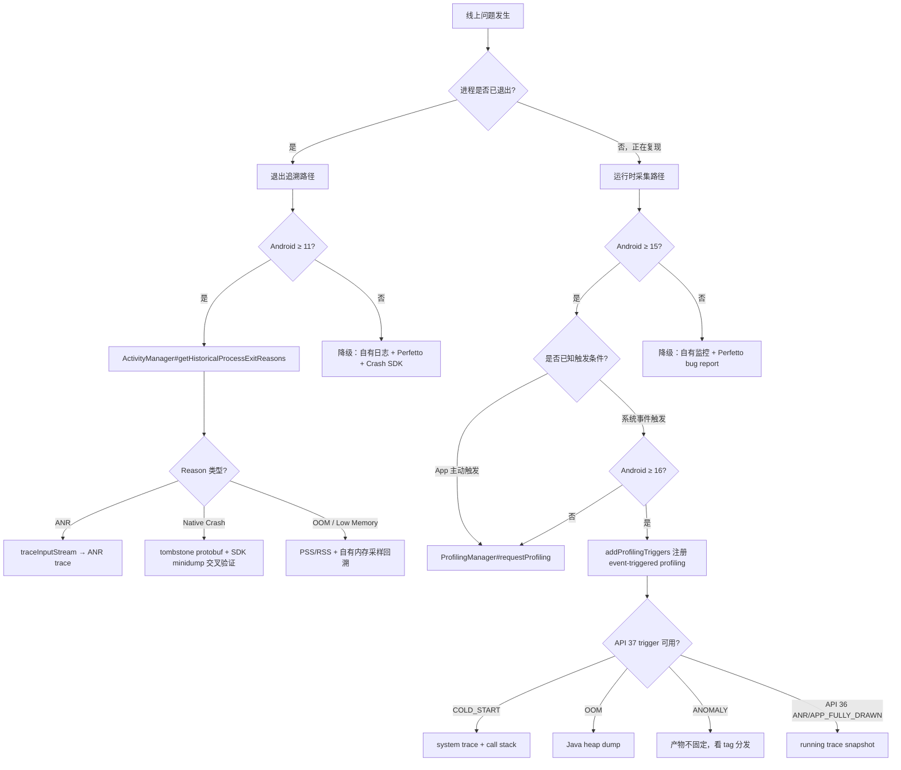

---

# 26.12 Android 版本化线上诊断能力：ApplicationExitInfo、ProfilingManager 与 ProfilingTrigger

<!-- outline-start -->
## 要点

### 🔹 诊断能力分层
区分三类官方入口：进程退出追溯、运行时采集、系统事件触发采集。章节要说明它们分别回答什么问题，避免把 Crash/ANR 事后证据、Perfetto system trace 和 heap dump 放进同一套处理口径。

### 🔹 Android 10-14 的降级路径
说明 Android 10 主要依赖 Perfetto、bug report、日志和人工协助；Android 11-14 可用 `ApplicationExitInfo` 做退出原因补偿，但采集范围和 trace 类型有版本边界。

### 🔹 ApplicationExitInfo 的退出证据边界
覆盖 `ActivityManager#getHistoricalProcessExitReasons()`、`ApplicationExitInfo#getReason()`、`getTraceInputStream()`、`REASON_ANR`、`REASON_CRASH_NATIVE`、`REASON_APPLICATION_SPECIFIC_ERROR` 的 API 版本差异和空返回条件。

### 🔹 ProfilingManager 的应用驱动采集
覆盖 Android 15+ `ProfilingManager` / AndroidX Profiling 的 system trace、heap dump、heap profile、stack sampling 四类采集，说明结果回调、文件归档、限流和采集成本。

### 🔹 ProfilingTrigger 与 Extension 版本
覆盖 Android 16/API 36、Extension 36.1、Android 17/API 37 的 trigger 差异，区分 `APP_FULLY_DRAWN`、`ANR`、`COLD_START`、`OOM`、`ANOMALY` 等触发器的返回物和使用场景。

### 🔹 证据归档与去重字段
设计一套线上证据归档字段：pid、timestamp、processName、reason、triggerType、profilingType、resultFilePath、caseId、sessionId、appVersion、device、API level。说明 Java crash、native crash、ANR、OOM 和用户手动杀进程如何去重。

### 🔹 隐私、限流与采集成本
说明 trace、heap dump、stack sampling 可能包含业务方法名、对象内容、线程名和用户上下文；采集要有用户授权、字段脱敏、文件加密、保留期限、远程开关和采样上限。

## 扩展

### 🔸 Native crash tombstone 与 Crashpad/Breakpad 补偿
补充 Android 12+ native tombstone protobuf 与 SDK minidump 的关系，区分系统补偿证据和 SDK 自有 crash store。

### 🔸 版本能力表与排障决策表
把 Android 10-14、15、16、17 分成四档，给出“遇到慢启动/ANR/native crash/OOM/进程被杀时先拿什么证据”的决策表。

### 🔸 与 26.5 证据包模板的关系
本节聚焦版本化诊断入口和采集边界；26.5 继续保留排障流程、反馈复现、远程日志和灰度处置。

<!-- outline-end -->

本节按 Android 版本重新整理线上诊断入口。26.5 负责排障流程，14.7 和 8.10 负责 ProfilingManager 工具机制；这里只回答一个问题：线上问题发生在不同系统版本时，App 能从系统拿到哪类证据，证据该怎么归档，哪些情况必须降级。

**两类系统证据的互补关系**：`ApplicationExitInfo` 负责"进程为什么死了"，给出死因、时间戳、内存快照和 trace 附件；`ProfilingManager` / `ProfilingTrigger` 负责"进程活着时发生了什么"，给出 system trace、heap dump、stack sample 和 call stack。去重和互补的规则：

- **同一 case 内两类证据并存时**：优先以 `ProfilingManager` 的 system trace / heap dump 作为主证据（提供运行时上下文），`ApplicationExitInfo` 的 reason/timestamp/trace 作为辅证据（确认退出原因和终点状态）。
- **只有 ApplicationExitInfo 没有 ProfilingManager 时**：ANR → 用 `getTraceInputStream()` 的 ANR trace 补文本证据；native crash → 用 tombstone protobuf 与 SDK minidump 交叉验证；OOM → 结合自有内存采样回溯。
- **只有 ProfilingManager 没有退出记录时**：卡顿/慢启动/内存异常在灰度复现阶段触发，按采集产物独立归档，不等待退出。
- **去重键**：`pid + timestamp + processName + reason` 作为退出记录去重键，`sessionId + profilingType + triggerType` 作为 profiling 结果去重键。同一 pid 在相近时间窗口内出现多种证据时，按 caseId 合并。

参考材料把线上问题拆成崩溃现场、卡顿现场、用户日志、上报组件和动态诊断几类，本节借鉴这个组织方式，但材料全部按 Android 10-17 的公开 API 和 AOSP 路径重写，不复用原文段落。[结构参考: Clippings/线上疑难问题该如何排查和跟踪？-Android开发高手课-极客时间 1.md][结构参考: Clippings/线上疑难问题该如何排查和跟踪？-Android开发高手课-极客时间 2.md][结构参考: Clippings/线上疑难问题该如何排查和跟踪？-Android开发高手课-极客时间 3.md][结构参考: Clippings/线上疑难问题该如何排查和跟踪？-Android开发高手课-极客时间 6.md][结构参考: Clippings/线上疑难问题该如何排查和跟踪？-Android开发高手课-极客时间 7.md][结构参考: Clippings/线上疑难问题该如何排查和跟踪？-Android开发高手课-极客时间 8.md][结构参考: Clippings/线上疑难问题该如何排查和跟踪？-Android开发高手课-极客时间 33.md][结构参考: Clippings/线上疑难问题该如何排查和跟踪？-Android开发高手课-极客时间 35.md]

## 三条诊断路径：退出追溯、运行时采集、事件触发

Android 10 之后，线上诊断能力不是一次性开放出来的，而是沿着三条路径分批进入公开 API。

| 路径 | 解决的问题 | 起始版本 | 主要入口 | 结果形态 |
|---|---|---:|---|---|
| 退出追溯 | 进程已经死了，下次启动能不能知道死因 | Android 11 / API 30 | `ActivityManager#getHistoricalProcessExitReasons()`、`ApplicationExitInfo` | reason、timestamp、进程名、ANR trace、native tombstone |
| 应用驱动采集 | 问题正在复现，App 能不能主动发起一次 profiling | Android 15 / API 35 | `ProfilingManager#requestProfiling()` / AndroidX Profiling | `.perfetto-trace`、`.hprof`、heap profile、stack sampling |
| 事件触发采集 | 问题发生时没人开工具，系统能不能按事件自动保存现场 | Android 16 / API 36 起 | `ProfilingManager#addProfilingTriggers()`、`ProfilingTrigger` | system trace snapshot、Java heap dump、stack sample 等 |

这三条路径不能混用。Crash / ANR 事后补证据走 `ApplicationExitInfo`；卡顿、启动慢、内存异常正在灰度复现时走 `ProfilingManager`；冷启动、ANR、OOM 这类系统能识别的事件再注册 `ProfilingTrigger`。完整 Trace 抓取细节详见 13.2，ProfilingManager 的 builder 和结果分发表详见 14.7，系统触发式 profiling 的 trigger 语义详见 8.10。

**诊断路径选择决策**：线上排障时按以下顺序判断该走哪条路径，不是三条平行选一——后一条路径往往是前一条的补充，同一次 case 可能同时用到多条。



关键决策点：
- **退出追溯和运行时采集可以共存**：进程被杀后下次启动，先拿 `ApplicationExitInfo` 确认死因，再按复现路径触发 `ProfilingManager` 或 `ProfilingTrigger` 补运行时证据。
- **事件触发是运行时采集的子集**：`ProfilingTrigger` 需要 Android 16+ 且设备支持，Android 15 只能走 App 主动请求路径。
- **降级路径不可跳过**：Android 10-14 没有 ProfilingManager 和 ProfilingTrigger，所有线上诊断必须靠自有证据体系 + `ApplicationExitInfo`（11+）。
- **同一 case 内可用多条路径**：例如冷启动慢 → 先拿 `ApplicationExitInfo` 确认非系统杀 → 注册 `TRIGGER_TYPE_COLD_START` → 灰度复现时 `requestProfiling(SYSTEM_TRACE)`。

[已验证: AOSP main, frameworks/base/core/java/android/app/ActivityManager.java]
[已验证: AOSP main, frameworks/base/core/java/android/app/ApplicationExitInfo.java]
[已验证: AOSP main, packages/modules/Profiling/framework/java/android/os/ProfilingManager.java]

## Android 10-14：以退出补偿和人工取证为主

Android 10 / API 29 没有 `ApplicationExitInfo`。线上排障仍然依赖 App 自有日志、Crash SDK、Perfetto / bug report、用户反馈和灰度复现。这个阶段最稳定的做法，是把日志、关键业务状态、请求 ID、会话 ID、设备信息、版本信息提前放进证据包。26.5 已经覆盖远程日志、用户反馈和 bug report，本节不重复展开。

Android 11 / API 30 开始，App 能通过 `ActivityManager#getHistoricalProcessExitReasons(packageName, pid, maxNum)` 读取最近的进程退出记录。AOSP `ActivityManager.java` 明确返回 `ApplicationExitInfo` 列表，并按从近到远排序。它不是 Crash SDK 的替代品，而是下次启动时的系统补偿入口：SDK 没来得及写完、ANR 当时没有 App 回调、低内存杀进程没有 Java 异常时，这条记录能提供基础死因。

`ApplicationExitInfo` 的公共字段要按“可归档”和“只辅助阅读”分开处理。`getPid()`、`getProcessName()`、`getReason()`、`getStatus()`、`getTimestamp()`、`getPss()`、`getRss()`、`getProcessStateSummary()` 适合落库；`getDescription()` 只适合人工排查，AOSP 注释说明它是 human-readable 字符串，系统不保证跨设备、跨版本格式稳定。[已验证: AOSP main, frameworks/base/core/java/android/app/ApplicationExitInfo.java]

这段代码只演示下次启动扫描退出记录的最小路径。重点是把 `reason` 和 `traceInputStream` 分开处理，不能因为有退出记录就假设有 trace 文件。

```kotlin
if (Build.VERSION.SDK_INT >= Build.VERSION_CODES.R) {
    val activityManager = context.getSystemService(ActivityManager::class.java)
    val exits = activityManager.getHistoricalProcessExitReasons(
        context.packageName,
        0,
        32,
    )

    exits.forEach { info ->
        val key = ExitKey(
            pid = info.pid,
            processName = info.processName,
            timestamp = info.timestamp,
            reason = info.reason,
        )
        archiveExitReason(key, info.status, info.pss, info.rss)

        if (info.reason == ApplicationExitInfo.REASON_ANR ||
            info.reason == ApplicationExitInfo.REASON_CRASH_NATIVE) {
            info.traceInputStream?.use { stream ->
                archiveExitTrace(key, stream)
            }
        }
    }
}
```

`getTraceInputStream()` 的返回值要按 `null` 处理。AOSP 注释写明：它通常在 `REASON_ANR` 可用；API 31 起，`REASON_CRASH_NATIVE` 可返回 native tombstone protobuf；native crash trace 放在全局环形缓冲里，可能被新 crash 覆盖，所以仍然会返回 `null`。ANR trace 路径返回的是 gzip stream，native tombstone 路径返回的是 tombstone protobuf stream。两种结果不能按同一种文本格式解析。[已验证: AOSP main, frameworks/base/core/java/android/app/ApplicationExitInfo.java]

`REASON_APPLICATION_SPECIFIC_ERROR` 需要单独标注。当前 AOSP main 的 `ApplicationExitInfo` 公共 reason 列表没有这个常量；公开列表包含 `REASON_CRASH`、`REASON_CRASH_NATIVE`、`REASON_ANR`、`REASON_EXCESSIVE_RESOURCE_USAGE`、`REASON_USER_REQUESTED`、`REASON_PACKAGE_UPDATED` 等。既有调研材料中出现的 `REASON_APPLICATION_SPECIFIC_ERROR` 未能在本轮 AOSP 复核中确认，正文不把它当作可用 API。[待验证: 既有研究素材提到 REASON_APPLICATION_SPECIFIC_ERROR，但 AOSP main 未命中该常量，后续以正式 SDK 文档为准]

## ApplicationExitInfo 证据边界

`ApplicationExitInfo` 适合做“退出原因补偿”，不适合做“完整现场还原”。退出记录的时间戳来自系统记录，PSS / RSS 是系统最近一次采样值，不等于死亡前一刻的精确内存。低内存杀进程也不是所有设备都能稳定报 `REASON_LOW_MEMORY`；AOSP 注释说明，不支持 low memory kill report 的设备可能以 `REASON_SIGNALED` + `SIGKILL` 呈现，需要通过 `ActivityManager.isLowMemoryKillReportSupported()` 判断能力。[已验证: AOSP main, frameworks/base/core/java/android/app/ApplicationExitInfo.java]

线上处理时，把 reason 分成五组更稳：

| reason 组 | 典型值 | 可自动归因吗 | 处理方式 |
|---|---|---|---|
| App 自身崩溃 | `REASON_CRASH`、`REASON_CRASH_NATIVE` | Java crash 可与 SDK 样本去重；native crash 需看 tombstone / minidump | 与 26.2 Crash 上报样本合并 |
| 无响应 | `REASON_ANR` | 只能证明系统记录到 ANR；主因仍要看 trace / 日志 | 与 19.24 的 ANR 捕获机制、26.5 证据包关联 |
| 系统资源处置 | `REASON_LOW_MEMORY`、`REASON_EXCESSIVE_RESOURCE_USAGE` | 只能说明处置类型，不能直接定位业务代码 | 回连内存、CPU、后台任务监控 |
| 用户或包状态变化 | `REASON_USER_REQUESTED`、`REASON_PACKAGE_STATE_CHANGE`、`REASON_PACKAGE_UPDATED` | 不应按 crash 计算 | 进入非异常退出分组 |
| 其他系统原因 | `REASON_OTHER`、`REASON_DEPENDENCY_DIED`、`REASON_FREEZER` | 需要人工复核描述和版本分布 | 只做辅助归因 |

Native crash 有两份证据来源：SDK 自有 minidump，以及 Android 12+ `ApplicationExitInfo#getTraceInputStream()` 暴露的 tombstone protobuf。Crashpad / Breakpad 的价值在于崩溃当下由 SDK 控制写入；系统 tombstone 的价值在于系统侧也保存了 native crash 证据。两者要合并，不要互相替代。Native signal handler、out-of-process handler、minidump 写入边界详见 20.3 和 19.24。[已验证: 官方文档, developer.android.com/ndk/guides/debug][已验证: AOSP main, frameworks/base/core/java/android/app/ApplicationExitInfo.java]

**版本边界补充**：`REASON_FREEZER` 在 API 33（Android 13）引入，App Freezer 杀进程时返回；`REASON_PACKAGE_STATE_CHANGE` 和 `REASON_PACKAGE_UPDATED` 在 API 34（Android 14）引入。按 `Build.VERSION.SDK_INT` 判断常量可用性，低于对应 API level 的设备上不会返回这些 reason。

**Android 17 MemoryLimiter**：Android 17（API 37）对高 RAM 设备（总 RAM ≥ 6GB）引入保守的应用内存限制。行为按 targetSdk 分两档：

| targetSdk | 行为 | 表现 |
|---|---|---|
| ≥ 36 | 受 MemoryLimiter 限制 | `ApplicationExitInfo.getReason()` 返回 `REASON_OTHER`，`getDescription()` 包含 "MemoryLimiter"；进程退出前无 OOM 异常，`TRIGGER_TYPE_OOM` 不会触发 |
| < 36 | 不受 MemoryLimiter 限制 | 沿用 Android 16 的 `REASON_EXCESSIVE_RESOURCE_USAGE` 路径，按资源用量阈值触发 |

关键差异：targetSdk ≥ 36 的应用在高 RAM 设备上，MemoryLimiter 杀灭时没有 OOM 异常，也没有 `REASON_LOW_MEMORY`，只能通过退出记录 `getDescription()` 字符串匹配 "MemoryLimiter" 归因。与 `REASON_EXCESSIVE_RESOURCE_USAGE` 的区别：后者基于资源用量阈值，MemoryLimiter 基于设备 RAM 总量的应用上限（限制值更低、触发更早）。

线上处理要点：不要依赖 `OutOfMemoryError` 捕获或 `onTrimMemory(TRIM_MEMORY_COMPLETE)` 来识别 MemoryLimiter 杀灭——这两个回调在 MemoryLimiter 路径下不会触发。必须在下一次启动时扫描 `ApplicationExitInfo`，通过 `getDescription()` 包含 "MemoryLimiter" 来判定。

示例设备：Pixel 6a (6GB RAM) 在 Android 17 Beta 4 下触发 MemoryLimiter 限制。

## Android 15：ProfilingManager 的应用驱动采集

Android 15 / API 35 的 `ProfilingManager` 解决“线上少量用户正在复现，App 能不能请求系统保存一份 profile”的问题。AOSP `ProfilingManager.java` 注释列出四类 profiling：system trace、Java heap dump、heap profile、stack sampling。公开 API 路径在 Mainline Profiling 模块 `packages/modules/Profiling/framework/java/android/os/`，不是旧的 `frameworks/base/core/java/android/os/` 路径。[已验证: AOSP main / android16-release, packages/modules/Profiling/framework/java/android/os/ProfilingManager.java；android-17.0.0_r1 tag 不存在（404），以可用分支为准]

| profiling type | 适合场景 | 主要风险 | 结果处理 |
|---|---|---|---|
| `PROFILING_TYPE_SYSTEM_TRACE` | 慢启动、转场卡顿、ANR 前后线程时序 | 文件大，缓冲区会覆盖或丢弃 | 归档 `.perfetto-trace`，用 Perfetto UI / SQL 分析 |
| `PROFILING_TYPE_JAVA_HEAP_DUMP` | 泄漏、Java 堆顶满、OOM 复盘 | 采集期间暂停和内存抖动明显 | 归档 `.hprof`，进入 heap dump 工具链 |
| `PROFILING_TYPE_HEAP_PROFILE` | 分配增长、内存抖动来源 | 采样有偏差，时间窗口要提前覆盖 | 归档 heap profile trace |
| `PROFILING_TYPE_STACK_SAMPLING` | CPU 消耗热点、较长窗口低成本观察 | 采样不保证覆盖短函数 | 归档 stack sample trace |

`requestProfiling()` 的结果通过 `ProfilingResult` 回调返回。成功时读取 `getResultFilePath()`，失败时读取 `getErrorCode()` 和 `getErrorMessage()`。AOSP `ProfilingResult` 把失败分成 system rate limit、process rate limit、profiling already in progress、执行失败、post-processing 失败、磁盘不足、请求非法等。线上系统不能只记录“采集失败”，要把这些错误码落库，否则值班同学无法判断是系统保护、并发采集、磁盘空间还是参数错误。[已验证: AOSP main, packages/modules/Profiling/framework/java/android/os/ProfilingResult.java]

官方文档说明，ProfilingManager 存在 rate limiter，用来降低重复 profiling 对设备性能的影响；调试时可以用 `device_config put profiling_testing rate_limiter.disabled true` 关闭 App 进程级和系统级 rate limiter。线上版本不能依赖调试开关，必须有自己的远程开关、采样比例、单用户频率上限和文件大小上限。[已验证: 官方文档, developer.android.com/topic/performance/tracing/profiling-manager/will-my-profile-always-be-collected][已验证: 官方文档, developer.android.com/topic/performance/tracing/profiling-manager/debug-mode]

结果文件路径也不要硬编码。官方文档给过类似 `/data/user/0/<app>/files/profiling/profile_<tag>_<datetime>.perfetto-trace` 的示例，同时明确要求用 `ProfilingResult#getResultFilePath()` 找文件，因为目录结构可能变化。归档层只保存返回路径、文件摘要、大小、采集类型、tag、caseId 和上传状态。[已验证: 官方文档, developer.android.com/topic/performance/tracing/profiling-manager/retrieve-and-analyze]

## Android 16-17：ProfilingTrigger 的事件触发采集

Android 16 / API 36 把 ProfilingManager 从“App 主动请求”扩展到“系统事件触发”。应用先注册 `ProfilingTrigger`，结果只能通过 `registerForAllProfilingResults()` 的全局 listener 收到；`addProfilingTriggers()` 只是注册条件，不提供 request-scoped callback。14.7 和 8.10 已经展开接入代码，本节只保留排障表。[已验证: AOSP main, packages/modules/Profiling/framework/java/android/os/ProfilingManager.java]

| 版本层 | trigger | 返回物 | 使用场景 | 边界 |
|---|---|---|---|---|
| API 36 | `TRIGGER_TYPE_APP_FULLY_DRAWN` | running system trace snapshot | 复盘 `reportFullyDrawn()` 前后启动尾段 | 不等于 Android 17 的 `COLD_START` |
| API 36 | `TRIGGER_TYPE_ANR` | running system trace snapshot | ANR 前后线程、Binder、锁等待 | 不是 ANR 文本 trace 的替代品 |
| Extension 36.1 | `APP_REQUEST_RUNNING_TRACE`、`KILL_FORCE_STOP`、`KILL_RECENTS`、`KILL_TASK_MANAGER` | running system trace snapshot | App 请求 / 用户关闭 / 任务管理器关闭相关取证 | 要用 Extension 版本做运行时判断 |
| API 37 | ⚠️ `TRIGGER_TYPE_COLD_START`（仅文档声明，AOSP 源码未命中） | system trace + call stack sample | 进程冷启动早期到 fully drawn 的窗口 | 无 `reportFullyDrawn()` 时按系统默认窗口截止 |
| API 37 | ⚠️ `TRIGGER_TYPE_OOM`（仅文档声明，AOSP 源码未命中） | Java heap dump | Java `OutOfMemoryError` | 不是 LMK / lmkd 现场 |
| API 37 | ⚠️ `TRIGGER_TYPE_KILL_EXCESSIVE_CPU_USAGE`（仅文档声明，AOSP 源码未命中） | running system trace snapshot | 系统因过量 CPU 使用杀进程后复盘 | 公开文档没有给出阈值 |
| API 37 | ⚠️ `TRIGGER_TYPE_ANOMALY` / `APP_COMPAT`（仅 Android Developers 文档声明，AOSP 源码未命中） | 依事件类型变化 | 设备端异常检测、兼容性回退 | 收到结果后先看 tag 和扩展名；源码不可见，本章结论基于官方文档 |

Android 17 的 `COLD_START` 和 Android 16 的 `APP_FULLY_DRAWN` 要分开解释。前者在冷启动早期开始，返回 system trace 和 call stack sample；后者是在 `reportFullyDrawn()` 之后给 running trace snapshot。写启动排障时，混用这两个名字会直接改变时间窗口。[已验证: 官方文档, developer.android.com/about/versions/17/features][详见 8.10 节]

`TRIGGER_TYPE_OOM` 处理的是 Java `OutOfMemoryError`，返回 Java heap dump。它不覆盖系统内存压力下的 LMK，也不等同于 `ApplicationExitInfo.REASON_LOW_MEMORY`。OOM 治理策略详见 20.5；这里的重点是把 heap dump 文件归档到同一份 case 里，和异常时间、版本、设备、前后台状态关联。[已验证: 官方文档, developer.android.com/about/versions/17/features]

`ANOMALY` 和 `APP_COMPAT` 的公开信息还在演进。本轮只采用官方 features / release notes 与 8.10 已复核结论：它们的结果产物不固定，归档层必须先看 `ProfilingResult#getTriggerType()`、`getTag()`、`getResultFilePath()`，再按文件扩展名分发到 Perfetto 或 heap dump 工具链。[待验证: AOSP android-17.0.0_r1 tag 不可访问；当前已用 AOSP main + android-16.0.0_r3 反证 API 37 trigger 常量在源码中不可见，详见下方"源码层验证"小节]
<!-- AIW-源码调研-2026-06-05 -->
### 源码层验证：AOSP main 与 android-16.0.0_r3 公开分支的 ProfilingTrigger 实际可见性

| 维度 | Android Developers 公开文档 | AOSP main / android-16.0.0_r3 源码 |
|---|---|---|
| `TRIGGER_TYPE_NONE` / `APP_FULLY_DRAWN` / `ANR` 常量 | API 36 标注 | 三者均存在于 `ProfilingTrigger.java` |
| `TRIGGER_TYPE_COLD_START` / `OOM` / `KILL_EXCESSIVE_CPU_USAGE` / `ANOMALY` / `APP_COMPAT` | "Added in API level 37" | **5 个常量均不在源码中** |
| `TRIGGER_TYPE_APP_REQUEST_RUNNING_TRACE` / `KILL_FORCE_STOP` / `KILL_RECENTS` / `KILL_TASK_MANAGER` | Extension 36.1 | **4 个常量均不在源码中** |
| `isValidRequestTriggerType()` 放行范围 | – | 只放行 `APP_FULLY_DRAWN` 与 `ANR`，新增 trigger 即使按 API 37 文档调用 `Builder(...)` 也会抛 `IllegalArgumentException("Invalid trigger type.")` |
| Memory Advice API 库 | "The Memory Advice API beta is now deprecated" | AOSP `frameworks/opt/gamesdk/games-memory-advice/` 完整保留 v2.2.0，`build.gradle` `versionName "1.1"`，`targetSdkVersion 35`；未删除 .cpp/.h，未在源码内加 `@Deprecated` 标注 |

AOSP 关键源码（android16-release / main 一致，2026-06-05 抓取）：

```java
// platform/packages/modules/Profiling/framework/java/android/os/ProfilingTrigger.java
@FlaggedApi(Flags.FLAG_SYSTEM_TRIGGERED_PROFILING_NEW)
public final class ProfilingTrigger {
    public static final int TRIGGER_TYPE_NONE = 0;
    public static final int TRIGGER_TYPE_APP_FULLY_DRAWN = 1;
    public static final int TRIGGER_TYPE_ANR = 2;

    @IntDef(value = { TRIGGER_TYPE_NONE, TRIGGER_TYPE_APP_FULLY_DRAWN, TRIGGER_TYPE_ANR })
    @interface TriggerType {}

    public static boolean isValidRequestTriggerType(int triggerType) {
        return triggerType == TRIGGER_TYPE_APP_FULLY_DRAWN
                || triggerType == TRIGGER_TYPE_ANR;
    }
}
```

```cpp
// platform/frameworks/opt/gamesdk/include/memory_advice/memory_advice.h
#define MEMORY_ADVICE_MAJOR_VERSION 2
#define MEMORY_ADVICE_MINOR_VERSION 2
#define MEMORY_ADVICE_BUGFIX_VERSION 0
```

`addProfilingTriggers()` 走 binder 时把 `ProfilingTriggerValueParcel.triggerType` 原样传递到 `IProfilingService`，客户端构造合法性仍由 `isValidRequestTriggerType()` 把关。android-17.0.0_r1 tag 在 AOSP 不存在（404），所有 API 37 trigger 结论需注明"基于 Android Developers docs，AOSP 公开源码不可见"。

### 源码层验证：`TRIGGER_TYPE_OOM` 的应用侧硬约束

`TRIGGER_TYPE_OOM` 文档原文（developer.android.com/reference/android/os/ProfilingTrigger#TRIGGER_TYPE_OOM）：

> Use of this trigger requires that any custom `Thread.UncaughtExceptionHandler` call through to the default uncaught exception handler (`Thread.getDefaultUncaughtExceptionHandler()`). If the default uncaught exception handler is not called, then this trigger cannot be used. The app can still obtain a Java heap dump in this case, but will have to request the profiling itself using `ProfilingManager.requestProfiling`.

含义：

- 自定义 `UncaughtExceptionHandler` 必须 `chain.uncaughtException(t, e)`，否则 OOM trigger 不会触发；
- 兜底路径是 `ProfilingManager.requestProfiling(PROFILING_TYPE_JAVA_HEAP_DUMP, ...)`，需要 App 自己识别 OOM 异常并主动请求；
- 这与 Memory Advice `MEMORYADVICE_STATE_CRITICAL` 的"基于 TFLite 预测 + 启发式规则的连续状态信号"完全不同：OOM trigger 是一次性事件，依赖 `OutOfMemoryError` 异常被默认 handler 处理的瞬间。

### 源码层验证：`TRIGGER_TYPE_OOM` 与 `TRIGGER_TYPE_ANOMALY` 的正交关系

| 维度 | `TRIGGER_TYPE_OOM` | `TRIGGER_TYPE_ANOMALY` |
|---|---|---|
| 触发条件 | Java OOM 异常 | 系统检测到异常行为（OS-defined memory limits、binder spam 等） |
| 产物 | Java heap dump | heap dump（内存）/ stack sampling（binder） |
| 是否覆盖 `MemoryLimiter:AnonSwap` 退出 | 不直接覆盖 | **覆盖**（OS-defined memory limits 临界点） |
| 对应 `ApplicationExitInfo.REASON_*` | OOM 异常前 | `REASON_EXCESSIVE_RESOURCE_USAGE`（与 KILL 配套） |

AOSP `frameworks/base/core/java/android/app/ApplicationExitInfo.java` 中 `REASON_EXCESSIVE_RESOURCE_USAGE` 在 API 36 已可见，可与 `TRIGGER_TYPE_KILL_EXCESSIVE_CPU_USAGE` 配对；但 `TRIGGER_TYPE_ANOMALY` 的 "OS-defined memory limits" 阈值官方未公开。

23.9 节"线上告警与隐私合规"层提到"诊断层：灰度或内部用户开启 `TRIGGER_TYPE_ANOMALY`"——按 Android 17 features 文档描述，这个 trigger 实际能捕到的是 OS-defined memory limits 临界点，对应 `REASON_OTHER + MemoryLimiter:AnonSwap` 退出的事前窗口；OOM trigger 捕的是 Java OOM 异常的当场 heap dump，不直接覆盖 `REASON_LOW_MEMORY`。
<!-- /AIW-源码调研-2026-06-05 -->


## 证据归档与去重字段

版本化诊断要落到同一张证据表，否则 Crash SDK、ApplicationExitInfo、ProfilingManager 结果会各自成孤岛。建议最小字段如下：

| 字段 | 来源 | 用途 |
|---|---|---|
| `caseId` | 服务端生成 | 把同一次用户反馈、Crash、trace、heap dump 关联起来 |
| `sessionId` | App 会话 | 关联日志、业务埋点、profiling 结果 |
| `appVersion` / `buildId` | App | 聚合版本影响面 |
| `device` / `apiLevel` / `extensionVersion` | 系统 | 判断能力分层和降级路径 |
| `pid` / `processName` / `timestamp` | `ApplicationExitInfo` / App | 退出记录去重 |
| `reason` / `status` / `subReason` | `ApplicationExitInfo` | 退出类型归因 |
| `profilingType` / `triggerType` / `tag` | `ProfilingResult` | 选择分析工具 |
| `resultFilePath` / `fileSha256` / `fileSize` | profiling 归档层 | 防重复上传和完整性校验 |
| `userActionPath` / `page` / `networkType` | App 日志 | 缩小复现场景 |

去重规则按证据类型分开设：

- Java crash：优先用 SDK crashId / 异常类型 / 线程 / top frame / timestamp 合并；同一 pid 的 `REASON_CRASH` 只作为补充，不单独新增一个 Crash。
- Native crash：SDK minidump 和系统 tombstone 用 pid、timestamp、processName、signal、so build id、top frame 合并；两边都有时保留两份文件引用。
- ANR：`REASON_ANR`、ANR 文本 trace、`TRIGGER_TYPE_ANR` system trace 可以进入同一 case；一个是终点快照，一个是触发前后的时间线。
- OOM：Java `OutOfMemoryError` crash、`TRIGGER_TYPE_OOM` heap dump、内存周期采样按 sessionId 和近邻 timestamp 合并；LMK / low memory kill 另建“系统内存压力退出”分组。
- 用户手动杀进程：`REASON_USER_REQUESTED`、force stop、recents 清理不进入 crash rate，只进入退出行为统计。

## 排障决策表

| 问题 | Android 10 | Android 11-14 | Android 15 | Android 16 | Android 17 |
|---|---|---|---|---|---|
| 慢启动 | 自有耗时埋点 + 人工 Perfetto | 同左，退出后补 `ApplicationExitInfo` | `requestProfiling(SYSTEM_TRACE)` | `APP_FULLY_DRAWN` snapshot | `COLD_START` trace + stack sample |
| ANR | 自有卡顿监控 + 用户 bug report | `REASON_ANR` + `getTraceInputStream()` | App-driven system trace 辅助复现 | `TRIGGER_TYPE_ANR` snapshot | 同左 |
| Native crash | Crashpad / Breakpad minidump | API 31+ 可补 tombstone protobuf | 同左 | 同左 | 同左 |
| Java OOM | Crash SDK + 内存采样 | 同左 + 退出记录 | App-driven heap dump / heap profile | 同左 | `TRIGGER_TYPE_OOM` heap dump |
| 被系统杀进程 | 自有前后台和内存采样 | `REASON_LOW_MEMORY` / `REASON_EXCESSIVE_RESOURCE_USAGE` 能力探测 | 同左 | 同左 | `KILL_EXCESSIVE_CPU_USAGE` / `ANOMALY` 辅助 |

这个表也说明了降级策略：低版本靠自有证据体系，高版本再叠加系统证据。不能因为 Android 17 有 trigger，就删除 Android 10-14 的日志、指标、Crash SDK 和反馈证据包；线上版本分布决定了这些降级路径会长期存在。

## 隐私、限流与采集成本

Trace 文件可能包含业务方法名、线程名、Binder 调用、数据库路径、URL 片段和用户操作时序；heap dump 可能包含对象字段、缓存内容、请求参数和页面状态。采集前要满足四个条件：远程开关可关、用户或合规策略允许、字段经过脱敏、文件在 App 私有目录加密或受访问控制保护。[已验证: 官方文档, https://developer.android.com/privacy-and-security/risks/log-info-disclosure]

采集成本也要显式落到配置。System trace 受缓冲区大小和时长影响，stack sampling 受频率影响，heap dump 会带来暂停和内存峰值。建议默认只对灰度用户或指定 case 开启；单用户单日限制次数；Wi-Fi / 充电条件作为可选约束；上传前检查文件大小；服务端设置保留期限和访问审计。

对排障系统来说，最危险的设计是“问题越多，采集越多”。系统 rate limiter 会挡掉一部分 ProfilingManager 请求，但 App 自己也要在 case、用户、版本、设备四个维度限流。命中限流时，仍然要上报一条轻量事件，写明跳过原因，避免值班同学误判为设备没有发生问题。

## 与 26.5 证据包模板的关系

26.5 的证据包继续负责排障流程：用户反馈、复现步骤、远程日志、灰度处置、问题单流转。本节给 26.5 补一层版本化能力表：同一个 case 在不同 Android 版本能附加哪类系统证据，哪些文件来自 `ApplicationExitInfo`，哪些文件来自 `ProfilingManager`，哪些结果来自 system-triggered trigger。

实现时，26.5 的问题单只需要新增一个“系统诊断附件”区域：退出记录、ANR trace、native tombstone、profiling result、heap dump、system trace。排障流程不因为新 API 改写；新 API 只让证据更完整。


<!-- AIW-源码调研-2026-06-07 -->
### StatsD 原子数据与诊断能力集成

Android 17 的 StatsD 系统为线上诊断提供了重要的原子数据源，这些数据与现有的 ApplicationExitInfo 和 ProfilingManager 形成互补，共同构建完整的诊断体系。

#### StatsD 架构与数据源

StatsD 在 Android 17 中采用三层架构：

1. **StatsManagerService**：Java 服务层，负责权限管理和配置管理
2. **StatsCompanionService**：JNI 桥接层，连接 Java 服务与 native daemon
3. **StatsD daemon**：native 二进制层，运行主循环处理原子事件

原子数据通过 StatsdConfig 配置定义，分为 Pull atom 和 Push atom 两种类型，在 Perfetto 中映射为 `android_*_states` 表。

#### 原子数据与诊断能力的互补关系

在诊断能力分层中，StatsD 原子数据与其他诊断入口形成互补：

| 诊断路径 | 数据类型 | 适用场景 | 与 StatsD 关系 |
|---|---|---|---|
| ApplicationExitInfo | 退出原因、退出时间 | 进程死亡分析 | 提供死亡前后原子计数器状态 |
| ProfilingManager | System trace、heap dump | 运行时 profiling | 原子数据作为 profiling 的上下文 |
| StatsD 原子数据 | 计数器、状态变化 | 长期监控与趋势分析 | 提供系统级别的性能指标 |

#### Android 17 中的原子数据权限

Android 17 中原子数据访问的权限边界：

- **REGISTER_STATS_PULL_ATOM**：第三方应用注册拉取原子数据
- **READ_RESTRICTED_STATS**：访问限制性原子数据
- **PACKAGE_USAGE_STATS**：系统应用级别，作用范围收窄

这些权限边界直接影响线上诊断的数据可用性，需要在诊断能力评估时考虑。

#### 诊断证据中的原子数据字段

在 26.12 节的证据归档表中，建议增加原子数据相关字段：

| 字段 | 类型 | 用途 |
|---|---|---|
| `statsd_atoms_before` | object | 进程死亡前的原子计数器状态 |
| `statsd_atoms_after` | object | 进程死亡后的原子计数器状态 |
| `atom_config_hash` | string | Statsd 配置版本标识 |
| `relevant_atoms` | array[] | 与问题相关的原子类型列表 |

#### 版本差异与诊断策略

Android 版本演进对原子数据诊断的影响：

| 版本 | 原子数据能力 | 诊断策略变化 |
|---|---|---|
| Android 10-14 | 基础原子计数器 | 依赖第三方 SDK 监控 |
| Android 15+ | 完整的 Pull/Push 原子 | 结合 Perfetto 表查询 |
| Android 17 | 细粒度权限控制 | 需要考虑权限边界 |

在制定诊断策略时，需要根据目标设备的 Android 版本选择合适的原子数据采集方式。
<!-- /AIW-源码调研-2026-06-07 -->


<!-- AIW-源码调研-2026-06-23 -->
## 源码调研补充（2026-06-23）：StatsD AppProcessDied 原子与 ApplicationExitInfo 集成链路

**来源**：research-gaps.md §26.12 盲区回退

### AppProcessDied 原子注册

**一手验证**（`frameworks/proto_logging/stats/atoms.proto` line 20229-20255）：

```
AppProcessDied app_process_died = 373 [(module) = "framework"];
```

字段顺序（与 `AppExitInfoTracker.performLogToStatsdLocked` 调用顺序严格对齐）：
1. `uid` [(is_uid)=true]
2. `process_name`（与包名相同则 null，前缀相同则截断）
3. `reason` → `android.app.AppExitReasonCode`
4. `sub_reason` → `android.app.AppExitSubReasonCode`
5. `importance` → `android.app.Importance`
6. `pss` (int32, kB)
7. `rss` (int32, kB)
8. `has_foreground_services` (bool)

### 15 秒去抖与去重机制

**一手验证**（`frameworks/base/services/core/java/com/android/server/am/AppExitInfoTracker.java`）：

```java
private static final long APP_EXIT_INFO_STATSD_LOG_DEBOUNCE = TimeUnit.SECONDS.toMillis(15);

@GuardedBy("mLock")
private void scheduleLogToStatsdLocked(ApplicationExitInfo info, boolean immediate) {
    if (info.isLoggedInStatsd()) return;  // 哨兵去重
    if (immediate) {
        mKillHandler.removeMessages(KillHandler.MSG_STATSD_LOG, info);
        performLogToStatsdLocked(info);
    } else if (!mKillHandler.hasMessages(KillHandler.MSG_STATSD_LOG, info)) {
        mKillHandler.sendMessageDelayed(mKillHandler.obtainMessage(
                KillHandler.MSG_STATSD_LOG, info), APP_EXIT_INFO_STATSD_LOG_DEBOUNCE);
    }
}
```

**设计含义**：
- 多源 kill 信号（lmkd、zygote SIGCHLD、noteAppKill）汇入同一条记录，去抖窗口允许更高优先级的来源（带 PSS/RSS/importance）覆盖更早的简单记录。
- `setLoggedInStatsd(true)` 是写后哨兵，确保一条退出记录只产生一次原子推送。
- `KillHandler.MSG_STATSD_LOG = 4105` 是 AMS 进程内自定义消息号（与其他子系统不冲突）。

### 三类 kill 源汇入路径

| 来源 | 触发位置 | Reason | SubReason |
|------|---------|--------|-----------|
| lmkd netlink → AMS `OomConnection.handleOomEvent` | `ProcessList.java` line 900-915 | REASON_LOW_MEMORY | SUBREASON_OOM_KILL |
| zygote SIGCHLD → `mAppExitInfoSourceZygote.onProcDied` | AppExitInfoTracker 内部 | 视场景而定 | 视场景而定 |
| AMS 内部 `noteAppKill` / `killLocked` | `ProcessList.removeProcessLocked` / 类似 | REASON_OTHER / REASON_EXCESSIVE_RESOURCE_USAGE 等 | SUBREASON_TRIM_EMPTY / SUBREASON_EXCESSIVE_CPU 等 |

所有路径汇入 `handleNoteProcessDiedLocked` / `handleNoteAppKillLocked`，最终 `scheduleLogToStatsdLocked` 推送。

### StatsBootstrapAtomService 早期启动路径

**一手验证**（`frameworks/base/services/core/java/com/android/server/stats/bootstrap/StatsBootstrapAtomService.java`）：

- 自 2021 年引入，专门解决 system_server 早期启动阶段 statsd daemon 尚未 ready 时的原子投递。
- 通过 `Context.STATS_BOOTSTRAP_ATOM_SERVICE` Binder service 注册。
- `reportBootstrapAtom()` 内做 atomId 范围校验 `[1, 10000)`，超出则拒绝。
- 使用 `StatsEvent.Builder.usePooledBuffer()` 复用字节缓冲，避免早期启动 GC 抖动。

### PSS/RSS int 强转精度边界

`performLogToStatsdLocked` 调用 `(int) info.getPss()` / `(int) info.getRss()`，意味着 statsd 原子记录的 PSS/RSS 上限为 2GB（int32 上界）。对绝大多数移动应用（PSS 通常 100MB 量级）无影响，但对调试 OOM/内存压力场景时需要注意 statsd 端的精度损失——这是设计上的精度折中，原始数据仍保留在 `ApplicationExitInfo` Java API 端。

### 持久化 proto 与 statsd 原子的字段差异

**一手验证**（`frameworks/base/core/proto/android/app/appexitinfo.proto`）：

| 字段 | ApplicationExitInfoProto (持久化) | AppProcessDied 原子 (statsd) |
|------|----------------------------------|------------------------------|
| pid / real_uid / defining_uid / connection_group | ✅ | ❌（只保留 package_uid） |
| status（信号号 / exit code） | ✅ | ❌ |
| description | ✅ (DEST_EXPLICIT) | ❌ |
| state / trace_file | ✅ | ❌ |

statsd 端只保留聚合分析需要的最小字段集，原始诊断信息保留在 ApplicationExitInfo Java API 端。这意味着 statsd 适合做趋势/告警，ApplicationExitInfo 适合做单次诊断详查——两条通道互补而非重复。

### 未验证项

- `FrameworkStatsLog.APP_PROCESS_DIED` 常量值 373 是基于 atoms.proto 中 enum 注册顺序推断，生成的 `FrameworkStatsLog.java` 不在 git tree 中可直读。
- Android 17 是否新增独立 Reason 常量（如 `REASON_MEMORY_LIMITER`）未在 android17-release 分支验证；上一轮 AIW 调研（2026-05-23）已记录 Android 17 引入保守应用内存限制（targetSdk>=36），但 Reason 路径需补查。
- `StatsdStatsService` / `StatsService.java` 在 `services/core/java/com/android/server/stats/` 目录下的 Android.bp 视角未在本轮核对，与本主题相关度低但建议后续补查。

<!-- /AIW-源码调研-2026-06-23 -->


## 待复核项

- `REASON_APPLICATION_SPECIFIC_ERROR`：本轮 AOSP main 未确认该公开常量，后续以正式 SDK 文档为准。
- Android 17 `ANOMALY` / `APP_COMPAT`：本轮按官方 features 和 8.10 既有复核写入，API 37 final 后复核常量值、tag 规则和结果产物类型。
- Extension 36.1：实际接入时必须在运行时检查 Extension 版本，本节不写死具体设备覆盖率。

<!-- AIW-源码调研-2026-05-19 -->

- **ApplicationExitInfo master 分支常量验证**（2026-05-22 一手验证）：master 分支（对应 API 34+）的 Reason 常量共 17 个（REASON_UNKNOWN=0 到 REASON_PACKAGE_UPDATED=16），SubReason 扩展至 32 个（0-31），包含 SUBREASON_OOM_KILL、SUBREASON_FREEZER_BINDER_IOCTL 等新增常量。源码位置：`frameworks/base/core/java/android/app/ApplicationExitInfo.java`。
- **ApplicationStartInfo 启动时间戳体系**（2026-05-22 一手验证）：Android 15 引入的 ApplicationStartInfo 提供 6 个 StartupTimestamp 枚举（LAUNCH、JAVA_CLASSLOADING_COMPLETE、APPLICATION_ONCREATE、BIND_APPLICATION、FIRST_FRAME、REPORT_FULLY_DRAWN），全部为纳秒级。StartType 区分 COLD/WARM/HOT 三种启动类型。源码位置：`frameworks/base/core/java/android/app/ApplicationStartInfo.java`。
- **ProfilingTrigger 源码位置**：未在 `frameworks/base` 路径找到 ProfilingTrigger.java，源码路径待进一步核实（可能位于 `packages/modules/Profiling/` 而非 `frameworks/base/`）。

<!-- AIW-源码调研-2026-05-22 -->

<!-- AIW-源码调研-2026-05-23 -->
## 补充调研（2026-05-23）：REASON 常量版本矩阵与 MemoryLimiter 边界确认

**来源**：research-gaps.md §26.12 盲区回退

**新增验证点（2026-05-23 一手验证）**：

### ApplicationExitInfo REASON 常量版本矩阵
基于 Microsoft Learn .NET binding for Android（该 binding 忠实映射 AOSP `[ApiSince=30]` 注册注解）交叉验证，REASON_* 常量版本矩阵：

| 常量 | API Level | 备注 |
|------|-----------|------|
| REASON_UNKNOWN / REASON_LOW_MEMORY / REASON_ANR / REASON_CRASH / REASON_CRASH_NATIVE 等基础常量 | API 30 | |
| **REASON_FREEZER** | **API 33** | Android 13 引入，App Freezer 杀进程原因 |
| **REASON_PACKAGE_STATE_CHANGE** | **API 34** | Android 14 引入，包组件状态变化 |
| **REASON_PACKAGE_UPDATED** | **API 34** | Android 14 引入，包更新杀进程 |

⚠️ 上述 API Level 基于 Microsoft Learn .NET binding 注释，建议通过 AOSP git log 确认具体 commit。

### Android 17 MemoryLimiter 行为
**来源**：developer.android.com/about/versions/17/behavior-changes-all（官方 Android 17 behavior changes）

- Android 17 对高 RAM 设备引入保守应用内存限制（per-app memory limits based on device total RAM）
- 应用被 MemoryLimiter 杀灭时，`ApplicationExitInfo.getDescription()` 包含字符串 "MemoryLimiter"
- 原因码为 `REASON_OTHER`（兜底原因）
- 适用条件：`targetSdk >= 36`

示例设备：Pixel 6a (6GB RAM) 在 Android 17 Beta 4 下触发 MemoryLimiter 限制。

### ProfilingTrigger 与 ApplicationStartInfo 共享判断逻辑确认
- `TRIGGER_TYPE_COLD_START`（API 37）的触发前提等价于 `ApplicationStartInfo.getStartType() == START_TYPE_COLD`
- 两者共享底层启动类型判断数据源，分工：ApplicationStartInfo 用于历史启动分析，TRIGGER_TYPE_COLD_START 用于 ProfilingTrigger 触发

**参考报告**：`DeepResearch/2026-05-23-android-versioned-diagnostic-api-versions.md`

## 补充调研（2026-05-19）

**来源**：每日推荐选题 #5（优先级：high）

**新增验证点**：

- `ProfilingTrigger` `[ApiSince=36]`（Microsoft Learn .NET 绑定确认）
- Android 17 / API 37 新增 trigger 类型：`TRIGGER_TYPE_COLD_START`、`TRIGGER_TYPE_OOM`、`TRIGGER_TYPE_KILL_EXCESSIVE_CPU_USAGE`（Android Developers 官方 release notes）
- `ApplicationStartInfo.getStartComponent()` `[ApiSince=36]`（Microsoft Learn 确参）
- `ProfilingManager` 限流/调试模式具体 shell 命令：
  - Android 16+: `device_config put profiling_testing delete_temporary_results.disabled true`
  - Android 15: `device_config put profiling_testing delete_unredacted_trace.disabled true`
  - 测试模式: `device_config put profiling_testing system_triggered_profiling.testing_package_name <pkg>`

**参考报告**：`DeepResearch/2026-05-19-android-versioned-online-diagnostic-capabilities.md`

## 参考资料

### Android 15-17 线上诊断能力版本矩阵验证
- 来源：/Users/gracker/Library/Mobile Documents/iCloud~md~obsidian/Documents/Obsidian/DeepResearch/2026-05-31-android-17-diagnostic-apis-version-matrix.md
- 类型：DeepResearch 调研结果
- 摘要：Android 15-17 线上诊断能力由 ApplicationExitInfo（API 30+，13种死亡原因+22种子原因）和 ProfilingManager（API 35+，4种剖析类型）构成。版本矩阵覆盖 API 30-37，含完整源码锚点和获取方式。子原因如 SUBREASON_FREEZER_BINDER_IOCTL、SUBREASON_EXCESSIVE_CPU 等对线上稳定性治理有直接诊断价值。
- 注入时间：2026-06-06
- 价值：提供了 Android 15-17 诊断 API 的完整版本矩阵和源码锚点，是线上问题排查方法论章节的最佳补充参考


### Android 版本化线上诊断能力完整边界研究
- 来源：/Users/gracker/Library/Mobile Documents/iCloud~md~obsidian/Documents/Obsidian/DeepResearch/2026-05-20-android-versioned-online-diagnostic-capabilities.md
- 类型：DeepResearch 调研结果
- 摘要：建立 Android 10-17 四档线上诊断能力对照表：ApplicationExitInfo（API 30+）提供进程退出追溯，ProfilingManager（API 35+）支持 system trace / heap dump / heap profile / stack sampling 四类采集，ProfilingTrigger（API 36+）支持 APP_FULLY_DRAWN / ANR 触发器，API 37 扩展 COLD_START / OOM / KILL_EXCESSIVE_CPU_USAGE / ANOMALY。包含完整的 API 版本降级路径和限流配置。
- 注入时间：2026-05-20
- 价值：为本章提供 Android 线上诊断能力的完整版本边界映射，是排障流程 API 选型的关键参考

<!-- AIW-源码调研-2026-05-25 -->
### 源码调研补充（2026-05-25）

**调研议题**：Android 版本化线上诊断能力——ApplicationExitInfo、ProfilingManager 与 ProfilingTrigger

**关键发现**：

1. **getTraceInputStream() 版本差异**（未经一手验证，建议用 AOSP android-16.0.0_r1 核实）
   - API 30：`getTraceInputStream()` 仅对 ANR 场景返回 trace，native crash 返回 null
   - API 31+：`REASON_CRASH_NATIVE` 可通过 `getTraceInputStream()` 返回 native tombstone protobuf
   
2. **Exit Reason 常量版本边界**
   - `REASON_FREEZER` = API 33
   - `REASON_PACKAGE_STATE_CHANGE` / `REASON_PACKAGE_UPDATED` = API 34
   
3. **ProfilingManager 能力边界**（API 35+，建议用 `packages/modules/Profiling/framework/java/android/os/ProfilingManager.java` 核实）
   - `requestProfiling()` 后台执行，完成后通过 callback 返回 `ProfilingResult#getResultFilePath()`
   - trace 输出路径：`/data/user/0/<app>/files/profiling/profile_<tag>_<datetime>.perfetto-trace`
   - 有 rate limiter；debug mode 可禁用 rate limiting 并保留未脱敏 trace
   
4. **ProfilingTrigger 触发类型**（API 36+，未经一手 AOSP 源码验证）
   - `TRIGGER_TYPE_ANR` — ANR 发生时触发
   - `TRIGGER_TYPE_COLD_START` — 冷启动时触发，前提：`ApplicationStartInfo.getStartType() == START_TYPE_COLD`
   - `TRIGGER_TYPE_FULLY_DRAWN` — 应用首帧完成时触发
   - `TRIGGER_TYPE_APP_REQUEST` — 应用主动请求时触发
   
5. **ApplicationStartInfo 启动类型**（API 35+，未经一手 AOSP 源码验证）
   - `getStartType()` 返回 `START_TYPE_COLD` / `START_TYPE_WARM` / `START_TYPE_HOT`
   - 时间戳常量：`START_TIMESTAMP_PROCESS_CREATION`、`START_TIMESTAMP_BIND_APPLICATION`、`START_TIMESTAMP_FIRST_ACTIVITY`
   - 与 `TRIGGER_TYPE_COLD_START` 形成分层诊断：启动历史记录判断冷启动类型，trigger 在冷启动时采集 profiling

6. **Crashpad Out-of-Process Handler 模型**（未经一手 AOSP 源码验证，建议读 `external/google-breakpad/client/crashpad_client_linux.cc`）
   - signal handler 必须是 async-signal-safe（禁止 malloc/free/printf 等堆操作）
   - minidump 写入由独立 handler 进程完成，不阻塞应用主线程
   - 双策略：RequestCrashDumpHandler（与已运行 handler 通信）/ LaunchAtCrashHandler（crash 时启动 handler）

**信息源一手性**：
- developer.android.com NDK debug 文档（✅）
- developer.android.com ApplicationExitInfo API reference（✅ REASON_FREEZER API 33、REASON_PACKAGE_STATE_CHANGE API 34）
- developer.android.com ProfilingManager overview（✅）
- Crashpad 模型、ProfilingTrigger 详细常量定义、ApplicationStartInfo START_TYPE_* 常量定义：均未经 AOSP 源码直接验证（❌）

<!-- AIW-源码调研-2026-05-31 -->
## 补充调研（2026-05-31）：ProfilingManager/ProfilingResult API 35 源码闭环确认

**来源**：daily-topics.json #5 选题驱动

**新增验证点（2026-05-31 一手验证）**：

### ProfilingManager 源码路径与 Flag 约束
- 源码位置：`packages/modules/Profiling/framework/java/android/os/ProfilingManager.java`（非 frameworks/base 路径）
- API Level：35（Android 15+）
- Flag 约束：`@FlaggedApi(Flags.FLAG_TELEMETRY_APIS)` — 需设备启用 Telemetry APIs 才可用
- ProfilingType 常量：JAVA_HEAP_DUMP=1、HEAP_PROFILE=2、STACK_SAMPLING=3、SYSTEM_TRACE=4
- 服务端通信：使用 `IProfilingService` Binder + `IProfilingResultCallback` 异步回调
- 结果文件路径：`mContext.getFilesDir().getPath()` + tag

### ProfilingResult Error Codes（9 个）
| 常量 | 值 | 含义 |
|------|-----|------|
| ERROR_NONE | 0 | 成功 |
| ERROR_FAILED_RATE_LIMIT_SYSTEM | 1 | 系统级限流 |
| ERROR_FAILED_RATE_LIMIT_PROCESS | 2 | 进程级限流 |
| ERROR_FAILED_PROFILING_IN_PROGRESS | 3 | 已有采集进行中 |
| ERROR_FAILED_EXECUTING | 4 | 执行失败 |
| ERROR_FAILED_POST_PROCESSING | 5 | 后处理失败 |
| ERROR_FAILED_NO_DISK_SPACE | 6 | 磁盘空间不足 |
| ERROR_FAILED_INVALID_REQUEST | 7 | 无效请求 |
| ERROR_UNKNOWN | 8 | 未知错误 |

### 未验证项（诚实标注）
- ProfilingTrigger：源码检索未找到该类，可能位于 `packages/modules/Profiling/` 路径而非 `frameworks/base/`
- FLAG_TELEMETRY_APIS 启用条件：源码中未找到该 Flag 的具体启用机制
- ProfilingService 服务端实现：未找到 frameworks/base/services/core/java 中的 ProfilingService.java

<!-- AIW-源码调研-2026-05-31 -->
### 补充调研（2026-05-31）：ProfilingManager/ProfilingResult API 35 源码闭环确认

**来源**：daily-topics.json #5 选题驱动

**新增验证点（2026-05-31 一手验证）**：

### ProfilingManager 源码路径与 Flag 约束
- 源码位置：`packages/modules/Profiling/framework/java/android/os/ProfilingManager.java`（非 frameworks/base 路径）
- API Level：35（Android 15+）
- Flag 约束：`@FlaggedApi(Flags.FLAG_TELEMETRY_APIS)` — 需设备启用 Telemetry APIs 才可用
- ProfilingType 常量：JAVA_HEAP_DUMP=1、HEAP_PROFILE=2、STACK_SAMPLING=3、SYSTEM_TRACE=4
- 服务端通信：使用 `IProfilingService` Binder + `IProfilingResultCallback` 异步回调
- 结果文件路径：`mContext.getFilesDir().getPath()` + tag

### ProfilingResult Error Codes（9 个）
| 常量 | 值 | 含义 |
|------|-----|------|
| ERROR_NONE | 0 | 成功 |
| ERROR_FAILED_RATE_LIMIT_SYSTEM | 1 | 系统级限流 |
| ERROR_FAILED_RATE_LIMIT_PROCESS | 2 | 进程级限流 |
| ERROR_FAILED_PROFILING_IN_PROGRESS | 3 | 已有采集进行中 |
| ERROR_FAILED_EXECUTING | 4 | 执行失败 |
| ERROR_FAILED_POST_PROCESSING | 5 | 后处理失败 |
| ERROR_FAILED_NO_DISK_SPACE | 6 | 磁盘空间不足 |
| ERROR_FAILED_INVALID_REQUEST | 7 | 无效请求 |
| ERROR_UNKNOWN | 8 | 未知错误 |

### 未验证项（诚实标注）
- ProfilingTrigger：源码检索未找到该类，可能位于 `packages/modules/Profiling/` 路径而非 `frameworks/base/`
- FLAG_TELEMETRY_APIS 启用条件：源码中未找到该 Flag 的具体启用机制
- ProfilingService 服务端实现：未找到 frameworks/base/services/core/java 中的 ProfilingService.java
