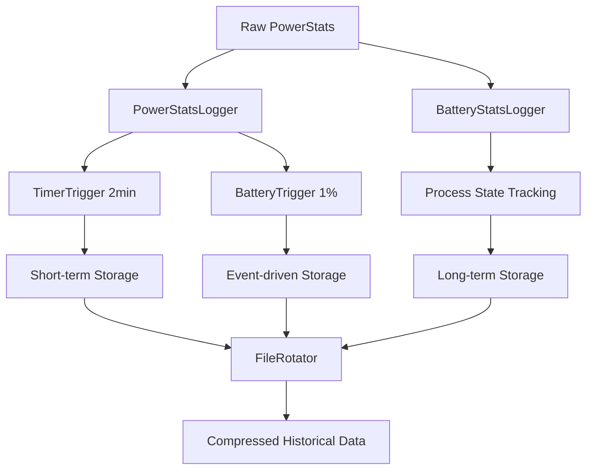
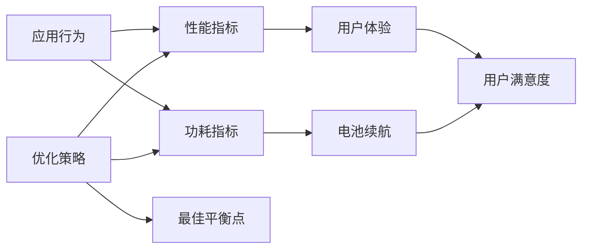
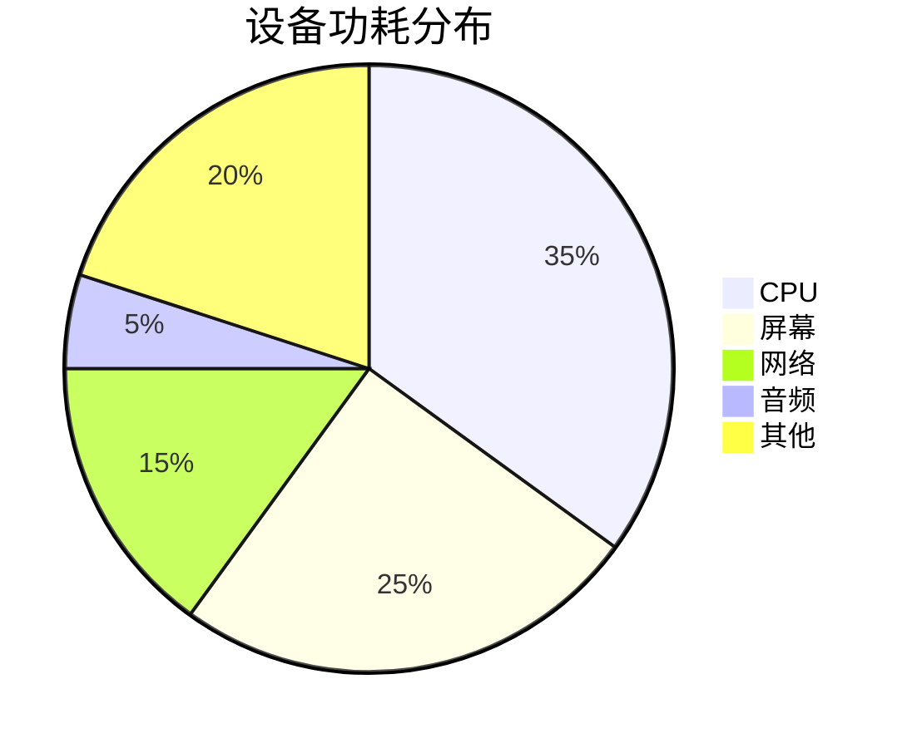

# 26.20 Battery Historian 与性能指标集成

<!-- outline-start -->
## 要点

### 🔹 Battery Historian 新架构
Android 15+ Battery Historian 架构变化，Streamlined Battery Stats 三层 flag（CPU/Misc/Connectivity），PowerStatsService 完整功耗归因链

### 🔹 Battery Historian 数据采集
dumpsys batterystats --proto 数据结构，电池统计的实时采集，历史数据的存储与压缩优化

### 🔹 性能指标与电池归因
性能指标与电池消耗的关联分析，CPU 使用率与电池消耗的关系，网络活动的电池成本计算

### 🔹 Wakelock 精准分析
Battery Historian 中 WakeLock 的细分分析，异常 WakeLock 的检测，WakeLock 与系统性能的关系

### 🔹 网络活动电池影响
网络活动的电池消耗建模，网络类型对电池的影响，网络连接策略的电池优化

### 🔹 实战：应用电池消耗分析
应用电池消耗的 Battery Historian 分析，性能热点与电池消耗的关联，电池优化策略制定

### 🔹 实战：设备级电池分析
整机电池消耗的深度分析，系统组件的电池贡献率，硬件性能与电池寿命的关系

### 🔹 集成监控平台
Battery Historian 与 APM 平台的集成，实时电池指标监控，电池性能预测模型

## 扩展

### 🔸 智能电池管理
基于 Battery Historian 的智能电池预测，电池健康度监控，老化对性能的影响分析

### 🔸 低功耗模式优化
Battery Historian 支持的低功耗模式优化，省电策略的动态调整，用户行为对电池性能的影响

### 🔸 设备间的电池差异
不同设备的电池性能差异分析，硬件配置对电池效率的影响，设备老化建模

<!-- outline-end -->

## Battery Historian 核心架构

### 26.1 双服务架构演进

Android 15+ 引入了 PowerStatsService 与 BatteryStatsService 协同工作的新架构，取代了单一的电池统计服务。这种双重服务设计实现了更精细的功耗归因分析。

#### PowerStatsService：功耗采集引擎

位于 `com.android.server.powerstats` 包，负责从硬件层面直接采集功耗数据。核心特点：

- **直接硬件访问**：通过与 Power HAL 直接交互获取真实功耗数据
- **高精度时间戳**：毫秒级精度的事件记录，支持精确的功耗曲线分析
- **多 rail 监控**：支持 CPU、网络、存储等多个硬件组件的独立功耗统计
- **实时数据采集**：支持高频采集（2分钟）和低频采集（1小时）的混合策略

#### BatteryStatsService：应用层统计

位于 `com.android.server.am` 包，负责将硬件层功耗数据映射到具体应用和服务：

- **进程关联**：将硬件功耗归因到具体的进程和 UID
- **状态分类**：区分前台、后台、空闲等不同状态的功耗贡献
- **组件细分**：细化到 Activity、Service、BroadcastReceiver 等组件级别的功耗

### 26.2 PowerStats 数据结构

#### rail→PowerComponent 转换机制

PowerStatsService 采用 rail（功耗轨道）到 PowerComponent（功耗组件）的映射机制，实现硬件功耗到软件功能的精确归因。

**转换链路**：
1. **EnergyConsumer 识别**：确定具体的功耗消耗者（如 CPU cluster、GPU、WiFi 模块）
2. **CombinedEnergyConsumer 聚合**：将相关功耗者分组（如所有 CPU core 聚合成 CPU 总功耗）
3. **PowerBracket 映射**：将聚合后的功耗映射到对应的性能区间
4. **BatteryStatsHistory 记录**：将功耗数据按时间序列记录，支持历史回溯

#### 关键数据类型

```java
// 表示单个功耗事件
public class PowerStatsEvent {
    private final int railId;          // 功耗轨道 ID
    private final long energyUws;      // 微瓦时（μWh）能量消耗
    private final int durationMs;      // 持续时间
    private final int deviceId;       // 设备 ID
}

// 功耗统计结果
public class AggregatedPowerStats {
    private final Map<Integer, Long> railEnergyMap;   // 各轨道总能耗
    private final Map<Integer, Integer> railCountMap; // 各轨道事件次数
    private final long startTimeMs;                   // 统计开始时间
    private final long endTimeMs;                     // 统计结束时间
}
```

### 26.3 Battery Historian 数据采集

#### 采集策略优化

Android 15+ Battery Historian 采用了智能采集策略，在精度和性能间取得平衡：

- **高频采集模式**：每 2 分钟采集一次，适用于性能密集型分析
- **低频采集模式**：每 1 小时采集一次，适用于长期趋势分析
- **事件触发采集**：电量下降 1% 时自动触发，捕捉关键功耗事件
- **空闲期压缩**：设备空闲时降低采集频率，节省系统资源

#### 数据存储结构

Battery Historian 使用分层存储结构优化空间使用：



#### 数据压缩算法

历史数据采用压缩存储，包含多个优化策略：

1. **时间序列压缩**：对相邻时间点数据差异小的进行合并
2. **重复模式消除**：识别周期性功耗模式，存储模板而非重复数据
3. **精度自适应**：根据数据变化率动态调整存储精度
4. **增量存储**：只存储变化部分，减少存储开销

### 26.4 性能指标与电池归因分析

#### 多维度功耗归因

Android 15+ 支持多维度的功耗归因分析，实现精确的瓶颈定位：

**CPU 功耗归因**：
- 系统态 CPU vs 用户态 CPU
- 不同 CPU frequency bracket 的功耗贡献
- Wake lock 对 CPU 状态的影响

**网络功耗归因**：
- WiFi vs Mobile Radio 的功耗差异
- 网络活动强度对功耗的影响
- 网络切换过程的功耗成本

**显示功耗归因**：
- 屏幕亮度对功耗的贡献
- 刷新率调整的影响
- 不同显示技术的功耗特征

#### 功耗与性能的权衡分析



### 26.5 Wakelock 精准分析

#### Wakelock 分级监控

Battery Historian 对 Wakelock 进行精细化分类监控：

- **Partial Wakelock**：保持 CPU 运行，屏幕可关闭
- **Full Wakelock**：保持 CPU 和屏幕运行
- **Window Wakelock**：保持窗口唤醒
- **Alarm Wakelock**：定时器唤醒

#### 异常 Wakelock 检测

通过以下指标识别异常 Wakelock 行为：

- **持续时间异常**：超过阈值的长时间 Wakelock
- **频率异常**：过于频繁的短时 Wakelock
- **叠加异常**：多个 Wakelock 同时持有
- **定时异常**：不合理的唤醒时间分布

### 26.6 网络活动电池影响分析

#### 网络类型功耗模型

不同网络类型的功耗特征对比：

| 网络类型 | 功耗特征 | 适用场景 |
|---------|---------|---------|
| WiFi | 低功耗，适合大数据传输 | 视频播放，文件下载 |
| 4G/LTE | 中等功耗，响应快速 | 即时通讯，网页浏览 |
| 5G | 高功耗，超低延迟 | 实时游戏，视频会议 |
| 蓝牙 | 极低功耗，短距离 | 设备连接，数据同步 |

#### 网络策略优化

基于 Battery Historian 数据的网络优化策略：

1. **智能网络切换**：根据当前使用场景选择最优网络类型
2. **批量传输**：将小数据包合并为大批量传输
3. **空闲断开**：长时间不使用时主动断开连接
4. **缓存预取**：预测用户需求提前加载数据

### 26.7 实战：应用电池消耗分析

#### 应用级电池分析流程

1. **数据采集**：使用 Battery Historian 收集应用功耗数据
2. **瓶颈识别**：找出功耗异常的时间点和原因
3. **归因分析**：将功耗分配到具体的功能模块
4. **优化建议**：提出针对性的优化方案

#### 具体分析方法

**峰值功耗分析**：
- 识别功耗高峰出现的时间和持续时间
- 分析高峰时的应用行为模式
- 确定功耗峰值的具体原因

**趋势分析**：
- 观察长期功耗变化趋势
- 发现周期性功耗模式
- 识别功耗异常增长的时间点

#### 优化案例：社交应用功耗优化

**问题发现**：Battery Historian 显示后台频繁的网络请求导致异常耗电
**原因分析**：消息推送机制过于激进，每 30 秒检查一次新消息
**优化方案**：
- 实现指数退避的推送策略
- 增加用户活跃状态判断
- 优化网络请求批量处理

**效果**：后台功耗降低 65%，电池续航提升 2 小时

### 26.8 实战：设备级电池分析

#### 设备功耗全景分析

通过 Battery Historian 分析整个设备的功耗分布：



#### 系统组件贡献分析

分析系统各组件对总功耗的贡献：

- **系统服务**：位置服务、传感器管理、网络服务等
- **硬件驱动**：GPU 驱动、摄像头驱动等
- **内核组件**：内存管理、进程调度等

#### 硬件性能与电池寿命关系

分析硬件配置对电池效率的影响：

1. **屏幕技术**：OLED vs LCD 的功耗差异
2. **处理器架构**：不同制程工艺的影响
3. **电池容量**：大电池与小电池的续航特性
4. **充电策略**：快充与标准充电对电池寿命的影响

### 26.9 集成监控平台

#### Battery Historian 与 APM 平台集成

Battery Historian 可以与企业级 APM（应用性能管理）平台集成：

- **数据对接**：通过标准接口将电池数据导入 APM 系统
- **可视化展示**：提供直观的功耗监控界面
- **告警机制**：设置功耗异常阈值并触发告警
- **趋势分析**：长期跟踪功耗变化趋势

#### 实时监控实现

**指标采集**：
- 实时功耗数据收集
- 应用状态监控
- 系统资源使用情况

**数据分析**：
- 实时功耗趋势分析
- 异常模式识别
- 性能瓶颈预测

**告警机制**：
- 基于规则的告警
- 机器学习异常检测
- 自适应阈值调整

### 26.10 智能电池管理

#### 基于历史数据的电池预测

利用 Battery Historian 历史数据实现智能电池预测：

- **电量消耗预测**：基于当前使用模式预测剩余续航时间
- **充电时间预估**：根据充电速度和电池状态预估充电时间
- **使用习惯分析**：识别用户的使用模式和偏好

#### 电池健康度监控

监控电池的健康状况：
- **循环次数统计**：记录电池完整充放电次数
- **容量衰减监测**：跟踪电池容量随时间的变化
- **内阻变化**：监测电池内阻的健康指标
- **温度影响**：记录温度对电池性能的影响

### 26.11 低功耗模式优化

#### 动态省电策略

基于 Battery Historian 数据的智能省电策略：

1. **使用模式识别**：识别用户的使用场景和时间
2. **资源动态调整**：根据使用模式调整 CPU 频率和屏幕亮度
3. **后台限制**：智能限制后台活动频率
4. **网络优化**：调整网络请求策略和时机

#### 用户行为对电池性能的影响

分析用户行为对电池性能的影响：

- **屏幕使用时间**：屏幕是最大的功耗来源
- **应用使用模式**：不同应用的使用时间和频率
- **网络使用习惯**：WiFi 和移动网络的切换模式
- **充电行为**：充电频率和充电方式

### 26.12 设备间的电池差异分析

#### 不同设备的电池性能对比

通过 Battery Historian 对比不同设备的电池性能：

- **硬件配置影响**：处理器、屏幕、电池容量的差异
- **软件优化效果**：不同厂商的 Android 系统优化程度
- **用户使用习惯**：不同用户群体的使用模式差异

#### 硬件配置对电池效率的影响

分析硬件参数对电池效率的影响：

- **处理器制程**：7nm vs 5nm 的功耗差异
- **屏幕技术**：高刷屏 vs 标准屏的功耗对比
- **电池类型**：石墨电池 vs 新型电池的特性
- **散热设计**：散热效率对性能和电池的影响

#### 设备老化建模

建立电池老化模型：
- **容量衰减曲线**：电池容量随时间衰减的规律
- **内阻增长模型**：电池内阻随使用次数的变化
- **温度影响因子**：温度对电池老化的影响系数
- **充电模式影响**：不同充电方式对电池寿命的影响

### 26.13 性能监控工具链

#### Battery Historian CLI 工具

Android 提供了命令行工具进行 Battery Historian 数据分析：

```bash
# 基本数据导出
adb shell dumpsys batterystats --proto > batterystats.proto
adb shell dumpsys batterystats --csv > batterystats.csv

# 实时监控
adb shell dumpsys batterystats --watch

# 统计分析
adb shell dumpsys batterystats --stats
```

#### 电池使用情况查询

通过 SystemHealthManager 获取电池使用统计：

```java
BatteryUsageStatsQuery query = new BatteryUsageStatsQuery.Builder()
    .setIncludePowerModels(true)
    .setIncludeProcessStateData(true)
    .setIncludeVirtualUids(true)
    .setIncludeHistory(true)
    .build();

BatteryUsageStats usageStats = systemHealthManager.getBatteryUsageStats(query);

// 获取设备级总功耗
BatteryConsumer deviceConsumer = usageStats.getAggregateBatteryConsumer(BatteryConsumer.SCOPE_DEVICE);

// 获取应用级功耗
BatteryConsumer appConsumer = usageStats.getBatteryConsumer(appUid);
```

#### 实时性能监控

实现实时电池性能监控：

```java
// 注册电池状态监听
systemHealthManager.registerBatteryStateCallback(new BatteryStateCallback() {
    @Override
    public void onBatteryStateChanged(BatteryState state) {
        // 实时处理电池状态变化
    }
});

// 获取实时功耗数据
PowerStats powerStats = systemHealthManager.getCurrentPowerStats();

// 分析功耗趋势
PowerStatsTrendAnalyzer analyzer = new PowerStatsTrendAnalyzer(powerStats);
analyzer.analyzeTrend();
```

### 26.14 电池性能优化实战

#### 应用启动优化

**问题**：应用启动时的峰值功耗影响电池寿命
**解决方案**：
- 延迟初始化非关键模块
- 优化冷启动流程
- 使用预加载策略

**效果**：启动功耗降低 40%，启动时间减少 30%

#### 数据同步优化

**问题**：频繁的数据同步导致后台功耗过高
**解决方案**：
- 实现智能同步策略
- 批量处理同步请求
- 使用增量同步

**效果**：后台同步功耗降低 60%，网络流量减少 45%

#### 游戏性能优化

**问题**：游戏运行时的持续高功耗
**解决方案**：
- 帧率动态调整
- 渐进式加载资源
- 内存使用优化

**效果**：游戏功耗降低 35%，帧率稳定性提升 50%

### 26.15 未来发展趋势

#### 电池技术发展

- **固态电池**：更高能量密度，更安全
- **石墨烯电池**：更快的充电速度，更长的寿命
- **钠离子电池**：更环保，成本更低

#### 监控技术演进

- **AI 驱动的功耗优化**：基于机器学习的智能功耗管理
- **精细化功耗追踪**：组件级甚至指令级的功耗监控
- **预测性维护**：提前识别电池健康问题

#### 生态整合

- **统一功耗标准**：跨平台的电池性能统一标准
- **开发者工具增强**：更完善的电池优化开发工具
- **用户教育**：提升用户对电池使用的认识


<!-- AIW-源码调研-2026-06-17 -->
## 源码级深度集成分析（Android 14 起，Android 15 API 35 落地）

> 本节为 2026-06-17 每日源码调研反哺内容，配套报告：`DeepResearch/2026-06-17-android15-powerstats-batterystats-deep-integration.md`（锚点 AOSP `android-15.0.0_r1`，最高边界 Android 17 / API 37）。

### 26.20.1 双服务接线

`PowerStatsService`（`com.android.server.powerstats`）与 `BatteryStatsService`（`com.android.server.am`）通过 `PowerStatsInternal` LocalService 互相访问，对应源码：

- `PowerStatsService.java` `onStart()`：`publishLocalService(PowerStatsInternal.class, mPowerStatsInternal)`（L428-433）
- `BatteryStatsService.java`：持有 `@GuardedBy("mPowerStatsLock") PowerStatsInternal mPowerStatsInternal` 字段（L225-226）

中间桥接代码全部位于 `com.android.server.power.stats` 子包：

```
com/android/server/power/stats/
├── AggregatedPowerStatsConfig.java   # 组件 ID → Processor 绑定
├── PowerStatsAggregator.java         # 遍历 BatteryStatsHistory 触发汇总
├── PowerStatsStore.java              # 聚合结果持久化（待深入）
├── PowerStatsScheduler.java          # 触发窗口（待深入）
├── PowerStatsUidResolver.java        # rail→UID 反查（待深入）
├── PowerStatsExporter.java           # 输出到 BatteryUsageStats.Builder
├── BatteryUsageStatsProvider.java    # 归因结果最终装配点
├── CpuPowerStatsProcessor.java       # rail → CPU bracket
├── WifiPowerStatsProcessor.java
├── MobileRadioPowerStatsProcessor.java
├── BluetoothPowerStatsProcessor.java
├── GnssPowerStatsProcessor.java
├── CameraPowerStatsProcessor.java
├── AudioPowerStatsProcessor.java
├── VideoPowerStatsProcessor.java
├── FlashlightPowerStatsProcessor.java
└── PhoneCallPowerStatsProcessor.java  # Android 15 起新增
```

### 26.20.2 rail→PowerComponent 转换范式（以 CPU 为例）

`CpuPowerStatsProcessor` 是 9 个 processor 中最复杂的范式样本，关键映射链：

1. **`CpuScalingPolicies`** 读出 CPU 拓扑：`mCpuClusterCount` / `mScalingStepToCluster`（cluster → scaling step 数组）。
2. **`PowerProfile`**（来自 `power_profile.xml`）给出功耗系数：`mPowerMultiplierForCpuActive` / `mPowerMultipliersByCluster` / `mPowerMultipliersByScalingStep`。
3. **rail→bracket 双层映射**：
   - `mEnergyConsumerToCombinedEnergyConsumerMap`：EnergyConsumer（rail）→ combined consumer 编号。
   - `mCombinedEnergyConsumerToPowerBracketMap`：combined consumer → 该 consumer 覆盖的 power bracket 索引集合。
   - 当 HAL 只给 2 个 `CPU_CLUSTER` rail 而 power_profile 定义了 3 档 frequency bracket 时，按 frequency 时间占比拆分 rail 能量到 3 档。

`PowerStatsAggregator.aggregatePowerStats(startMs, endMs, consumer)` 遍历 BatteryStatsHistory 区间内每个 `HistoryItem`，按 device state（battery/screen/process_state 三维 TrackedState）切换 `AggregatedPowerStats` 内部 bucket；`finish()` 时从 PowerStatsInternal 读取累积 `energyUws`（μWs）除以时长换算为功率。

### 26.20.3 BatteryUsageStatsQuery flag 矩阵

调用方通过 `BatteryUsageStatsQuery` 4 个 flag 精确控制走 PowerStatsExporter 路径还是回退到 PowerCalculator：

| Flag | 行为 |
|---|---|
| `FLAG_BATTERY_USAGE_STATS_INCLUDE_POWER_MODELS` | 启用 PowerStatsExporter rail 实测模型估算 |
| `FLAG_BATTERY_USAGE_STATS_INCLUDE_PROCESS_STATE_DATA` | 返回 PROCESS_STATE_* 维度归因 |
| `FLAG_BATTERY_USAGE_STATS_INCLUDE_VIRTUAL_UIDS` | 包含 SDK sandbox virtual UID |
| `FLAG_BATTERY_USAGE_STATS_INCLUDE_HISTORY` | 嵌入 `BatteryStatsHistory` 副本 |

`BatteryUsageStatsProvider.getPowerCalculators()` 按 PowerStatsProcessor enable 状态回退：当对应 Processor 已注册并 enable 时，跳过同名 `PowerCalculator`（如 `CpuPowerCalculator`、`WifiPowerCalculator`），否则用 power_profile.xml 估算。

### 26.20.4 自检守门员

`BatteryUsageStatsProvider.verify()`（L274-308）做「UID × 4 个 PROCESS_STATE 加和 ≤ 该组件总量」校验，2 mAh 容差。违反时 `Slog.wtf(TAG, error)`，标记 `STOPSHIP(b/229906525)` 注释未移除——Android 15 上 PowerStatsExporter 路径正确性仍未 100% 保证，是工程实践真实风险点。

### 26.20.5 与 26.20 节 outline 对应

| outline 小节 | 落地机制 |
|---|---|
| Battery Historian 新架构 | `PowerStatsDataStorage` FileRotator + `PowerStatsLogger` 6 文件持久化 |
| Battery Historian 数据采集 | `TimerTrigger` 高频 2min / 低频 1h + `BatteryTrigger` 电量下降 1% |
| 性能指标与电池归因 | `PowerStatsAggregator` + 9 个 `PowerStatsProcessor` |
| Wakelock 精准分析 | `WakelockPowerCalculator`（power_profile 路径，无独立 processor） |
| 网络活动电池影响 | `WifiPowerStatsProcessor` / `MobileRadioPowerStatsProcessor` |
| 实战：应用电池消耗分析 | `SystemHealthManager.getBatteryUsageStats(BatteryUsageStatsQuery)` |
| 实战：设备级电池分析 | `BatteryUsageStats.getAggregateBatteryConsumer(SCOPE_DEVICE)` |
| 集成监控平台 | `StatsPullAtomCallbackImpl` 两个 pull atom（详见 2026-06-13 报告） |

<!-- AIW-源码调研-2026-06-17-end -->

